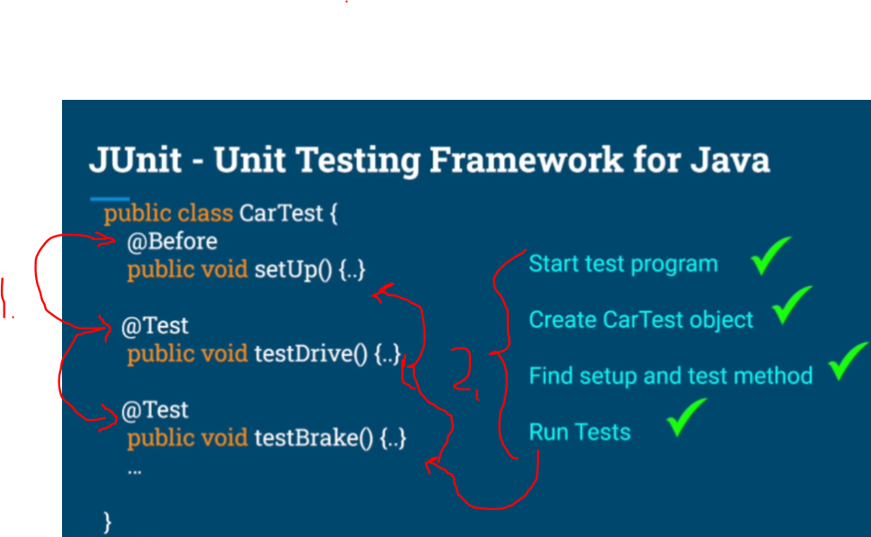
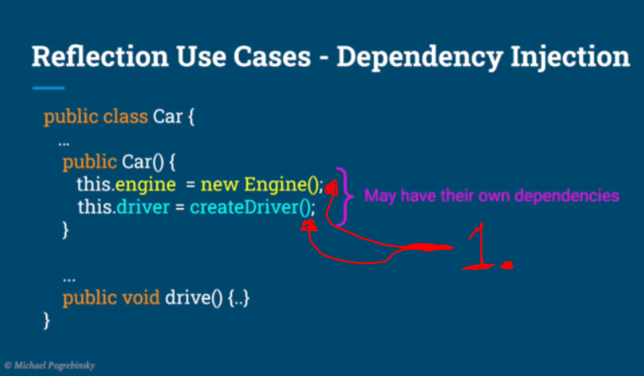
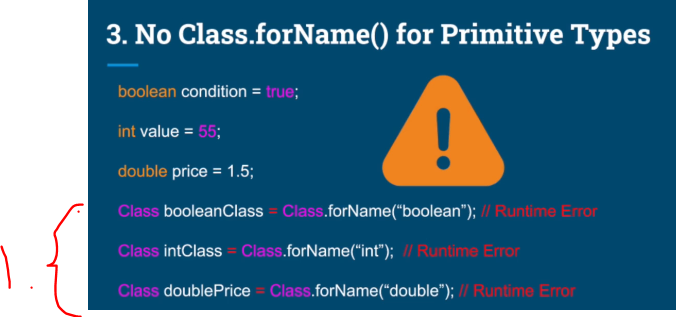
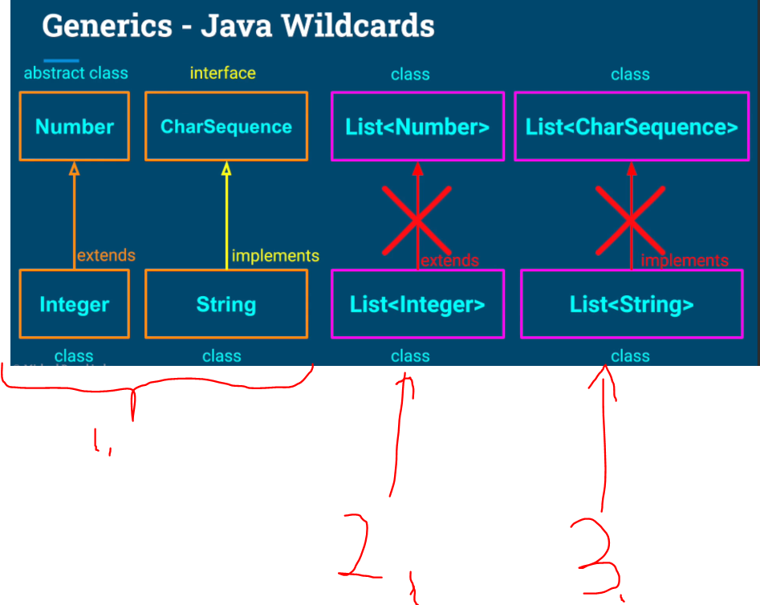

# Section 01: Introduction to Reflection.

Introduction to Reflection.

# What I Learned.

# Introduction to Java Reflection


1. 🙏🙏🙏 Give me motivation for finishing this course!!!✝️


1. Its **powerful** feature from **JVM** and **Language**, which allows us to get **runtime** access to information to application's **classes** and **objects**!!

2. To use these functionalities or classes, we use `Reflection API`.
    - This is shipped by **JDK**.


1. We can **link** software components at **runtime**.
2. This **allows** us to introduce **new workflows**, without modification of the **original source code**.
3. We can **adapt** from the projects given classes, to apply for the **algorithms**.


1. Old way is that, we give **data** to the input, then we **analyze** the data and perform some operations on it and give **some output**


1. With the **reflection**, we can **process** `code` and `data` as **inputs** to produce output.


1. **Code** and **data** as **input**.
2. We can **achieve** powerful features, for the:
    - Libraries
    - Frameworks
    - Software Designs
- That would otherwise be impossible.


1. **JUnit**.

- Example of the **library** that uses **Java reflection**:


1. Without **Java Reflection**, we would need to **set up** test classes. Likes such:

```
public class CarTest {
    public void setUp() { .. }
    public void testDrive() { .. }
    public void testBrake() { .. }
    ...
    public static void main() {
        CarTest carTest = new CarTest(); // Example here.
        carTest.setUp(); // Example here.
    }
}
```



1. With **Java reflection**, we can remove **boiler code** and focus to tests.
2. With **only** annotations, we can achieve all these steps! Even the test are ran in order.


1. Another users of **Java reflection** are frameworks with **Dependency Injection** like:
    - Spring.
    - Google Guice.



1. Without **dependency injection**, we would need to take care of initiating the Cars **Engine()** and **createDriver()** implementations!
    - This tightly couples, the details of the dependency to the Car itself!


1. In **Spring,** we can define the `Car` class and delegate the creation of its component somewhere else in **code**. 
    - This using `@Autowired` annotation.


1. Spring will register these Object, with using `@Configuaration` and `@Bean` annotation. At this point **Spring** knows, that these needs to be injected at runtime.


1. These are **created** and **injected** at runtime.


1. This will in the end **create** object of the `Car`.


1. Another usage of library like:
    - **Jackson**.
    - **Gson**.


1. These libraries will, inspect given **JSON** and analyze it. As result, it will know how to map these fields and populate these.


1. Mapping and populating is done, **solely** based on the fields!


1. **JSON** string to parse from.
2. In code, we can simply **parse** given **JSON** by simply, as giving parser the `json` and the **class** `Person.class` and reflection will be taking care of rest of the process.


1. This is also true, other way around.
    - **Java** → **JSON** using reflection.


1. There are many other cases for the **Java reflection**.

2. We can even use this as **tool** for **architecting** the application!


1. While using **reflection**, we introduce multiple dangerous situations if not careful!
    - Making the code harder to maintain!
    - Slower to run!
    - Dangerous to execute!
- We can **crush** our application unrecoverably!
2. **Reflection** is reserved for the **most skilled developers** only. 


- The **Challenge** is using this **superpower**!


1. Nice **Michael**, I lack this intuition!!! Give me the POWER to overcome this fear!!! 


# Reflection API Gateway & Wildcards.  


1. You can get **much** information out of this `Class<?>` reflection mechanism, such as these. We can get following information from **Reflection Entry Point**
    - What methods and fields it contains.
    - What classes it extends.
    - What interfaces it implements.
    
- There are three ways to get **Object** of `Class<?>`❗

- The **first** way to get Object instance:


1. Getting **Class object** using method of the **Object** instance. Example using `Object.getClass()`.
    - Reference document [.GetClass](https://docs.oracle.com/javase/tutorial/reflect/class/classNew.html).


- We can get their respected **runtime type** of the given `Class<?>`. 

1. We have **Class object** that represents the **String** type. Example:
    - Setting the variable: `String stringObject = "some-string";`. 
    - Getting the reference with the `Class<String> stringClass = stringObject.getClass();`
2. We have the **Class object** that represents the **Car** class.
    - Setting the variable: `Car car = new Car();`. 
    - Getting the reference with the `Class<Car> carClass = car.getClass();`.
3. We have **Class** object referring the **HashMap** type.
    - Setting the variable: `Map<String, Integer> map = new HashMap<>();`.
    - Getting the reference with the `Class<?> mapClass = map.getClass(); // returns HashMap class`
        - Notice this will point to the **Hash Map** and not the **interface type**❗


1. There is no way to get `.getClass()` for the ❌**primitive type**❌.
    - **Primitive types** don't **inherit** from the **Object class**.

- The **second** way to get, to get **class object** is to type `.class` after **type name**:


1. Getting **Class** method of the **Object** instance. Example using `.class` suffix to a type name.


1. We want to get **Class object** information of **particular type**, **without the class instance**.

- Example of getting the **Class information**, without having **instance** of the given type.

````
Class<String> stringClass = String.class;
Class<Car> carClass = Car.class;
Class<?> mapClass = HashMap.class;
````


1. We can get information of the **primitive types**, with the following technique. `primitiveTypeHere` and as **prefix** `.class`!

- Example below:

```
Class booleanType = boolean.class;

Class intType = int.class;

Class doubleType = double.class;

class MyClass {
    private int value;

    public boolean isNegative(float x) {
    // Code come here.
    }
}
```


1. The **third way** to get **Class information** is to call the `Class.froName()`.
    - We are retrieving **dynamically** the **Class information** from the `classpath`, with **fully qualified class name**!


1. We can access, own **classes** or the **interfaces**.
2. Even **internal classes**.



1. Still we cannot get the **primitive type**.
    - We will get **RUNTIME ERROR** instead of **COMPILATION ERROR**


1. With the `Class.forName()`, we are more prone for getting the **Exception**, since it's written as parameter.
2. **There** at least one good use case, it is when using **configuration**.


1. We are reading using **reflection** from the **config file**.


- This can be **very** useful, when the **Class** is not available in the **Runtime**.


1. Such as **external** libraries, which are injected to the **class path** at **run time**!


> [!TIP]
> Remember the **SuperClass** is the **parent** class.



1. In **Java** the **Integer** extends **Number** and
**String** implements **CharSequence**.
2. `List<Number>` is **not** super class of the `List<Integer>`.
3. `List<CharSequence>` is **not** super class of the `List<String>`.


1. **HOWEVER!**, The `List<?>` is **Java wildcard** and its super type of **any generic type**!
    - [Wildcards](https://docs.oracle.com/javase/tutorial/java/generics/wildcards.html).


1. `List<?>` is super class of any `List<T>`, of any **T** type!


1. We can follow this logic and make it so, that `Class<?>` is **super class** of any class of the `Class<T>` of any type of **T**!


# Reflection API Gateway in Practice.  

IDE Information Plugin - Class Analysis.  
# Solution - IDE Information Plugin - Class Analysis.  
Reflection, Interfaces and Basic Recursion.
Solution - Reflection, Interfaces and Recursion.


