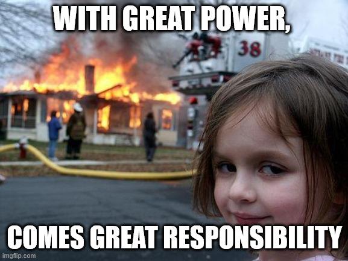

# Section 01: Introduction to Reflection.

Introduction to Reflection.

# What I Learned.

# Introduction to Java Reflection


1. 🙏🙏🙏 Give me motivation for finishing this course!!!✝️


1. Its **powerful** feature from **JVM** and **Language**, which allows us to get **runtime** access to information to application's **classes** and **objects**!!

2. To use these functionalities or classes, we use `Reflection API`.
    - This is shipped by **JDK**.


1. We can **link** software components at **runtime**.
2. This **allows** us to introduce **new workflows**, without modification of the **original source code**.
3. We can **adapt** from the projects given classes, to apply for the **algorithms**.


1. Old way is that, we give **data** to the input, then we **analyze** the data and perform some operations on it and give **some output**


1. With the **reflection**, we can **process** `code` and `data` as **inputs** to produce output.


1. **Code** and **data** as **input**.
2. We can **achieve** powerful features, for the:
    - Libraries
    - Frameworks
    - Software Designs
- That would otherwise be impossible.


1. **JUnit**.

- Example of the **library** that uses **Java reflection**:


1. Without **Java Reflection**, we would need to **set up** test classes. Likes such:

```
public class CarTest {
    public void setUp() { .. }
    public void testDrive() { .. }
    public void testBrake() { .. }
    ...
    public static void main() {
        CarTest carTest = new CarTest(); // Example here.
        carTest.setUp(); // Example here.
    }
}
```


1. With **Java reflection**, we can remove **boiler code** and focus to tests.
2. With **only** annotations, we can achieve all these steps! Even the test are ran in order.


1. Another users of **Java reflection** are frameworks with **Dependency Injection** like:
    - Spring.
    - Google Guice.


1. Without **dependency injection**, we would need to take care of initiating the Cars **Engine()** and **createDriver()** implementations!
    - This tightly couples, the details of the dependency to the Car itself!


1. In **Spring,** we can define the `Car` class and delegate the creation of its component somewhere else in **code**. 
    - This using `@Autowired` annotation.


1. Spring will register these Object, with using `@Configuaration` and `@Bean` annotation. At this point **Spring** knows, that these needs to be injected at runtime.


1. These are **created** and **injected** at runtime.


1. This will in the end **create** object of the `Car`.


1. Another usage of library like:
    - **Jackson**.
    - **Gson**.


1. These libraries will, inspect given **JSON** and analyze it. As result, it will know how to map these fields and populate these.


1. Mapping and populating is done, **solely** based on the fields!


1. **JSON** string to parse from.
2. In code, we can simply **parse** given **JSON** by simply, as giving parser the `json` and the **class** `Person.class` and reflection will be taking care of rest of the process.


1. This is also true, other way around.
    - **Java** → **JSON** using reflection.


1. There are many other cases for the **Java reflection**.

2. We can even use this as **tool** for **architecting** the application!


1. While using **reflection**, we introduce multiple dangerous situations if not careful!
    - Making the code harder to maintain!
    - Slower to run!
    - Dangerous to execute!
- We can **crush** our application unrecoverably!
2. **Reflection** is reserved for the **most skilled developers** only. 



- The **Challenge** is using this **superpower**!


1. Nice **Michael**, I lack this intuition!!! Give me the POWER to overcome this fear!!! 


# Reflection API Gateway & Wildcards.  


- Todo check this. 


1. You can get **much** information out of this `Class<?>` reflection mechanism, such as these. 
    - How are we getting **Object** of `Class<?>`.

- There are three ways to get **Object** of `Class<?>`.

- The **first** way to get:


1. Getting **Class** method of the **Object** instance. Example using `Object.getClass()`.


1.
2.
3.

- Todo check this one.

- The **second** way to get:


1. Getting **Class** method of the **Object** instance. Example using `.class` suffix to a type name.


1. We want to get **Class** information of **particular type**, **without the class instance**.

- Todo check this one.

- [WildCards](https://docs.oracle.com/javase/tutorial/java/generics/wildcards.html).
# Reflection API Gateway in Practice.  

IDE Information Plugin - Class Analysis.  
# Solution - IDE Information Plugin - Class Analysis.  
Reflection, Interfaces and Basic Recursion.
Solution - Reflection, Interfaces and Recursion.