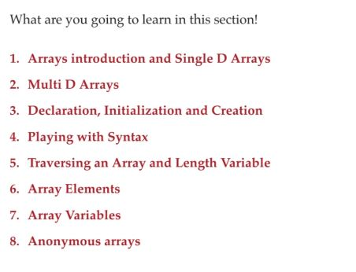

# Section 02: Java Arrays in Depth.

Java Arrays in Depth.

# What I Learned.

# Section introduction.

    

- Todo these one.

# Arrays and Single D Array.

# Multi-Dimensional Arrays.

# Declaration and initialization,creation.

# Playing with Syntax.

# Traversing Arrays, Length of Array.

# Types of Array based on elements it holds.

# Assigning and Reassigning Array Objects to Array References.

# Anonymous arrays.

# Arrays Summary.