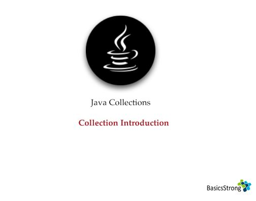
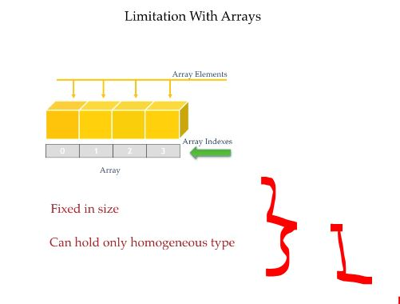
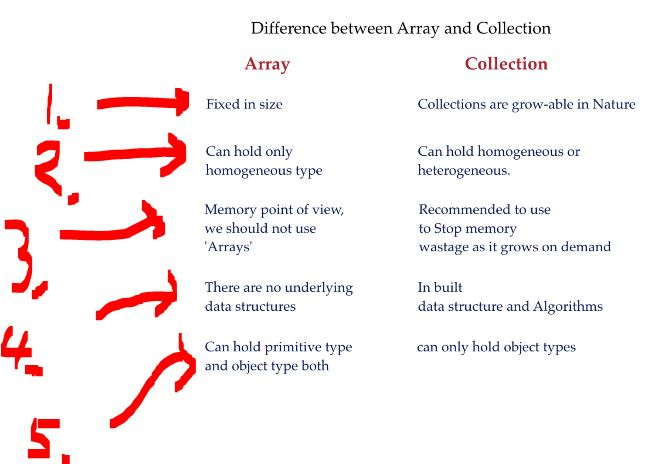

# Section 03: Collections Overview.

Collections Overview.

# What I Learned.

- Todo previous and re-do this first video.

# Collections Overview.

    

- There are limitations in the **Arrays**!

    

1. Arrays are fixed in **size** and this can hold **single type** of **data**! 

- Todo this below:

    

