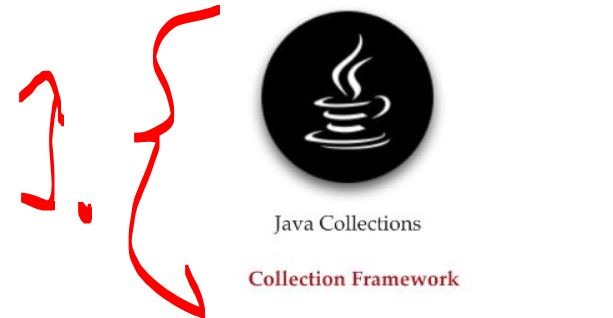
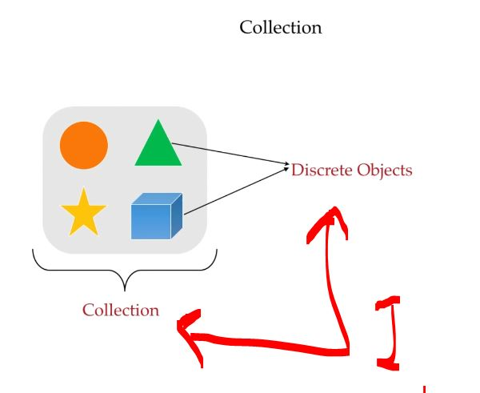
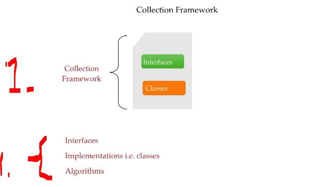
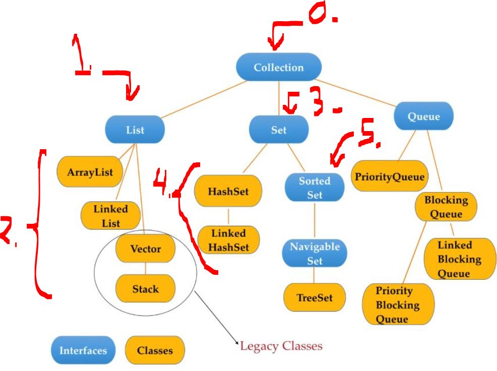

# Section 04: Collection Framework. 

Collection Framework.

# What I Learned.

# Collection Framework.

    

1. We will be going thought the **Collection Framework**!

    

1. **Collection** is group of **discrete** object in the single units!

    

1. It will hold **interfaces** and implementations of the **classes** and **Algorithms** to solve the programmers problems!

    

0. **Collection** came part of **Java* from the version `1.2` **JDK**.
1. Group of objects in single entity, where **List** can have **duplicates**! The **inserting order** is **preserved**!
2. There are other **subtypes** of the implemented classes!
    - `ArrayList`.
    - `Linked List`.
    - `Vector` **(legacy)**.
3. Group of objects in single entity, **Set** cannot have **duplicates** and the inserted **order** is **not preserved**!
4. There are other **subtypes** of the implemented classes!
    - `HashSet`.
    - `Linked HashSet`.
5. There is another interface, which implements the `set` interface, it's called `sorted set`.
    - This has **order preserved**!
    - This has the still the `set` characteristics, where there are **no** **duplicates**! 
6. `Navigatble Set` is interface and the `TreeSet` is the implementation of this class!
    - This is **Sorted Set** and **navigation methods** for ease of use.

