# Section 05: Collection and Collections.

Collection and Collections.

# What I Learned.

# Collection Interface.

    

1. Collection interfaces!

    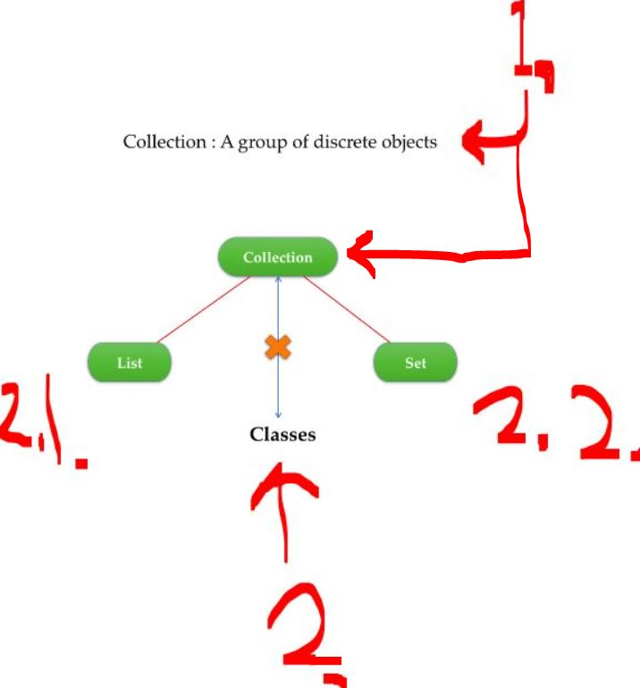

1. **Collection** interface represent group of discrete objects!
    - It provides **most common** methods for its sub-classes!
2. There is **no implementation** of this interface directly!
    - It provides **sub-interfaces** like `List` in `2.1`.
    - It provides **sub-interfaces** like `Set` in `2.2`.

    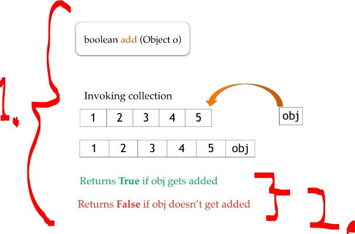

1. `add(...)` adds object to the collection!
2. In case of `set` this `add(...)` would return `false`.

    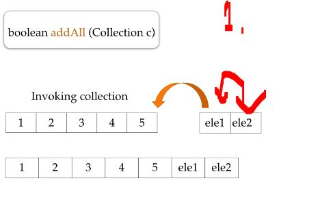

1. With `addAll(...)` Example, we can add `list` to another `list`!

    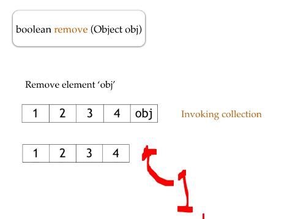

1. With `remove(...)` **removes** the **specified** element from the collection!

    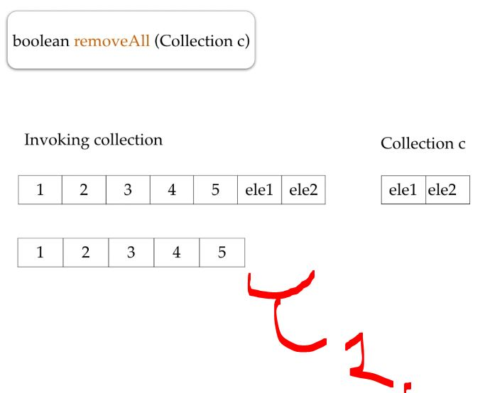

1. With the `removeAll(...)` **removes** the all which are specified. One example is to specify the **array** to be removed, from original one! 

    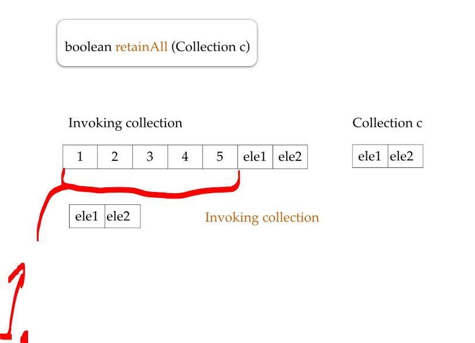

1. With the `retainAll(...)`, **remove** the **other elements**, except the invoked ones!

    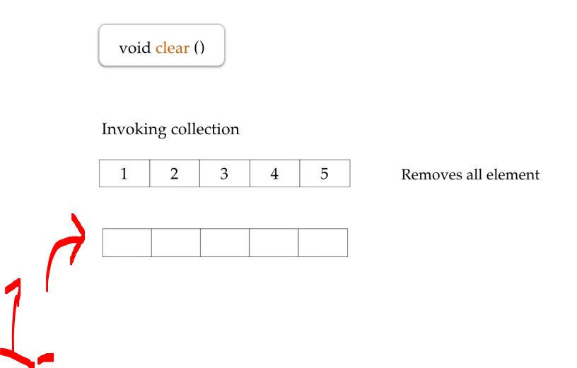

1. With the `clear()` is clearing the **collection**.

    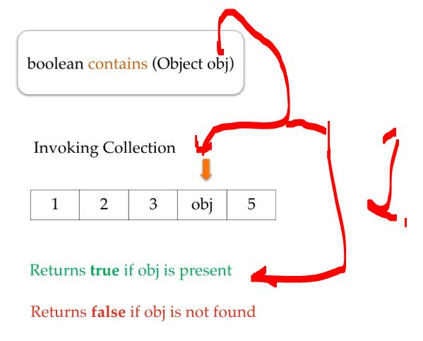

1. With the `contains(...)`, returns `true` if the `obj` is **inside** the **collection**.

    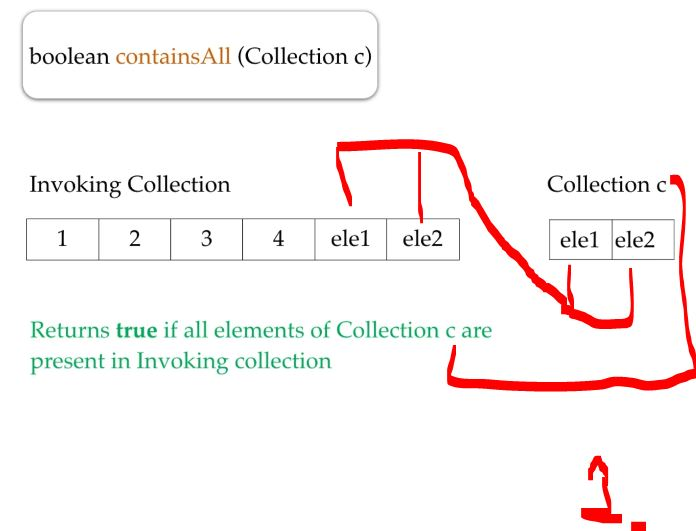

1. With the `containsAll(...)`, returns `true` if the **Collection** `c` `ele1` and `ele2` is inside the **invoking collection**!

    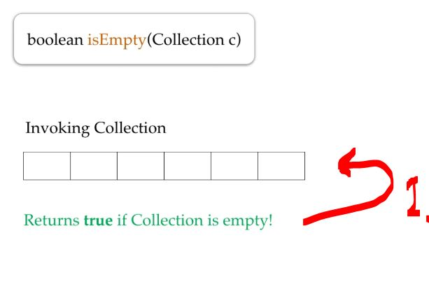

1. With the `isEmpty(...)`, returns `true` if the **Collection** is empty! 

    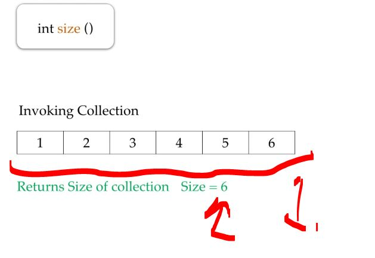

1. With the `size()`, returns **size** of the **Collection**!

    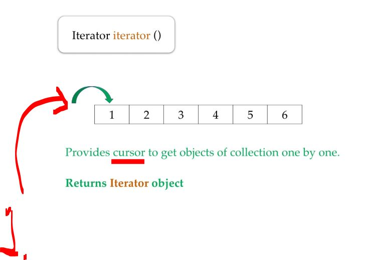

1. With the `iterator()`, returns `Iterator`/`Cursor` for the **working collection**!

> [!NOTE]  
> *“**Cursor** is a control structure that enables traversal of records”*

    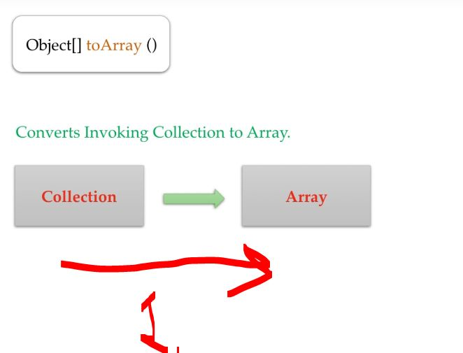

1. With the `toArray()`, **converts** the working `Collection` into the `Array`!

# Collection vs Collections.

    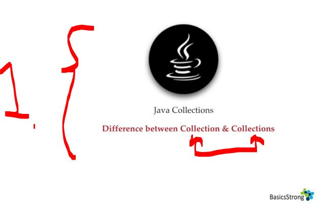

1. We will be looking what is difference between **term** `Collection` and `Collections`.

    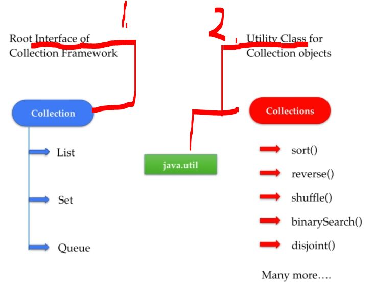

> [!NOTE]  
> **Notice** that **Collection** and **Collections** comes from `package java.util;`.

1. The `Collection` is the **interface** for **Java Collection Framework**!
2. The `Collections` is having **Util** classes, such as:
    - `sort()`.
    - `reverse()`.
    - `shuffle()`.
    - `binarySearch()`.
    - `disjoint()`.