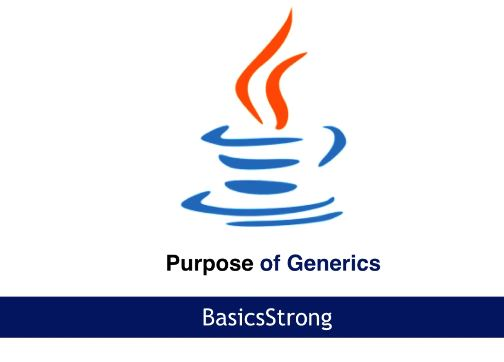
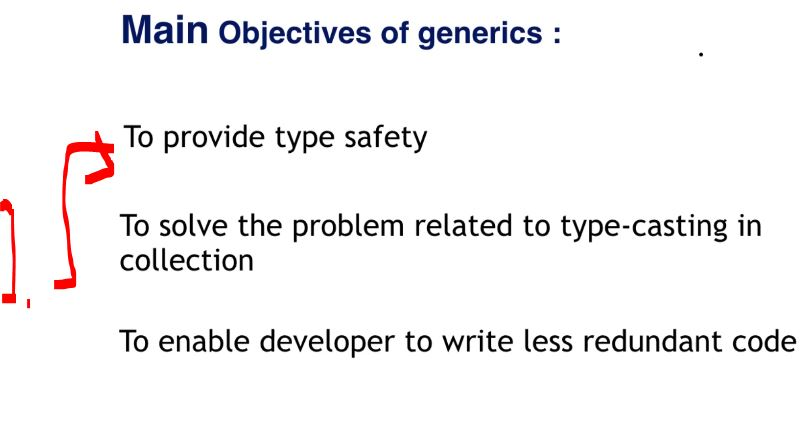

# Section 06: Generics Overview. 

Generics Overview.

# What I Learned.

# Generics Overview.

    

1. We will be going thought, what is the purpose of the **generics**!

    

1. The **generics** provide:
    - Type safety, will enforce the **specific type** like for the array.
        - This **array** can have one type of the data.
    

- Todo this one