# Section 07: Lists ArrayList LinkedList Vector and Stack and Cursors. 

Lists ArrayList LinkedList Vector and Stack and Cursors.

# What I Learned.

# List.

<div align="center">
    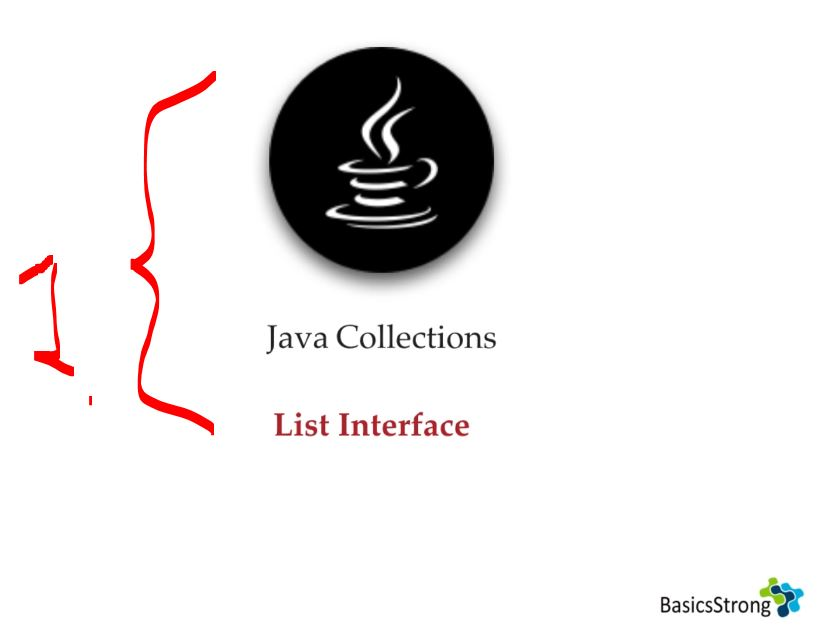
</div>

1. We will be looking at the **List** data structure!

<div align="center">
    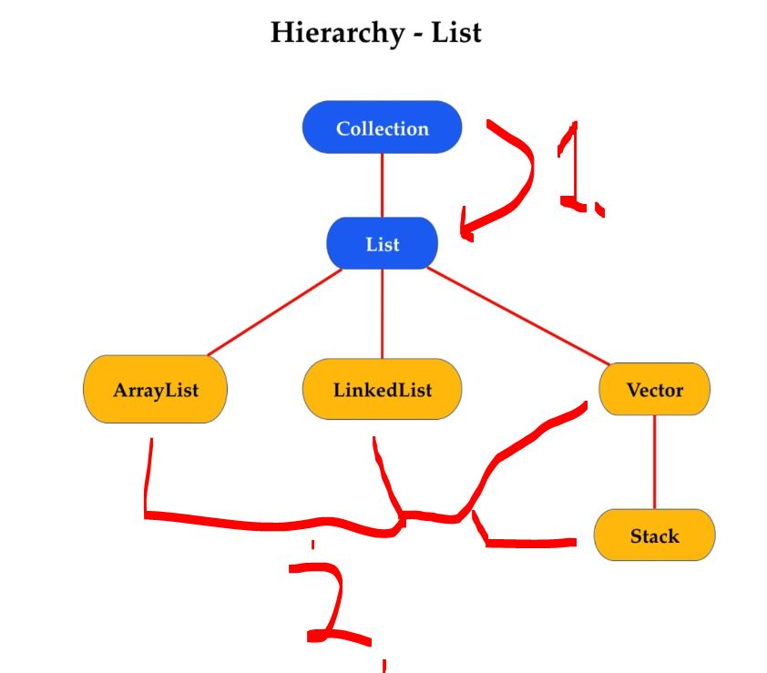
</div>

1. The `List` is child interface of the `Collection` interface.
    - Notice all these implementations allow:
        - **Duplicate** values to be existed!
        - Inserted **order** is preserved!
2. **List** following implementations:
    - `ArrayList`.
    - `LinkedLis`.
    - `Vector`.
    - `Stack`.

- How **Java** implements the **List**:

<details>
<summary id="list_interface_from_JDK" open="true"> <b>List interface from JDK</b>! </summary>

```Java
/*
 * Copyright (c) 1997, 2023, Oracle and/or its affiliates. All rights reserved.
 * DO NOT ALTER OR REMOVE COPYRIGHT NOTICES OR THIS FILE HEADER.
 *
 * This code is free software; you can redistribute it and/or modify it
 * under the terms of the GNU General Public License version 2 only, as
 * published by the Free Software Foundation.  Oracle designates this
 * particular file as subject to the "Classpath" exception as provided
 * by Oracle in the LICENSE file that accompanied this code.
 *
 * This code is distributed in the hope that it will be useful, but WITHOUT
 * ANY WARRANTY; without even the implied warranty of MERCHANTABILITY or
 * FITNESS FOR A PARTICULAR PURPOSE.  See the GNU General Public License
 * version 2 for more details (a copy is included in the LICENSE file that
 * accompanied this code).
 *
 * You should have received a copy of the GNU General Public License version
 * 2 along with this work; if not, write to the Free Software Foundation,
 * Inc., 51 Franklin St, Fifth Floor, Boston, MA 02110-1301 USA.
 *
 * Please contact Oracle, 500 Oracle Parkway, Redwood Shores, CA 94065 USA
 * or visit www.oracle.com if you need additional information or have any
 * questions.
 */

package java.util;

import java.util.function.UnaryOperator;

/**
 * An ordered collection, where the user has precise control over where in the
 * list each element is inserted.  The user can access elements by their integer
 * index (position in the list), and search for elements in the list.<p>
 *
 * Unlike sets, lists typically allow duplicate elements.  More formally,
 * lists typically allow pairs of elements {@code e1} and {@code e2}
 * such that {@code e1.equals(e2)}, and they typically allow multiple
 * null elements if they allow null elements at all.  It is not inconceivable
 * that someone might wish to implement a list that prohibits duplicates, by
 * throwing runtime exceptions when the user attempts to insert them, but we
 * expect this usage to be rare.<p>
 *
 * The {@code List} interface places additional stipulations, beyond those
 * specified in the {@code Collection} interface, on the contracts of the
 * {@code iterator}, {@code add}, {@code remove}, {@code equals}, and
 * {@code hashCode} methods.  Declarations for other inherited methods are
 * also included here for convenience.<p>
 *
 * The {@code List} interface provides four methods for positional (indexed)
 * access to list elements.  Lists (like Java arrays) are zero based.  Note
 * that these operations may execute in time proportional to the index value
 * for some implementations (the {@code LinkedList} class, for
 * example). Thus, iterating over the elements in a list is typically
 * preferable to indexing through it if the caller does not know the
 * implementation.<p>
 *
 * The {@code List} interface provides a special iterator, called a
 * {@code ListIterator}, that allows element insertion and replacement, and
 * bidirectional access in addition to the normal operations that the
 * {@code Iterator} interface provides.  A method is provided to obtain a
 * list iterator that starts at a specified position in the list.<p>
 *
 * The {@code List} interface provides two methods to search for a specified
 * object.  From a performance standpoint, these methods should be used with
 * caution.  In many implementations they will perform costly linear
 * searches.<p>
 *
 * The {@code List} interface provides two methods to efficiently insert and
 * remove multiple elements at an arbitrary point in the list.<p>
 *
 * Note: While it is permissible for lists to contain themselves as elements,
 * extreme caution is advised: the {@code equals} and {@code hashCode}
 * methods are no longer well defined on such a list.
 *
 * <p>Some list implementations have restrictions on the elements that
 * they may contain.  For example, some implementations prohibit null elements,
 * and some have restrictions on the types of their elements.  Attempting to
 * add an ineligible element throws an unchecked exception, typically
 * {@code NullPointerException} or {@code ClassCastException}.  Attempting
 * to query the presence of an ineligible element may throw an exception,
 * or it may simply return false; some implementations will exhibit the former
 * behavior and some will exhibit the latter.  More generally, attempting an
 * operation on an ineligible element whose completion would not result in
 * the insertion of an ineligible element into the list may throw an
 * exception or it may succeed, at the option of the implementation.
 * Such exceptions are marked as "optional" in the specification for this
 * interface.
 *
 * <h2><a id="unmodifiable">Unmodifiable Lists</a></h2>
 * <p>The {@link List#of(Object...) List.of} and
 * {@link List#copyOf List.copyOf} static factory methods
 * provide a convenient way to create unmodifiable lists. The {@code List}
 * instances created by these methods have the following characteristics:
 *
 * <ul>
 * <li>They are <a href="Collection.html#unmodifiable"><i>unmodifiable</i></a>. Elements cannot
 * be added, removed, or replaced. Calling any mutator method on the List
 * will always cause {@code UnsupportedOperationException} to be thrown.
 * However, if the contained elements are themselves mutable,
 * this may cause the List's contents to appear to change.
 * <li>They disallow {@code null} elements. Attempts to create them with
 * {@code null} elements result in {@code NullPointerException}.
 * <li>They are serializable if all elements are serializable.
 * <li>The order of elements in the list is the same as the order of the
 * provided arguments, or of the elements in the provided array.
 * <li>The lists and their {@link #subList(int, int) subList} views implement the
 * {@link RandomAccess} interface.
 * <li>They are <a href="../lang/doc-files/ValueBased.html">value-based</a>.
 * Programmers should treat instances that are {@linkplain #equals(Object) equal}
 * as interchangeable and should not use them for synchronization, or
 * unpredictable behavior may occur. For example, in a future release,
 * synchronization may fail. Callers should make no assumptions about the
 * identity of the returned instances. Factories are free to
 * create new instances or reuse existing ones.
 * <li>They are serialized as specified on the
 * <a href="{@docRoot}/serialized-form.html#java.util.CollSer">Serialized Form</a>
 * page.
 * </ul>
 *
 * <p>This interface is a member of the
 * <a href="{@docRoot}/java.base/java/util/package-summary.html#CollectionsFramework">
 * Java Collections Framework</a>.
 *
 * @param <E> the type of elements in this list
 *
 * @author  Josh Bloch
 * @author  Neal Gafter
 * @see Collection
 * @see Set
 * @see ArrayList
 * @see LinkedList
 * @see Vector
 * @see Arrays#asList(Object[])
 * @see Collections#nCopies(int, Object)
 * @see Collections#EMPTY_LIST
 * @see AbstractList
 * @see AbstractSequentialList
 * @since 1.2
 */

public interface List<E> extends SequencedCollection<E> {
    // Query Operations

    /**
     * Returns the number of elements in this list.  If this list contains
     * more than {@code Integer.MAX_VALUE} elements, returns
     * {@code Integer.MAX_VALUE}.
     *
     * @return the number of elements in this list
     */
    int size();

    /**
     * Returns {@code true} if this list contains no elements.
     *
     * @return {@code true} if this list contains no elements
     */
    boolean isEmpty();

    /**
     * Returns {@code true} if this list contains the specified element.
     * More formally, returns {@code true} if and only if this list contains
     * at least one element {@code e} such that
     * {@code Objects.equals(o, e)}.
     *
     * @param o element whose presence in this list is to be tested
     * @return {@code true} if this list contains the specified element
     * @throws ClassCastException if the type of the specified element
     *         is incompatible with this list
     * (<a href="Collection.html#optional-restrictions">optional</a>)
     * @throws NullPointerException if the specified element is null and this
     *         list does not permit null elements
     * (<a href="Collection.html#optional-restrictions">optional</a>)
     */
    boolean contains(Object o);

    /**
     * Returns an iterator over the elements in this list in proper sequence.
     *
     * @return an iterator over the elements in this list in proper sequence
     */
    Iterator<E> iterator();

    /**
     * Returns an array containing all of the elements in this list in proper
     * sequence (from first to last element).
     *
     * <p>The returned array will be "safe" in that no references to it are
     * maintained by this list.  (In other words, this method must
     * allocate a new array even if this list is backed by an array).
     * The caller is thus free to modify the returned array.
     *
     * <p>This method acts as bridge between array-based and collection-based
     * APIs.
     *
     * @return an array containing all of the elements in this list in proper
     *         sequence
     * @see Arrays#asList(Object[])
     */
    Object[] toArray();

    /**
     * Returns an array containing all of the elements in this list in
     * proper sequence (from first to last element); the runtime type of
     * the returned array is that of the specified array.  If the list fits
     * in the specified array, it is returned therein.  Otherwise, a new
     * array is allocated with the runtime type of the specified array and
     * the size of this list.
     *
     * <p>If the list fits in the specified array with room to spare (i.e.,
     * the array has more elements than the list), the element in the array
     * immediately following the end of the list is set to {@code null}.
     * (This is useful in determining the length of the list <i>only</i> if
     * the caller knows that the list does not contain any null elements.)
     *
     * <p>Like the {@link #toArray()} method, this method acts as bridge between
     * array-based and collection-based APIs.  Further, this method allows
     * precise control over the runtime type of the output array, and may,
     * under certain circumstances, be used to save allocation costs.
     *
     * <p>Suppose {@code x} is a list known to contain only strings.
     * The following code can be used to dump the list into a newly
     * allocated array of {@code String}:
     *
     * <pre>{@code
     *     String[] y = x.toArray(new String[0]);
     * }</pre>
     *
     * Note that {@code toArray(new Object[0])} is identical in function to
     * {@code toArray()}.
     *
     * @param a the array into which the elements of this list are to
     *          be stored, if it is big enough; otherwise, a new array of the
     *          same runtime type is allocated for this purpose.
     * @return an array containing the elements of this list
     * @throws ArrayStoreException if the runtime type of the specified array
     *         is not a supertype of the runtime type of every element in
     *         this list
     * @throws NullPointerException if the specified array is null
     */
    <T> T[] toArray(T[] a);


    // Modification Operations

    /**
     * Appends the specified element to the end of this list (optional
     * operation).
     *
     * <p>Lists that support this operation may place limitations on what
     * elements may be added to this list.  In particular, some
     * lists will refuse to add null elements, and others will impose
     * restrictions on the type of elements that may be added.  List
     * classes should clearly specify in their documentation any restrictions
     * on what elements may be added.
     *
     * @param e element to be appended to this list
     * @return {@code true} (as specified by {@link Collection#add})
     * @throws UnsupportedOperationException if the {@code add} operation
     *         is not supported by this list
     * @throws ClassCastException if the class of the specified element
     *         prevents it from being added to this list
     * @throws NullPointerException if the specified element is null and this
     *         list does not permit null elements
     * @throws IllegalArgumentException if some property of this element
     *         prevents it from being added to this list
     */
    boolean add(E e);

    /**
     * Removes the first occurrence of the specified element from this list,
     * if it is present (optional operation).  If this list does not contain
     * the element, it is unchanged.  More formally, removes the element with
     * the lowest index {@code i} such that
     * {@code Objects.equals(o, get(i))}
     * (if such an element exists).  Returns {@code true} if this list
     * contained the specified element (or equivalently, if this list changed
     * as a result of the call).
     *
     * @param o element to be removed from this list, if present
     * @return {@code true} if this list contained the specified element
     * @throws ClassCastException if the type of the specified element
     *         is incompatible with this list
     * (<a href="Collection.html#optional-restrictions">optional</a>)
     * @throws NullPointerException if the specified element is null and this
     *         list does not permit null elements
     * (<a href="Collection.html#optional-restrictions">optional</a>)
     * @throws UnsupportedOperationException if the {@code remove} operation
     *         is not supported by this list
     */
    boolean remove(Object o);


    // Bulk Modification Operations

    /**
     * Returns {@code true} if this list contains all of the elements of the
     * specified collection.
     *
     * @param  c collection to be checked for containment in this list
     * @return {@code true} if this list contains all of the elements of the
     *         specified collection
     * @throws ClassCastException if the types of one or more elements
     *         in the specified collection are incompatible with this
     *         list
     * (<a href="Collection.html#optional-restrictions">optional</a>)
     * @throws NullPointerException if the specified collection contains one
     *         or more null elements and this list does not permit null
     *         elements
     *         (<a href="Collection.html#optional-restrictions">optional</a>),
     *         or if the specified collection is null
     * @see #contains(Object)
     */
    boolean containsAll(Collection<?> c);

    /**
     * Appends all of the elements in the specified collection to the end of
     * this list, in the order that they are returned by the specified
     * collection's iterator (optional operation).  The behavior of this
     * operation is undefined if the specified collection is modified while
     * the operation is in progress.  (Note that this will occur if the
     * specified collection is this list, and it's nonempty.)
     *
     * @param c collection containing elements to be added to this list
     * @return {@code true} if this list changed as a result of the call
     * @throws UnsupportedOperationException if the {@code addAll} operation
     *         is not supported by this list
     * @throws ClassCastException if the class of an element of the specified
     *         collection prevents it from being added to this list
     * @throws NullPointerException if the specified collection contains one
     *         or more null elements and this list does not permit null
     *         elements, or if the specified collection is null
     * @throws IllegalArgumentException if some property of an element of the
     *         specified collection prevents it from being added to this list
     * @see #add(Object)
     */
    boolean addAll(Collection<? extends E> c);

    /**
     * Inserts all of the elements in the specified collection into this
     * list at the specified position (optional operation).  Shifts the
     * element currently at that position (if any) and any subsequent
     * elements to the right (increases their indices).  The new elements
     * will appear in this list in the order that they are returned by the
     * specified collection's iterator.  The behavior of this operation is
     * undefined if the specified collection is modified while the
     * operation is in progress.  (Note that this will occur if the specified
     * collection is this list, and it's nonempty.)
     *
     * @param index index at which to insert the first element from the
     *              specified collection
     * @param c collection containing elements to be added to this list
     * @return {@code true} if this list changed as a result of the call
     * @throws UnsupportedOperationException if the {@code addAll} operation
     *         is not supported by this list
     * @throws ClassCastException if the class of an element of the specified
     *         collection prevents it from being added to this list
     * @throws NullPointerException if the specified collection contains one
     *         or more null elements and this list does not permit null
     *         elements, or if the specified collection is null
     * @throws IllegalArgumentException if some property of an element of the
     *         specified collection prevents it from being added to this list
     * @throws IndexOutOfBoundsException if the index is out of range
     *         ({@code index < 0 || index > size()})
     */
    boolean addAll(int index, Collection<? extends E> c);

    /**
     * Removes from this list all of its elements that are contained in the
     * specified collection (optional operation).
     *
     * @param c collection containing elements to be removed from this list
     * @return {@code true} if this list changed as a result of the call
     * @throws UnsupportedOperationException if the {@code removeAll} operation
     *         is not supported by this list
     * @throws ClassCastException if the class of an element of this list
     *         is incompatible with the specified collection
     * (<a href="Collection.html#optional-restrictions">optional</a>)
     * @throws NullPointerException if this list contains a null element and the
     *         specified collection does not permit null elements
     *         (<a href="Collection.html#optional-restrictions">optional</a>),
     *         or if the specified collection is null
     * @see #remove(Object)
     * @see #contains(Object)
     */
    boolean removeAll(Collection<?> c);

    /**
     * Retains only the elements in this list that are contained in the
     * specified collection (optional operation).  In other words, removes
     * from this list all of its elements that are not contained in the
     * specified collection.
     *
     * @param c collection containing elements to be retained in this list
     * @return {@code true} if this list changed as a result of the call
     * @throws UnsupportedOperationException if the {@code retainAll} operation
     *         is not supported by this list
     * @throws ClassCastException if the class of an element of this list
     *         is incompatible with the specified collection
     * (<a href="Collection.html#optional-restrictions">optional</a>)
     * @throws NullPointerException if this list contains a null element and the
     *         specified collection does not permit null elements
     *         (<a href="Collection.html#optional-restrictions">optional</a>),
     *         or if the specified collection is null
     * @see #remove(Object)
     * @see #contains(Object)
     */
    boolean retainAll(Collection<?> c);

    /**
     * Replaces each element of this list with the result of applying the
     * operator to that element.  Errors or runtime exceptions thrown by
     * the operator are relayed to the caller.
     *
     * @implSpec
     * The default implementation is equivalent to, for this {@code list}:
     * <pre>{@code
     *     final ListIterator<E> li = list.listIterator();
     *     while (li.hasNext()) {
     *         li.set(operator.apply(li.next()));
     *     }
     * }</pre>
     *
     * If the list's list-iterator does not support the {@code set} operation
     * then an {@code UnsupportedOperationException} will be thrown when
     * replacing the first element.
     *
     * @param operator the operator to apply to each element
     * @throws UnsupportedOperationException if this list is unmodifiable.
     *         Implementations may throw this exception if an element
     *         cannot be replaced or if, in general, modification is not
     *         supported
     * @throws NullPointerException if the specified operator is null or
     *         if the operator result is a null value and this list does
     *         not permit null elements
     *         (<a href="Collection.html#optional-restrictions">optional</a>)
     * @since 1.8
     */
    default void replaceAll(UnaryOperator<E> operator) {
        Objects.requireNonNull(operator);
        final ListIterator<E> li = this.listIterator();
        while (li.hasNext()) {
            li.set(operator.apply(li.next()));
        }
    }

    /**
     * Sorts this list according to the order induced by the specified
     * {@link Comparator}.  The sort is <i>stable</i>: this method must not
     * reorder equal elements.
     *
     * <p>All elements in this list must be <i>mutually comparable</i> using the
     * specified comparator (that is, {@code c.compare(e1, e2)} must not throw
     * a {@code ClassCastException} for any elements {@code e1} and {@code e2}
     * in the list).
     *
     * <p>If the specified comparator is {@code null} then all elements in this
     * list must implement the {@link Comparable} interface and the elements'
     * {@linkplain Comparable natural ordering} should be used.
     *
     * <p>This list must be modifiable, but need not be resizable.
     *
     * @implSpec
     * The default implementation obtains an array containing all elements in
     * this list, sorts the array, and iterates over this list resetting each
     * element from the corresponding position in the array. (This avoids the
     * n<sup>2</sup> log(n) performance that would result from attempting
     * to sort a linked list in place.)
     *
     * @implNote
     * This implementation is a stable, adaptive, iterative mergesort that
     * requires far fewer than n lg(n) comparisons when the input array is
     * partially sorted, while offering the performance of a traditional
     * mergesort when the input array is randomly ordered.  If the input array
     * is nearly sorted, the implementation requires approximately n
     * comparisons.  Temporary storage requirements vary from a small constant
     * for nearly sorted input arrays to n/2 object references for randomly
     * ordered input arrays.
     *
     * <p>The implementation takes equal advantage of ascending and
     * descending order in its input array, and can take advantage of
     * ascending and descending order in different parts of the same
     * input array.  It is well-suited to merging two or more sorted arrays:
     * simply concatenate the arrays and sort the resulting array.
     *
     * <p>The implementation was adapted from Tim Peters's list sort for Python
     * (<a href="http://svn.python.org/projects/python/trunk/Objects/listsort.txt">
     * TimSort</a>).  It uses techniques from Peter McIlroy's "Optimistic
     * Sorting and Information Theoretic Complexity", in Proceedings of the
     * Fourth Annual ACM-SIAM Symposium on Discrete Algorithms, pp 467-474,
     * January 1993.
     *
     * @param c the {@code Comparator} used to compare list elements.
     *          A {@code null} value indicates that the elements'
     *          {@linkplain Comparable natural ordering} should be used
     * @throws ClassCastException if the list contains elements that are not
     *         <i>mutually comparable</i> using the specified comparator
     * @throws UnsupportedOperationException if the list's list-iterator does
     *         not support the {@code set} operation
     * @throws IllegalArgumentException
     *         (<a href="Collection.html#optional-restrictions">optional</a>)
     *         if the comparator is found to violate the {@link Comparator}
     *         contract
     * @since 1.8
     */
    @SuppressWarnings({"unchecked", "rawtypes"})
    default void sort(Comparator<? super E> c) {
        Object[] a = this.toArray();
        Arrays.sort(a, (Comparator) c);
        ListIterator<E> i = this.listIterator();
        for (Object e : a) {
            i.next();
            i.set((E) e);
        }
    }

    /**
     * Removes all of the elements from this list (optional operation).
     * The list will be empty after this call returns.
     *
     * @throws UnsupportedOperationException if the {@code clear} operation
     *         is not supported by this list
     */
    void clear();


    // Comparison and hashing

    /**
     * Compares the specified object with this list for equality.  Returns
     * {@code true} if and only if the specified object is also a list, both
     * lists have the same size, and all corresponding pairs of elements in
     * the two lists are <i>equal</i>.  (Two elements {@code e1} and
     * {@code e2} are <i>equal</i> if {@code Objects.equals(e1, e2)}.)
     * In other words, two lists are defined to be
     * equal if they contain the same elements in the same order.  This
     * definition ensures that the equals method works properly across
     * different implementations of the {@code List} interface.
     *
     * @param o the object to be compared for equality with this list
     * @return {@code true} if the specified object is equal to this list
     */
    boolean equals(Object o);

    /**
     * Returns the hash code value for this list.  The hash code of a list
     * is defined to be the result of the following calculation:
     * <pre>{@code
     *     int hashCode = 1;
     *     for (E e : list)
     *         hashCode = 31*hashCode + (e==null ? 0 : e.hashCode());
     * }</pre>
     * This ensures that {@code list1.equals(list2)} implies that
     * {@code list1.hashCode()==list2.hashCode()} for any two lists,
     * {@code list1} and {@code list2}, as required by the general
     * contract of {@link Object#hashCode}.
     *
     * @return the hash code value for this list
     * @see Object#equals(Object)
     * @see #equals(Object)
     */
    int hashCode();


    // Positional Access Operations

    /**
     * Returns the element at the specified position in this list.
     *
     * @param index index of the element to return
     * @return the element at the specified position in this list
     * @throws IndexOutOfBoundsException if the index is out of range
     *         ({@code index < 0 || index >= size()})
     */
    E get(int index);

    /**
     * Replaces the element at the specified position in this list with the
     * specified element (optional operation).
     *
     * @param index index of the element to replace
     * @param element element to be stored at the specified position
     * @return the element previously at the specified position
     * @throws UnsupportedOperationException if the {@code set} operation
     *         is not supported by this list
     * @throws ClassCastException if the class of the specified element
     *         prevents it from being added to this list
     * @throws NullPointerException if the specified element is null and
     *         this list does not permit null elements
     * @throws IllegalArgumentException if some property of the specified
     *         element prevents it from being added to this list
     * @throws IndexOutOfBoundsException if the index is out of range
     *         ({@code index < 0 || index >= size()})
     */
    E set(int index, E element);

    /**
     * Inserts the specified element at the specified position in this list
     * (optional operation).  Shifts the element currently at that position
     * (if any) and any subsequent elements to the right (adds one to their
     * indices).
     *
     * @param index index at which the specified element is to be inserted
     * @param element element to be inserted
     * @throws UnsupportedOperationException if the {@code add} operation
     *         is not supported by this list
     * @throws ClassCastException if the class of the specified element
     *         prevents it from being added to this list
     * @throws NullPointerException if the specified element is null and
     *         this list does not permit null elements
     * @throws IllegalArgumentException if some property of the specified
     *         element prevents it from being added to this list
     * @throws IndexOutOfBoundsException if the index is out of range
     *         ({@code index < 0 || index > size()})
     */
    void add(int index, E element);

    /**
     * Removes the element at the specified position in this list (optional
     * operation).  Shifts any subsequent elements to the left (subtracts one
     * from their indices).  Returns the element that was removed from the
     * list.
     *
     * @param index the index of the element to be removed
     * @return the element previously at the specified position
     * @throws UnsupportedOperationException if the {@code remove} operation
     *         is not supported by this list
     * @throws IndexOutOfBoundsException if the index is out of range
     *         ({@code index < 0 || index >= size()})
     */
    E remove(int index);


    // Search Operations

    /**
     * Returns the index of the first occurrence of the specified element
     * in this list, or -1 if this list does not contain the element.
     * More formally, returns the lowest index {@code i} such that
     * {@code Objects.equals(o, get(i))},
     * or -1 if there is no such index.
     *
     * @param o element to search for
     * @return the index of the first occurrence of the specified element in
     *         this list, or -1 if this list does not contain the element
     * @throws ClassCastException if the type of the specified element
     *         is incompatible with this list
     *         (<a href="Collection.html#optional-restrictions">optional</a>)
     * @throws NullPointerException if the specified element is null and this
     *         list does not permit null elements
     *         (<a href="Collection.html#optional-restrictions">optional</a>)
     */
    int indexOf(Object o);

    /**
     * Returns the index of the last occurrence of the specified element
     * in this list, or -1 if this list does not contain the element.
     * More formally, returns the highest index {@code i} such that
     * {@code Objects.equals(o, get(i))},
     * or -1 if there is no such index.
     *
     * @param o element to search for
     * @return the index of the last occurrence of the specified element in
     *         this list, or -1 if this list does not contain the element
     * @throws ClassCastException if the type of the specified element
     *         is incompatible with this list
     *         (<a href="Collection.html#optional-restrictions">optional</a>)
     * @throws NullPointerException if the specified element is null and this
     *         list does not permit null elements
     *         (<a href="Collection.html#optional-restrictions">optional</a>)
     */
    int lastIndexOf(Object o);


    // List Iterators

    /**
     * Returns a list iterator over the elements in this list (in proper
     * sequence).
     *
     * @return a list iterator over the elements in this list (in proper
     *         sequence)
     */
    ListIterator<E> listIterator();

    /**
     * Returns a list iterator over the elements in this list (in proper
     * sequence), starting at the specified position in the list.
     * The specified index indicates the first element that would be
     * returned by an initial call to {@link ListIterator#next next}.
     * An initial call to {@link ListIterator#previous previous} would
     * return the element with the specified index minus one.
     *
     * @param index index of the first element to be returned from the
     *        list iterator (by a call to {@link ListIterator#next next})
     * @return a list iterator over the elements in this list (in proper
     *         sequence), starting at the specified position in the list
     * @throws IndexOutOfBoundsException if the index is out of range
     *         ({@code index < 0 || index > size()})
     */
    ListIterator<E> listIterator(int index);

    // View

    /**
     * Returns a view of the portion of this list between the specified
     * {@code fromIndex}, inclusive, and {@code toIndex}, exclusive.  (If
     * {@code fromIndex} and {@code toIndex} are equal, the returned list is
     * empty.)  The returned list is backed by this list, so non-structural
     * changes in the returned list are reflected in this list, and vice-versa.
     * The returned list supports all of the optional list operations supported
     * by this list.<p>
     *
     * This method eliminates the need for explicit range operations (of
     * the sort that commonly exist for arrays).  Any operation that expects
     * a list can be used as a range operation by passing a subList view
     * instead of a whole list.  For example, the following idiom
     * removes a range of elements from a list:
     * <pre>{@code
     *      list.subList(from, to).clear();
     * }</pre>
     * Similar idioms may be constructed for {@code indexOf} and
     * {@code lastIndexOf}, and all of the algorithms in the
     * {@code Collections} class can be applied to a subList.<p>
     *
     * The semantics of the list returned by this method become undefined if
     * the backing list (i.e., this list) is <i>structurally modified</i> in
     * any way other than via the returned list.  (Structural modifications are
     * those that change the size of this list, or otherwise perturb it in such
     * a fashion that iterations in progress may yield incorrect results.)
     *
     * @param fromIndex low endpoint (inclusive) of the subList
     * @param toIndex high endpoint (exclusive) of the subList
     * @return a view of the specified range within this list
     * @throws IndexOutOfBoundsException for an illegal endpoint index value
     *         ({@code fromIndex < 0 || toIndex > size ||
     *         fromIndex > toIndex})
     */
    List<E> subList(int fromIndex, int toIndex);

    /**
     * Creates a {@link Spliterator} over the elements in this list.
     *
     * <p>The {@code Spliterator} reports {@link Spliterator#SIZED} and
     * {@link Spliterator#ORDERED}.  Implementations should document the
     * reporting of additional characteristic values.
     *
     * @implSpec
     * The default implementation creates a
     * <em><a href="Spliterator.html#binding">late-binding</a></em>
     * spliterator as follows:
     * <ul>
     * <li>If the list is an instance of {@link RandomAccess} then the default
     *     implementation creates a spliterator that traverses elements by
     *     invoking the method {@link List#get}.  If such invocation results or
     *     would result in an {@code IndexOutOfBoundsException} then the
     *     spliterator will <em>fail-fast</em> and throw a
     *     {@code ConcurrentModificationException}.
     *     If the list is also an instance of {@link AbstractList} then the
     *     spliterator will use the list's {@link AbstractList#modCount modCount}
     *     field to provide additional <em>fail-fast</em> behavior.
     * <li>Otherwise, the default implementation creates a spliterator from the
     *     list's {@code Iterator}.  The spliterator inherits the
     *     <em>fail-fast</em> of the list's iterator.
     * </ul>
     *
     * @implNote
     * The created {@code Spliterator} additionally reports
     * {@link Spliterator#SUBSIZED}.
     *
     * @return a {@code Spliterator} over the elements in this list
     * @since 1.8
     */
    @Override
    default Spliterator<E> spliterator() {
        if (this instanceof RandomAccess) {
            return new AbstractList.RandomAccessSpliterator<>(this);
        } else {
            return Spliterators.spliterator(this, Spliterator.ORDERED);
        }
    }

    // ========== SequencedCollection ==========

    /**
     * {@inheritDoc}
     *
     * @implSpec
     * The implementation in this interface calls {@code add(0, e)}.
     *
     * @throws NullPointerException {@inheritDoc}
     * @throws UnsupportedOperationException {@inheritDoc}
     * @since 21
     */
    default void addFirst(E e) {
        this.add(0, e);
    }

    /**
     * {@inheritDoc}
     *
     * @implSpec
     * The implementation in this interface calls {@code add(e)}.
     *
     * @throws NullPointerException {@inheritDoc}
     * @throws UnsupportedOperationException {@inheritDoc}
     * @since 21
     */
    default void addLast(E e) {
        this.add(e);
    }

    /**
     * {@inheritDoc}
     *
     * @implSpec
     * If this List is not empty, the implementation in this interface returns the result
     * of calling {@code get(0)}. Otherwise, it throws {@code NoSuchElementException}.
     *
     * @throws NoSuchElementException {@inheritDoc}
     * @since 21
     */
    default E getFirst() {
        if (this.isEmpty()) {
            throw new NoSuchElementException();
        } else {
            return this.get(0);
        }
    }

    /**
     * {@inheritDoc}
     *
     * @implSpec
     * If this List is not empty, the implementation in this interface returns the result
     * of calling {@code get(size() - 1)}. Otherwise, it throws {@code NoSuchElementException}.
     *
     * @throws NoSuchElementException {@inheritDoc}
     * @since 21
     */
    default E getLast() {
        if (this.isEmpty()) {
            throw new NoSuchElementException();
        } else {
            return this.get(this.size() - 1);
        }
    }

    /**
     * {@inheritDoc}
     *
     * @implSpec
     * If this List is not empty, the implementation in this interface returns the result
     * of calling {@code remove(0)}. Otherwise, it throws {@code NoSuchElementException}.
     *
     * @throws NoSuchElementException {@inheritDoc}
     * @throws UnsupportedOperationException {@inheritDoc}
     * @since 21
     */
    default E removeFirst() {
        if (this.isEmpty()) {
            throw new NoSuchElementException();
        } else {
            return this.remove(0);
        }
    }

    /**
     * {@inheritDoc}
     *
     * @implSpec
     * If this List is not empty, the implementation in this interface returns the result
     * of calling {@code remove(size() - 1)}. Otherwise, it throws {@code NoSuchElementException}.
     *
     * @throws NoSuchElementException {@inheritDoc}
     * @throws UnsupportedOperationException {@inheritDoc}
     * @since 21
     */
    default E removeLast() {
        if (this.isEmpty()) {
            throw new NoSuchElementException();
        } else {
            return this.remove(this.size() - 1);
        }
    }

    /**
     * {@inheritDoc}
     *
     * @implSpec
     * The implementation in this interface returns a reverse-ordered List
     * view. The {@code reversed()} method of the view returns a reference
     * to this List. Other operations on the view are implemented via calls to
     * public methods on this List. The exact relationship between calls on the
     * view and calls on this List is unspecified. However, order-sensitive
     * operations generally delegate to the appropriate method with the opposite
     * orientation. For example, calling {@code getFirst} on the view results in
     * a call to {@code getLast} on this List.
     *
     * @return a reverse-ordered view of this collection, as a {@code List}
     * @since 21
     */
    default List<E> reversed() {
        return ReverseOrderListView.of(this, true); // we must assume it's modifiable
    }

    // ========== static methods ==========

    /**
     * Returns an unmodifiable list containing zero elements.
     *
     * See <a href="#unmodifiable">Unmodifiable Lists</a> for details.
     *
     * @param <E> the {@code List}'s element type
     * @return an empty {@code List}
     *
     * @since 9
     */
    @SuppressWarnings("unchecked")
    static <E> List<E> of() {
        return (List<E>) ImmutableCollections.EMPTY_LIST;
    }

    /**
     * Returns an unmodifiable list containing one element.
     *
     * See <a href="#unmodifiable">Unmodifiable Lists</a> for details.
     *
     * @param <E> the {@code List}'s element type
     * @param e1 the single element
     * @return a {@code List} containing the specified element
     * @throws NullPointerException if the element is {@code null}
     *
     * @since 9
     */
    static <E> List<E> of(E e1) {
        return new ImmutableCollections.List12<>(e1);
    }

    /**
     * Returns an unmodifiable list containing two elements.
     *
     * See <a href="#unmodifiable">Unmodifiable Lists</a> for details.
     *
     * @param <E> the {@code List}'s element type
     * @param e1 the first element
     * @param e2 the second element
     * @return a {@code List} containing the specified elements
     * @throws NullPointerException if an element is {@code null}
     *
     * @since 9
     */
    static <E> List<E> of(E e1, E e2) {
        return new ImmutableCollections.List12<>(e1, e2);
    }

    /**
     * Returns an unmodifiable list containing three elements.
     *
     * See <a href="#unmodifiable">Unmodifiable Lists</a> for details.
     *
     * @param <E> the {@code List}'s element type
     * @param e1 the first element
     * @param e2 the second element
     * @param e3 the third element
     * @return a {@code List} containing the specified elements
     * @throws NullPointerException if an element is {@code null}
     *
     * @since 9
     */
    static <E> List<E> of(E e1, E e2, E e3) {
        return ImmutableCollections.listFromTrustedArray(e1, e2, e3);
    }

    /**
     * Returns an unmodifiable list containing four elements.
     *
     * See <a href="#unmodifiable">Unmodifiable Lists</a> for details.
     *
     * @param <E> the {@code List}'s element type
     * @param e1 the first element
     * @param e2 the second element
     * @param e3 the third element
     * @param e4 the fourth element
     * @return a {@code List} containing the specified elements
     * @throws NullPointerException if an element is {@code null}
     *
     * @since 9
     */
    static <E> List<E> of(E e1, E e2, E e3, E e4) {
        return ImmutableCollections.listFromTrustedArray(e1, e2, e3, e4);
    }

    /**
     * Returns an unmodifiable list containing five elements.
     *
     * See <a href="#unmodifiable">Unmodifiable Lists</a> for details.
     *
     * @param <E> the {@code List}'s element type
     * @param e1 the first element
     * @param e2 the second element
     * @param e3 the third element
         * @param e4 the fourth element
     * @param e5 the fifth element
     * @return a {@code List} containing the specified elements
     * @throws NullPointerException if an element is {@code null}
     *
     * @since 9
     */
    static <E> List<E> of(E e1, E e2, E e3, E e4, E e5) {
        return ImmutableCollections.listFromTrustedArray(e1, e2, e3, e4, e5);
    }

    /**
     * Returns an unmodifiable list containing six elements.
     *
     * See <a href="#unmodifiable">Unmodifiable Lists</a> for details.
     *
     * @param <E> the {@code List}'s element type
     * @param e1 the first element
     * @param e2 the second element
     * @param e3 the third element
     * @param e4 the fourth element
     * @param e5 the fifth element
     * @param e6 the sixth element
     * @return a {@code List} containing the specified elements
     * @throws NullPointerException if an element is {@code null}
     *
     * @since 9
     */
    static <E> List<E> of(E e1, E e2, E e3, E e4, E e5, E e6) {
        return ImmutableCollections.listFromTrustedArray(e1, e2, e3, e4, e5,
                                                         e6);
    }

    /**
     * Returns an unmodifiable list containing seven elements.
     *
     * See <a href="#unmodifiable">Unmodifiable Lists</a> for details.
     *
     * @param <E> the {@code List}'s element type
     * @param e1 the first element
     * @param e2 the second element
     * @param e3 the third element
     * @param e4 the fourth element
     * @param e5 the fifth element
     * @param e6 the sixth element
     * @param e7 the seventh element
     * @return a {@code List} containing the specified elements
     * @throws NullPointerException if an element is {@code null}
     *
     * @since 9
     */
    static <E> List<E> of(E e1, E e2, E e3, E e4, E e5, E e6, E e7) {
        return ImmutableCollections.listFromTrustedArray(e1, e2, e3, e4, e5,
                                                         e6, e7);
    }

    /**
     * Returns an unmodifiable list containing eight elements.
     *
     * See <a href="#unmodifiable">Unmodifiable Lists</a> for details.
     *
     * @param <E> the {@code List}'s element type
     * @param e1 the first element
     * @param e2 the second element
     * @param e3 the third element
     * @param e4 the fourth element
     * @param e5 the fifth element
     * @param e6 the sixth element
     * @param e7 the seventh element
     * @param e8 the eighth element
     * @return a {@code List} containing the specified elements
     * @throws NullPointerException if an element is {@code null}
     *
     * @since 9
     */
    static <E> List<E> of(E e1, E e2, E e3, E e4, E e5, E e6, E e7, E e8) {
        return ImmutableCollections.listFromTrustedArray(e1, e2, e3, e4, e5,
                                                         e6, e7, e8);
    }

    /**
     * Returns an unmodifiable list containing nine elements.
     *
     * See <a href="#unmodifiable">Unmodifiable Lists</a> for details.
     *
     * @param <E> the {@code List}'s element type
     * @param e1 the first element
     * @param e2 the second element
     * @param e3 the third element
     * @param e4 the fourth element
     * @param e5 the fifth element
     * @param e6 the sixth element
     * @param e7 the seventh element
     * @param e8 the eighth element
     * @param e9 the ninth element
     * @return a {@code List} containing the specified elements
     * @throws NullPointerException if an element is {@code null}
     *
     * @since 9
     */
    static <E> List<E> of(E e1, E e2, E e3, E e4, E e5, E e6, E e7, E e8, E e9) {
        return ImmutableCollections.listFromTrustedArray(e1, e2, e3, e4, e5,
                                                         e6, e7, e8, e9);
    }

    /**
     * Returns an unmodifiable list containing ten elements.
     *
     * See <a href="#unmodifiable">Unmodifiable Lists</a> for details.
     *
     * @param <E> the {@code List}'s element type
     * @param e1 the first element
     * @param e2 the second element
     * @param e3 the third element
     * @param e4 the fourth element
     * @param e5 the fifth element
     * @param e6 the sixth element
     * @param e7 the seventh element
     * @param e8 the eighth element
     * @param e9 the ninth element
     * @param e10 the tenth element
     * @return a {@code List} containing the specified elements
     * @throws NullPointerException if an element is {@code null}
     *
     * @since 9
     */
    static <E> List<E> of(E e1, E e2, E e3, E e4, E e5, E e6, E e7, E e8, E e9, E e10) {
        return ImmutableCollections.listFromTrustedArray(e1, e2, e3, e4, e5,
                                                         e6, e7, e8, e9, e10);
    }

    /**
     * Returns an unmodifiable list containing an arbitrary number of elements.
     * See <a href="#unmodifiable">Unmodifiable Lists</a> for details.
     *
     * @apiNote
     * This method also accepts a single array as an argument. The element type of
     * the resulting list will be the component type of the array, and the size of
     * the list will be equal to the length of the array. To create a list with
     * a single element that is an array, do the following:
     *
     * <pre>{@code
     *     String[] array = ... ;
     *     List<String[]> list = List.<String[]>of(array);
     * }</pre>
     *
     * This will cause the {@link List#of(Object) List.of(E)} method
     * to be invoked instead.
     *
     * @param <E> the {@code List}'s element type
     * @param elements the elements to be contained in the list
     * @return a {@code List} containing the specified elements
     * @throws NullPointerException if an element is {@code null} or if the array is {@code null}
     *
     * @since 9
     */
    @SafeVarargs
    @SuppressWarnings("varargs")
    static <E> List<E> of(E... elements) {
        switch (elements.length) { // implicit null check of elements
            case 0:
                @SuppressWarnings("unchecked")
                var list = (List<E>) ImmutableCollections.EMPTY_LIST;
                return list;
            case 1:
                return new ImmutableCollections.List12<>(elements[0]);
            case 2:
                return new ImmutableCollections.List12<>(elements[0], elements[1]);
            default:
                return ImmutableCollections.listFromArray(elements);
        }
    }

    /**
     * Returns an <a href="#unmodifiable">unmodifiable List</a> containing the elements of
     * the given Collection, in its iteration order. The given Collection must not be null,
     * and it must not contain any null elements. If the given Collection is subsequently
     * modified, the returned List will not reflect such modifications.
     *
     * @implNote
     * If the given Collection is an <a href="#unmodifiable">unmodifiable List</a>,
     * calling copyOf will generally not create a copy.
     *
     * @param <E> the {@code List}'s element type
     * @param coll a {@code Collection} from which elements are drawn, must be non-null
     * @return a {@code List} containing the elements of the given {@code Collection}
     * @throws NullPointerException if coll is null, or if it contains any nulls
     * @since 10
     */
    static <E> List<E> copyOf(Collection<? extends E> coll) {
        return ImmutableCollections.listCopy(coll);
    }
}
```
</details>

<div align="center">
    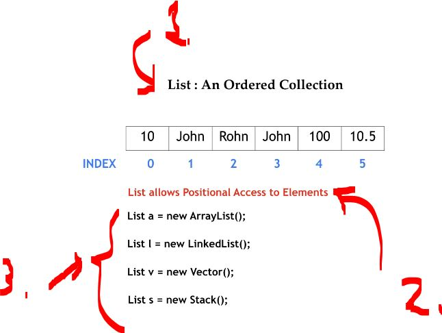
</div>

1. List is **ordered collection**!
2. List allows as to access **specific element**! 
3. `List` is not **allowed** be **instantiated**, with `new`!

# ArrayList.

<div align="center">
    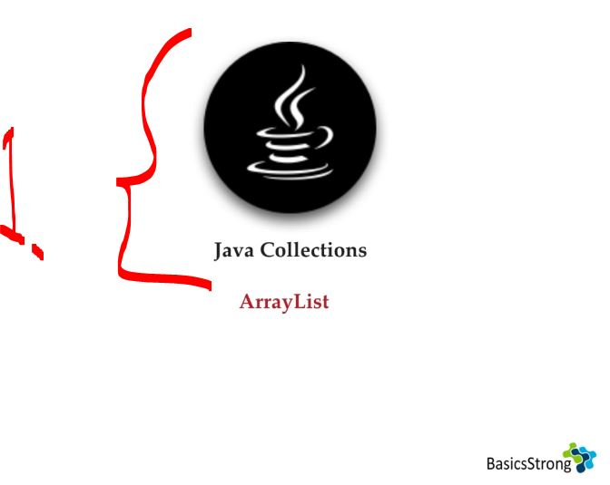
</div>

1. First implementation class `ArrayList` of `List`!

<div align="center">
    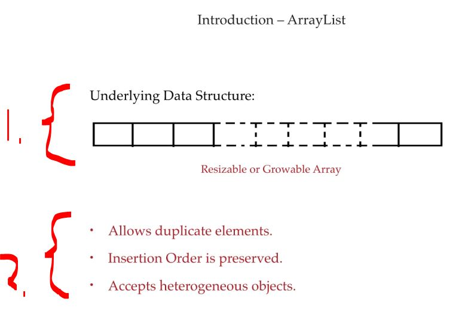
</div>

1. **ArrayList** is resizable!
2. Other characteristics!
    - Allows duplicate elements.
    - Insertion order is preserved.
    - Accepts heterogeneous objects.
        - It means **ArrayList** can accept **multiple types**. Example:
        ````Java
        ArrayList list = new ArrayList<>();
        list.add("John");   // String
        list.add(25);       // Integer
        list.add(true);     // Boolean
        ````

<div align="center">
    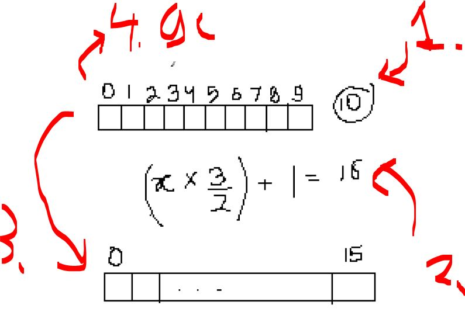
</div>

1. When the **10th** element is inserted, `ArrayList` needs to be resized!
2. **Resizing formula:** `new capacity = old capacity + (old capacity / 2)`.
3. Once the `ArrayList` is created, the old values are **copied** over.
4. Once this is done, the **garage collector** takes care of the **old array**!

<details>
<summary id="arraylist_class_from_JDK" open="true"> <b>ArrayList class from JDK</b>! </summary>

```Java
/*
 * Copyright (c) 1997, 2023, Oracle and/or its affiliates. All rights reserved.
 * DO NOT ALTER OR REMOVE COPYRIGHT NOTICES OR THIS FILE HEADER.
 *
 * This code is free software; you can redistribute it and/or modify it
 * under the terms of the GNU General Public License version 2 only, as
 * published by the Free Software Foundation.  Oracle designates this
 * particular file as subject to the "Classpath" exception as provided
 * by Oracle in the LICENSE file that accompanied this code.
 *
 * This code is distributed in the hope that it will be useful, but WITHOUT
 * ANY WARRANTY; without even the implied warranty of MERCHANTABILITY or
 * FITNESS FOR A PARTICULAR PURPOSE.  See the GNU General Public License
 * version 2 for more details (a copy is included in the LICENSE file that
 * accompanied this code).
 *
 * You should have received a copy of the GNU General Public License version
 * 2 along with this work; if not, write to the Free Software Foundation,
 * Inc., 51 Franklin St, Fifth Floor, Boston, MA 02110-1301 USA.
 *
 * Please contact Oracle, 500 Oracle Parkway, Redwood Shores, CA 94065 USA
 * or visit www.oracle.com if you need additional information or have any
 * questions.
 */

package java.util;

import java.util.function.Consumer;
import java.util.function.Predicate;
import java.util.function.UnaryOperator;
import jdk.internal.access.SharedSecrets;
import jdk.internal.util.ArraysSupport;

/**
 * Resizable-array implementation of the {@code List} interface.  Implements
 * all optional list operations, and permits all elements, including
 * {@code null}.  In addition to implementing the {@code List} interface,
 * this class provides methods to manipulate the size of the array that is
 * used internally to store the list.  (This class is roughly equivalent to
 * {@code Vector}, except that it is unsynchronized.)
 *
 * <p>The {@code size}, {@code isEmpty}, {@code get}, {@code set},
 * {@code iterator}, and {@code listIterator} operations run in constant
 * time.  The {@code add} operation runs in <i>amortized constant time</i>,
 * that is, adding n elements requires O(n) time.  All of the other operations
 * run in linear time (roughly speaking).  The constant factor is low compared
 * to that for the {@code LinkedList} implementation.
 *
 * <p>Each {@code ArrayList} instance has a <i>capacity</i>.  The capacity is
 * the size of the array used to store the elements in the list.  It is always
 * at least as large as the list size.  As elements are added to an ArrayList,
 * its capacity grows automatically.  The details of the growth policy are not
 * specified beyond the fact that adding an element has constant amortized
 * time cost.
 *
 * <p>An application can increase the capacity of an {@code ArrayList} instance
 * before adding a large number of elements using the {@code ensureCapacity}
 * operation.  This may reduce the amount of incremental reallocation.
 *
 * <p><strong>Note that this implementation is not synchronized.</strong>
 * If multiple threads access an {@code ArrayList} instance concurrently,
 * and at least one of the threads modifies the list structurally, it
 * <i>must</i> be synchronized externally.  (A structural modification is
 * any operation that adds or deletes one or more elements, or explicitly
 * resizes the backing array; merely setting the value of an element is not
 * a structural modification.)  This is typically accomplished by
 * synchronizing on some object that naturally encapsulates the list.
 *
 * If no such object exists, the list should be "wrapped" using the
 * {@link Collections#synchronizedList Collections.synchronizedList}
 * method.  This is best done at creation time, to prevent accidental
 * unsynchronized access to the list:<pre>
 *   List list = Collections.synchronizedList(new ArrayList(...));</pre>
 *
 * <p id="fail-fast">
 * The iterators returned by this class's {@link #iterator() iterator} and
 * {@link #listIterator(int) listIterator} methods are <em>fail-fast</em>:
 * if the list is structurally modified at any time after the iterator is
 * created, in any way except through the iterator's own
 * {@link ListIterator#remove() remove} or
 * {@link ListIterator#add(Object) add} methods, the iterator will throw a
 * {@link ConcurrentModificationException}.  Thus, in the face of
 * concurrent modification, the iterator fails quickly and cleanly, rather
 * than risking arbitrary, non-deterministic behavior at an undetermined
 * time in the future.
 *
 * <p>Note that the fail-fast behavior of an iterator cannot be guaranteed
 * as it is, generally speaking, impossible to make any hard guarantees in the
 * presence of unsynchronized concurrent modification.  Fail-fast iterators
 * throw {@code ConcurrentModificationException} on a best-effort basis.
 * Therefore, it would be wrong to write a program that depended on this
 * exception for its correctness:  <i>the fail-fast behavior of iterators
 * should be used only to detect bugs.</i>
 *
 * <p>This class is a member of the
 * <a href="{@docRoot}/java.base/java/util/package-summary.html#CollectionsFramework">
 * Java Collections Framework</a>.
 *
 * @param <E> the type of elements in this list
 *
 * @author  Josh Bloch
 * @author  Neal Gafter
 * @see     Collection
 * @see     List
 * @see     LinkedList
 * @see     Vector
 * @since   1.2
 */
public class ArrayList<E> extends AbstractList<E>
        implements List<E>, RandomAccess, Cloneable, java.io.Serializable
{
    @java.io.Serial
    private static final long serialVersionUID = 8683452581122892189L;

    /**
     * Default initial capacity.
     */
    private static final int DEFAULT_CAPACITY = 10;

    /**
     * Shared empty array instance used for empty instances.
     */
    private static final Object[] EMPTY_ELEMENTDATA = {};

    /**
     * Shared empty array instance used for default sized empty instances. We
     * distinguish this from EMPTY_ELEMENTDATA to know how much to inflate when
     * first element is added.
     */
    private static final Object[] DEFAULTCAPACITY_EMPTY_ELEMENTDATA = {};

    /**
     * The array buffer into which the elements of the ArrayList are stored.
     * The capacity of the ArrayList is the length of this array buffer. Any
     * empty ArrayList with elementData == DEFAULTCAPACITY_EMPTY_ELEMENTDATA
     * will be expanded to DEFAULT_CAPACITY when the first element is added.
     */
    transient Object[] elementData; // non-private to simplify nested class access

    /**
     * The size of the ArrayList (the number of elements it contains).
     *
     * @serial
     */
    private int size;

    /**
     * Constructs an empty list with the specified initial capacity.
     *
     * @param  initialCapacity  the initial capacity of the list
     * @throws IllegalArgumentException if the specified initial capacity
     *         is negative
     */
    public ArrayList(int initialCapacity) {
        if (initialCapacity > 0) {
            this.elementData = new Object[initialCapacity];
        } else if (initialCapacity == 0) {
            this.elementData = EMPTY_ELEMENTDATA;
        } else {
            throw new IllegalArgumentException("Illegal Capacity: "+
                                               initialCapacity);
        }
    }

    /**
     * Constructs an empty list with an initial capacity of ten.
     */
    public ArrayList() {
        this.elementData = DEFAULTCAPACITY_EMPTY_ELEMENTDATA;
    }

    /**
     * Constructs a list containing the elements of the specified
     * collection, in the order they are returned by the collection's
     * iterator.
     *
     * @param c the collection whose elements are to be placed into this list
     * @throws NullPointerException if the specified collection is null
     */
    public ArrayList(Collection<? extends E> c) {
        Object[] a = c.toArray();
        if ((size = a.length) != 0) {
            if (c.getClass() == ArrayList.class) {
                elementData = a;
            } else {
                elementData = Arrays.copyOf(a, size, Object[].class);
            }
        } else {
            // replace with empty array.
            elementData = EMPTY_ELEMENTDATA;
        }
    }

    /**
     * Trims the capacity of this {@code ArrayList} instance to be the
     * list's current size.  An application can use this operation to minimize
     * the storage of an {@code ArrayList} instance.
     */
    public void trimToSize() {
        modCount++;
        if (size < elementData.length) {
            elementData = (size == 0)
              ? EMPTY_ELEMENTDATA
              : Arrays.copyOf(elementData, size);
        }
    }

    /**
     * Increases the capacity of this {@code ArrayList} instance, if
     * necessary, to ensure that it can hold at least the number of elements
     * specified by the minimum capacity argument.
     *
     * @param minCapacity the desired minimum capacity
     */
    public void ensureCapacity(int minCapacity) {
        if (minCapacity > elementData.length
            && !(elementData == DEFAULTCAPACITY_EMPTY_ELEMENTDATA
                 && minCapacity <= DEFAULT_CAPACITY)) {
            modCount++;
            grow(minCapacity);
        }
    }

    /**
     * Increases the capacity to ensure that it can hold at least the
     * number of elements specified by the minimum capacity argument.
     *
     * @param minCapacity the desired minimum capacity
     * @throws OutOfMemoryError if minCapacity is less than zero
     */
    private Object[] grow(int minCapacity) {
        int oldCapacity = elementData.length;
        if (oldCapacity > 0 || elementData != DEFAULTCAPACITY_EMPTY_ELEMENTDATA) {
            int newCapacity = ArraysSupport.newLength(oldCapacity,
                    minCapacity - oldCapacity, /* minimum growth */
                    oldCapacity >> 1           /* preferred growth */);
            return elementData = Arrays.copyOf(elementData, newCapacity);
        } else {
            return elementData = new Object[Math.max(DEFAULT_CAPACITY, minCapacity)];
        }
    }

    private Object[] grow() {
        return grow(size + 1);
    }

    /**
     * Returns the number of elements in this list.
     *
     * @return the number of elements in this list
     */
    public int size() {
        return size;
    }

    /**
     * Returns {@code true} if this list contains no elements.
     *
     * @return {@code true} if this list contains no elements
     */
    public boolean isEmpty() {
        return size == 0;
    }

    /**
     * Returns {@code true} if this list contains the specified element.
     * More formally, returns {@code true} if and only if this list contains
     * at least one element {@code e} such that
     * {@code Objects.equals(o, e)}.
     *
     * @param o element whose presence in this list is to be tested
     * @return {@code true} if this list contains the specified element
     */
    public boolean contains(Object o) {
        return indexOf(o) >= 0;
    }

    /**
     * Returns the index of the first occurrence of the specified element
     * in this list, or -1 if this list does not contain the element.
     * More formally, returns the lowest index {@code i} such that
     * {@code Objects.equals(o, get(i))},
     * or -1 if there is no such index.
     */
    public int indexOf(Object o) {
        return indexOfRange(o, 0, size);
    }

    int indexOfRange(Object o, int start, int end) {
        Object[] es = elementData;
        if (o == null) {
            for (int i = start; i < end; i++) {
                if (es[i] == null) {
                    return i;
                }
            }
        } else {
            for (int i = start; i < end; i++) {
                if (o.equals(es[i])) {
                    return i;
                }
            }
        }
        return -1;
    }

    /**
     * Returns the index of the last occurrence of the specified element
     * in this list, or -1 if this list does not contain the element.
     * More formally, returns the highest index {@code i} such that
     * {@code Objects.equals(o, get(i))},
     * or -1 if there is no such index.
     */
    public int lastIndexOf(Object o) {
        return lastIndexOfRange(o, 0, size);
    }

    int lastIndexOfRange(Object o, int start, int end) {
        Object[] es = elementData;
        if (o == null) {
            for (int i = end - 1; i >= start; i--) {
                if (es[i] == null) {
                    return i;
                }
            }
        } else {
            for (int i = end - 1; i >= start; i--) {
                if (o.equals(es[i])) {
                    return i;
                }
            }
        }
        return -1;
    }

    /**
     * Returns a shallow copy of this {@code ArrayList} instance.  (The
     * elements themselves are not copied.)
     *
     * @return a clone of this {@code ArrayList} instance
     */
    public Object clone() {
        try {
            ArrayList<?> v = (ArrayList<?>) super.clone();
            v.elementData = Arrays.copyOf(elementData, size);
            v.modCount = 0;
            return v;
        } catch (CloneNotSupportedException e) {
            // this shouldn't happen, since we are Cloneable
            throw new InternalError(e);
        }
    }

    /**
     * Returns an array containing all of the elements in this list
     * in proper sequence (from first to last element).
     *
     * <p>The returned array will be "safe" in that no references to it are
     * maintained by this list.  (In other words, this method must allocate
     * a new array).  The caller is thus free to modify the returned array.
     *
     * <p>This method acts as bridge between array-based and collection-based
     * APIs.
     *
     * @return an array containing all of the elements in this list in
     *         proper sequence
     */
    public Object[] toArray() {
        return Arrays.copyOf(elementData, size);
    }

    /**
     * Returns an array containing all of the elements in this list in proper
     * sequence (from first to last element); the runtime type of the returned
     * array is that of the specified array.  If the list fits in the
     * specified array, it is returned therein.  Otherwise, a new array is
     * allocated with the runtime type of the specified array and the size of
     * this list.
     *
     * <p>If the list fits in the specified array with room to spare
     * (i.e., the array has more elements than the list), the element in
     * the array immediately following the end of the collection is set to
     * {@code null}.  (This is useful in determining the length of the
     * list <i>only</i> if the caller knows that the list does not contain
     * any null elements.)
     *
     * @param a the array into which the elements of the list are to
     *          be stored, if it is big enough; otherwise, a new array of the
     *          same runtime type is allocated for this purpose.
     * @return an array containing the elements of the list
     * @throws ArrayStoreException if the runtime type of the specified array
     *         is not a supertype of the runtime type of every element in
     *         this list
     * @throws NullPointerException if the specified array is null
     */
    @SuppressWarnings("unchecked")
    public <T> T[] toArray(T[] a) {
        if (a.length < size)
            // Make a new array of a's runtime type, but my contents:
            return (T[]) Arrays.copyOf(elementData, size, a.getClass());
        System.arraycopy(elementData, 0, a, 0, size);
        if (a.length > size)
            a[size] = null;
        return a;
    }

    // Positional Access Operations

    @SuppressWarnings("unchecked")
    E elementData(int index) {
        return (E) elementData[index];
    }

    @SuppressWarnings("unchecked")
    static <E> E elementAt(Object[] es, int index) {
        return (E) es[index];
    }

    /**
     * Returns the element at the specified position in this list.
     *
     * @param  index index of the element to return
     * @return the element at the specified position in this list
     * @throws IndexOutOfBoundsException {@inheritDoc}
     */
    public E get(int index) {
        Objects.checkIndex(index, size);
        return elementData(index);
    }

    /**
     * {@inheritDoc}
     *
     * @throws NoSuchElementException {@inheritDoc}
     * @since 21
     */
    public E getFirst() {
        if (size == 0) {
            throw new NoSuchElementException();
        } else {
            return elementData(0);
        }
    }

    /**
     * {@inheritDoc}
     *
     * @throws NoSuchElementException {@inheritDoc}
     * @since 21
     */
    public E getLast() {
        int last = size - 1;
        if (last < 0) {
            throw new NoSuchElementException();
        } else {
            return elementData(last);
        }
    }

    /**
     * Replaces the element at the specified position in this list with
     * the specified element.
     *
     * @param index index of the element to replace
     * @param element element to be stored at the specified position
     * @return the element previously at the specified position
     * @throws IndexOutOfBoundsException {@inheritDoc}
     */
    public E set(int index, E element) {
        Objects.checkIndex(index, size);
        E oldValue = elementData(index);
        elementData[index] = element;
        return oldValue;
    }

    /**
     * This helper method split out from add(E) to keep method
     * bytecode size under 35 (the -XX:MaxInlineSize default value),
     * which helps when add(E) is called in a C1-compiled loop.
     */
    private void add(E e, Object[] elementData, int s) {
        if (s == elementData.length)
            elementData = grow();
        elementData[s] = e;
        size = s + 1;
    }

    /**
     * Appends the specified element to the end of this list.
     *
     * @param e element to be appended to this list
     * @return {@code true} (as specified by {@link Collection#add})
     */
    public boolean add(E e) {
        modCount++;
        add(e, elementData, size);
        return true;
    }

    /**
     * Inserts the specified element at the specified position in this
     * list. Shifts the element currently at that position (if any) and
     * any subsequent elements to the right (adds one to their indices).
     *
     * @param index index at which the specified element is to be inserted
     * @param element element to be inserted
     * @throws IndexOutOfBoundsException {@inheritDoc}
     */
    public void add(int index, E element) {
        rangeCheckForAdd(index);
        modCount++;
        final int s;
        Object[] elementData;
        if ((s = size) == (elementData = this.elementData).length)
            elementData = grow();
        System.arraycopy(elementData, index,
                         elementData, index + 1,
                         s - index);
        elementData[index] = element;
        size = s + 1;
    }

    /**
     * {@inheritDoc}
     *
     * @since 21
     */
    public void addFirst(E element) {
        add(0, element);
    }

    /**
     * {@inheritDoc}
     *
     * @since 21
     */
    public void addLast(E element) {
        add(element);
    }

    /**
     * Removes the element at the specified position in this list.
     * Shifts any subsequent elements to the left (subtracts one from their
     * indices).
     *
     * @param index the index of the element to be removed
     * @return the element that was removed from the list
     * @throws IndexOutOfBoundsException {@inheritDoc}
     */
    public E remove(int index) {
        Objects.checkIndex(index, size);
        final Object[] es = elementData;

        @SuppressWarnings("unchecked") E oldValue = (E) es[index];
        fastRemove(es, index);

        return oldValue;
    }

    /**
     * {@inheritDoc}
     *
     * @throws NoSuchElementException {@inheritDoc}
     * @since 21
     */
    public E removeFirst() {
        if (size == 0) {
            throw new NoSuchElementException();
        } else {
            Object[] es = elementData;
            @SuppressWarnings("unchecked") E oldValue = (E) es[0];
            fastRemove(es, 0);
            return oldValue;
        }
    }

    /**
     * {@inheritDoc}
     *
     * @throws NoSuchElementException {@inheritDoc}
     * @since 21
     */
    public E removeLast() {
        int last = size - 1;
        if (last < 0) {
            throw new NoSuchElementException();
        } else {
            Object[] es = elementData;
            @SuppressWarnings("unchecked") E oldValue = (E) es[last];
            fastRemove(es, last);
            return oldValue;
        }
    }

    /**
     * {@inheritDoc}
     */
    public boolean equals(Object o) {
        if (o == this) {
            return true;
        }

        if (!(o instanceof List)) {
            return false;
        }

        final int expectedModCount = modCount;
        // ArrayList can be subclassed and given arbitrary behavior, but we can
        // still deal with the common case where o is ArrayList precisely
        boolean equal = (o.getClass() == ArrayList.class)
            ? equalsArrayList((ArrayList<?>) o)
            : equalsRange((List<?>) o, 0, size);

        checkForComodification(expectedModCount);
        return equal;
    }

    boolean equalsRange(List<?> other, int from, int to) {
        final Object[] es = elementData;
        if (to > es.length) {
            throw new ConcurrentModificationException();
        }
        var oit = other.iterator();
        for (; from < to; from++) {
            if (!oit.hasNext() || !Objects.equals(es[from], oit.next())) {
                return false;
            }
        }
        return !oit.hasNext();
    }

    private boolean equalsArrayList(ArrayList<?> other) {
        final int otherModCount = other.modCount;
        final int s = size;
        boolean equal;
        if (equal = (s == other.size)) {
            final Object[] otherEs = other.elementData;
            final Object[] es = elementData;
            if (s > es.length || s > otherEs.length) {
                throw new ConcurrentModificationException();
            }
            for (int i = 0; i < s; i++) {
                if (!Objects.equals(es[i], otherEs[i])) {
                    equal = false;
                    break;
                }
            }
        }
        other.checkForComodification(otherModCount);
        return equal;
    }

    private void checkForComodification(final int expectedModCount) {
        if (modCount != expectedModCount) {
            throw new ConcurrentModificationException();
        }
    }

    /**
     * {@inheritDoc}
     */
    public int hashCode() {
        int expectedModCount = modCount;
        int hash = hashCodeRange(0, size);
        checkForComodification(expectedModCount);
        return hash;
    }

    int hashCodeRange(int from, int to) {
        final Object[] es = elementData;
        if (to > es.length) {
            throw new ConcurrentModificationException();
        }
        int hashCode = 1;
        for (int i = from; i < to; i++) {
            Object e = es[i];
            hashCode = 31 * hashCode + (e == null ? 0 : e.hashCode());
        }
        return hashCode;
    }

    /**
     * Removes the first occurrence of the specified element from this list,
     * if it is present.  If the list does not contain the element, it is
     * unchanged.  More formally, removes the element with the lowest index
     * {@code i} such that
     * {@code Objects.equals(o, get(i))}
     * (if such an element exists).  Returns {@code true} if this list
     * contained the specified element (or equivalently, if this list
     * changed as a result of the call).
     *
     * @param o element to be removed from this list, if present
     * @return {@code true} if this list contained the specified element
     */
    public boolean remove(Object o) {
        final Object[] es = elementData;
        final int size = this.size;
        int i = 0;
        found: {
            if (o == null) {
                for (; i < size; i++)
                    if (es[i] == null)
                        break found;
            } else {
                for (; i < size; i++)
                    if (o.equals(es[i]))
                        break found;
            }
            return false;
        }
        fastRemove(es, i);
        return true;
    }

    /**
     * Private remove method that skips bounds checking and does not
     * return the value removed.
     */
    private void fastRemove(Object[] es, int i) {
        modCount++;
        final int newSize;
        if ((newSize = size - 1) > i)
            System.arraycopy(es, i + 1, es, i, newSize - i);
        es[size = newSize] = null;
    }

    /**
     * Removes all of the elements from this list.  The list will
     * be empty after this call returns.
     */
    public void clear() {
        modCount++;
        final Object[] es = elementData;
        for (int to = size, i = size = 0; i < to; i++)
            es[i] = null;
    }

    /**
     * Appends all of the elements in the specified collection to the end of
     * this list, in the order that they are returned by the
     * specified collection's Iterator.  The behavior of this operation is
     * undefined if the specified collection is modified while the operation
     * is in progress.  (This implies that the behavior of this call is
     * undefined if the specified collection is this list, and this
     * list is nonempty.)
     *
     * @param c collection containing elements to be added to this list
     * @return {@code true} if this list changed as a result of the call
     * @throws NullPointerException if the specified collection is null
     */
    public boolean addAll(Collection<? extends E> c) {
        Object[] a = c.toArray();
        modCount++;
        int numNew = a.length;
        if (numNew == 0)
            return false;
        Object[] elementData;
        final int s;
        if (numNew > (elementData = this.elementData).length - (s = size))
            elementData = grow(s + numNew);
        System.arraycopy(a, 0, elementData, s, numNew);
        size = s + numNew;
        return true;
    }

    /**
     * Inserts all of the elements in the specified collection into this
     * list, starting at the specified position.  Shifts the element
     * currently at that position (if any) and any subsequent elements to
     * the right (increases their indices).  The new elements will appear
     * in the list in the order that they are returned by the
     * specified collection's iterator.
     *
     * @param index index at which to insert the first element from the
     *              specified collection
     * @param c collection containing elements to be added to this list
     * @return {@code true} if this list changed as a result of the call
     * @throws IndexOutOfBoundsException {@inheritDoc}
     * @throws NullPointerException if the specified collection is null
     */
    public boolean addAll(int index, Collection<? extends E> c) {
        rangeCheckForAdd(index);

        Object[] a = c.toArray();
        modCount++;
        int numNew = a.length;
        if (numNew == 0)
            return false;
        Object[] elementData;
        final int s;
        if (numNew > (elementData = this.elementData).length - (s = size))
            elementData = grow(s + numNew);

        int numMoved = s - index;
        if (numMoved > 0)
            System.arraycopy(elementData, index,
                             elementData, index + numNew,
                             numMoved);
        System.arraycopy(a, 0, elementData, index, numNew);
        size = s + numNew;
        return true;
    }

    /**
     * Removes from this list all of the elements whose index is between
     * {@code fromIndex}, inclusive, and {@code toIndex}, exclusive.
     * Shifts any succeeding elements to the left (reduces their index).
     * This call shortens the list by {@code (toIndex - fromIndex)} elements.
     * (If {@code toIndex==fromIndex}, this operation has no effect.)
     *
     * @throws IndexOutOfBoundsException if {@code fromIndex} or
     *         {@code toIndex} is out of range
     *         ({@code fromIndex < 0 ||
     *          toIndex > size() ||
     *          toIndex < fromIndex})
     */
    protected void removeRange(int fromIndex, int toIndex) {
        if (fromIndex > toIndex) {
            throw new IndexOutOfBoundsException(
                    outOfBoundsMsg(fromIndex, toIndex));
        }
        modCount++;
        shiftTailOverGap(elementData, fromIndex, toIndex);
    }

    /** Erases the gap from lo to hi, by sliding down following elements. */
    private void shiftTailOverGap(Object[] es, int lo, int hi) {
        System.arraycopy(es, hi, es, lo, size - hi);
        for (int to = size, i = (size -= hi - lo); i < to; i++)
            es[i] = null;
    }

    /**
     * A version of rangeCheck used by add and addAll.
     */
    private void rangeCheckForAdd(int index) {
        if (index > size || index < 0)
            throw new IndexOutOfBoundsException(outOfBoundsMsg(index));
    }

    /**
     * Constructs an IndexOutOfBoundsException detail message.
     * Of the many possible refactorings of the error handling code,
     * this "outlining" performs best with both server and client VMs.
     */
    private String outOfBoundsMsg(int index) {
        return "Index: "+index+", Size: "+size;
    }

    /**
     * A version used in checking (fromIndex > toIndex) condition
     */
    private static String outOfBoundsMsg(int fromIndex, int toIndex) {
        return "From Index: " + fromIndex + " > To Index: " + toIndex;
    }

    /**
     * Removes from this list all of its elements that are contained in the
     * specified collection.
     *
     * @param c collection containing elements to be removed from this list
     * @return {@code true} if this list changed as a result of the call
     * @throws ClassCastException if the class of an element of this list
     *         is incompatible with the specified collection
     * (<a href="Collection.html#optional-restrictions">optional</a>)
     * @throws NullPointerException if this list contains a null element and the
     *         specified collection does not permit null elements
     * (<a href="Collection.html#optional-restrictions">optional</a>),
     *         or if the specified collection is null
     * @see Collection#contains(Object)
     */
    public boolean removeAll(Collection<?> c) {
        return batchRemove(c, false, 0, size);
    }

    /**
     * Retains only the elements in this list that are contained in the
     * specified collection.  In other words, removes from this list all
     * of its elements that are not contained in the specified collection.
     *
     * @param c collection containing elements to be retained in this list
     * @return {@code true} if this list changed as a result of the call
     * @throws ClassCastException if the class of an element of this list
     *         is incompatible with the specified collection
     * (<a href="Collection.html#optional-restrictions">optional</a>)
     * @throws NullPointerException if this list contains a null element and the
     *         specified collection does not permit null elements
     * (<a href="Collection.html#optional-restrictions">optional</a>),
     *         or if the specified collection is null
     * @see Collection#contains(Object)
     */
    public boolean retainAll(Collection<?> c) {
        return batchRemove(c, true, 0, size);
    }

    boolean batchRemove(Collection<?> c, boolean complement,
                        final int from, final int end) {
        Objects.requireNonNull(c);
        final Object[] es = elementData;
        int r;
        // Optimize for initial run of survivors
        for (r = from;; r++) {
            if (r == end)
                return false;
            if (c.contains(es[r]) != complement)
                break;
        }
        int w = r++;
        try {
            for (Object e; r < end; r++)
                if (c.contains(e = es[r]) == complement)
                    es[w++] = e;
        } catch (Throwable ex) {
            // Preserve behavioral compatibility with AbstractCollection,
            // even if c.contains() throws.
            System.arraycopy(es, r, es, w, end - r);
            w += end - r;
            throw ex;
        } finally {
            modCount += end - w;
            shiftTailOverGap(es, w, end);
        }
        return true;
    }

    /**
     * Saves the state of the {@code ArrayList} instance to a stream
     * (that is, serializes it).
     *
     * @param s the stream
     * @throws java.io.IOException if an I/O error occurs
     * @serialData The length of the array backing the {@code ArrayList}
     *             instance is emitted (int), followed by all of its elements
     *             (each an {@code Object}) in the proper order.
     */
    @java.io.Serial
    private void writeObject(java.io.ObjectOutputStream s)
        throws java.io.IOException {
        // Write out element count, and any hidden stuff
        int expectedModCount = modCount;
        s.defaultWriteObject();

        // Write out size as capacity for behavioral compatibility with clone()
        s.writeInt(size);

        // Write out all elements in the proper order.
        for (int i=0; i<size; i++) {
            s.writeObject(elementData[i]);
        }

        if (modCount != expectedModCount) {
            throw new ConcurrentModificationException();
        }
    }

    /**
     * Reconstitutes the {@code ArrayList} instance from a stream (that is,
     * deserializes it).
     * @param s the stream
     * @throws ClassNotFoundException if the class of a serialized object
     *         could not be found
     * @throws java.io.IOException if an I/O error occurs
     */
    @java.io.Serial
    private void readObject(java.io.ObjectInputStream s)
        throws java.io.IOException, ClassNotFoundException {

        // Read in size, and any hidden stuff
        s.defaultReadObject();

        // Read in capacity
        s.readInt(); // ignored

        if (size > 0) {
            // like clone(), allocate array based upon size not capacity
            SharedSecrets.getJavaObjectInputStreamAccess().checkArray(s, Object[].class, size);
            Object[] elements = new Object[size];

            // Read in all elements in the proper order.
            for (int i = 0; i < size; i++) {
                elements[i] = s.readObject();
            }

            elementData = elements;
        } else if (size == 0) {
            elementData = EMPTY_ELEMENTDATA;
        } else {
            throw new java.io.InvalidObjectException("Invalid size: " + size);
        }
    }

    /**
     * Returns a list iterator over the elements in this list (in proper
     * sequence), starting at the specified position in the list.
     * The specified index indicates the first element that would be
     * returned by an initial call to {@link ListIterator#next next}.
     * An initial call to {@link ListIterator#previous previous} would
     * return the element with the specified index minus one.
     *
     * <p>The returned list iterator is <a href="#fail-fast"><i>fail-fast</i></a>.
     *
     * @throws IndexOutOfBoundsException {@inheritDoc}
     */
    public ListIterator<E> listIterator(int index) {
        rangeCheckForAdd(index);
        return new ListItr(index);
    }

    /**
     * Returns a list iterator over the elements in this list (in proper
     * sequence).
     *
     * <p>The returned list iterator is <a href="#fail-fast"><i>fail-fast</i></a>.
     *
     * @see #listIterator(int)
     */
    public ListIterator<E> listIterator() {
        return new ListItr(0);
    }

    /**
     * Returns an iterator over the elements in this list in proper sequence.
     *
     * <p>The returned iterator is <a href="#fail-fast"><i>fail-fast</i></a>.
     *
     * @return an iterator over the elements in this list in proper sequence
     */
    public Iterator<E> iterator() {
        return new Itr();
    }

    /**
     * An optimized version of AbstractList.Itr
     */
    private class Itr implements Iterator<E> {
        int cursor;       // index of next element to return
        int lastRet = -1; // index of last element returned; -1 if no such
        int expectedModCount = modCount;

        // prevent creating a synthetic constructor
        Itr() {}

        public boolean hasNext() {
            return cursor != size;
        }

        @SuppressWarnings("unchecked")
        public E next() {
            checkForComodification();
            int i = cursor;
            if (i >= size)
                throw new NoSuchElementException();
            Object[] elementData = ArrayList.this.elementData;
            if (i >= elementData.length)
                throw new ConcurrentModificationException();
            cursor = i + 1;
            return (E) elementData[lastRet = i];
        }

        public void remove() {
            if (lastRet < 0)
                throw new IllegalStateException();
            checkForComodification();

            try {
                ArrayList.this.remove(lastRet);
                cursor = lastRet;
                lastRet = -1;
                expectedModCount = modCount;
            } catch (IndexOutOfBoundsException ex) {
                throw new ConcurrentModificationException();
            }
        }

        @Override
        public void forEachRemaining(Consumer<? super E> action) {
            Objects.requireNonNull(action);
            final int size = ArrayList.this.size;
            int i = cursor;
            if (i < size) {
                final Object[] es = elementData;
                if (i >= es.length)
                    throw new ConcurrentModificationException();
                for (; i < size && modCount == expectedModCount; i++)
                    action.accept(elementAt(es, i));
                // update once at end to reduce heap write traffic
                cursor = i;
                lastRet = i - 1;
                checkForComodification();
            }
        }

        final void checkForComodification() {
            if (modCount != expectedModCount)
                throw new ConcurrentModificationException();
        }
    }

    /**
     * An optimized version of AbstractList.ListItr
     */
    private class ListItr extends Itr implements ListIterator<E> {
        ListItr(int index) {
            super();
            cursor = index;
        }

        public boolean hasPrevious() {
            return cursor != 0;
        }

        public int nextIndex() {
            return cursor;
        }

        public int previousIndex() {
            return cursor - 1;
        }

        @SuppressWarnings("unchecked")
        public E previous() {
            checkForComodification();
            int i = cursor - 1;
            if (i < 0)
                throw new NoSuchElementException();
            Object[] elementData = ArrayList.this.elementData;
            if (i >= elementData.length)
                throw new ConcurrentModificationException();
            cursor = i;
            return (E) elementData[lastRet = i];
        }

        public void set(E e) {
            if (lastRet < 0)
                throw new IllegalStateException();
            checkForComodification();

            try {
                ArrayList.this.set(lastRet, e);
            } catch (IndexOutOfBoundsException ex) {
                throw new ConcurrentModificationException();
            }
        }

        public void add(E e) {
            checkForComodification();

            try {
                int i = cursor;
                ArrayList.this.add(i, e);
                cursor = i + 1;
                lastRet = -1;
                expectedModCount = modCount;
            } catch (IndexOutOfBoundsException ex) {
                throw new ConcurrentModificationException();
            }
        }
    }

    /**
     * Returns a view of the portion of this list between the specified
     * {@code fromIndex}, inclusive, and {@code toIndex}, exclusive.  (If
     * {@code fromIndex} and {@code toIndex} are equal, the returned list is
     * empty.)  The returned list is backed by this list, so non-structural
     * changes in the returned list are reflected in this list, and vice-versa.
     * The returned list supports all of the optional list operations.
     *
     * <p>This method eliminates the need for explicit range operations (of
     * the sort that commonly exist for arrays).  Any operation that expects
     * a list can be used as a range operation by passing a subList view
     * instead of a whole list.  For example, the following idiom
     * removes a range of elements from a list:
     * <pre>
     *      list.subList(from, to).clear();
     * </pre>
     * Similar idioms may be constructed for {@link #indexOf(Object)} and
     * {@link #lastIndexOf(Object)}, and all of the algorithms in the
     * {@link Collections} class can be applied to a subList.
     *
     * <p>The semantics of the list returned by this method become undefined if
     * the backing list (i.e., this list) is <i>structurally modified</i> in
     * any way other than via the returned list.  (Structural modifications are
     * those that change the size of this list, or otherwise perturb it in such
     * a fashion that iterations in progress may yield incorrect results.)
     *
     * @throws IndexOutOfBoundsException {@inheritDoc}
     * @throws IllegalArgumentException {@inheritDoc}
     */
    public List<E> subList(int fromIndex, int toIndex) {
        subListRangeCheck(fromIndex, toIndex, size);
        return new SubList<>(this, fromIndex, toIndex);
    }

    private static class SubList<E> extends AbstractList<E> implements RandomAccess {
        private final ArrayList<E> root;
        private final SubList<E> parent;
        private final int offset;
        private int size;

        /**
         * Constructs a sublist of an arbitrary ArrayList.
         */
        public SubList(ArrayList<E> root, int fromIndex, int toIndex) {
            this.root = root;
            this.parent = null;
            this.offset = fromIndex;
            this.size = toIndex - fromIndex;
            this.modCount = root.modCount;
        }

        /**
         * Constructs a sublist of another SubList.
         */
        private SubList(SubList<E> parent, int fromIndex, int toIndex) {
            this.root = parent.root;
            this.parent = parent;
            this.offset = parent.offset + fromIndex;
            this.size = toIndex - fromIndex;
            this.modCount = parent.modCount;
        }

        public E set(int index, E element) {
            Objects.checkIndex(index, size);
            checkForComodification();
            E oldValue = root.elementData(offset + index);
            root.elementData[offset + index] = element;
            return oldValue;
        }

        public E get(int index) {
            Objects.checkIndex(index, size);
            checkForComodification();
            return root.elementData(offset + index);
        }

        public int size() {
            checkForComodification();
            return size;
        }

        public void add(int index, E element) {
            rangeCheckForAdd(index);
            checkForComodification();
            root.add(offset + index, element);
            updateSizeAndModCount(1);
        }

        public E remove(int index) {
            Objects.checkIndex(index, size);
            checkForComodification();
            E result = root.remove(offset + index);
            updateSizeAndModCount(-1);
            return result;
        }

        protected void removeRange(int fromIndex, int toIndex) {
            checkForComodification();
            root.removeRange(offset + fromIndex, offset + toIndex);
            updateSizeAndModCount(fromIndex - toIndex);
        }

        public boolean addAll(Collection<? extends E> c) {
            return addAll(this.size, c);
        }

        public boolean addAll(int index, Collection<? extends E> c) {
            rangeCheckForAdd(index);
            int cSize = c.size();
            if (cSize==0)
                return false;
            checkForComodification();
            root.addAll(offset + index, c);
            updateSizeAndModCount(cSize);
            return true;
        }

        public void replaceAll(UnaryOperator<E> operator) {
            root.replaceAllRange(operator, offset, offset + size);
        }

        public boolean removeAll(Collection<?> c) {
            return batchRemove(c, false);
        }

        public boolean retainAll(Collection<?> c) {
            return batchRemove(c, true);
        }

        private boolean batchRemove(Collection<?> c, boolean complement) {
            checkForComodification();
            int oldSize = root.size;
            boolean modified =
                root.batchRemove(c, complement, offset, offset + size);
            if (modified)
                updateSizeAndModCount(root.size - oldSize);
            return modified;
        }

        public boolean removeIf(Predicate<? super E> filter) {
            checkForComodification();
            int oldSize = root.size;
            boolean modified = root.removeIf(filter, offset, offset + size);
            if (modified)
                updateSizeAndModCount(root.size - oldSize);
            return modified;
        }

        public Object[] toArray() {
            checkForComodification();
            return Arrays.copyOfRange(root.elementData, offset, offset + size);
        }

        @SuppressWarnings("unchecked")
        public <T> T[] toArray(T[] a) {
            checkForComodification();
            if (a.length < size)
                return (T[]) Arrays.copyOfRange(
                        root.elementData, offset, offset + size, a.getClass());
            System.arraycopy(root.elementData, offset, a, 0, size);
            if (a.length > size)
                a[size] = null;
            return a;
        }

        public boolean equals(Object o) {
            if (o == this) {
                return true;
            }

            if (!(o instanceof List)) {
                return false;
            }

            boolean equal = root.equalsRange((List<?>)o, offset, offset + size);
            checkForComodification();
            return equal;
        }

        public int hashCode() {
            int hash = root.hashCodeRange(offset, offset + size);
            checkForComodification();
            return hash;
        }

        public int indexOf(Object o) {
            int index = root.indexOfRange(o, offset, offset + size);
            checkForComodification();
            return index >= 0 ? index - offset : -1;
        }

        public int lastIndexOf(Object o) {
            int index = root.lastIndexOfRange(o, offset, offset + size);
            checkForComodification();
            return index >= 0 ? index - offset : -1;
        }

        public boolean contains(Object o) {
            return indexOf(o) >= 0;
        }

        public Iterator<E> iterator() {
            return listIterator();
        }

        public ListIterator<E> listIterator(int index) {
            checkForComodification();
            rangeCheckForAdd(index);

            return new ListIterator<E>() {
                int cursor = index;
                int lastRet = -1;
                int expectedModCount = SubList.this.modCount;

                public boolean hasNext() {
                    return cursor != SubList.this.size;
                }

                @SuppressWarnings("unchecked")
                public E next() {
                    checkForComodification();
                    int i = cursor;
                    if (i >= SubList.this.size)
                        throw new NoSuchElementException();
                    Object[] elementData = root.elementData;
                    if (offset + i >= elementData.length)
                        throw new ConcurrentModificationException();
                    cursor = i + 1;
                    return (E) elementData[offset + (lastRet = i)];
                }

                public boolean hasPrevious() {
                    return cursor != 0;
                }

                @SuppressWarnings("unchecked")
                public E previous() {
                    checkForComodification();
                    int i = cursor - 1;
                    if (i < 0)
                        throw new NoSuchElementException();
                    Object[] elementData = root.elementData;
                    if (offset + i >= elementData.length)
                        throw new ConcurrentModificationException();
                    cursor = i;
                    return (E) elementData[offset + (lastRet = i)];
                }

                public void forEachRemaining(Consumer<? super E> action) {
                    Objects.requireNonNull(action);
                    final int size = SubList.this.size;
                    int i = cursor;
                    if (i < size) {
                        final Object[] es = root.elementData;
                        if (offset + i >= es.length)
                            throw new ConcurrentModificationException();
                        for (; i < size && root.modCount == expectedModCount; i++)
                            action.accept(elementAt(es, offset + i));
                        // update once at end to reduce heap write traffic
                        cursor = i;
                        lastRet = i - 1;
                        checkForComodification();
                    }
                }

                public int nextIndex() {
                    return cursor;
                }

                public int previousIndex() {
                    return cursor - 1;
                }

                public void remove() {
                    if (lastRet < 0)
                        throw new IllegalStateException();
                    checkForComodification();

                    try {
                        SubList.this.remove(lastRet);
                        cursor = lastRet;
                        lastRet = -1;
                        expectedModCount = SubList.this.modCount;
                    } catch (IndexOutOfBoundsException ex) {
                        throw new ConcurrentModificationException();
                    }
                }

                public void set(E e) {
                    if (lastRet < 0)
                        throw new IllegalStateException();
                    checkForComodification();

                    try {
                        root.set(offset + lastRet, e);
                    } catch (IndexOutOfBoundsException ex) {
                        throw new ConcurrentModificationException();
                    }
                }

                public void add(E e) {
                    checkForComodification();

                    try {
                        int i = cursor;
                        SubList.this.add(i, e);
                        cursor = i + 1;
                        lastRet = -1;
                        expectedModCount = SubList.this.modCount;
                    } catch (IndexOutOfBoundsException ex) {
                        throw new ConcurrentModificationException();
                    }
                }

                final void checkForComodification() {
                    if (root.modCount != expectedModCount)
                        throw new ConcurrentModificationException();
                }
            };
        }

        public List<E> subList(int fromIndex, int toIndex) {
            subListRangeCheck(fromIndex, toIndex, size);
            return new SubList<>(this, fromIndex, toIndex);
        }

        private void rangeCheckForAdd(int index) {
            if (index < 0 || index > this.size)
                throw new IndexOutOfBoundsException(outOfBoundsMsg(index));
        }

        private String outOfBoundsMsg(int index) {
            return "Index: "+index+", Size: "+this.size;
        }

        private void checkForComodification() {
            if (root.modCount != modCount)
                throw new ConcurrentModificationException();
        }

        private void updateSizeAndModCount(int sizeChange) {
            SubList<E> slist = this;
            do {
                slist.size += sizeChange;
                slist.modCount = root.modCount;
                slist = slist.parent;
            } while (slist != null);
        }

        public Spliterator<E> spliterator() {
            checkForComodification();

            // This Spliterator needs to late-bind to the subList, not the outer
            // ArrayList. Note that it is legal for structural changes to be made
            // to a subList after spliterator() is called but before any spliterator
            // operations that would causing binding are performed.
            return new Spliterator<E>() {
                private int index = offset; // current index, modified on advance/split
                private int fence = -1; // -1 until used; then one past last index
                private int expectedModCount; // initialized when fence set

                private int getFence() { // initialize fence to size on first use
                    int hi; // (a specialized variant appears in method forEach)
                    if ((hi = fence) < 0) {
                        expectedModCount = modCount;
                        hi = fence = offset + size;
                    }
                    return hi;
                }

                public ArrayList<E>.ArrayListSpliterator trySplit() {
                    int hi = getFence(), lo = index, mid = (lo + hi) >>> 1;
                    // ArrayListSpliterator can be used here as the source is already bound
                    return (lo >= mid) ? null : // divide range in half unless too small
                        root.new ArrayListSpliterator(lo, index = mid, expectedModCount);
                }

                public boolean tryAdvance(Consumer<? super E> action) {
                    Objects.requireNonNull(action);
                    int hi = getFence(), i = index;
                    if (i < hi) {
                        index = i + 1;
                        @SuppressWarnings("unchecked") E e = (E)root.elementData[i];
                        action.accept(e);
                        if (root.modCount != expectedModCount)
                            throw new ConcurrentModificationException();
                        return true;
                    }
                    return false;
                }

                public void forEachRemaining(Consumer<? super E> action) {
                    Objects.requireNonNull(action);
                    int i, hi, mc; // hoist accesses and checks from loop
                    ArrayList<E> lst = root;
                    Object[] a;
                    if ((a = lst.elementData) != null) {
                        if ((hi = fence) < 0) {
                            mc = modCount;
                            hi = offset + size;
                        }
                        else
                            mc = expectedModCount;
                        if ((i = index) >= 0 && (index = hi) <= a.length) {
                            for (; i < hi; ++i) {
                                @SuppressWarnings("unchecked") E e = (E) a[i];
                                action.accept(e);
                            }
                            if (lst.modCount == mc)
                                return;
                        }
                    }
                    throw new ConcurrentModificationException();
                }

                public long estimateSize() {
                    return getFence() - index;
                }

                public int characteristics() {
                    return Spliterator.ORDERED | Spliterator.SIZED | Spliterator.SUBSIZED;
                }
            };
        }
    }

    /**
     * @throws NullPointerException {@inheritDoc}
     */
    @Override
    public void forEach(Consumer<? super E> action) {
        Objects.requireNonNull(action);
        final int expectedModCount = modCount;
        final Object[] es = elementData;
        final int size = this.size;
        for (int i = 0; modCount == expectedModCount && i < size; i++)
            action.accept(elementAt(es, i));
        if (modCount != expectedModCount)
            throw new ConcurrentModificationException();
    }

    /**
     * Creates a <em><a href="Spliterator.html#binding">late-binding</a></em>
     * and <em>fail-fast</em> {@link Spliterator} over the elements in this
     * list.
     *
     * <p>The {@code Spliterator} reports {@link Spliterator#SIZED},
     * {@link Spliterator#SUBSIZED}, and {@link Spliterator#ORDERED}.
     * Overriding implementations should document the reporting of additional
     * characteristic values.
     *
     * @return a {@code Spliterator} over the elements in this list
     * @since 1.8
     */
    @Override
    public Spliterator<E> spliterator() {
        return new ArrayListSpliterator(0, -1, 0);
    }

    /** Index-based split-by-two, lazily initialized Spliterator */
    final class ArrayListSpliterator implements Spliterator<E> {

        /*
         * If ArrayLists were immutable, or structurally immutable (no
         * adds, removes, etc), we could implement their spliterators
         * with Arrays.spliterator. Instead we detect as much
         * interference during traversal as practical without
         * sacrificing much performance. We rely primarily on
         * modCounts. These are not guaranteed to detect concurrency
         * violations, and are sometimes overly conservative about
         * within-thread interference, but detect enough problems to
         * be worthwhile in practice. To carry this out, we (1) lazily
         * initialize fence and expectedModCount until the latest
         * point that we need to commit to the state we are checking
         * against; thus improving precision. (2) We perform only a single
         * ConcurrentModificationException check at the end of forEach
         * (the most performance-sensitive method). When using forEach
         * (as opposed to iterators), we can normally only detect
         * interference after actions, not before. Further
         * CME-triggering checks apply to all other possible
         * violations of assumptions for example null or too-small
         * elementData array given its size(), that could only have
         * occurred due to interference.  This allows the inner loop
         * of forEach to run without any further checks, and
         * simplifies lambda-resolution. While this does entail a
         * number of checks, note that in the common case of
         * list.stream().forEach(a), no checks or other computation
         * occur anywhere other than inside forEach itself.  The other
         * less-often-used methods cannot take advantage of most of
         * these streamlinings.
         */

        private int index; // current index, modified on advance/split
        private int fence; // -1 until used; then one past last index
        private int expectedModCount; // initialized when fence set

        /** Creates new spliterator covering the given range. */
        ArrayListSpliterator(int origin, int fence, int expectedModCount) {
            this.index = origin;
            this.fence = fence;
            this.expectedModCount = expectedModCount;
        }

        private int getFence() { // initialize fence to size on first use
            int hi; // (a specialized variant appears in method forEach)
            if ((hi = fence) < 0) {
                expectedModCount = modCount;
                hi = fence = size;
            }
            return hi;
        }

        public ArrayListSpliterator trySplit() {
            int hi = getFence(), lo = index, mid = (lo + hi) >>> 1;
            return (lo >= mid) ? null : // divide range in half unless too small
                new ArrayListSpliterator(lo, index = mid, expectedModCount);
        }

        public boolean tryAdvance(Consumer<? super E> action) {
            if (action == null)
                throw new NullPointerException();
            int hi = getFence(), i = index;
            if (i < hi) {
                index = i + 1;
                @SuppressWarnings("unchecked") E e = (E)elementData[i];
                action.accept(e);
                if (modCount != expectedModCount)
                    throw new ConcurrentModificationException();
                return true;
            }
            return false;
        }

        public void forEachRemaining(Consumer<? super E> action) {
            int i, hi, mc; // hoist accesses and checks from loop
            Object[] a;
            if (action == null)
                throw new NullPointerException();
            if ((a = elementData) != null) {
                if ((hi = fence) < 0) {
                    mc = modCount;
                    hi = size;
                }
                else
                    mc = expectedModCount;
                if ((i = index) >= 0 && (index = hi) <= a.length) {
                    for (; i < hi; ++i) {
                        @SuppressWarnings("unchecked") E e = (E) a[i];
                        action.accept(e);
                    }
                    if (modCount == mc)
                        return;
                }
            }
            throw new ConcurrentModificationException();
        }

        public long estimateSize() {
            return getFence() - index;
        }

        public int characteristics() {
            return Spliterator.ORDERED | Spliterator.SIZED | Spliterator.SUBSIZED;
        }
    }

    // A tiny bit set implementation

    private static long[] nBits(int n) {
        return new long[((n - 1) >> 6) + 1];
    }
    private static void setBit(long[] bits, int i) {
        bits[i >> 6] |= 1L << i;
    }
    private static boolean isClear(long[] bits, int i) {
        return (bits[i >> 6] & (1L << i)) == 0;
    }

    /**
     * @throws NullPointerException {@inheritDoc}
     */
    @Override
    public boolean removeIf(Predicate<? super E> filter) {
        return removeIf(filter, 0, size);
    }

    /**
     * Removes all elements satisfying the given predicate, from index
     * i (inclusive) to index end (exclusive).
     */
    boolean removeIf(Predicate<? super E> filter, int i, final int end) {
        Objects.requireNonNull(filter);
        int expectedModCount = modCount;
        final Object[] es = elementData;
        // Optimize for initial run of survivors
        for (; i < end && !filter.test(elementAt(es, i)); i++)
            ;
        // Tolerate predicates that reentrantly access the collection for
        // read (but writers still get CME), so traverse once to find
        // elements to delete, a second pass to physically expunge.
        if (i < end) {
            final int beg = i;
            final long[] deathRow = nBits(end - beg);
            deathRow[0] = 1L;   // set bit 0
            for (i = beg + 1; i < end; i++)
                if (filter.test(elementAt(es, i)))
                    setBit(deathRow, i - beg);
            if (modCount != expectedModCount)
                throw new ConcurrentModificationException();
            modCount++;
            int w = beg;
            for (i = beg; i < end; i++)
                if (isClear(deathRow, i - beg))
                    es[w++] = es[i];
            shiftTailOverGap(es, w, end);
            return true;
        } else {
            if (modCount != expectedModCount)
                throw new ConcurrentModificationException();
            return false;
        }
    }

    @Override
    public void replaceAll(UnaryOperator<E> operator) {
        replaceAllRange(operator, 0, size);
        // TODO(8203662): remove increment of modCount from ...
        modCount++;
    }

    private void replaceAllRange(UnaryOperator<E> operator, int i, int end) {
        Objects.requireNonNull(operator);
        final int expectedModCount = modCount;
        final Object[] es = elementData;
        for (; modCount == expectedModCount && i < end; i++)
            es[i] = operator.apply(elementAt(es, i));
        if (modCount != expectedModCount)
            throw new ConcurrentModificationException();
    }

    @Override
    @SuppressWarnings("unchecked")
    public void sort(Comparator<? super E> c) {
        final int expectedModCount = modCount;
        Arrays.sort((E[]) elementData, 0, size, c);
        if (modCount != expectedModCount)
            throw new ConcurrentModificationException();
        modCount++;
    }

    void checkInvariants() {
        // assert size >= 0;
        // assert size == elementData.length || elementData[size] == null;
    }
}
```
</details>

<br>

- Different ways to initialize the `ArrayList()`:

````Java
         // ArrayList default 10 will get created!
        ArrayList al = new ArrayList();

        // Other Syntax to use ArrayList.
        List alSecond = new ArrayList();

        // ArrayList of given size 30.
        ArrayList aList = new ArrayList(30);

        // We can initialize the, with the Collection.
        // ArrayList aList1 = new ArrayList(Collection c);
````

- The Homogeneous Objects:

````Java
ArrayList<String> list = new ArrayList<>();
list.add("John");
list.add("Alice");
// list.add(25); ❌ Compile-time error.
````

- The Heterogeneous Objects:

````Java
ArrayList list = new ArrayList<>();
list.add("John");   // Can add String.
list.add(25);       // Can add Integer.
list.add(true);     // Can add Boolean.
````

- We can use multiple different methods for the `ArrayList`:

````Java
        // Adding element
        al.add("Johnn");
        al.add(true);
        al.add(10);
        System.out.println(al);

        // Remove element
        al.remove(true);
        System.out.println(al);

        // Get specific element from ArrayList!
        System.out.println(al.get(1));

        // You can see there is multiple methods in ArrayList!
````

<details>
<summary id="full_code_arraylist" open="true"> <b>Full code after ArrayList chapter</b>! </summary>

```Java
package list;

import java.util.ArrayList;
import java.util.List;

public class ArrayListDemo
{
    public static void main( String[] args )
    {
        // ArrayList default 10 will get created!
        ArrayList al = new ArrayList();
        // Other Syntax to use ArrayList.
        List alSecond = new ArrayList();

        // ArrayList of given size 30.
        ArrayList aList = new ArrayList(30);

        // We can initialize the, with the Collection.
        // ArrayList aList1 = new ArrayList(Collection c);


        // Adding element
        al.add("Johnn");
        al.add(true);
        al.add(10);
        System.out.println(al);

        // Remove element
        al.remove(true);
        System.out.println(al);

        // Get specific element from ArrayList!
        System.out.println(al.get(1));

        // You can see there is multiple methods in ArrayList!

    }
}
```
</details>

# Important concepts of ArrayList.

<div align="center">
    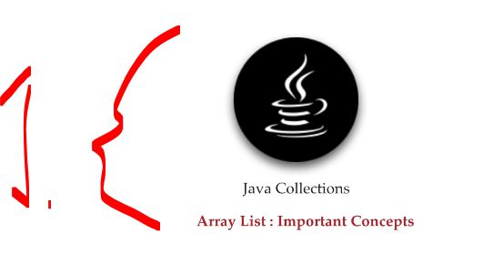
</div>

1. Important concepts to **Array List**!

<div align="center">
    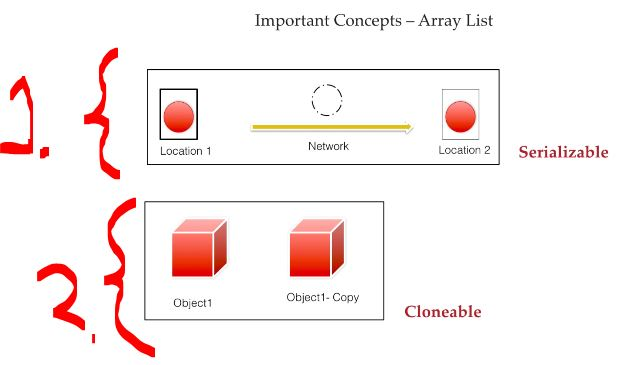
</div>

1. Collection has `Seriazable` interface.
    - This is a marker interface in Java that indicates an object can be converted into a byte stream (for saving to a file, sending over a network, etc.).
2. Collection has `Clonable` interface for **making copies** of **one object**!

<div align="center">
    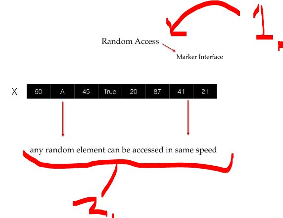
</div>

1. `ArrayList` implements **Random Access** interface `RandomAccess`.
2. This allows same speed for **access**!
    - Directly access any element by its index in constant time `O(1)`.

<div align="center">
    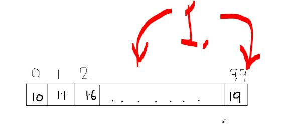
</div>

1. Inserting/Delete into middle of `ArrayList` takes time. This needs to **re-indexed** and the array needs to grow!

# LinkedList.

<div align="center">
    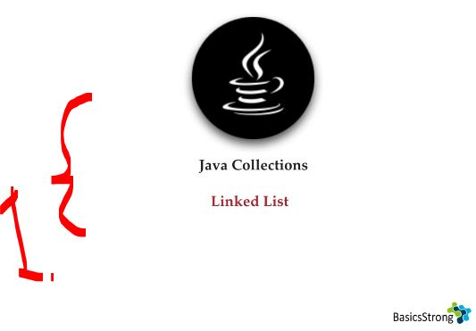
</div>

1. We will be looking how to use **Linked List**! 

<div align="center">
    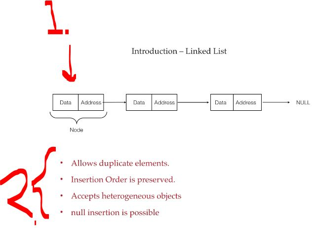
</div>

1. One is called **Node**!
2. **LinkedList** has the following characteristics:
    - Duplicates allowed.
    - Insertion order preserved.
    - Null allowed.
    - Accepts Heterogeneous.

- Different ways to initialize the `LinkedList()`:

````Java
// First way creating LinkedList
LinkedList l = new LinkedList();

// Other way creating LinkedList
// LinkedList ll =  new LinkedList(Collection c);
````

<details>
<summary id="linkedlist_class_from_JDK" open="true"> <b>LinkedList class from JDK</b>! </summary>

```Java
/*
 * Copyright (c) 1997, 2023, Oracle and/or its affiliates. All rights reserved.
 * DO NOT ALTER OR REMOVE COPYRIGHT NOTICES OR THIS FILE HEADER.
 *
 * This code is free software; you can redistribute it and/or modify it
 * under the terms of the GNU General Public License version 2 only, as
 * published by the Free Software Foundation.  Oracle designates this
 * particular file as subject to the "Classpath" exception as provided
 * by Oracle in the LICENSE file that accompanied this code.
 *
 * This code is distributed in the hope that it will be useful, but WITHOUT
 * ANY WARRANTY; without even the implied warranty of MERCHANTABILITY or
 * FITNESS FOR A PARTICULAR PURPOSE.  See the GNU General Public License
 * version 2 for more details (a copy is included in the LICENSE file that
 * accompanied this code).
 *
 * You should have received a copy of the GNU General Public License version
 * 2 along with this work; if not, write to the Free Software Foundation,
 * Inc., 51 Franklin St, Fifth Floor, Boston, MA 02110-1301 USA.
 *
 * Please contact Oracle, 500 Oracle Parkway, Redwood Shores, CA 94065 USA
 * or visit www.oracle.com if you need additional information or have any
 * questions.
 */

package java.util;

import java.io.IOException;
import java.io.ObjectInput;
import java.io.ObjectOutput;
import java.util.function.Consumer;
import java.util.function.IntFunction;
import java.util.function.Predicate;
import java.util.function.UnaryOperator;
import java.util.stream.Stream;

/**
 * Doubly-linked list implementation of the {@code List} and {@code Deque}
 * interfaces.  Implements all optional list operations, and permits all
 * elements (including {@code null}).
 *
 * <p>All of the operations perform as could be expected for a doubly-linked
 * list.  Operations that index into the list will traverse the list from
 * the beginning or the end, whichever is closer to the specified index.
 *
 * <p><strong>Note that this implementation is not synchronized.</strong>
 * If multiple threads access a linked list concurrently, and at least
 * one of the threads modifies the list structurally, it <i>must</i> be
 * synchronized externally.  (A structural modification is any operation
 * that adds or deletes one or more elements; merely setting the value of
 * an element is not a structural modification.)  This is typically
 * accomplished by synchronizing on some object that naturally
 * encapsulates the list.
 *
 * If no such object exists, the list should be "wrapped" using the
 * {@link Collections#synchronizedList Collections.synchronizedList}
 * method.  This is best done at creation time, to prevent accidental
 * unsynchronized access to the list:<pre>
 *   List list = Collections.synchronizedList(new LinkedList(...));</pre>
 *
 * <p>The iterators returned by this class's {@code iterator} and
 * {@code listIterator} methods are <i>fail-fast</i>: if the list is
 * structurally modified at any time after the iterator is created, in
 * any way except through the Iterator's own {@code remove} or
 * {@code add} methods, the iterator will throw a {@link
 * ConcurrentModificationException}.  Thus, in the face of concurrent
 * modification, the iterator fails quickly and cleanly, rather than
 * risking arbitrary, non-deterministic behavior at an undetermined
 * time in the future.
 *
 * <p>Note that the fail-fast behavior of an iterator cannot be guaranteed
 * as it is, generally speaking, impossible to make any hard guarantees in the
 * presence of unsynchronized concurrent modification.  Fail-fast iterators
 * throw {@code ConcurrentModificationException} on a best-effort basis.
 * Therefore, it would be wrong to write a program that depended on this
 * exception for its correctness:   <i>the fail-fast behavior of iterators
 * should be used only to detect bugs.</i>
 *
 * <p>This class is a member of the
 * <a href="{@docRoot}/java.base/java/util/package-summary.html#CollectionsFramework">
 * Java Collections Framework</a>.
 *
 * @author  Josh Bloch
 * @see     List
 * @see     ArrayList
 * @since 1.2
 * @param <E> the type of elements held in this collection
 */

public class LinkedList<E>
    extends AbstractSequentialList<E>
    implements List<E>, Deque<E>, Cloneable, java.io.Serializable
{
    transient int size = 0;

    /**
     * Pointer to first node.
     */
    transient Node<E> first;

    /**
     * Pointer to last node.
     */
    transient Node<E> last;

    /*
    void dataStructureInvariants() {
        assert (size == 0)
            ? (first == null && last == null)
            : (first.prev == null && last.next == null);
    }
    */

    /**
     * Constructs an empty list.
     */
    public LinkedList() {
    }

    /**
     * Constructs a list containing the elements of the specified
     * collection, in the order they are returned by the collection's
     * iterator.
     *
     * @param  c the collection whose elements are to be placed into this list
     * @throws NullPointerException if the specified collection is null
     */
    public LinkedList(Collection<? extends E> c) {
        this();
        addAll(c);
    }

    /**
     * Links e as first element.
     */
    private void linkFirst(E e) {
        final Node<E> f = first;
        final Node<E> newNode = new Node<>(null, e, f);
        first = newNode;
        if (f == null)
            last = newNode;
        else
            f.prev = newNode;
        size++;
        modCount++;
    }

    /**
     * Links e as last element.
     */
    void linkLast(E e) {
        final Node<E> l = last;
        final Node<E> newNode = new Node<>(l, e, null);
        last = newNode;
        if (l == null)
            first = newNode;
        else
            l.next = newNode;
        size++;
        modCount++;
    }

    /**
     * Inserts element e before non-null Node succ.
     */
    void linkBefore(E e, Node<E> succ) {
        // assert succ != null;
        final Node<E> pred = succ.prev;
        final Node<E> newNode = new Node<>(pred, e, succ);
        succ.prev = newNode;
        if (pred == null)
            first = newNode;
        else
            pred.next = newNode;
        size++;
        modCount++;
    }

    /**
     * Unlinks non-null first node f.
     */
    private E unlinkFirst(Node<E> f) {
        // assert f == first && f != null;
        final E element = f.item;
        final Node<E> next = f.next;
        f.item = null;
        f.next = null; // help GC
        first = next;
        if (next == null)
            last = null;
        else
            next.prev = null;
        size--;
        modCount++;
        return element;
    }

    /**
     * Unlinks non-null last node l.
     */
    private E unlinkLast(Node<E> l) {
        // assert l == last && l != null;
        final E element = l.item;
        final Node<E> prev = l.prev;
        l.item = null;
        l.prev = null; // help GC
        last = prev;
        if (prev == null)
            first = null;
        else
            prev.next = null;
        size--;
        modCount++;
        return element;
    }

    /**
     * Unlinks non-null node x.
     */
    E unlink(Node<E> x) {
        // assert x != null;
        final E element = x.item;
        final Node<E> next = x.next;
        final Node<E> prev = x.prev;

        if (prev == null) {
            first = next;
        } else {
            prev.next = next;
            x.prev = null;
        }

        if (next == null) {
            last = prev;
        } else {
            next.prev = prev;
            x.next = null;
        }

        x.item = null;
        size--;
        modCount++;
        return element;
    }

    /**
     * Returns the first element in this list.
     *
     * @return the first element in this list
     * @throws NoSuchElementException if this list is empty
     */
    public E getFirst() {
        final Node<E> f = first;
        if (f == null)
            throw new NoSuchElementException();
        return f.item;
    }

    /**
     * Returns the last element in this list.
     *
     * @return the last element in this list
     * @throws NoSuchElementException if this list is empty
     */
    public E getLast() {
        final Node<E> l = last;
        if (l == null)
            throw new NoSuchElementException();
        return l.item;
    }

    /**
     * Removes and returns the first element from this list.
     *
     * @return the first element from this list
     * @throws NoSuchElementException if this list is empty
     */
    public E removeFirst() {
        final Node<E> f = first;
        if (f == null)
            throw new NoSuchElementException();
        return unlinkFirst(f);
    }

    /**
     * Removes and returns the last element from this list.
     *
     * @return the last element from this list
     * @throws NoSuchElementException if this list is empty
     */
    public E removeLast() {
        final Node<E> l = last;
        if (l == null)
            throw new NoSuchElementException();
        return unlinkLast(l);
    }

    /**
     * Inserts the specified element at the beginning of this list.
     *
     * @param e the element to add
     */
    public void addFirst(E e) {
        linkFirst(e);
    }

    /**
     * Appends the specified element to the end of this list.
     *
     * <p>This method is equivalent to {@link #add}.
     *
     * @param e the element to add
     */
    public void addLast(E e) {
        linkLast(e);
    }

    /**
     * Returns {@code true} if this list contains the specified element.
     * More formally, returns {@code true} if and only if this list contains
     * at least one element {@code e} such that
     * {@code Objects.equals(o, e)}.
     *
     * @param o element whose presence in this list is to be tested
     * @return {@code true} if this list contains the specified element
     */
    public boolean contains(Object o) {
        return indexOf(o) >= 0;
    }

    /**
     * Returns the number of elements in this list.
     *
     * @return the number of elements in this list
     */
    public int size() {
        return size;
    }

    /**
     * Appends the specified element to the end of this list.
     *
     * <p>This method is equivalent to {@link #addLast}.
     *
     * @param e element to be appended to this list
     * @return {@code true} (as specified by {@link Collection#add})
     */
    public boolean add(E e) {
        linkLast(e);
        return true;
    }

    /**
     * Removes the first occurrence of the specified element from this list,
     * if it is present.  If this list does not contain the element, it is
     * unchanged.  More formally, removes the element with the lowest index
     * {@code i} such that
     * {@code Objects.equals(o, get(i))}
     * (if such an element exists).  Returns {@code true} if this list
     * contained the specified element (or equivalently, if this list
     * changed as a result of the call).
     *
     * @param o element to be removed from this list, if present
     * @return {@code true} if this list contained the specified element
     */
    public boolean remove(Object o) {
        if (o == null) {
            for (Node<E> x = first; x != null; x = x.next) {
                if (x.item == null) {
                    unlink(x);
                    return true;
                }
            }
        } else {
            for (Node<E> x = first; x != null; x = x.next) {
                if (o.equals(x.item)) {
                    unlink(x);
                    return true;
                }
            }
        }
        return false;
    }

    /**
     * Appends all of the elements in the specified collection to the end of
     * this list, in the order that they are returned by the specified
     * collection's iterator.  The behavior of this operation is undefined if
     * the specified collection is modified while the operation is in
     * progress.  (Note that this will occur if the specified collection is
     * this list, and it's nonempty.)
     *
     * @param c collection containing elements to be added to this list
     * @return {@code true} if this list changed as a result of the call
     * @throws NullPointerException if the specified collection is null
     */
    public boolean addAll(Collection<? extends E> c) {
        return addAll(size, c);
    }

    /**
     * Inserts all of the elements in the specified collection into this
     * list, starting at the specified position.  Shifts the element
     * currently at that position (if any) and any subsequent elements to
     * the right (increases their indices).  The new elements will appear
     * in the list in the order that they are returned by the
     * specified collection's iterator.
     *
     * @param index index at which to insert the first element
     *              from the specified collection
     * @param c collection containing elements to be added to this list
     * @return {@code true} if this list changed as a result of the call
     * @throws IndexOutOfBoundsException {@inheritDoc}
     * @throws NullPointerException if the specified collection is null
     */
    public boolean addAll(int index, Collection<? extends E> c) {
        checkPositionIndex(index);

        Object[] a = c.toArray();
        int numNew = a.length;
        if (numNew == 0)
            return false;

        Node<E> pred, succ;
        if (index == size) {
            succ = null;
            pred = last;
        } else {
            succ = node(index);
            pred = succ.prev;
        }

        for (Object o : a) {
            @SuppressWarnings("unchecked") E e = (E) o;
            Node<E> newNode = new Node<>(pred, e, null);
            if (pred == null)
                first = newNode;
            else
                pred.next = newNode;
            pred = newNode;
        }

        if (succ == null) {
            last = pred;
        } else {
            pred.next = succ;
            succ.prev = pred;
        }

        size += numNew;
        modCount++;
        return true;
    }

    /**
     * Removes all of the elements from this list.
     * The list will be empty after this call returns.
     */
    public void clear() {
        // Clearing all of the links between nodes is "unnecessary", but:
        // - helps a generational GC if the discarded nodes inhabit
        //   more than one generation
        // - is sure to free memory even if there is a reachable Iterator
        for (Node<E> x = first; x != null; ) {
            Node<E> next = x.next;
            x.item = null;
            x.next = null;
            x.prev = null;
            x = next;
        }
        first = last = null;
        size = 0;
        modCount++;
    }


    // Positional Access Operations

    /**
     * Returns the element at the specified position in this list.
     *
     * @param index index of the element to return
     * @return the element at the specified position in this list
     * @throws IndexOutOfBoundsException {@inheritDoc}
     */
    public E get(int index) {
        checkElementIndex(index);
        return node(index).item;
    }

    /**
     * Replaces the element at the specified position in this list with the
     * specified element.
     *
     * @param index index of the element to replace
     * @param element element to be stored at the specified position
     * @return the element previously at the specified position
     * @throws IndexOutOfBoundsException {@inheritDoc}
     */
    public E set(int index, E element) {
        checkElementIndex(index);
        Node<E> x = node(index);
        E oldVal = x.item;
        x.item = element;
        return oldVal;
    }

    /**
     * Inserts the specified element at the specified position in this list.
     * Shifts the element currently at that position (if any) and any
     * subsequent elements to the right (adds one to their indices).
     *
     * @param index index at which the specified element is to be inserted
     * @param element element to be inserted
     * @throws IndexOutOfBoundsException {@inheritDoc}
     */
    public void add(int index, E element) {
        checkPositionIndex(index);

        if (index == size)
            linkLast(element);
        else
            linkBefore(element, node(index));
    }

    /**
     * Removes the element at the specified position in this list.  Shifts any
     * subsequent elements to the left (subtracts one from their indices).
     * Returns the element that was removed from the list.
     *
     * @param index the index of the element to be removed
     * @return the element previously at the specified position
     * @throws IndexOutOfBoundsException {@inheritDoc}
     */
    public E remove(int index) {
        checkElementIndex(index);
        return unlink(node(index));
    }

    /**
     * Tells if the argument is the index of an existing element.
     */
    private boolean isElementIndex(int index) {
        return index >= 0 && index < size;
    }

    /**
     * Tells if the argument is the index of a valid position for an
     * iterator or an add operation.
     */
    private boolean isPositionIndex(int index) {
        return index >= 0 && index <= size;
    }

    /**
     * Constructs an IndexOutOfBoundsException detail message.
     * Of the many possible refactorings of the error handling code,
     * this "outlining" performs best with both server and client VMs.
     */
    private String outOfBoundsMsg(int index) {
        return "Index: "+index+", Size: "+size;
    }

    private void checkElementIndex(int index) {
        if (!isElementIndex(index))
            throw new IndexOutOfBoundsException(outOfBoundsMsg(index));
    }

    private void checkPositionIndex(int index) {
        if (!isPositionIndex(index))
            throw new IndexOutOfBoundsException(outOfBoundsMsg(index));
    }

    /**
     * Returns the (non-null) Node at the specified element index.
     */
    Node<E> node(int index) {
        // assert isElementIndex(index);

        if (index < (size >> 1)) {
            Node<E> x = first;
            for (int i = 0; i < index; i++)
                x = x.next;
            return x;
        } else {
            Node<E> x = last;
            for (int i = size - 1; i > index; i--)
                x = x.prev;
            return x;
        }
    }

    // Search Operations

    /**
     * Returns the index of the first occurrence of the specified element
     * in this list, or -1 if this list does not contain the element.
     * More formally, returns the lowest index {@code i} such that
     * {@code Objects.equals(o, get(i))},
     * or -1 if there is no such index.
     *
     * @param o element to search for
     * @return the index of the first occurrence of the specified element in
     *         this list, or -1 if this list does not contain the element
     */
    public int indexOf(Object o) {
        int index = 0;
        if (o == null) {
            for (Node<E> x = first; x != null; x = x.next) {
                if (x.item == null)
                    return index;
                index++;
            }
        } else {
            for (Node<E> x = first; x != null; x = x.next) {
                if (o.equals(x.item))
                    return index;
                index++;
            }
        }
        return -1;
    }

    /**
     * Returns the index of the last occurrence of the specified element
     * in this list, or -1 if this list does not contain the element.
     * More formally, returns the highest index {@code i} such that
     * {@code Objects.equals(o, get(i))},
     * or -1 if there is no such index.
     *
     * @param o element to search for
     * @return the index of the last occurrence of the specified element in
     *         this list, or -1 if this list does not contain the element
     */
    public int lastIndexOf(Object o) {
        int index = size;
        if (o == null) {
            for (Node<E> x = last; x != null; x = x.prev) {
                index--;
                if (x.item == null)
                    return index;
            }
        } else {
            for (Node<E> x = last; x != null; x = x.prev) {
                index--;
                if (o.equals(x.item))
                    return index;
            }
        }
        return -1;
    }

    // Queue operations.

    /**
     * Retrieves, but does not remove, the head (first element) of this list.
     *
     * @return the head of this list, or {@code null} if this list is empty
     * @since 1.5
     */
    public E peek() {
        final Node<E> f = first;
        return (f == null) ? null : f.item;
    }

    /**
     * Retrieves, but does not remove, the head (first element) of this list.
     *
     * @return the head of this list
     * @throws NoSuchElementException if this list is empty
     * @since 1.5
     */
    public E element() {
        return getFirst();
    }

    /**
     * Retrieves and removes the head (first element) of this list.
     *
     * @return the head of this list, or {@code null} if this list is empty
     * @since 1.5
     */
    public E poll() {
        final Node<E> f = first;
        return (f == null) ? null : unlinkFirst(f);
    }

    /**
     * Retrieves and removes the head (first element) of this list.
     *
     * @return the head of this list
     * @throws NoSuchElementException if this list is empty
     * @since 1.5
     */
    public E remove() {
        return removeFirst();
    }

    /**
     * Adds the specified element as the tail (last element) of this list.
     *
     * @param e the element to add
     * @return {@code true} (as specified by {@link Queue#offer})
     * @since 1.5
     */
    public boolean offer(E e) {
        return add(e);
    }

    // Deque operations
    /**
     * Inserts the specified element at the front of this list.
     *
     * @param e the element to insert
     * @return {@code true} (as specified by {@link Deque#offerFirst})
     * @since 1.6
     */
    public boolean offerFirst(E e) {
        addFirst(e);
        return true;
    }

    /**
     * Inserts the specified element at the end of this list.
     *
     * @param e the element to insert
     * @return {@code true} (as specified by {@link Deque#offerLast})
     * @since 1.6
     */
    public boolean offerLast(E e) {
        addLast(e);
        return true;
    }

    /**
     * Retrieves, but does not remove, the first element of this list,
     * or returns {@code null} if this list is empty.
     *
     * @return the first element of this list, or {@code null}
     *         if this list is empty
     * @since 1.6
     */
    public E peekFirst() {
        final Node<E> f = first;
        return (f == null) ? null : f.item;
     }

    /**
     * Retrieves, but does not remove, the last element of this list,
     * or returns {@code null} if this list is empty.
     *
     * @return the last element of this list, or {@code null}
     *         if this list is empty
     * @since 1.6
     */
    public E peekLast() {
        final Node<E> l = last;
        return (l == null) ? null : l.item;
    }

    /**
     * Retrieves and removes the first element of this list,
     * or returns {@code null} if this list is empty.
     *
     * @return the first element of this list, or {@code null} if
     *     this list is empty
     * @since 1.6
     */
    public E pollFirst() {
        final Node<E> f = first;
        return (f == null) ? null : unlinkFirst(f);
    }

    /**
     * Retrieves and removes the last element of this list,
     * or returns {@code null} if this list is empty.
     *
     * @return the last element of this list, or {@code null} if
     *     this list is empty
     * @since 1.6
     */
    public E pollLast() {
        final Node<E> l = last;
        return (l == null) ? null : unlinkLast(l);
    }

    /**
     * Pushes an element onto the stack represented by this list.  In other
     * words, inserts the element at the front of this list.
     *
     * <p>This method is equivalent to {@link #addFirst}.
     *
     * @param e the element to push
     * @since 1.6
     */
    public void push(E e) {
        addFirst(e);
    }

    /**
     * Pops an element from the stack represented by this list.  In other
     * words, removes and returns the first element of this list.
     *
     * <p>This method is equivalent to {@link #removeFirst()}.
     *
     * @return the element at the front of this list (which is the top
     *         of the stack represented by this list)
     * @throws NoSuchElementException if this list is empty
     * @since 1.6
     */
    public E pop() {
        return removeFirst();
    }

    /**
     * Removes the first occurrence of the specified element in this
     * list (when traversing the list from head to tail).  If the list
     * does not contain the element, it is unchanged.
     *
     * @param o element to be removed from this list, if present
     * @return {@code true} if the list contained the specified element
     * @since 1.6
     */
    public boolean removeFirstOccurrence(Object o) {
        return remove(o);
    }

    /**
     * Removes the last occurrence of the specified element in this
     * list (when traversing the list from head to tail).  If the list
     * does not contain the element, it is unchanged.
     *
     * @param o element to be removed from this list, if present
     * @return {@code true} if the list contained the specified element
     * @since 1.6
     */
    public boolean removeLastOccurrence(Object o) {
        if (o == null) {
            for (Node<E> x = last; x != null; x = x.prev) {
                if (x.item == null) {
                    unlink(x);
                    return true;
                }
            }
        } else {
            for (Node<E> x = last; x != null; x = x.prev) {
                if (o.equals(x.item)) {
                    unlink(x);
                    return true;
                }
            }
        }
        return false;
    }

    /**
     * Returns a list-iterator of the elements in this list (in proper
     * sequence), starting at the specified position in the list.
     * Obeys the general contract of {@code List.listIterator(int)}.<p>
     *
     * The list-iterator is <i>fail-fast</i>: if the list is structurally
     * modified at any time after the Iterator is created, in any way except
     * through the list-iterator's own {@code remove} or {@code add}
     * methods, the list-iterator will throw a
     * {@code ConcurrentModificationException}.  Thus, in the face of
     * concurrent modification, the iterator fails quickly and cleanly, rather
     * than risking arbitrary, non-deterministic behavior at an undetermined
     * time in the future.
     *
     * @param index index of the first element to be returned from the
     *              list-iterator (by a call to {@code next})
     * @return a ListIterator of the elements in this list (in proper
     *         sequence), starting at the specified position in the list
     * @throws IndexOutOfBoundsException {@inheritDoc}
     * @see List#listIterator(int)
     */
    public ListIterator<E> listIterator(int index) {
        checkPositionIndex(index);
        return new ListItr(index);
    }

    private class ListItr implements ListIterator<E> {
        private Node<E> lastReturned;
        private Node<E> next;
        private int nextIndex;
        private int expectedModCount = modCount;

        ListItr(int index) {
            // assert isPositionIndex(index);
            next = (index == size) ? null : node(index);
            nextIndex = index;
        }

        public boolean hasNext() {
            return nextIndex < size;
        }

        public E next() {
            checkForComodification();
            if (!hasNext())
                throw new NoSuchElementException();

            lastReturned = next;
            next = next.next;
            nextIndex++;
            return lastReturned.item;
        }

        public boolean hasPrevious() {
            return nextIndex > 0;
        }

        public E previous() {
            checkForComodification();
            if (!hasPrevious())
                throw new NoSuchElementException();

            lastReturned = next = (next == null) ? last : next.prev;
            nextIndex--;
            return lastReturned.item;
        }

        public int nextIndex() {
            return nextIndex;
        }

        public int previousIndex() {
            return nextIndex - 1;
        }

        public void remove() {
            checkForComodification();
            if (lastReturned == null)
                throw new IllegalStateException();

            Node<E> lastNext = lastReturned.next;
            unlink(lastReturned);
            if (next == lastReturned)
                next = lastNext;
            else
                nextIndex--;
            lastReturned = null;
            expectedModCount++;
        }

        public void set(E e) {
            if (lastReturned == null)
                throw new IllegalStateException();
            checkForComodification();
            lastReturned.item = e;
        }

        public void add(E e) {
            checkForComodification();
            lastReturned = null;
            if (next == null)
                linkLast(e);
            else
                linkBefore(e, next);
            nextIndex++;
            expectedModCount++;
        }

        public void forEachRemaining(Consumer<? super E> action) {
            Objects.requireNonNull(action);
            while (modCount == expectedModCount && nextIndex < size) {
                action.accept(next.item);
                lastReturned = next;
                next = next.next;
                nextIndex++;
            }
            checkForComodification();
        }

        final void checkForComodification() {
            if (modCount != expectedModCount)
                throw new ConcurrentModificationException();
        }
    }

    private static class Node<E> {
        E item;
        Node<E> next;
        Node<E> prev;

        Node(Node<E> prev, E element, Node<E> next) {
            this.item = element;
            this.next = next;
            this.prev = prev;
        }
    }

    /**
     * @since 1.6
     */
    public Iterator<E> descendingIterator() {
        return new DescendingIterator();
    }

    /**
     * Adapter to provide descending iterators via ListItr.previous
     */
    private class DescendingIterator implements Iterator<E> {
        private final ListItr itr = new ListItr(size());
        public boolean hasNext() {
            return itr.hasPrevious();
        }
        public E next() {
            return itr.previous();
        }
        public void remove() {
            itr.remove();
        }
    }

    @SuppressWarnings("unchecked")
    private LinkedList<E> superClone() {
        try {
            return (LinkedList<E>) super.clone();
        } catch (CloneNotSupportedException e) {
            throw new InternalError(e);
        }
    }

    /**
     * Returns a shallow copy of this {@code LinkedList}. (The elements
     * themselves are not cloned.)
     *
     * @return a shallow copy of this {@code LinkedList} instance
     */
    public Object clone() {
        LinkedList<E> clone = superClone();

        // Put clone into "virgin" state
        clone.first = clone.last = null;
        clone.size = 0;
        clone.modCount = 0;

        // Initialize clone with our elements
        for (Node<E> x = first; x != null; x = x.next)
            clone.add(x.item);

        return clone;
    }

    /**
     * Returns an array containing all of the elements in this list
     * in proper sequence (from first to last element).
     *
     * <p>The returned array will be "safe" in that no references to it are
     * maintained by this list.  (In other words, this method must allocate
     * a new array).  The caller is thus free to modify the returned array.
     *
     * <p>This method acts as bridge between array-based and collection-based
     * APIs.
     *
     * @return an array containing all of the elements in this list
     *         in proper sequence
     */
    public Object[] toArray() {
        Object[] result = new Object[size];
        int i = 0;
        for (Node<E> x = first; x != null; x = x.next)
            result[i++] = x.item;
        return result;
    }

    /**
     * Returns an array containing all of the elements in this list in
     * proper sequence (from first to last element); the runtime type of
     * the returned array is that of the specified array.  If the list fits
     * in the specified array, it is returned therein.  Otherwise, a new
     * array is allocated with the runtime type of the specified array and
     * the size of this list.
     *
     * <p>If the list fits in the specified array with room to spare (i.e.,
     * the array has more elements than the list), the element in the array
     * immediately following the end of the list is set to {@code null}.
     * (This is useful in determining the length of the list <i>only</i> if
     * the caller knows that the list does not contain any null elements.)
     *
     * <p>Like the {@link #toArray()} method, this method acts as bridge between
     * array-based and collection-based APIs.  Further, this method allows
     * precise control over the runtime type of the output array, and may,
     * under certain circumstances, be used to save allocation costs.
     *
     * <p>Suppose {@code x} is a list known to contain only strings.
     * The following code can be used to dump the list into a newly
     * allocated array of {@code String}:
     *
     * <pre>
     *     String[] y = x.toArray(new String[0]);</pre>
     *
     * Note that {@code toArray(new Object[0])} is identical in function to
     * {@code toArray()}.
     *
     * @param a the array into which the elements of the list are to
     *          be stored, if it is big enough; otherwise, a new array of the
     *          same runtime type is allocated for this purpose.
     * @return an array containing the elements of the list
     * @throws ArrayStoreException if the runtime type of the specified array
     *         is not a supertype of the runtime type of every element in
     *         this list
     * @throws NullPointerException if the specified array is null
     */
    @SuppressWarnings("unchecked")
    public <T> T[] toArray(T[] a) {
        if (a.length < size)
            a = (T[])java.lang.reflect.Array.newInstance(
                                a.getClass().getComponentType(), size);
        int i = 0;
        Object[] result = a;
        for (Node<E> x = first; x != null; x = x.next)
            result[i++] = x.item;

        if (a.length > size)
            a[size] = null;

        return a;
    }

    @java.io.Serial
    private static final long serialVersionUID = 876323262645176354L;

    /**
     * Saves the state of this {@code LinkedList} instance to a stream
     * (that is, serializes it).
     *
     * @serialData The size of the list (the number of elements it
     *             contains) is emitted (int), followed by all of its
     *             elements (each an Object) in the proper order.
     */
    @java.io.Serial
    private void writeObject(java.io.ObjectOutputStream s)
        throws java.io.IOException {
        // Write out any hidden serialization magic
        s.defaultWriteObject();

        // Write out size
        s.writeInt(size);

        // Write out all elements in the proper order.
        for (Node<E> x = first; x != null; x = x.next)
            s.writeObject(x.item);
    }

    /**
     * Reconstitutes this {@code LinkedList} instance from a stream
     * (that is, deserializes it).
     */
    @SuppressWarnings("unchecked")
    @java.io.Serial
    private void readObject(java.io.ObjectInputStream s)
        throws java.io.IOException, ClassNotFoundException {
        // Read in any hidden serialization magic
        s.defaultReadObject();

        // Read in size
        int size = s.readInt();

        // Read in all elements in the proper order.
        for (int i = 0; i < size; i++)
            linkLast((E)s.readObject());
    }

    /**
     * Creates a <em><a href="Spliterator.html#binding">late-binding</a></em>
     * and <em>fail-fast</em> {@link Spliterator} over the elements in this
     * list.
     *
     * <p>The {@code Spliterator} reports {@link Spliterator#SIZED} and
     * {@link Spliterator#ORDERED}.  Overriding implementations should document
     * the reporting of additional characteristic values.
     *
     * @implNote
     * The {@code Spliterator} additionally reports {@link Spliterator#SUBSIZED}
     * and implements {@code trySplit} to permit limited parallelism..
     *
     * @return a {@code Spliterator} over the elements in this list
     * @since 1.8
     */
    @Override
    public Spliterator<E> spliterator() {
        return new LLSpliterator<>(this, -1, 0);
    }

    /** A customized variant of Spliterators.IteratorSpliterator */
    static final class LLSpliterator<E> implements Spliterator<E> {
        static final int BATCH_UNIT = 1 << 10;  // batch array size increment
        static final int MAX_BATCH = 1 << 25;  // max batch array size;
        final LinkedList<E> list; // null OK unless traversed
        Node<E> current;      // current node; null until initialized
        int est;              // size estimate; -1 until first needed
        int expectedModCount; // initialized when est set
        int batch;            // batch size for splits

        LLSpliterator(LinkedList<E> list, int est, int expectedModCount) {
            this.list = list;
            this.est = est;
            this.expectedModCount = expectedModCount;
        }

        final int getEst() {
            int s; // force initialization
            final LinkedList<E> lst;
            if ((s = est) < 0) {
                if ((lst = list) == null)
                    s = est = 0;
                else {
                    expectedModCount = lst.modCount;
                    current = lst.first;
                    s = est = lst.size;
                }
            }
            return s;
        }

        public long estimateSize() { return (long) getEst(); }

        public Spliterator<E> trySplit() {
            Node<E> p;
            int s = getEst();
            if (s > 1 && (p = current) != null) {
                int n = batch + BATCH_UNIT;
                if (n > s)
                    n = s;
                if (n > MAX_BATCH)
                    n = MAX_BATCH;
                Object[] a = new Object[n];
                int j = 0;
                do { a[j++] = p.item; } while ((p = p.next) != null && j < n);
                current = p;
                batch = j;
                est = s - j;
                return Spliterators.spliterator(a, 0, j, Spliterator.ORDERED);
            }
            return null;
        }

        public void forEachRemaining(Consumer<? super E> action) {
            Node<E> p; int n;
            if (action == null) throw new NullPointerException();
            if ((n = getEst()) > 0 && (p = current) != null) {
                current = null;
                est = 0;
                do {
                    E e = p.item;
                    p = p.next;
                    action.accept(e);
                } while (p != null && --n > 0);
            }
            if (list.modCount != expectedModCount)
                throw new ConcurrentModificationException();
        }

        public boolean tryAdvance(Consumer<? super E> action) {
            Node<E> p;
            if (action == null) throw new NullPointerException();
            if (getEst() > 0 && (p = current) != null) {
                --est;
                E e = p.item;
                current = p.next;
                action.accept(e);
                if (list.modCount != expectedModCount)
                    throw new ConcurrentModificationException();
                return true;
            }
            return false;
        }

        public int characteristics() {
            return Spliterator.ORDERED | Spliterator.SIZED | Spliterator.SUBSIZED;
        }
    }

    /**
     * {@inheritDoc}
     * <p>
     * Modifications to the reversed view are permitted and will be propagated to this list.
     * In addition, modifications to this list will be visible in the reversed view.
     *
     * @return {@inheritDoc}
     * @since 21
     */
    public LinkedList<E> reversed() {
        return new ReverseOrderLinkedListView<>(this, super.reversed(), Deque.super.reversed());
    }

    // all operations are delegated to the reverse-ordered views.
    // TODO audit all overridden methods
    @SuppressWarnings("serial")
    static class ReverseOrderLinkedListView<E> extends LinkedList<E> implements java.io.Externalizable {
        final LinkedList<E> list;
        final List<E> rlist;
        final Deque<E> rdeque;

        ReverseOrderLinkedListView(LinkedList<E> list, List<E> rlist, Deque<E> rdeque) {
            this.list = list;
            this.rlist = rlist;
            this.rdeque = rdeque;
        }

        public String toString() {
            return rlist.toString();
        }

        public boolean retainAll(Collection<?> c) {
            return rlist.retainAll(c);
        }

        public boolean removeAll(Collection<?> c) {
            return rlist.removeAll(c);
        }

        public boolean containsAll(Collection<?> c) {
            return rlist.containsAll(c);
        }

        public boolean isEmpty() {
            return rlist.isEmpty();
        }

        public Stream<E> parallelStream() {
            return rlist.parallelStream();
        }

        public Stream<E> stream() {
            return rlist.stream();
        }

        public boolean removeIf(Predicate<? super E> filter) {
            return rlist.removeIf(filter);
        }

        public <T> T[] toArray(IntFunction<T[]> generator) {
            return rlist.toArray(generator);
        }

        public void forEach(Consumer<? super E> action) {
            rlist.forEach(action);
        }

        public Iterator<E> iterator() {
            return rlist.iterator();
        }

        public int hashCode() {
            return rlist.hashCode();
        }

        public boolean equals(Object o) {
            return rlist.equals(o);
        }

        public List<E> subList(int fromIndex, int toIndex) {
            return rlist.subList(fromIndex, toIndex);
        }

        public ListIterator<E> listIterator() {
            return rlist.listIterator();
        }

        public void sort(Comparator<? super E> c) {
            rlist.sort(c);
        }

        public void replaceAll(UnaryOperator<E> operator) {
            rlist.replaceAll(operator);
        }

        public LinkedList<E> reversed() {
            return list;
        }

        public Spliterator<E> spliterator() {
            return rlist.spliterator();
        }

        public <T> T[] toArray(T[] a) {
            return rlist.toArray(a);
        }

        public Object[] toArray() {
            return rlist.toArray();
        }

        public Iterator<E> descendingIterator() {
            return rdeque.descendingIterator();
        }

        public ListIterator<E> listIterator(int index) {
            return rlist.listIterator(index);
        }

        public boolean removeLastOccurrence(Object o) {
            return rdeque.removeLastOccurrence(o);
        }

        public boolean removeFirstOccurrence(Object o) {
            return rdeque.removeFirstOccurrence(o);
        }

        public E pop() {
            return rdeque.pop();
        }

        public void push(E e) {
            rdeque.push(e);
        }

        public E pollLast() {
            return rdeque.pollLast();
        }

        public E pollFirst() {
            return rdeque.pollFirst();
        }

        public E peekLast() {
            return rdeque.peekLast();
        }

        public E peekFirst() {
            return rdeque.peekFirst();
        }

        public boolean offerLast(E e) {
            return rdeque.offerLast(e);
        }

        public boolean offerFirst(E e) {
            return rdeque.offerFirst(e);
        }

        public boolean offer(E e) {
            return rdeque.offer(e);
        }

        public E remove() {
            return rdeque.remove();
        }

        public E poll() {
            return rdeque.poll();
        }

        public E element() {
            return rdeque.element();
        }

        public E peek() {
            return rdeque.peek();
        }

        public int lastIndexOf(Object o) {
            return rlist.lastIndexOf(o);
        }

        public int indexOf(Object o) {
            return rlist.indexOf(o);
        }

        public E remove(int index) {
            return rlist.remove(index);
        }

        public void add(int index, E element) {
            rlist.add(index, element);
        }

        public E set(int index, E element) {
            return rlist.set(index, element);
        }

        public E get(int index) {
            return rlist.get(index);
        }

        public void clear() {
            rlist.clear();
        }

        public boolean addAll(int index, Collection<? extends E> c) {
            return rlist.addAll(index, c);
        }

        public boolean addAll(Collection<? extends E> c) {
            return rlist.addAll(c);
        }

        public boolean remove(Object o) {
            return rlist.remove(o);
        }

        public boolean add(E e) {
            return rlist.add(e);
        }

        public int size() {
            return rlist.size();
        }

        public boolean contains(Object o) {
            return rlist.contains(o);
        }

        public void addLast(E e) {
            rdeque.addLast(e);
        }

        public void addFirst(E e) {
            rdeque.addFirst(e);
        }

        public E removeLast() {
            return rdeque.removeLast();
        }

        public E removeFirst() {
            return rdeque.removeFirst();
        }

        public E getLast() {
            return rdeque.getLast();
        }

        public E getFirst() {
            return rdeque.getFirst();
        }

        public void readExternal(ObjectInput in) throws IOException, ClassNotFoundException {
            throw new java.io.InvalidObjectException("not serializable");
        }

        public void writeExternal(ObjectOutput out) throws IOException {
            throw new java.io.InvalidObjectException("not serializable");
        }
    }
}
```
</details>

<br>

- We can use multiple different methods for the `LinkedList`:

````Java
        // Adding to LinkedList.
        l.add("John");
        l.add(2);
        l.add(null);
        System.out.println(l);

        // This will add with replace.
        l.set(1,13);
        System.out.println(l);

        // Adds and shifts the value if there exists!
        l.add(2,true);
        System.out.println(l);

        // Remove Last!
        l.removeLast();
        System.out.println(l);

        // Adding First!
        l.addFirst(23);
        System.out.println(l);
````

<details>
<summary id="full_code_linkedlist" open="true"> <b>Full code after LinkedList chapter</b>! </summary>

```Java
package list;

import java.util.ArrayList;
import java.util.LinkedList;
import java.util.List;

public class LinkedListDemo
{
    public static void main( String[] args )
    {
        // First way creating LinkedList
        LinkedList l = new LinkedList();

        // Other way creating LinkedList
        // LinkedList ll =  new LinkedList(Collection c);

        // Adding to LinkedList.
        l.add("John");
        l.add(2);
        l.add(null);
        System.out.println(l);

        // This will add with replace.
        l.set(1,13);
        System.out.println(l);

        // Adds and shifts the value if there exists!
        l.add(2,true);
        System.out.println(l);

        // Remove Last!
        l.removeLast();
        System.out.println(l);

        // Adding First!
        l.addFirst(23);
        System.out.println(l);
    }
}
```
</details>


# LinkedList vs ArrayList.

<div align="center">
    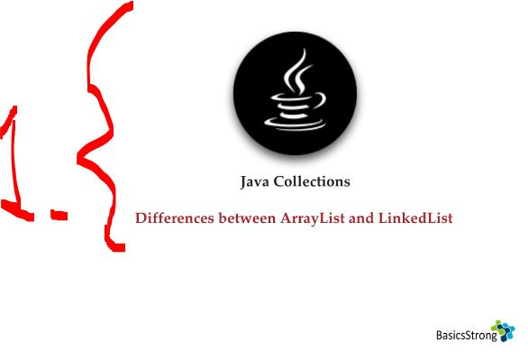
</div>

1. We will see what is difference between `ArrayList` and `LinkedList`.

<div align="center">
    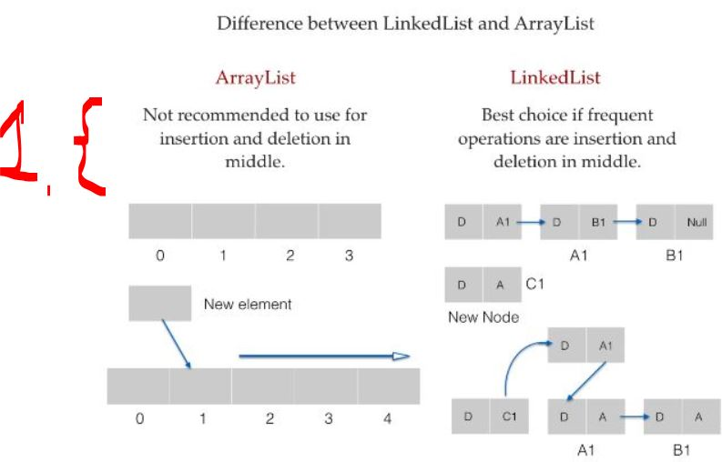
</div>

1. **ArrayList** not recommended for operations in middle! 

<div align="center">
    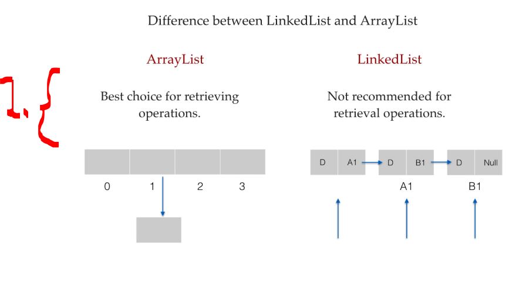
</div>

1. **ArrayList** best when retrieving operation! 

# Vector.

<div align="center">
    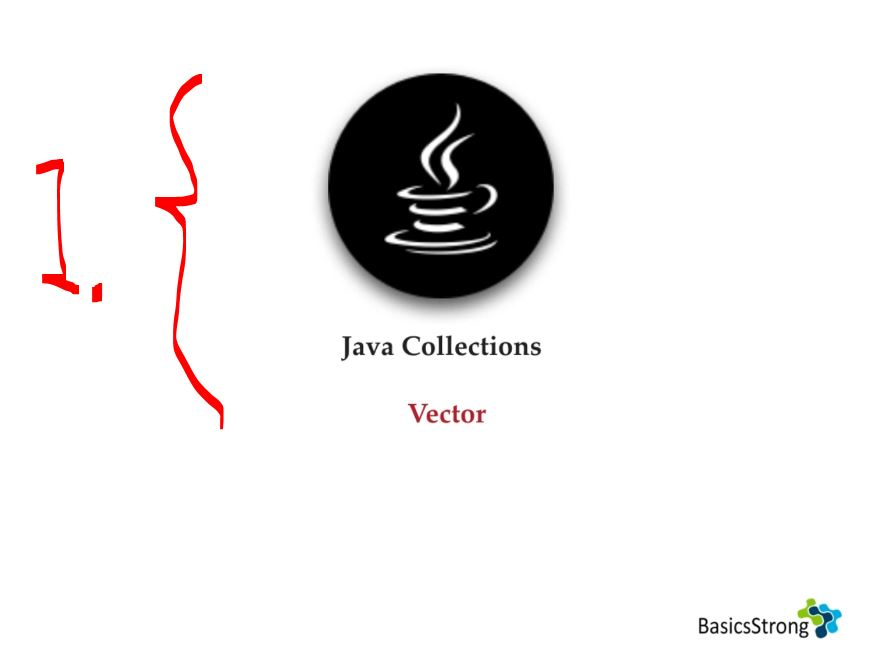
</div>

1. How the **Vector** class behaves! 

<div align="center">
    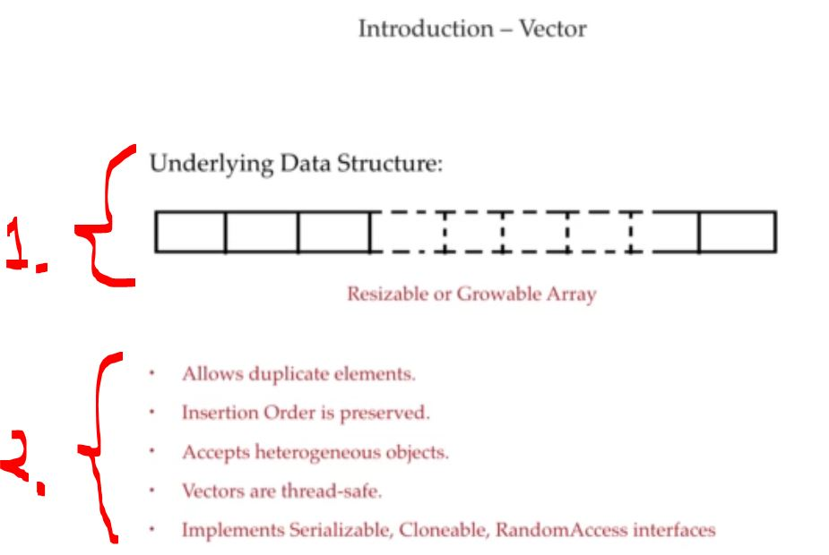
</div>

1. **Vector** has **Growable Array** inside.
2. **Vector** has the following characteristics:
    - **Allows duplicate** elements.
    - **Insertion order** is preserved.
    - Accepts **heterogeneous** objects.
        - Multiple types!
    - **One thread** can access method at the time!
    - Implements interfaces:
        - `Serializable`.
        - `Cloneable`.
        - `RandomAccess`.

<div align="center">
    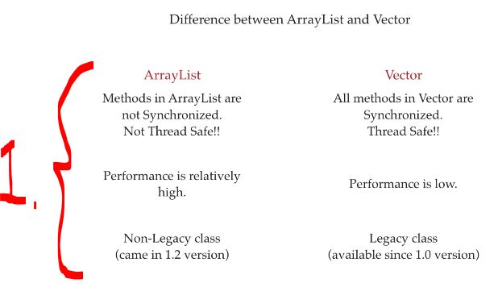
</div>

1. Points below:

| Feature        | ArrayList                                      | Vector                                      |
|---------------|------------------------------------------------|---------------------------------------------|
| Synchronization | Methods are **not synchronized**              | All methods are **synchronized**             |
| Thread Safety | ❌ Not thread-safe                              | ✅ Thread-safe                               |
| Performance   | ✅ High (faster)                                | ❌ Lower (slower due to synchronization)     |
| Type          | Non-legacy class (introduced in Java 1.2)      | Legacy class (introduced in Java 1.0)        |

- Different ways to initialize the `Vector()`:

````Java
       // Vector initialized, different ways!
        Vector v = new Vector();
        Vector vec = new Vector(60);
        // Avoid wasting memory, we have another way to initialize this:
        Vector vec1 = new Vector(100, 5); // Just grow 5.
        // We get vector to equal to this!
        // Vector vec2 = new Vector(Collection c)
````

- **Resizing formula:** New capacity = 2 × old capacity (it doubles).

<details>
<summary id="vector_class_from_JDK" open="true"> <b>Vector class from JDK</b>! </summary>

```Java
/*
 * Copyright (c) 1994, 2019, Oracle and/or its affiliates. All rights reserved.
 * DO NOT ALTER OR REMOVE COPYRIGHT NOTICES OR THIS FILE HEADER.
 *
 * This code is free software; you can redistribute it and/or modify it
 * under the terms of the GNU General Public License version 2 only, as
 * published by the Free Software Foundation.  Oracle designates this
 * particular file as subject to the "Classpath" exception as provided
 * by Oracle in the LICENSE file that accompanied this code.
 *
 * This code is distributed in the hope that it will be useful, but WITHOUT
 * ANY WARRANTY; without even the implied warranty of MERCHANTABILITY or
 * FITNESS FOR A PARTICULAR PURPOSE.  See the GNU General Public License
 * version 2 for more details (a copy is included in the LICENSE file that
 * accompanied this code).
 *
 * You should have received a copy of the GNU General Public License version
 * 2 along with this work; if not, write to the Free Software Foundation,
 * Inc., 51 Franklin St, Fifth Floor, Boston, MA 02110-1301 USA.
 *
 * Please contact Oracle, 500 Oracle Parkway, Redwood Shores, CA 94065 USA
 * or visit www.oracle.com if you need additional information or have any
 * questions.
 */

package java.util;

import java.io.IOException;
import java.io.ObjectInputStream;
import java.io.StreamCorruptedException;
import java.util.function.Consumer;
import java.util.function.Predicate;
import java.util.function.UnaryOperator;

import jdk.internal.util.ArraysSupport;

/**
 * The {@code Vector} class implements a growable array of
 * objects. Like an array, it contains components that can be
 * accessed using an integer index. However, the size of a
 * {@code Vector} can grow or shrink as needed to accommodate
 * adding and removing items after the {@code Vector} has been created.
 *
 * <p>Each vector tries to optimize storage management by maintaining a
 * {@code capacity} and a {@code capacityIncrement}. The
 * {@code capacity} is always at least as large as the vector
 * size; it is usually larger because as components are added to the
 * vector, the vector's storage increases in chunks the size of
 * {@code capacityIncrement}. An application can increase the
 * capacity of a vector before inserting a large number of
 * components; this reduces the amount of incremental reallocation.
 *
 * <p id="fail-fast">
 * The iterators returned by this class's {@link #iterator() iterator} and
 * {@link #listIterator(int) listIterator} methods are <em>fail-fast</em>:
 * if the vector is structurally modified at any time after the iterator is
 * created, in any way except through the iterator's own
 * {@link ListIterator#remove() remove} or
 * {@link ListIterator#add(Object) add} methods, the iterator will throw a
 * {@link ConcurrentModificationException}.  Thus, in the face of
 * concurrent modification, the iterator fails quickly and cleanly, rather
 * than risking arbitrary, non-deterministic behavior at an undetermined
 * time in the future.  The {@link Enumeration Enumerations} returned by
 * the {@link #elements() elements} method are <em>not</em> fail-fast; if the
 * Vector is structurally modified at any time after the enumeration is
 * created then the results of enumerating are undefined.
 *
 * <p>Note that the fail-fast behavior of an iterator cannot be guaranteed
 * as it is, generally speaking, impossible to make any hard guarantees in the
 * presence of unsynchronized concurrent modification.  Fail-fast iterators
 * throw {@code ConcurrentModificationException} on a best-effort basis.
 * Therefore, it would be wrong to write a program that depended on this
 * exception for its correctness:  <i>the fail-fast behavior of iterators
 * should be used only to detect bugs.</i>
 *
 * <p>As of the Java 2 platform v1.2, this class was retrofitted to
 * implement the {@link List} interface, making it a member of the
 * <a href="{@docRoot}/java.base/java/util/package-summary.html#CollectionsFramework">
 * Java Collections Framework</a>.  Unlike the new collection
 * implementations, {@code Vector} is synchronized.  If a thread-safe
 * implementation is not needed, it is recommended to use {@link
 * ArrayList} in place of {@code Vector}.
 *
 * @param <E> Type of component elements
 *
 * @author  Lee Boynton
 * @author  Jonathan Payne
 * @see Collection
 * @see LinkedList
 * @since   1.0
 */
public class Vector<E>
    extends AbstractList<E>
    implements List<E>, RandomAccess, Cloneable, java.io.Serializable
{
    /**
     * The array buffer into which the components of the vector are
     * stored. The capacity of the vector is the length of this array buffer,
     * and is at least large enough to contain all the vector's elements.
     *
     * <p>Any array elements following the last element in the Vector are null.
     *
     * @serial
     */
    @SuppressWarnings("serial") // Conditionally serializable
    protected Object[] elementData;

    /**
     * The number of valid components in this {@code Vector} object.
     * Components {@code elementData[0]} through
     * {@code elementData[elementCount-1]} are the actual items.
     *
     * @serial
     */
    protected int elementCount;

    /**
     * The amount by which the capacity of the vector is automatically
     * incremented when its size becomes greater than its capacity.  If
     * the capacity increment is less than or equal to zero, the capacity
     * of the vector is doubled each time it needs to grow.
     *
     * @serial
     */
    protected int capacityIncrement;

    /** use serialVersionUID from JDK 1.0.2 for interoperability */
    @java.io.Serial
    private static final long serialVersionUID = -2767605614048989439L;

    /**
     * Constructs an empty vector with the specified initial capacity and
     * capacity increment.
     *
     * @param   initialCapacity     the initial capacity of the vector
     * @param   capacityIncrement   the amount by which the capacity is
     *                              increased when the vector overflows
     * @throws IllegalArgumentException if the specified initial capacity
     *         is negative
     */
    public Vector(int initialCapacity, int capacityIncrement) {
        super();
        if (initialCapacity < 0)
            throw new IllegalArgumentException("Illegal Capacity: "+
                                               initialCapacity);
        this.elementData = new Object[initialCapacity];
        this.capacityIncrement = capacityIncrement;
    }

    /**
     * Constructs an empty vector with the specified initial capacity and
     * with its capacity increment equal to zero.
     *
     * @param   initialCapacity   the initial capacity of the vector
     * @throws IllegalArgumentException if the specified initial capacity
     *         is negative
     */
    public Vector(int initialCapacity) {
        this(initialCapacity, 0);
    }

    /**
     * Constructs an empty vector so that its internal data array
     * has size {@code 10} and its standard capacity increment is
     * zero.
     */
    public Vector() {
        this(10);
    }

    /**
     * Constructs a vector containing the elements of the specified
     * collection, in the order they are returned by the collection's
     * iterator.
     *
     * @param c the collection whose elements are to be placed into this
     *       vector
     * @throws NullPointerException if the specified collection is null
     * @since   1.2
     */
    public Vector(Collection<? extends E> c) {
        Object[] a = c.toArray();
        elementCount = a.length;
        if (c.getClass() == ArrayList.class) {
            elementData = a;
        } else {
            elementData = Arrays.copyOf(a, elementCount, Object[].class);
        }
    }

    /**
     * Copies the components of this vector into the specified array.
     * The item at index {@code k} in this vector is copied into
     * component {@code k} of {@code anArray}.
     *
     * @param  anArray the array into which the components get copied
     * @throws NullPointerException if the given array is null
     * @throws IndexOutOfBoundsException if the specified array is not
     *         large enough to hold all the components of this vector
     * @throws ArrayStoreException if a component of this vector is not of
     *         a runtime type that can be stored in the specified array
     * @see #toArray(Object[])
     */
    public synchronized void copyInto(Object[] anArray) {
        System.arraycopy(elementData, 0, anArray, 0, elementCount);
    }

    /**
     * Trims the capacity of this vector to be the vector's current
     * size. If the capacity of this vector is larger than its current
     * size, then the capacity is changed to equal the size by replacing
     * its internal data array, kept in the field {@code elementData},
     * with a smaller one. An application can use this operation to
     * minimize the storage of a vector.
     */
    public synchronized void trimToSize() {
        modCount++;
        int oldCapacity = elementData.length;
        if (elementCount < oldCapacity) {
            elementData = Arrays.copyOf(elementData, elementCount);
        }
    }

    /**
     * Increases the capacity of this vector, if necessary, to ensure
     * that it can hold at least the number of components specified by
     * the minimum capacity argument.
     *
     * <p>If the current capacity of this vector is less than
     * {@code minCapacity}, then its capacity is increased by replacing its
     * internal data array, kept in the field {@code elementData}, with a
     * larger one.  The size of the new data array will be the old size plus
     * {@code capacityIncrement}, unless the value of
     * {@code capacityIncrement} is less than or equal to zero, in which case
     * the new capacity will be twice the old capacity; but if this new size
     * is still smaller than {@code minCapacity}, then the new capacity will
     * be {@code minCapacity}.
     *
     * @param minCapacity the desired minimum capacity
     */
    public synchronized void ensureCapacity(int minCapacity) {
        if (minCapacity > 0) {
            modCount++;
            if (minCapacity > elementData.length)
                grow(minCapacity);
        }
    }

    /**
     * Increases the capacity to ensure that it can hold at least the
     * number of elements specified by the minimum capacity argument.
     *
     * @param minCapacity the desired minimum capacity
     * @throws OutOfMemoryError if minCapacity is less than zero
     */
    private Object[] grow(int minCapacity) {
        int oldCapacity = elementData.length;
        int newCapacity = ArraysSupport.newLength(oldCapacity,
                minCapacity - oldCapacity, /* minimum growth */
                capacityIncrement > 0 ? capacityIncrement : oldCapacity
                                           /* preferred growth */);
        return elementData = Arrays.copyOf(elementData, newCapacity);
    }

    private Object[] grow() {
        return grow(elementCount + 1);
    }

    /**
     * Sets the size of this vector. If the new size is greater than the
     * current size, new {@code null} items are added to the end of
     * the vector. If the new size is less than the current size, all
     * components at index {@code newSize} and greater are discarded.
     *
     * @param  newSize   the new size of this vector
     * @throws ArrayIndexOutOfBoundsException if the new size is negative
     */
    public synchronized void setSize(int newSize) {
        modCount++;
        if (newSize > elementData.length)
            grow(newSize);
        final Object[] es = elementData;
        for (int to = elementCount, i = newSize; i < to; i++)
            es[i] = null;
        elementCount = newSize;
    }

    /**
     * Returns the current capacity of this vector.
     *
     * @return  the current capacity (the length of its internal
     *          data array, kept in the field {@code elementData}
     *          of this vector)
     */
    public synchronized int capacity() {
        return elementData.length;
    }

    /**
     * Returns the number of components in this vector.
     *
     * @return  the number of components in this vector
     */
    public synchronized int size() {
        return elementCount;
    }

    /**
     * Tests if this vector has no components.
     *
     * @return  {@code true} if and only if this vector has
     *          no components, that is, its size is zero;
     *          {@code false} otherwise.
     */
    public synchronized boolean isEmpty() {
        return elementCount == 0;
    }

    /**
     * Returns an enumeration of the components of this vector. The
     * returned {@code Enumeration} object will generate all items in
     * this vector. The first item generated is the item at index {@code 0},
     * then the item at index {@code 1}, and so on. If the vector is
     * structurally modified while enumerating over the elements then the
     * results of enumerating are undefined.
     *
     * @return  an enumeration of the components of this vector
     * @see     Iterator
     */
    public Enumeration<E> elements() {
        return new Enumeration<E>() {
            int count = 0;

            public boolean hasMoreElements() {
                return count < elementCount;
            }

            public E nextElement() {
                synchronized (Vector.this) {
                    if (count < elementCount) {
                        return elementData(count++);
                    }
                }
                throw new NoSuchElementException("Vector Enumeration");
            }
        };
    }

    /**
     * Returns {@code true} if this vector contains the specified element.
     * More formally, returns {@code true} if and only if this vector
     * contains at least one element {@code e} such that
     * {@code Objects.equals(o, e)}.
     *
     * @param o element whose presence in this vector is to be tested
     * @return {@code true} if this vector contains the specified element
     */
    public boolean contains(Object o) {
        return indexOf(o, 0) >= 0;
    }

    /**
     * Returns the index of the first occurrence of the specified element
     * in this vector, or -1 if this vector does not contain the element.
     * More formally, returns the lowest index {@code i} such that
     * {@code Objects.equals(o, get(i))},
     * or -1 if there is no such index.
     *
     * @param o element to search for
     * @return the index of the first occurrence of the specified element in
     *         this vector, or -1 if this vector does not contain the element
     */
    public int indexOf(Object o) {
        return indexOf(o, 0);
    }

    /**
     * Returns the index of the first occurrence of the specified element in
     * this vector, searching forwards from {@code index}, or returns -1 if
     * the element is not found.
     * More formally, returns the lowest index {@code i} such that
     * {@code (i >= index && Objects.equals(o, get(i)))},
     * or -1 if there is no such index.
     *
     * @param o element to search for
     * @param index index to start searching from
     * @return the index of the first occurrence of the element in
     *         this vector at position {@code index} or later in the vector;
     *         {@code -1} if the element is not found.
     * @throws IndexOutOfBoundsException if the specified index is negative
     * @see     Object#equals(Object)
     */
    public synchronized int indexOf(Object o, int index) {
        if (o == null) {
            for (int i = index ; i < elementCount ; i++)
                if (elementData[i]==null)
                    return i;
        } else {
            for (int i = index ; i < elementCount ; i++)
                if (o.equals(elementData[i]))
                    return i;
        }
        return -1;
    }

    /**
     * Returns the index of the last occurrence of the specified element
     * in this vector, or -1 if this vector does not contain the element.
     * More formally, returns the highest index {@code i} such that
     * {@code Objects.equals(o, get(i))},
     * or -1 if there is no such index.
     *
     * @param o element to search for
     * @return the index of the last occurrence of the specified element in
     *         this vector, or -1 if this vector does not contain the element
     */
    public synchronized int lastIndexOf(Object o) {
        return lastIndexOf(o, elementCount-1);
    }

    /**
     * Returns the index of the last occurrence of the specified element in
     * this vector, searching backwards from {@code index}, or returns -1 if
     * the element is not found.
     * More formally, returns the highest index {@code i} such that
     * {@code (i <= index && Objects.equals(o, get(i)))},
     * or -1 if there is no such index.
     *
     * @param o element to search for
     * @param index index to start searching backwards from
     * @return the index of the last occurrence of the element at position
     *         less than or equal to {@code index} in this vector;
     *         -1 if the element is not found.
     * @throws IndexOutOfBoundsException if the specified index is greater
     *         than or equal to the current size of this vector
     */
    public synchronized int lastIndexOf(Object o, int index) {
        if (index >= elementCount)
            throw new IndexOutOfBoundsException(index + " >= "+ elementCount);

        if (o == null) {
            for (int i = index; i >= 0; i--)
                if (elementData[i]==null)
                    return i;
        } else {
            for (int i = index; i >= 0; i--)
                if (o.equals(elementData[i]))
                    return i;
        }
        return -1;
    }

    /**
     * Returns the component at the specified index.
     *
     * <p>This method is identical in functionality to the {@link #get(int)}
     * method (which is part of the {@link List} interface).
     *
     * @param      index   an index into this vector
     * @return     the component at the specified index
     * @throws ArrayIndexOutOfBoundsException if the index is out of range
     *         ({@code index < 0 || index >= size()})
     */
    public synchronized E elementAt(int index) {
        if (index >= elementCount) {
            throw new ArrayIndexOutOfBoundsException(index + " >= " + elementCount);
        }

        return elementData(index);
    }

    /**
     * Returns the first component (the item at index {@code 0}) of
     * this vector.
     *
     * @return     the first component of this vector
     * @throws NoSuchElementException if this vector has no components
     */
    public synchronized E firstElement() {
        if (elementCount == 0) {
            throw new NoSuchElementException();
        }
        return elementData(0);
    }

    /**
     * Returns the last component of the vector.
     *
     * @return  the last component of the vector, i.e., the component at index
     *          {@code size() - 1}
     * @throws NoSuchElementException if this vector is empty
     */
    public synchronized E lastElement() {
        if (elementCount == 0) {
            throw new NoSuchElementException();
        }
        return elementData(elementCount - 1);
    }

    /**
     * Sets the component at the specified {@code index} of this
     * vector to be the specified object. The previous component at that
     * position is discarded.
     *
     * <p>The index must be a value greater than or equal to {@code 0}
     * and less than the current size of the vector.
     *
     * <p>This method is identical in functionality to the
     * {@link #set(int, Object) set(int, E)}
     * method (which is part of the {@link List} interface). Note that the
     * {@code set} method reverses the order of the parameters, to more closely
     * match array usage.  Note also that the {@code set} method returns the
     * old value that was stored at the specified position.
     *
     * @param      obj     what the component is to be set to
     * @param      index   the specified index
     * @throws ArrayIndexOutOfBoundsException if the index is out of range
     *         ({@code index < 0 || index >= size()})
     */
    public synchronized void setElementAt(E obj, int index) {
        if (index >= elementCount) {
            throw new ArrayIndexOutOfBoundsException(index + " >= " +
                                                     elementCount);
        }
        elementData[index] = obj;
    }

    /**
     * Deletes the component at the specified index. Each component in
     * this vector with an index greater or equal to the specified
     * {@code index} is shifted downward to have an index one
     * smaller than the value it had previously. The size of this vector
     * is decreased by {@code 1}.
     *
     * <p>The index must be a value greater than or equal to {@code 0}
     * and less than the current size of the vector.
     *
     * <p>This method is identical in functionality to the {@link #remove(int)}
     * method (which is part of the {@link List} interface).  Note that the
     * {@code remove} method returns the old value that was stored at the
     * specified position.
     *
     * @param      index   the index of the object to remove
     * @throws ArrayIndexOutOfBoundsException if the index is out of range
     *         ({@code index < 0 || index >= size()})
     */
    public synchronized void removeElementAt(int index) {
        if (index >= elementCount) {
            throw new ArrayIndexOutOfBoundsException(index + " >= " +
                                                     elementCount);
        }
        else if (index < 0) {
            throw new ArrayIndexOutOfBoundsException(index);
        }
        int j = elementCount - index - 1;
        if (j > 0) {
            System.arraycopy(elementData, index + 1, elementData, index, j);
        }
        modCount++;
        elementCount--;
        elementData[elementCount] = null; /* to let gc do its work */
    }

    /**
     * Inserts the specified object as a component in this vector at the
     * specified {@code index}. Each component in this vector with
     * an index greater or equal to the specified {@code index} is
     * shifted upward to have an index one greater than the value it had
     * previously.
     *
     * <p>The index must be a value greater than or equal to {@code 0}
     * and less than or equal to the current size of the vector. (If the
     * index is equal to the current size of the vector, the new element
     * is appended to the Vector.)
     *
     * <p>This method is identical in functionality to the
     * {@link #add(int, Object) add(int, E)}
     * method (which is part of the {@link List} interface).  Note that the
     * {@code add} method reverses the order of the parameters, to more closely
     * match array usage.
     *
     * @param      obj     the component to insert
     * @param      index   where to insert the new component
     * @throws ArrayIndexOutOfBoundsException if the index is out of range
     *         ({@code index < 0 || index > size()})
     */
    public synchronized void insertElementAt(E obj, int index) {
        if (index > elementCount) {
            throw new ArrayIndexOutOfBoundsException(index
                                                     + " > " + elementCount);
        }
        modCount++;
        final int s = elementCount;
        Object[] elementData = this.elementData;
        if (s == elementData.length)
            elementData = grow();
        System.arraycopy(elementData, index,
                         elementData, index + 1,
                         s - index);
        elementData[index] = obj;
        elementCount = s + 1;
    }

    /**
     * Adds the specified component to the end of this vector,
     * increasing its size by one. The capacity of this vector is
     * increased if its size becomes greater than its capacity.
     *
     * <p>This method is identical in functionality to the
     * {@link #add(Object) add(E)}
     * method (which is part of the {@link List} interface).
     *
     * @param   obj   the component to be added
     */
    public synchronized void addElement(E obj) {
        modCount++;
        add(obj, elementData, elementCount);
    }

    /**
     * Removes the first (lowest-indexed) occurrence of the argument
     * from this vector. If the object is found in this vector, each
     * component in the vector with an index greater or equal to the
     * object's index is shifted downward to have an index one smaller
     * than the value it had previously.
     *
     * <p>This method is identical in functionality to the
     * {@link #remove(Object)} method (which is part of the
     * {@link List} interface).
     *
     * @param   obj   the component to be removed
     * @return  {@code true} if the argument was a component of this
     *          vector; {@code false} otherwise.
     */
    public synchronized boolean removeElement(Object obj) {
        modCount++;
        int i = indexOf(obj);
        if (i >= 0) {
            removeElementAt(i);
            return true;
        }
        return false;
    }

    /**
     * Removes all components from this vector and sets its size to zero.
     *
     * <p>This method is identical in functionality to the {@link #clear}
     * method (which is part of the {@link List} interface).
     */
    public synchronized void removeAllElements() {
        final Object[] es = elementData;
        for (int to = elementCount, i = elementCount = 0; i < to; i++)
            es[i] = null;
        modCount++;
    }

    /**
     * Returns a clone of this vector. The copy will contain a
     * reference to a clone of the internal data array, not a reference
     * to the original internal data array of this {@code Vector} object.
     *
     * @return  a clone of this vector
     */
    public synchronized Object clone() {
        try {
            @SuppressWarnings("unchecked")
            Vector<E> v = (Vector<E>) super.clone();
            v.elementData = Arrays.copyOf(elementData, elementCount);
            v.modCount = 0;
            return v;
        } catch (CloneNotSupportedException e) {
            // this shouldn't happen, since we are Cloneable
            throw new InternalError(e);
        }
    }

    /**
     * Returns an array containing all of the elements in this Vector
     * in the correct order.
     *
     * @since 1.2
     */
    public synchronized Object[] toArray() {
        return Arrays.copyOf(elementData, elementCount);
    }

    /**
     * Returns an array containing all of the elements in this Vector in the
     * correct order; the runtime type of the returned array is that of the
     * specified array.  If the Vector fits in the specified array, it is
     * returned therein.  Otherwise, a new array is allocated with the runtime
     * type of the specified array and the size of this Vector.
     *
     * <p>If the Vector fits in the specified array with room to spare
     * (i.e., the array has more elements than the Vector),
     * the element in the array immediately following the end of the
     * Vector is set to null.  (This is useful in determining the length
     * of the Vector <em>only</em> if the caller knows that the Vector
     * does not contain any null elements.)
     *
     * @param <T> type of array elements. The same type as {@code <E>} or a
     * supertype of {@code <E>}.
     * @param a the array into which the elements of the Vector are to
     *          be stored, if it is big enough; otherwise, a new array of the
     *          same runtime type is allocated for this purpose.
     * @return an array containing the elements of the Vector
     * @throws ArrayStoreException if the runtime type of a, {@code <T>}, is not
     * a supertype of the runtime type, {@code <E>}, of every element in this
     * Vector
     * @throws NullPointerException if the given array is null
     * @since 1.2
     */
    @SuppressWarnings("unchecked")
    public synchronized <T> T[] toArray(T[] a) {
        if (a.length < elementCount)
            return (T[]) Arrays.copyOf(elementData, elementCount, a.getClass());

        System.arraycopy(elementData, 0, a, 0, elementCount);

        if (a.length > elementCount)
            a[elementCount] = null;

        return a;
    }

    // Positional Access Operations

    @SuppressWarnings("unchecked")
    E elementData(int index) {
        return (E) elementData[index];
    }

    @SuppressWarnings("unchecked")
    static <E> E elementAt(Object[] es, int index) {
        return (E) es[index];
    }

    /**
     * Returns the element at the specified position in this Vector.
     *
     * @param index index of the element to return
     * @return object at the specified index
     * @throws ArrayIndexOutOfBoundsException if the index is out of range
     *            ({@code index < 0 || index >= size()})
     * @since 1.2
     */
    public synchronized E get(int index) {
        if (index >= elementCount)
            throw new ArrayIndexOutOfBoundsException(index);

        return elementData(index);
    }

    /**
     * Replaces the element at the specified position in this Vector with the
     * specified element.
     *
     * @param index index of the element to replace
     * @param element element to be stored at the specified position
     * @return the element previously at the specified position
     * @throws ArrayIndexOutOfBoundsException if the index is out of range
     *         ({@code index < 0 || index >= size()})
     * @since 1.2
     */
    public synchronized E set(int index, E element) {
        if (index >= elementCount)
            throw new ArrayIndexOutOfBoundsException(index);

        E oldValue = elementData(index);
        elementData[index] = element;
        return oldValue;
    }

    /**
     * This helper method split out from add(E) to keep method
     * bytecode size under 35 (the -XX:MaxInlineSize default value),
     * which helps when add(E) is called in a C1-compiled loop.
     */
    private void add(E e, Object[] elementData, int s) {
        if (s == elementData.length)
            elementData = grow();
        elementData[s] = e;
        elementCount = s + 1;
    }

    /**
     * Appends the specified element to the end of this Vector.
     *
     * @param e element to be appended to this Vector
     * @return {@code true} (as specified by {@link Collection#add})
     * @since 1.2
     */
    public synchronized boolean add(E e) {
        modCount++;
        add(e, elementData, elementCount);
        return true;
    }

    /**
     * Removes the first occurrence of the specified element in this Vector
     * If the Vector does not contain the element, it is unchanged.  More
     * formally, removes the element with the lowest index i such that
     * {@code Objects.equals(o, get(i))} (if such
     * an element exists).
     *
     * @param o element to be removed from this Vector, if present
     * @return true if the Vector contained the specified element
     * @since 1.2
     */
    public boolean remove(Object o) {
        return removeElement(o);
    }

    /**
     * Inserts the specified element at the specified position in this Vector.
     * Shifts the element currently at that position (if any) and any
     * subsequent elements to the right (adds one to their indices).
     *
     * @param index index at which the specified element is to be inserted
     * @param element element to be inserted
     * @throws ArrayIndexOutOfBoundsException if the index is out of range
     *         ({@code index < 0 || index > size()})
     * @since 1.2
     */
    public void add(int index, E element) {
        insertElementAt(element, index);
    }

    /**
     * Removes the element at the specified position in this Vector.
     * Shifts any subsequent elements to the left (subtracts one from their
     * indices).  Returns the element that was removed from the Vector.
     *
     * @param index the index of the element to be removed
     * @return element that was removed
     * @throws ArrayIndexOutOfBoundsException if the index is out of range
     *         ({@code index < 0 || index >= size()})
     * @since 1.2
     */
    public synchronized E remove(int index) {
        modCount++;
        if (index >= elementCount)
            throw new ArrayIndexOutOfBoundsException(index);
        E oldValue = elementData(index);

        int numMoved = elementCount - index - 1;
        if (numMoved > 0)
            System.arraycopy(elementData, index+1, elementData, index,
                             numMoved);
        elementData[--elementCount] = null; // Let gc do its work

        return oldValue;
    }

    /**
     * Removes all of the elements from this Vector.  The Vector will
     * be empty after this call returns (unless it throws an exception).
     *
     * @since 1.2
     */
    public void clear() {
        removeAllElements();
    }

    // Bulk Operations

    /**
     * Returns true if this Vector contains all of the elements in the
     * specified Collection.
     *
     * @param   c a collection whose elements will be tested for containment
     *          in this Vector
     * @return true if this Vector contains all of the elements in the
     *         specified collection
     * @throws NullPointerException if the specified collection is null
     */
    public synchronized boolean containsAll(Collection<?> c) {
        return super.containsAll(c);
    }

    /**
     * Appends all of the elements in the specified Collection to the end of
     * this Vector, in the order that they are returned by the specified
     * Collection's Iterator.  The behavior of this operation is undefined if
     * the specified Collection is modified while the operation is in progress.
     * (This implies that the behavior of this call is undefined if the
     * specified Collection is this Vector, and this Vector is nonempty.)
     *
     * @param c elements to be inserted into this Vector
     * @return {@code true} if this Vector changed as a result of the call
     * @throws NullPointerException if the specified collection is null
     * @since 1.2
     */
    public boolean addAll(Collection<? extends E> c) {
        Object[] a = c.toArray();
        modCount++;
        int numNew = a.length;
        if (numNew == 0)
            return false;
        synchronized (this) {
            Object[] elementData = this.elementData;
            final int s = elementCount;
            if (numNew > elementData.length - s)
                elementData = grow(s + numNew);
            System.arraycopy(a, 0, elementData, s, numNew);
            elementCount = s + numNew;
            return true;
        }
    }

    /**
     * Removes from this Vector all of its elements that are contained in the
     * specified Collection.
     *
     * @param c a collection of elements to be removed from the Vector
     * @return true if this Vector changed as a result of the call
     * @throws ClassCastException if the types of one or more elements
     *         in this vector are incompatible with the specified
     *         collection
     * (<a href="Collection.html#optional-restrictions">optional</a>)
     * @throws NullPointerException if this vector contains one or more null
     *         elements and the specified collection does not support null
     *         elements
     * (<a href="Collection.html#optional-restrictions">optional</a>),
     *         or if the specified collection is null
     * @since 1.2
     */
    public boolean removeAll(Collection<?> c) {
        Objects.requireNonNull(c);
        return bulkRemove(e -> c.contains(e));
    }

    /**
     * Retains only the elements in this Vector that are contained in the
     * specified Collection.  In other words, removes from this Vector all
     * of its elements that are not contained in the specified Collection.
     *
     * @param c a collection of elements to be retained in this Vector
     *          (all other elements are removed)
     * @return true if this Vector changed as a result of the call
     * @throws ClassCastException if the types of one or more elements
     *         in this vector are incompatible with the specified
     *         collection
     * (<a href="Collection.html#optional-restrictions">optional</a>)
     * @throws NullPointerException if this vector contains one or more null
     *         elements and the specified collection does not support null
     *         elements
     *         (<a href="Collection.html#optional-restrictions">optional</a>),
     *         or if the specified collection is null
     * @since 1.2
     */
    public boolean retainAll(Collection<?> c) {
        Objects.requireNonNull(c);
        return bulkRemove(e -> !c.contains(e));
    }

    /**
     * @throws NullPointerException {@inheritDoc}
     */
    @Override
    public boolean removeIf(Predicate<? super E> filter) {
        Objects.requireNonNull(filter);
        return bulkRemove(filter);
    }

    // A tiny bit set implementation

    private static long[] nBits(int n) {
        return new long[((n - 1) >> 6) + 1];
    }
    private static void setBit(long[] bits, int i) {
        bits[i >> 6] |= 1L << i;
    }
    private static boolean isClear(long[] bits, int i) {
        return (bits[i >> 6] & (1L << i)) == 0;
    }

    private synchronized boolean bulkRemove(Predicate<? super E> filter) {
        int expectedModCount = modCount;
        final Object[] es = elementData;
        final int end = elementCount;
        int i;
        // Optimize for initial run of survivors
        for (i = 0; i < end && !filter.test(elementAt(es, i)); i++)
            ;
        // Tolerate predicates that reentrantly access the collection for
        // read (but writers still get CME), so traverse once to find
        // elements to delete, a second pass to physically expunge.
        if (i < end) {
            final int beg = i;
            final long[] deathRow = nBits(end - beg);
            deathRow[0] = 1L;   // set bit 0
            for (i = beg + 1; i < end; i++)
                if (filter.test(elementAt(es, i)))
                    setBit(deathRow, i - beg);
            if (modCount != expectedModCount)
                throw new ConcurrentModificationException();
            modCount++;
            int w = beg;
            for (i = beg; i < end; i++)
                if (isClear(deathRow, i - beg))
                    es[w++] = es[i];
            for (i = elementCount = w; i < end; i++)
                es[i] = null;
            return true;
        } else {
            if (modCount != expectedModCount)
                throw new ConcurrentModificationException();
            return false;
        }
    }

    /**
     * Inserts all of the elements in the specified Collection into this
     * Vector at the specified position.  Shifts the element currently at
     * that position (if any) and any subsequent elements to the right
     * (increases their indices).  The new elements will appear in the Vector
     * in the order that they are returned by the specified Collection's
     * iterator.
     *
     * @param index index at which to insert the first element from the
     *              specified collection
     * @param c elements to be inserted into this Vector
     * @return {@code true} if this Vector changed as a result of the call
     * @throws ArrayIndexOutOfBoundsException if the index is out of range
     *         ({@code index < 0 || index > size()})
     * @throws NullPointerException if the specified collection is null
     * @since 1.2
     */
    public synchronized boolean addAll(int index, Collection<? extends E> c) {
        if (index < 0 || index > elementCount)
            throw new ArrayIndexOutOfBoundsException(index);

        Object[] a = c.toArray();
        modCount++;
        int numNew = a.length;
        if (numNew == 0)
            return false;
        Object[] elementData = this.elementData;
        final int s = elementCount;
        if (numNew > elementData.length - s)
            elementData = grow(s + numNew);

        int numMoved = s - index;
        if (numMoved > 0)
            System.arraycopy(elementData, index,
                             elementData, index + numNew,
                             numMoved);
        System.arraycopy(a, 0, elementData, index, numNew);
        elementCount = s + numNew;
        return true;
    }

    /**
     * Compares the specified Object with this Vector for equality.  Returns
     * true if and only if the specified Object is also a List, both Lists
     * have the same size, and all corresponding pairs of elements in the two
     * Lists are <em>equal</em>.  (Two elements {@code e1} and
     * {@code e2} are <em>equal</em> if {@code Objects.equals(e1, e2)}.)
     * In other words, two Lists are defined to be
     * equal if they contain the same elements in the same order.
     *
     * @param o the Object to be compared for equality with this Vector
     * @return true if the specified Object is equal to this Vector
     */
    public synchronized boolean equals(Object o) {
        return super.equals(o);
    }

    /**
     * Returns the hash code value for this Vector.
     */
    public synchronized int hashCode() {
        return super.hashCode();
    }

    /**
     * Returns a string representation of this Vector, containing
     * the String representation of each element.
     */
    public synchronized String toString() {
        return super.toString();
    }

    /**
     * Returns a view of the portion of this List between fromIndex,
     * inclusive, and toIndex, exclusive.  (If fromIndex and toIndex are
     * equal, the returned List is empty.)  The returned List is backed by this
     * List, so changes in the returned List are reflected in this List, and
     * vice-versa.  The returned List supports all of the optional List
     * operations supported by this List.
     *
     * <p>This method eliminates the need for explicit range operations (of
     * the sort that commonly exist for arrays).  Any operation that expects
     * a List can be used as a range operation by operating on a subList view
     * instead of a whole List.  For example, the following idiom
     * removes a range of elements from a List:
     * <pre>
     *      list.subList(from, to).clear();
     * </pre>
     * Similar idioms may be constructed for indexOf and lastIndexOf,
     * and all of the algorithms in the Collections class can be applied to
     * a subList.
     *
     * <p>The semantics of the List returned by this method become undefined if
     * the backing list (i.e., this List) is <i>structurally modified</i> in
     * any way other than via the returned List.  (Structural modifications are
     * those that change the size of the List, or otherwise perturb it in such
     * a fashion that iterations in progress may yield incorrect results.)
     *
     * @param fromIndex low endpoint (inclusive) of the subList
     * @param toIndex high endpoint (exclusive) of the subList
     * @return a view of the specified range within this List
     * @throws IndexOutOfBoundsException if an endpoint index value is out of range
     *         {@code (fromIndex < 0 || toIndex > size)}
     * @throws IllegalArgumentException if the endpoint indices are out of order
     *         {@code (fromIndex > toIndex)}
     */
    public synchronized List<E> subList(int fromIndex, int toIndex) {
        return Collections.synchronizedList(super.subList(fromIndex, toIndex),
                                            this);
    }

    /**
     * Removes from this list all of the elements whose index is between
     * {@code fromIndex}, inclusive, and {@code toIndex}, exclusive.
     * Shifts any succeeding elements to the left (reduces their index).
     * This call shortens the list by {@code (toIndex - fromIndex)} elements.
     * (If {@code toIndex==fromIndex}, this operation has no effect.)
     */
    protected synchronized void removeRange(int fromIndex, int toIndex) {
        modCount++;
        shiftTailOverGap(elementData, fromIndex, toIndex);
    }

    /** Erases the gap from lo to hi, by sliding down following elements. */
    private void shiftTailOverGap(Object[] es, int lo, int hi) {
        System.arraycopy(es, hi, es, lo, elementCount - hi);
        for (int to = elementCount, i = (elementCount -= hi - lo); i < to; i++)
            es[i] = null;
    }

    /**
     * Loads a {@code Vector} instance from a stream
     * (that is, deserializes it).
     * This method performs checks to ensure the consistency
     * of the fields.
     *
     * @param in the stream
     * @throws java.io.IOException if an I/O error occurs
     * @throws ClassNotFoundException if the stream contains data
     *         of a non-existing class
     */
    @java.io.Serial
    private void readObject(ObjectInputStream in)
            throws IOException, ClassNotFoundException {
        ObjectInputStream.GetField gfields = in.readFields();
        int count = gfields.get("elementCount", 0);
        Object[] data = (Object[])gfields.get("elementData", null);
        if (count < 0 || data == null || count > data.length) {
            throw new StreamCorruptedException("Inconsistent vector internals");
        }
        elementCount = count;
        elementData = data.clone();
    }

    /**
     * Saves the state of the {@code Vector} instance to a stream
     * (that is, serializes it).
     * This method performs synchronization to ensure the consistency
     * of the serialized data.
     *
     * @param s the stream
     * @throws java.io.IOException if an I/O error occurs
     */
    @java.io.Serial
    private void writeObject(java.io.ObjectOutputStream s)
            throws java.io.IOException {
        final java.io.ObjectOutputStream.PutField fields = s.putFields();
        final Object[] data;
        synchronized (this) {
            fields.put("capacityIncrement", capacityIncrement);
            fields.put("elementCount", elementCount);
            data = elementData.clone();
        }
        fields.put("elementData", data);
        s.writeFields();
    }

    /**
     * Returns a list iterator over the elements in this list (in proper
     * sequence), starting at the specified position in the list.
     * The specified index indicates the first element that would be
     * returned by an initial call to {@link ListIterator#next next}.
     * An initial call to {@link ListIterator#previous previous} would
     * return the element with the specified index minus one.
     *
     * <p>The returned list iterator is <a href="#fail-fast"><i>fail-fast</i></a>.
     *
     * @throws IndexOutOfBoundsException {@inheritDoc}
     */
    public synchronized ListIterator<E> listIterator(int index) {
        if (index < 0 || index > elementCount)
            throw new IndexOutOfBoundsException("Index: "+index);
        return new ListItr(index);
    }

    /**
     * Returns a list iterator over the elements in this list (in proper
     * sequence).
     *
     * <p>The returned list iterator is <a href="#fail-fast"><i>fail-fast</i></a>.
     *
     * @see #listIterator(int)
     */
    public synchronized ListIterator<E> listIterator() {
        return new ListItr(0);
    }

    /**
     * Returns an iterator over the elements in this list in proper sequence.
     *
     * <p>The returned iterator is <a href="#fail-fast"><i>fail-fast</i></a>.
     *
     * @return an iterator over the elements in this list in proper sequence
     */
    public synchronized Iterator<E> iterator() {
        return new Itr();
    }

    /**
     * An optimized version of AbstractList.Itr
     */
    private class Itr implements Iterator<E> {
        int cursor;       // index of next element to return
        int lastRet = -1; // index of last element returned; -1 if no such
        int expectedModCount = modCount;

        public boolean hasNext() {
            // Racy but within spec, since modifications are checked
            // within or after synchronization in next/previous
            return cursor != elementCount;
        }

        public E next() {
            synchronized (Vector.this) {
                checkForComodification();
                int i = cursor;
                if (i >= elementCount)
                    throw new NoSuchElementException();
                cursor = i + 1;
                return elementData(lastRet = i);
            }
        }

        public void remove() {
            if (lastRet == -1)
                throw new IllegalStateException();
            synchronized (Vector.this) {
                checkForComodification();
                Vector.this.remove(lastRet);
                expectedModCount = modCount;
            }
            cursor = lastRet;
            lastRet = -1;
        }

        @Override
        public void forEachRemaining(Consumer<? super E> action) {
            Objects.requireNonNull(action);
            synchronized (Vector.this) {
                final int size = elementCount;
                int i = cursor;
                if (i >= size) {
                    return;
                }
                final Object[] es = elementData;
                if (i >= es.length)
                    throw new ConcurrentModificationException();
                while (i < size && modCount == expectedModCount)
                    action.accept(elementAt(es, i++));
                // update once at end of iteration to reduce heap write traffic
                cursor = i;
                lastRet = i - 1;
                checkForComodification();
            }
        }

        final void checkForComodification() {
            if (modCount != expectedModCount)
                throw new ConcurrentModificationException();
        }
    }

    /**
     * An optimized version of AbstractList.ListItr
     */
    final class ListItr extends Itr implements ListIterator<E> {
        ListItr(int index) {
            super();
            cursor = index;
        }

        public boolean hasPrevious() {
            return cursor != 0;
        }

        public int nextIndex() {
            return cursor;
        }

        public int previousIndex() {
            return cursor - 1;
        }

        public E previous() {
            synchronized (Vector.this) {
                checkForComodification();
                int i = cursor - 1;
                if (i < 0)
                    throw new NoSuchElementException();
                cursor = i;
                return elementData(lastRet = i);
            }
        }

        public void set(E e) {
            if (lastRet == -1)
                throw new IllegalStateException();
            synchronized (Vector.this) {
                checkForComodification();
                Vector.this.set(lastRet, e);
            }
        }

        public void add(E e) {
            int i = cursor;
            synchronized (Vector.this) {
                checkForComodification();
                Vector.this.add(i, e);
                expectedModCount = modCount;
            }
            cursor = i + 1;
            lastRet = -1;
        }
    }

    /**
     * @throws NullPointerException {@inheritDoc}
     */
    @Override
    public synchronized void forEach(Consumer<? super E> action) {
        Objects.requireNonNull(action);
        final int expectedModCount = modCount;
        final Object[] es = elementData;
        final int size = elementCount;
        for (int i = 0; modCount == expectedModCount && i < size; i++)
            action.accept(elementAt(es, i));
        if (modCount != expectedModCount)
            throw new ConcurrentModificationException();
    }

    /**
     * @throws NullPointerException {@inheritDoc}
     */
    @Override
    public synchronized void replaceAll(UnaryOperator<E> operator) {
        Objects.requireNonNull(operator);
        final int expectedModCount = modCount;
        final Object[] es = elementData;
        final int size = elementCount;
        for (int i = 0; modCount == expectedModCount && i < size; i++)
            es[i] = operator.apply(elementAt(es, i));
        if (modCount != expectedModCount)
            throw new ConcurrentModificationException();
        // TODO(8203662): remove increment of modCount from ...
        modCount++;
    }

    @SuppressWarnings("unchecked")
    @Override
    public synchronized void sort(Comparator<? super E> c) {
        final int expectedModCount = modCount;
        Arrays.sort((E[]) elementData, 0, elementCount, c);
        if (modCount != expectedModCount)
            throw new ConcurrentModificationException();
        modCount++;
    }

    /**
     * Creates a <em><a href="Spliterator.html#binding">late-binding</a></em>
     * and <em>fail-fast</em> {@link Spliterator} over the elements in this
     * list.
     *
     * <p>The {@code Spliterator} reports {@link Spliterator#SIZED},
     * {@link Spliterator#SUBSIZED}, and {@link Spliterator#ORDERED}.
     * Overriding implementations should document the reporting of additional
     * characteristic values.
     *
     * @return a {@code Spliterator} over the elements in this list
     * @since 1.8
     */
    @Override
    public Spliterator<E> spliterator() {
        return new VectorSpliterator(null, 0, -1, 0);
    }

    /** Similar to ArrayList Spliterator */
    final class VectorSpliterator implements Spliterator<E> {
        private Object[] array;
        private int index; // current index, modified on advance/split
        private int fence; // -1 until used; then one past last index
        private int expectedModCount; // initialized when fence set

        /** Creates new spliterator covering the given range. */
        VectorSpliterator(Object[] array, int origin, int fence,
                          int expectedModCount) {
            this.array = array;
            this.index = origin;
            this.fence = fence;
            this.expectedModCount = expectedModCount;
        }

        private int getFence() { // initialize on first use
            int hi;
            if ((hi = fence) < 0) {
                synchronized (Vector.this) {
                    array = elementData;
                    expectedModCount = modCount;
                    hi = fence = elementCount;
                }
            }
            return hi;
        }

        public Spliterator<E> trySplit() {
            int hi = getFence(), lo = index, mid = (lo + hi) >>> 1;
            return (lo >= mid) ? null :
                new VectorSpliterator(array, lo, index = mid, expectedModCount);
        }

        @SuppressWarnings("unchecked")
        public boolean tryAdvance(Consumer<? super E> action) {
            Objects.requireNonNull(action);
            int i;
            if (getFence() > (i = index)) {
                index = i + 1;
                action.accept((E)array[i]);
                if (modCount != expectedModCount)
                    throw new ConcurrentModificationException();
                return true;
            }
            return false;
        }

        @SuppressWarnings("unchecked")
        public void forEachRemaining(Consumer<? super E> action) {
            Objects.requireNonNull(action);
            final int hi = getFence();
            final Object[] a = array;
            int i;
            for (i = index, index = hi; i < hi; i++)
                action.accept((E) a[i]);
            if (modCount != expectedModCount)
                throw new ConcurrentModificationException();
        }

        public long estimateSize() {
            return getFence() - index;
        }

        public int characteristics() {
            return Spliterator.ORDERED | Spliterator.SIZED | Spliterator.SUBSIZED;
        }
    }

    void checkInvariants() {
        // assert elementCount >= 0;
        // assert elementCount == elementData.length || elementData[elementCount] == null;
    }
}
```
</details>

<br>

- We can use multiple different methods for the `Vector`:


````Java
        // Add to vector!
        System.out.println("Adding to the vector:");
        v.add(10); // From collection
        v.addElement("Hello"); //From Vector
        System.out.println(v);
        // Removing from vector!
        System.out.println("Removing from the vector:");
        v.remove(0);
        System.out.println(v);
        System.out.println(v.elementAt(0));
        System.out.println("Getting from the vector:");
        System.out.println(v.firstElement());
        System.out.println(v.lastElement());
        System.out.println(v.get(0));
````

- Also, there are many other methods:

````Java
    // there is more methods, like
    System.out.println(v.capacity());
    System.out.println(v.size());
````

- `size()`.
    - Number of elements currently **stored in the vector**.

- `capacity()`.
    - Total number of elements the vector can hold **without resizing**.

<details>
<summary id="full_code_vector" open="true"> <b>Full code after Vector chapter</b>! </summary>

```Java
package list;

import java.util.Vector;

public class VectorDemo
{
    public static void main( String[] args )
    {
        // Vector initialized, different ways!
        Vector v = new Vector();
        Vector vec = new Vector(60);
        // Avoid wasting memory, we have another way to initialize this:
        Vector vec1 = new Vector(100, 5); // Just grow 5.
        // We get vector to equal to this!
        // Vector vec2 = new Vector(Collection c)

        // Add to vector!
        System.out.println("Adding to the vector:");
        v.add(10); // From collection
        v.addElement("Hello"); //From Vector
        System.out.println(v);
        // Removing from vector!
        System.out.println("Removing from the vector:");
        v.remove(0);
        System.out.println(v);
        System.out.println(v.elementAt(0));
        System.out.println("Getting from the vector:");
        System.out.println(v.firstElement());
        System.out.println(v.lastElement());
        System.out.println(v.get(0));

        // there is more methods, like
        System.out.println(v.capacity());
        System.out.println(v.size());
    }
}
```
</details>

# Stack.

<div align="center">
    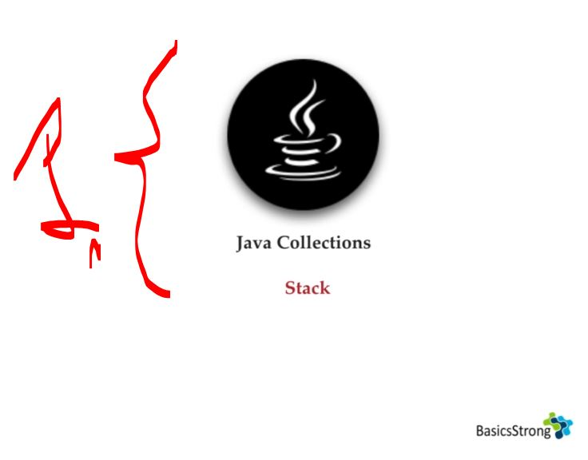
</div>

1. This time we will be checking **Stack** class is child class of **Vector** class!

<div align="center">
    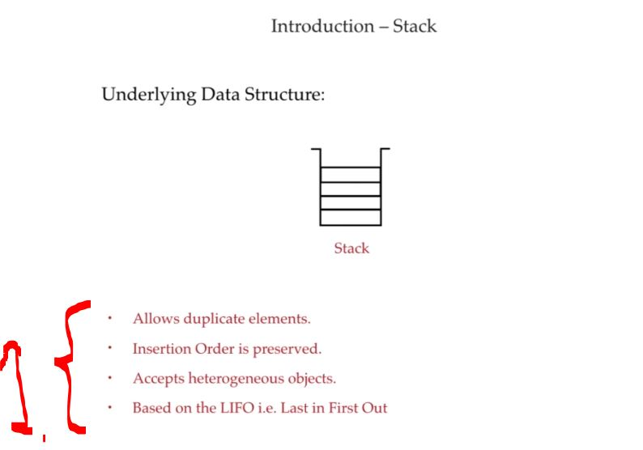
</div>

1. Other characteristics!
    - **Allows duplicate** elements.
    - **Insertion order** is preserved.
    - **Accepts heterogeneous** objects.
    - Based on **LIFO** (**L**ast **I**n, **F**irst **O**ut).


- How **Java** implements the **Stack**:

<details>
<summary id="full_code_stack" open="true"> <b>Full code after Stack chapter</b>! </summary>

```Java

```
</details>


<details>
<summary id="stack_class_from_JDK" open="true"> <b>Stack class from JDK</b>! </summary>

```Java
/*
 * Copyright (c) 1994, 2022, Oracle and/or its affiliates. All rights reserved.
 * DO NOT ALTER OR REMOVE COPYRIGHT NOTICES OR THIS FILE HEADER.
 *
 * This code is free software; you can redistribute it and/or modify it
 * under the terms of the GNU General Public License version 2 only, as
 * published by the Free Software Foundation.  Oracle designates this
 * particular file as subject to the "Classpath" exception as provided
 * by Oracle in the LICENSE file that accompanied this code.
 *
 * This code is distributed in the hope that it will be useful, but WITHOUT
 * ANY WARRANTY; without even the implied warranty of MERCHANTABILITY or
 * FITNESS FOR A PARTICULAR PURPOSE.  See the GNU General Public License
 * version 2 for more details (a copy is included in the LICENSE file that
 * accompanied this code).
 *
 * You should have received a copy of the GNU General Public License version
 * 2 along with this work; if not, write to the Free Software Foundation,
 * Inc., 51 Franklin St, Fifth Floor, Boston, MA 02110-1301 USA.
 *
 * Please contact Oracle, 500 Oracle Parkway, Redwood Shores, CA 94065 USA
 * or visit www.oracle.com if you need additional information or have any
 * questions.
 */

package java.util;

/**
 * The {@code Stack} class represents a last-in-first-out
 * (LIFO) stack of objects. It extends class {@code Vector} with five
 * operations that allow a vector to be treated as a stack. The usual
 * {@code push} and {@code pop} operations are provided, as well as a
 * method to {@code peek} at the top item on the stack, a method to test
 * for whether the stack is {@code empty}, and a method to {@code search}
 * the stack for an item and discover how far it is from the top.
 * <p>
 * When a stack is first created, it contains no items.
 *
 * <p>A more complete and consistent set of LIFO stack operations is
 * provided by the {@link Deque} interface and its implementations, which
 * should be used in preference to this class.  For example:
 * <pre>   {@code
 *   Deque<Integer> stack = new ArrayDeque<Integer>();}</pre>
 *
 * @param <E> Type of component elements
 *
 * @author  Jonathan Payne
 * @since   1.0
 */
public class Stack<E> extends Vector<E> {
    /**
     * Creates an empty Stack.
     */
    public Stack() {
    }

    /**
     * Pushes an item onto the top of this stack. This has exactly
     * the same effect as:
     * <blockquote><pre>
     * addElement(item)</pre></blockquote>
     *
     * @param   item   the item to be pushed onto this stack.
     * @return  the {@code item} argument.
     * @see     java.util.Vector#addElement
     */
    public E push(E item) {
        addElement(item);

        return item;
    }

    /**
     * Removes the object at the top of this stack and returns that
     * object as the value of this function.
     *
     * @return  The object at the top of this stack (the last item
     *          of the {@code Vector} object).
     * @throws  EmptyStackException  if this stack is empty.
     */
    public synchronized E pop() {
        E       obj;
        int     len = size();

        obj = peek();
        removeElementAt(len - 1);

        return obj;
    }

    /**
     * Looks at the object at the top of this stack without removing it
     * from the stack.
     *
     * @return  the object at the top of this stack (the last item
     *          of the {@code Vector} object).
     * @throws  EmptyStackException  if this stack is empty.
     */
    public synchronized E peek() {
        int     len = size();

        if (len == 0)
            throw new EmptyStackException();
        return elementAt(len - 1);
    }

    /**
     * Tests if this stack is empty.
     *
     * @return  {@code true} if and only if this stack contains
     *          no items; {@code false} otherwise.
     */
    public boolean empty() {
        return size() == 0;
    }

    /**
     * Returns the 1-based position where an object is on this stack.
     * If the object {@code o} occurs as an item in this stack, this
     * method returns the distance from the top of the stack of the
     * occurrence nearest the top of the stack; the topmost item on the
     * stack is considered to be at distance {@code 1}. The {@code equals}
     * method is used to compare {@code o} to the
     * items in this stack.
     *
     * @param   o   the desired object.
     * @return  the 1-based position from the top of the stack where
     *          the object is located; the return value {@code -1}
     *          indicates that the object is not on the stack.
     */
    public synchronized int search(Object o) {
        int i = lastIndexOf(o);

        if (i >= 0) {
            return size() - i;
        }
        return -1;
    }

    /** use serialVersionUID from JDK 1.0.2 for interoperability */
    @java.io.Serial
    private static final long serialVersionUID = 1224463164541339165L;
}
```
</details>

# Cursors.

<div align="center">
    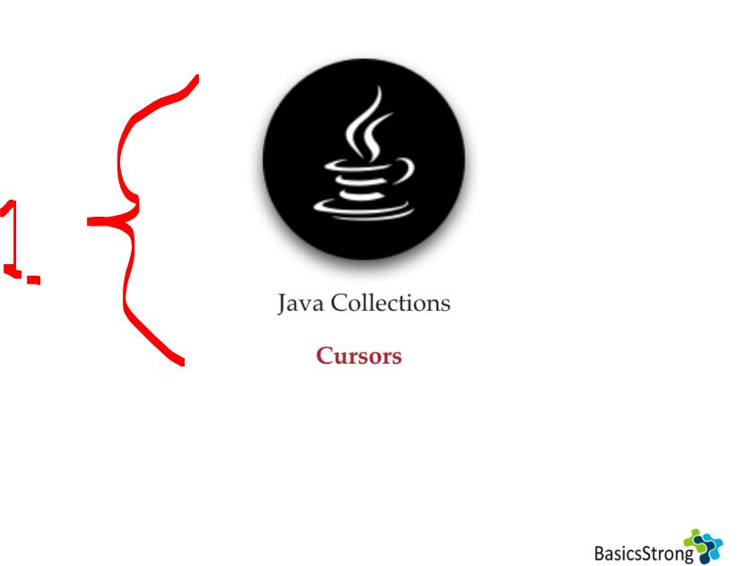
</div>

1. We will be exploring **cursor**, for iterating element one by one!

<div align="center">
    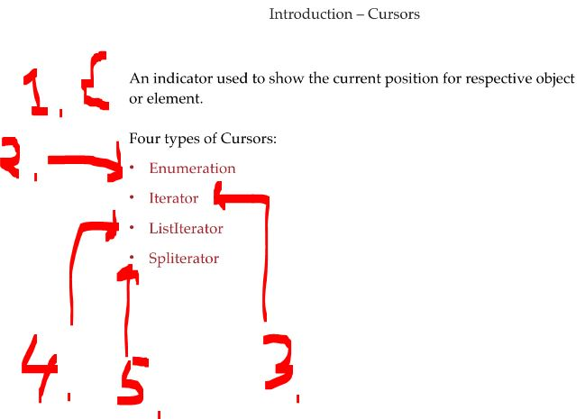
</div>

1. **Object** that lets you move through data one item (or row) at a time! 
2. `Enumeration` is used to get **elements** form legacy collections like:
    - `Vector`.
    - `Stack`.
    - `Hashtable`.
    - `Dictionary`.
    - `Properties`.
3. `Iterator` can be used with any collection **Legacy** or **not**.
4. `ListIterator` for **list objects**!
5. `Splititerator`.

# Summary.