# Section 08: Set Its implementation class and more. 

Set Its implementation class and more.

# What I Learned.

# Introduction.

<div align="center">
    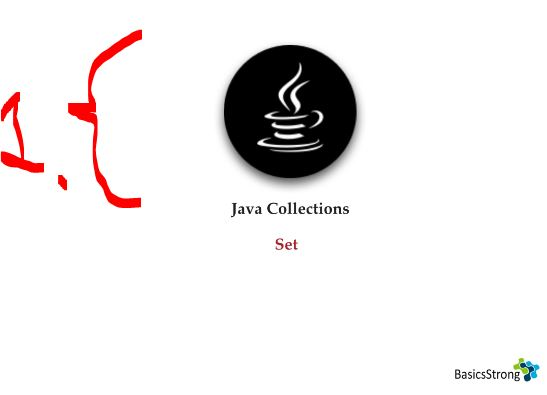
</div>

1. We will go thought **Set** interface, its sub interface of **Collection** interface.

<div align="center">
    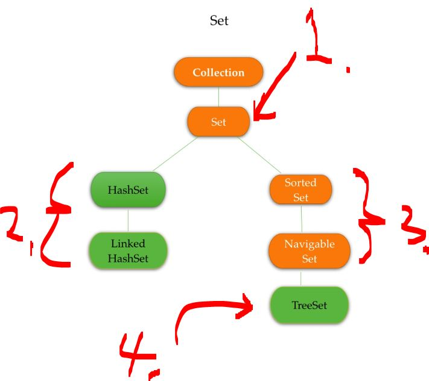
</div>

1. **Set** is where **duplicates are not** allowed and **order is not** preserved!
2. Implementation classes:
    - `HashSet`.
    - `Linked HashSet`.
3. Interfaces:
    - `Sorted Set`.
    - `Navigable Set`.
4. `Navigable Set` implementation class **TreeSet**!

<div align="center">
    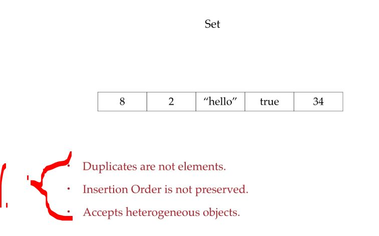
</div>

1. Set Characteristics:
    - **Duplicates are not** elements.
    - Insertion **Order** is **not preserved**.
    - Accepts heterogeneous objects.

# HashSet.

> [!NOTE]  
> **HashSet**:
>   - Duplicates are **not allowed!**
>   - Insertion order **is not** preserved!
>   - Can add different type of elements.
>   - We can add `null` **value**.
>   - Searching **hash** (lookup) is `O(1)` on average!

<div align="center">
    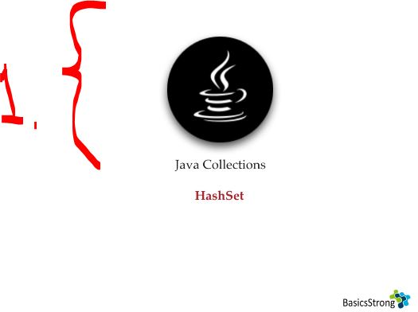
</div>

1. We will be going the **HashSet** implementation!

<div align="center">
    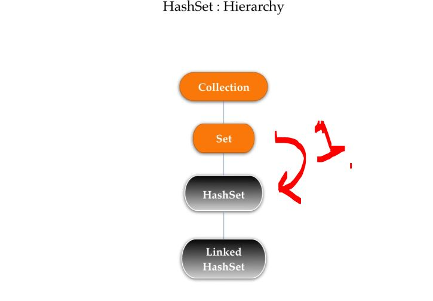
</div>

1. **HashSet** is first implementation of the **Set**!
    - Searching in **HashSet** is much more efficient!
        - Uses a **hash** function!

<div align="center">
    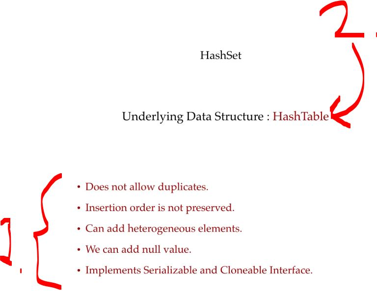
</div>

1. **HashSet** characteristics:
    - Does not allow duplicates.
    - Insertion order is not preserved.
    - Can add heterogeneous elements.
    - We can add `null` value.
    - Implements Serializable and Cloneable interface.
2. **HashSet** uses a **HashTable** internally!

<div align="center">
    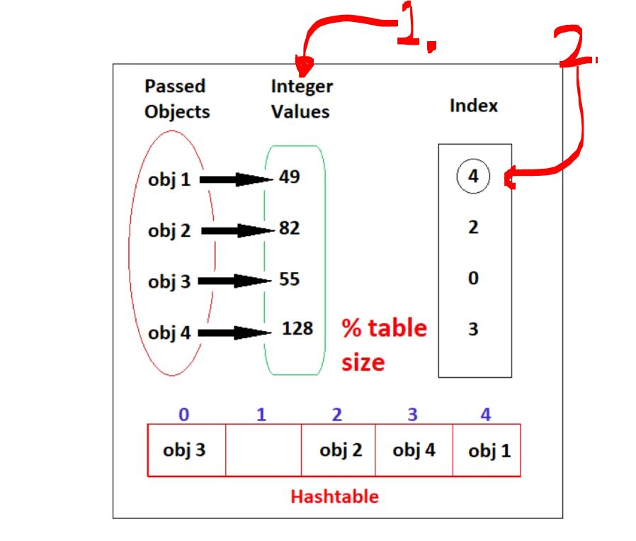
</div>

1. Once the **Object** is passed to the **HashTable** the **HashCode** gets generated!
2. `49 % 5 = 4`.

- How **Java** implements the **HashTable**:

<details>
<summary id="hashset_class_from_jdk" open="true"> <b>HashSet class from JDK</b>! </summary>

```Java
/*
 * Copyright (c) 1997, 2023, Oracle and/or its affiliates. All rights reserved.
 * DO NOT ALTER OR REMOVE COPYRIGHT NOTICES OR THIS FILE HEADER.
 *
 * This code is free software; you can redistribute it and/or modify it
 * under the terms of the GNU General Public License version 2 only, as
 * published by the Free Software Foundation.  Oracle designates this
 * particular file as subject to the "Classpath" exception as provided
 * by Oracle in the LICENSE file that accompanied this code.
 *
 * This code is distributed in the hope that it will be useful, but WITHOUT
 * ANY WARRANTY; without even the implied warranty of MERCHANTABILITY or
 * FITNESS FOR A PARTICULAR PURPOSE.  See the GNU General Public License
 * version 2 for more details (a copy is included in the LICENSE file that
 * accompanied this code).
 *
 * You should have received a copy of the GNU General Public License version
 * 2 along with this work; if not, write to the Free Software Foundation,
 * Inc., 51 Franklin St, Fifth Floor, Boston, MA 02110-1301 USA.
 *
 * Please contact Oracle, 500 Oracle Parkway, Redwood Shores, CA 94065 USA
 * or visit www.oracle.com if you need additional information or have any
 * questions.
 */

package java.util;

import java.io.InvalidObjectException;
import jdk.internal.access.SharedSecrets;

/**
 * This class implements the {@code Set} interface, backed by a hash table
 * (actually a {@code HashMap} instance).  It makes no guarantees as to the
 * iteration order of the set; in particular, it does not guarantee that the
 * order will remain constant over time.  This class permits the {@code null}
 * element.
 *
 * <p>This class offers constant time performance for the basic operations
 * ({@code add}, {@code remove}, {@code contains} and {@code size}),
 * assuming the hash function disperses the elements properly among the
 * buckets.  Iterating over this set requires time proportional to the sum of
 * the {@code HashSet} instance's size (the number of elements) plus the
 * "capacity" of the backing {@code HashMap} instance (the number of
 * buckets).  Thus, it's very important not to set the initial capacity too
 * high (or the load factor too low) if iteration performance is important.
 *
 * <p><strong>Note that this implementation is not synchronized.</strong>
 * If multiple threads access a hash set concurrently, and at least one of
 * the threads modifies the set, it <i>must</i> be synchronized externally.
 * This is typically accomplished by synchronizing on some object that
 * naturally encapsulates the set.
 *
 * If no such object exists, the set should be "wrapped" using the
 * {@link Collections#synchronizedSet Collections.synchronizedSet}
 * method.  This is best done at creation time, to prevent accidental
 * unsynchronized access to the set:<pre>
 *   Set s = Collections.synchronizedSet(new HashSet(...));</pre>
 *
 * <p>The iterators returned by this class's {@code iterator} method are
 * <i>fail-fast</i>: if the set is modified at any time after the iterator is
 * created, in any way except through the iterator's own {@code remove}
 * method, the Iterator throws a {@link ConcurrentModificationException}.
 * Thus, in the face of concurrent modification, the iterator fails quickly
 * and cleanly, rather than risking arbitrary, non-deterministic behavior at
 * an undetermined time in the future.
 *
 * <p>Note that the fail-fast behavior of an iterator cannot be guaranteed
 * as it is, generally speaking, impossible to make any hard guarantees in the
 * presence of unsynchronized concurrent modification.  Fail-fast iterators
 * throw {@code ConcurrentModificationException} on a best-effort basis.
 * Therefore, it would be wrong to write a program that depended on this
 * exception for its correctness: <i>the fail-fast behavior of iterators
 * should be used only to detect bugs.</i>
 *
 * <p>This class is a member of the
 * <a href="{@docRoot}/java.base/java/util/package-summary.html#CollectionsFramework">
 * Java Collections Framework</a>.
 *
 * @param <E> the type of elements maintained by this set
 *
 * @author  Josh Bloch
 * @author  Neal Gafter
 * @see     Collection
 * @see     Set
 * @see     TreeSet
 * @see     HashMap
 * @since   1.2
 */

public class HashSet<E>
    extends AbstractSet<E>
    implements Set<E>, Cloneable, java.io.Serializable
{
    @java.io.Serial
    static final long serialVersionUID = -5024744406713321676L;

    transient HashMap<E,Object> map;

    // Dummy value to associate with an Object in the backing Map
    static final Object PRESENT = new Object();

    /**
     * Constructs a new, empty set; the backing {@code HashMap} instance has
     * default initial capacity (16) and load factor (0.75).
     */
    public HashSet() {
        map = new HashMap<>();
    }

    /**
     * Constructs a new set containing the elements in the specified
     * collection.  The {@code HashMap} is created with default load factor
     * (0.75) and an initial capacity sufficient to contain the elements in
     * the specified collection.
     *
     * @param c the collection whose elements are to be placed into this set
     * @throws NullPointerException if the specified collection is null
     */
    public HashSet(Collection<? extends E> c) {
        map = HashMap.newHashMap(Math.max(c.size(), 12));
        addAll(c);
    }

    /**
     * Constructs a new, empty set; the backing {@code HashMap} instance has
     * the specified initial capacity and the specified load factor.
     *
     * @apiNote
     * To create a {@code HashSet} with an initial capacity that accommodates
     * an expected number of elements, use {@link #newHashSet(int) newHashSet}.
     *
     * @param      initialCapacity   the initial capacity of the hash map
     * @param      loadFactor        the load factor of the hash map
     * @throws     IllegalArgumentException if the initial capacity is less
     *             than zero, or if the load factor is nonpositive
     */
    public HashSet(int initialCapacity, float loadFactor) {
        map = new HashMap<>(initialCapacity, loadFactor);
    }

    /**
     * Constructs a new, empty set; the backing {@code HashMap} instance has
     * the specified initial capacity and default load factor (0.75).
     *
     * @apiNote
     * To create a {@code HashSet} with an initial capacity that accommodates
     * an expected number of elements, use {@link #newHashSet(int) newHashSet}.
     *
     * @param      initialCapacity   the initial capacity of the hash table
     * @throws     IllegalArgumentException if the initial capacity is less
     *             than zero
     */
    public HashSet(int initialCapacity) {
        map = new HashMap<>(initialCapacity);
    }

    /**
     * Constructs a new, empty linked hash set.  (This package private
     * constructor is only used by LinkedHashSet.) The backing
     * HashMap instance is a LinkedHashMap with the specified initial
     * capacity and the specified load factor.
     *
     * @param      initialCapacity   the initial capacity of the hash map
     * @param      loadFactor        the load factor of the hash map
     * @param      dummy             ignored (distinguishes this
     *             constructor from other int, float constructor.)
     * @throws     IllegalArgumentException if the initial capacity is less
     *             than zero, or if the load factor is nonpositive
     */
    HashSet(int initialCapacity, float loadFactor, boolean dummy) {
        map = new LinkedHashMap<>(initialCapacity, loadFactor);
    }

    /**
     * Returns an iterator over the elements in this set.  The elements
     * are returned in no particular order.
     *
     * @return an Iterator over the elements in this set
     * @see ConcurrentModificationException
     */
    public Iterator<E> iterator() {
        return map.keySet().iterator();
    }

    /**
     * Returns the number of elements in this set (its cardinality).
     *
     * @return the number of elements in this set (its cardinality)
     */
    public int size() {
        return map.size();
    }

    /**
     * Returns {@code true} if this set contains no elements.
     *
     * @return {@code true} if this set contains no elements
     */
    public boolean isEmpty() {
        return map.isEmpty();
    }

    /**
     * Returns {@code true} if this set contains the specified element.
     * More formally, returns {@code true} if and only if this set
     * contains an element {@code e} such that
     * {@code Objects.equals(o, e)}.
     *
     * @param o element whose presence in this set is to be tested
     * @return {@code true} if this set contains the specified element
     */
    public boolean contains(Object o) {
        return map.containsKey(o);
    }

    /**
     * Adds the specified element to this set if it is not already present.
     * More formally, adds the specified element {@code e} to this set if
     * this set contains no element {@code e2} such that
     * {@code Objects.equals(e, e2)}.
     * If this set already contains the element, the call leaves the set
     * unchanged and returns {@code false}.
     *
     * @param e element to be added to this set
     * @return {@code true} if this set did not already contain the specified
     * element
     */
    public boolean add(E e) {
        return map.put(e, PRESENT)==null;
    }

    /**
     * Removes the specified element from this set if it is present.
     * More formally, removes an element {@code e} such that
     * {@code Objects.equals(o, e)},
     * if this set contains such an element.  Returns {@code true} if
     * this set contained the element (or equivalently, if this set
     * changed as a result of the call).  (This set will not contain the
     * element once the call returns.)
     *
     * @param o object to be removed from this set, if present
     * @return {@code true} if the set contained the specified element
     */
    public boolean remove(Object o) {
        return map.remove(o)==PRESENT;
    }

    /**
     * Removes all of the elements from this set.
     * The set will be empty after this call returns.
     */
    public void clear() {
        map.clear();
    }

    /**
     * Returns a shallow copy of this {@code HashSet} instance: the elements
     * themselves are not cloned.
     *
     * @return a shallow copy of this set
     */
    @SuppressWarnings("unchecked")
    public Object clone() {
        try {
            HashSet<E> newSet = (HashSet<E>) super.clone();
            newSet.map = (HashMap<E, Object>) map.clone();
            return newSet;
        } catch (CloneNotSupportedException e) {
            throw new InternalError(e);
        }
    }

    /**
     * Save the state of this {@code HashSet} instance to a stream (that is,
     * serialize it).
     *
     * @serialData The capacity of the backing {@code HashMap} instance
     *             (int), and its load factor (float) are emitted, followed by
     *             the size of the set (the number of elements it contains)
     *             (int), followed by all of its elements (each an Object) in
     *             no particular order.
     */
    @java.io.Serial
    private void writeObject(java.io.ObjectOutputStream s)
        throws java.io.IOException {
        // Write out any hidden serialization magic
        s.defaultWriteObject();

        // Write out HashMap capacity and load factor
        s.writeInt(map.capacity());
        s.writeFloat(map.loadFactor());

        // Write out size
        s.writeInt(map.size());

        // Write out all elements in the proper order.
        for (E e : map.keySet())
            s.writeObject(e);
    }

    /**
     * Reconstitute the {@code HashSet} instance from a stream (that is,
     * deserialize it).
     */
    @java.io.Serial
    private void readObject(java.io.ObjectInputStream s)
        throws java.io.IOException, ClassNotFoundException {
        // Consume and ignore stream fields (currently zero).
        s.readFields();

        // Read capacity and verify non-negative.
        int capacity = s.readInt();
        if (capacity < 0) {
            throw new InvalidObjectException("Illegal capacity: " +
                                             capacity);
        }

        // Read load factor and verify positive and non NaN.
        float loadFactor = s.readFloat();
        if (loadFactor <= 0 || Float.isNaN(loadFactor)) {
            throw new InvalidObjectException("Illegal load factor: " +
                                             loadFactor);
        }
        // Clamp load factor to range of 0.25...4.0.
        loadFactor = Math.clamp(loadFactor, 0.25f, 4.0f);

        // Read size and verify non-negative.
        int size = s.readInt();
        if (size < 0) {
            throw new InvalidObjectException("Illegal size: " + size);
        }

        // Set the capacity according to the size and load factor ensuring that
        // the HashMap is at least 25% full but clamping to maximum capacity.
        capacity = (int) Math.min(size * Math.min(1 / loadFactor, 4.0f),
                HashMap.MAXIMUM_CAPACITY);

        // Constructing the backing map will lazily create an array when the first element is
        // added, so check it before construction. Call HashMap.tableSizeFor to compute the
        // actual allocation size. Check Map.Entry[].class since it's the nearest public type to
        // what is actually created.
        SharedSecrets.getJavaObjectInputStreamAccess()
                     .checkArray(s, Map.Entry[].class, HashMap.tableSizeFor(capacity));

        // Create backing HashMap
        map = (this instanceof LinkedHashSet ?
               new LinkedHashMap<>(capacity, loadFactor) :
               new HashMap<>(capacity, loadFactor));

        // Read in all elements in the proper order.
        for (int i=0; i<size; i++) {
            @SuppressWarnings("unchecked")
                E e = (E) s.readObject();
            map.put(e, PRESENT);
        }
    }

    /**
     * Creates a <em><a href="Spliterator.html#binding">late-binding</a></em>
     * and <em>fail-fast</em> {@link Spliterator} over the elements in this
     * set.
     *
     * <p>The {@code Spliterator} reports {@link Spliterator#SIZED} and
     * {@link Spliterator#DISTINCT}.  Overriding implementations should document
     * the reporting of additional characteristic values.
     *
     * @return a {@code Spliterator} over the elements in this set
     * @since 1.8
     */
    public Spliterator<E> spliterator() {
        return new HashMap.KeySpliterator<>(map, 0, -1, 0, 0);
    }

    @Override
    public Object[] toArray() {
        return map.keysToArray(new Object[map.size()]);
    }

    @Override
    public <T> T[] toArray(T[] a) {
        return map.keysToArray(map.prepareArray(a));
    }

    /**
     * Creates a new, empty HashSet suitable for the expected number of elements.
     * The returned set uses the default load factor of 0.75, and its initial capacity is
     * generally large enough so that the expected number of elements can be added
     * without resizing the set.
     *
     * @param numElements    the expected number of elements
     * @param <T>         the type of elements maintained by the new set
     * @return the newly created set
     * @throws IllegalArgumentException if numElements is negative
     * @since 19
     */
    public static <T> HashSet<T> newHashSet(int numElements) {
        if (numElements < 0) {
            throw new IllegalArgumentException("Negative number of elements: " + numElements);
        }
        return new HashSet<>(HashMap.calculateHashMapCapacity(numElements));
    }

}
```
</details>

> [!NOTE]  
> `Index` = `hash value` % `table size`!

- Different ways to initialize the `HashSet()`:
    - Default size is `16`.

````Java
        // Only way to create HashSet !
        HashSet hashset = new HashSet(); // Initial capacity = 16.
        HashSet hashset1 = new HashSet(30);// Initial capacity = 30.
````

- Different ways to initialize the `HashSet()`, with **load factor**:

> [!NOTE]  
> `Load factor` = how full the hash table is allowed to get before it grows!
> Default value is `0.75` and it will resize by **doubling capacity**!
> The left over `HashSet` is for **GC** to collect!

````Java
        // Load factor, at what is the factor when it would change!
        // We can provide also, the load factor!
        HashSet hashset3 = new HashSet(100, .80f);
        // When 80% of the old HashSet is full, the new HasSet size will be 200! The left over HashSet is for the gc to collect!

        // We can initialize this with Collection!
        ArrayList l = new ArrayList();
        HashSet hashset4 = new HashSet(l);
````

<details>
<summary id="hashset_class_from_jdk" open="true"> <b>Full code after HashSet chapter</b>! </summary>

```Java
package list;

import java.util.ArrayList;
import java.util.HashSet;
import java.util.Stack;

public class HashSetDemo
{
    public static void main( String[] args )
    {
        // Only way to create HashSet !
        HashSet hashset = new HashSet(); // Initial capacity = 16.
        HashSet hashset1 = new HashSet(30);// Initial capacity = 30.
        // Load factor, at what is the factor when it would change!
        // We can provide also, the load factor!
        HashSet hashset3 = new HashSet(100, .80f);
        // When 80% of the old HashSet is full, the new HasSet size will be 200! The left over HashSet is for the gc to collect!

        // We can initialize this with Collection!
        ArrayList l = new ArrayList();
        HashSet hashset4 = new HashSet(l);
    }
}
```
</details>

# LinkedHashSet.

> [!NOTE]  
> **LinkedHashSet**:
>   - Duplicates are **not allowed!**
>   - Insertion order **is** preserved!
>   - Can add different type of elements.
>   - We can add `null` **value**.
>   - Searching **hash** (lookup) is `O(1)` on average!

<div align="center">
    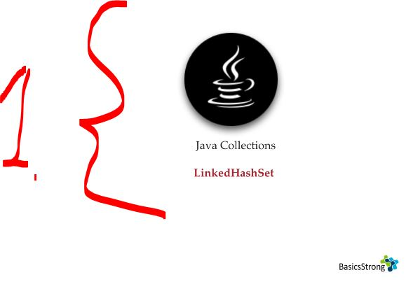
</div>

1. We will be looking **LinkedHashSet**.

<div align="center">
    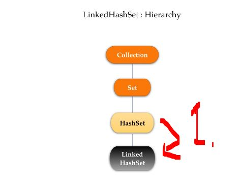
</div>

1. **Linked HashSet** is **child** class of the **HashSet**! 
    - This was introduced **Java 1.4**!
    - In **Linked HashSet** the insert **order is preserved**!

- Different ways to initialize the `LinkedHashSet()`:

````Java
        // Different ways to initialize the LinkedHashSet.
        LinkedHashSet lks = new LinkedHashSet();
        LinkedHashSet lhs1 =  new LinkedHashSet(30);
        LinkedHashSet lhs2 =  new LinkedHashSet(20, 1.00f); // When LinkedHashSet is full!
        // Insertion order is preserved!
````

<details>
<summary id="linkedhashset_from_jdk" open="true"> <b>Full code after LinkedHashSet chapter</b>! </summary>

```Java
/*
 * Copyright (c) 2000, 2023, Oracle and/or its affiliates. All rights reserved.
 * DO NOT ALTER OR REMOVE COPYRIGHT NOTICES OR THIS FILE HEADER.
 *
 * This code is free software; you can redistribute it and/or modify it
 * under the terms of the GNU General Public License version 2 only, as
 * published by the Free Software Foundation.  Oracle designates this
 * particular file as subject to the "Classpath" exception as provided
 * by Oracle in the LICENSE file that accompanied this code.
 *
 * This code is distributed in the hope that it will be useful, but WITHOUT
 * ANY WARRANTY; without even the implied warranty of MERCHANTABILITY or
 * FITNESS FOR A PARTICULAR PURPOSE.  See the GNU General Public License
 * version 2 for more details (a copy is included in the LICENSE file that
 * accompanied this code).
 *
 * You should have received a copy of the GNU General Public License version
 * 2 along with this work; if not, write to the Free Software Foundation,
 * Inc., 51 Franklin St, Fifth Floor, Boston, MA 02110-1301 USA.
 *
 * Please contact Oracle, 500 Oracle Parkway, Redwood Shores, CA 94065 USA
 * or visit www.oracle.com if you need additional information or have any
 * questions.
 */

package java.util;

/**
 * <p>Hash table and linked list implementation of the {@code Set} interface,
 * with well-defined encounter order.  This implementation differs from
 * {@code HashSet} in that it maintains a doubly-linked list running through
 * all of its entries.  This linked list defines the encounter order (iteration
 * order), which is the order in which elements were inserted into the set
 * (<i>insertion-order</i>). The least recently inserted element (the eldest) is
 * first, and the youngest element is last. Note that encounter order is <i>not</i> affected
 * if an element is <i>re-inserted</i> into the set with the {@code add} method.
 * (An element {@code e} is reinserted into a set {@code s} if {@code s.add(e)} is
 * invoked when {@code s.contains(e)} would return {@code true} immediately prior to
 * the invocation.) The reverse-ordered view of this set is in the opposite order, with
 * the youngest element appearing first and the eldest element appearing last. The encounter
 * order of elements already in the set can be changed by using the
 * {@link #addFirst addFirst} and {@link #addLast addLast} methods.
 *
 * <p>This implementation spares its clients from the unspecified, generally
 * chaotic ordering provided by {@link HashSet}, without incurring the
 * increased cost associated with {@link TreeSet}.  It can be used to
 * produce a copy of a set that has the same order as the original, regardless
 * of the original set's implementation:
 * <pre>{@code
 *     void foo(Set<String> s) {
 *         Set<String> copy = new LinkedHashSet<>(s);
 *         ...
 *     }
 * }</pre>
 * This technique is particularly useful if a module takes a set on input,
 * copies it, and later returns results whose order is determined by that of
 * the copy.  (Clients generally appreciate having things returned in the same
 * order they were presented.)
 *
 * <p>This class provides all of the optional {@link Set} and {@link SequencedSet}
 * operations, and it permits null elements. Like {@code HashSet}, it provides constant-time
 * performance for the basic operations ({@code add}, {@code contains} and
 * {@code remove}), assuming the hash function disperses elements
 * properly among the buckets.  Performance is likely to be just slightly
 * below that of {@code HashSet}, due to the added expense of maintaining the
 * linked list, with one exception: Iteration over a {@code LinkedHashSet}
 * requires time proportional to the <i>size</i> of the set, regardless of
 * its capacity.  Iteration over a {@code HashSet} is likely to be more
 * expensive, requiring time proportional to its <i>capacity</i>.
 *
 * <p>A linked hash set has two parameters that affect its performance:
 * <i>initial capacity</i> and <i>load factor</i>.  They are defined precisely
 * as for {@code HashSet}.  Note, however, that the penalty for choosing an
 * excessively high value for initial capacity is less severe for this class
 * than for {@code HashSet}, as iteration times for this class are unaffected
 * by capacity.
 *
 * <p><strong>Note that this implementation is not synchronized.</strong>
 * If multiple threads access a linked hash set concurrently, and at least
 * one of the threads modifies the set, it <em>must</em> be synchronized
 * externally.  This is typically accomplished by synchronizing on some
 * object that naturally encapsulates the set.
 *
 * If no such object exists, the set should be "wrapped" using the
 * {@link Collections#synchronizedSet Collections.synchronizedSet}
 * method.  This is best done at creation time, to prevent accidental
 * unsynchronized access to the set: <pre>
 *   Set s = Collections.synchronizedSet(new LinkedHashSet(...));</pre>
 *
 * <p>The iterators returned by this class's {@code iterator} method are
 * <em>fail-fast</em>: if the set is modified at any time after the iterator
 * is created, in any way except through the iterator's own {@code remove}
 * method, the iterator will throw a {@link ConcurrentModificationException}.
 * Thus, in the face of concurrent modification, the iterator fails quickly
 * and cleanly, rather than risking arbitrary, non-deterministic behavior at
 * an undetermined time in the future.
 *
 * <p>Note that the fail-fast behavior of an iterator cannot be guaranteed
 * as it is, generally speaking, impossible to make any hard guarantees in the
 * presence of unsynchronized concurrent modification.  Fail-fast iterators
 * throw {@code ConcurrentModificationException} on a best-effort basis.
 * Therefore, it would be wrong to write a program that depended on this
 * exception for its correctness:   <i>the fail-fast behavior of iterators
 * should be used only to detect bugs.</i>
 *
 * <p>This class is a member of the
 * <a href="{@docRoot}/java.base/java/util/package-summary.html#CollectionsFramework">
 * Java Collections Framework</a>.
 *
 * @param <E> the type of elements maintained by this set
 *
 * @author  Josh Bloch
 * @see     Object#hashCode()
 * @see     Collection
 * @see     Set
 * @see     HashSet
 * @see     TreeSet
 * @see     Hashtable
 * @since   1.4
 */

public class LinkedHashSet<E>
    extends HashSet<E>
    implements SequencedSet<E>, Cloneable, java.io.Serializable {

    @java.io.Serial
    private static final long serialVersionUID = -2851667679971038690L;

    /**
     * Constructs a new, empty linked hash set with the specified initial
     * capacity and load factor.
     *
     * @apiNote
     * To create a {@code LinkedHashSet} with an initial capacity that accommodates
     * an expected number of elements, use {@link #newLinkedHashSet(int) newLinkedHashSet}.
     *
     * @param      initialCapacity the initial capacity of the linked hash set
     * @param      loadFactor      the load factor of the linked hash set
     * @throws     IllegalArgumentException  if the initial capacity is less
     *               than zero, or if the load factor is nonpositive
     */
    public LinkedHashSet(int initialCapacity, float loadFactor) {
        super(initialCapacity, loadFactor, true);
    }

    /**
     * Constructs a new, empty linked hash set with the specified initial
     * capacity and the default load factor (0.75).
     *
     * @apiNote
     * To create a {@code LinkedHashSet} with an initial capacity that accommodates
     * an expected number of elements, use {@link #newLinkedHashSet(int) newLinkedHashSet}.
     *
     * @param   initialCapacity   the initial capacity of the LinkedHashSet
     * @throws  IllegalArgumentException if the initial capacity is less
     *              than zero
     */
    public LinkedHashSet(int initialCapacity) {
        super(initialCapacity, .75f, true);
    }

    /**
     * Constructs a new, empty linked hash set with the default initial
     * capacity (16) and load factor (0.75).
     */
    public LinkedHashSet() {
        super(16, .75f, true);
    }

    /**
     * Constructs a new linked hash set with the same elements as the
     * specified collection.  The linked hash set is created with an initial
     * capacity sufficient to hold the elements in the specified collection
     * and the default load factor (0.75).
     *
     * @param c  the collection whose elements are to be placed into
     *           this set
     * @throws NullPointerException if the specified collection is null
     */
    public LinkedHashSet(Collection<? extends E> c) {
        super(HashMap.calculateHashMapCapacity(Math.max(c.size(), 12)), .75f, true);
        addAll(c);
    }

    /**
     * Creates a <em><a href="Spliterator.html#binding">late-binding</a></em>
     * and <em>fail-fast</em> {@code Spliterator} over the elements in this set.
     *
     * <p>The {@code Spliterator} reports {@link Spliterator#SIZED},
     * {@link Spliterator#DISTINCT}, and {@code ORDERED}.  Implementations
     * should document the reporting of additional characteristic values.
     *
     * @implNote
     * The implementation creates a
     * <em><a href="Spliterator.html#binding">late-binding</a></em> spliterator
     * from the set's {@code Iterator}.  The spliterator inherits the
     * <em>fail-fast</em> properties of the set's iterator.
     * The created {@code Spliterator} additionally reports
     * {@link Spliterator#SUBSIZED}.
     *
     * @return a {@code Spliterator} over the elements in this set
     * @since 1.8
     */
    @Override
    public Spliterator<E> spliterator() {
        return Spliterators.spliterator(this, Spliterator.DISTINCT | Spliterator.ORDERED);
    }

    /**
     * Creates a new, empty LinkedHashSet suitable for the expected number of elements.
     * The returned set uses the default load factor of 0.75, and its initial capacity is
     * generally large enough so that the expected number of elements can be added
     * without resizing the set.
     *
     * @param numElements    the expected number of elements
     * @param <T>         the type of elements maintained by the new set
     * @return the newly created set
     * @throws IllegalArgumentException if numElements is negative
     * @since 19
     */
    public static <T> LinkedHashSet<T> newLinkedHashSet(int numElements) {
        if (numElements < 0) {
            throw new IllegalArgumentException("Negative number of elements: " + numElements);
        }
        return new LinkedHashSet<>(HashMap.calculateHashMapCapacity(numElements));
    }

    @SuppressWarnings("unchecked")
    LinkedHashMap<E, Object> map() {
        return (LinkedHashMap<E, Object>) map;
    }

    /**
     * {@inheritDoc}
     * <p>
     * If this set already contains the element, it is relocated if necessary so that it is
     * first in encounter order.
     *
     * @since 21
     */
    public void addFirst(E e) {
        map().putFirst(e, PRESENT);
    }

    /**
     * {@inheritDoc}
     * <p>
     * If this set already contains the element, it is relocated if necessary so that it is
     * last in encounter order.
     *
     * @since 21
     */
    public void addLast(E e) {
        map().putLast(e, PRESENT);
    }

    /**
     * {@inheritDoc}
     *
     * @throws NoSuchElementException {@inheritDoc}
     * @since 21
     */
    public E getFirst() {
        return map().sequencedKeySet().getFirst();
    }

    /**
     * {@inheritDoc}
     *
     * @throws NoSuchElementException {@inheritDoc}
     * @since 21
     */
    public E getLast() {
        return map().sequencedKeySet().getLast();
    }

    /**
     * {@inheritDoc}
     *
     * @throws NoSuchElementException {@inheritDoc}
     * @since 21
     */
    public E removeFirst() {
        return map().sequencedKeySet().removeFirst();
    }

    /**
     * {@inheritDoc}
     *
     * @throws NoSuchElementException {@inheritDoc}
     * @since 21
     */
    public E removeLast() {
        return map().sequencedKeySet().removeLast();
    }

    /**
     * {@inheritDoc}
     * <p>
     * Modifications to the reversed view are permitted and will be propagated to this set.
     * In addition, modifications to this set will be visible in the reversed view.
     *
     * @return {@inheritDoc}
     * @since 21
     */
    public SequencedSet<E> reversed() {
        class ReverseLinkedHashSetView extends AbstractSet<E> implements SequencedSet<E> {
            public int size()                  { return LinkedHashSet.this.size(); }
            public Iterator<E> iterator()      { return map().sequencedKeySet().reversed().iterator(); }
            public boolean add(E e)            { return LinkedHashSet.this.add(e); }
            public void addFirst(E e)          { LinkedHashSet.this.addLast(e); }
            public void addLast(E e)           { LinkedHashSet.this.addFirst(e); }
            public E getFirst()                { return LinkedHashSet.this.getLast(); }
            public E getLast()                 { return LinkedHashSet.this.getFirst(); }
            public E removeFirst()             { return LinkedHashSet.this.removeLast(); }
            public E removeLast()              { return LinkedHashSet.this.removeFirst(); }
            public SequencedSet<E> reversed()  { return LinkedHashSet.this; }
            public Object[] toArray() { return map().keysToArray(new Object[map.size()], true); }
            public <T> T[] toArray(T[] a) { return map().keysToArray(map.prepareArray(a), true); }
        }

        return new ReverseLinkedHashSetView();
    }
}
```
</details>

# SortedSet.

> [!NOTE]  
> **SortedSet**:
>   - **Always maintained** in a **sorted order** based on a defined comparison rule (natural ordering or Comparator).
>   - No duplicates.
>   - Comparison-based structure.
>   - No null (in most cases).

<div align="center">
    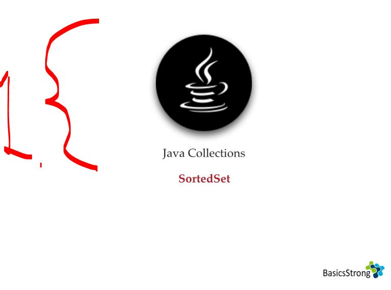
</div>

1. We will be looking **SortedSet**.

<div align="center">
    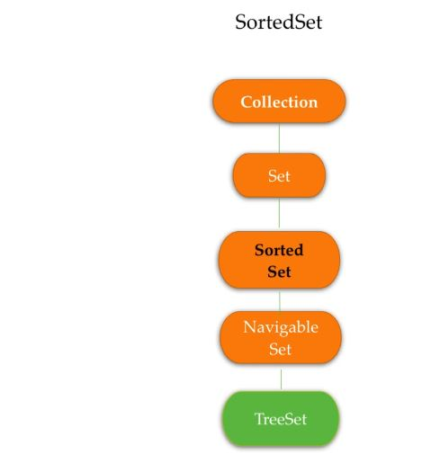
</div>


<details>
<summary id="sortedset_interface_from_jdk" open="true"> <b>SortedSet interface from jdk</b>! </summary>

```Java


```
</details>


- Todo here 

<details>
<summary id="" open="true"> <b>Full code after SortedSet chapter</b>! </summary>

```Java
/*
 * Copyright (c) 1998, 2023, Oracle and/or its affiliates. All rights reserved.
 * DO NOT ALTER OR REMOVE COPYRIGHT NOTICES OR THIS FILE HEADER.
 *
 * This code is free software; you can redistribute it and/or modify it
 * under the terms of the GNU General Public License version 2 only, as
 * published by the Free Software Foundation.  Oracle designates this
 * particular file as subject to the "Classpath" exception as provided
 * by Oracle in the LICENSE file that accompanied this code.
 *
 * This code is distributed in the hope that it will be useful, but WITHOUT
 * ANY WARRANTY; without even the implied warranty of MERCHANTABILITY or
 * FITNESS FOR A PARTICULAR PURPOSE.  See the GNU General Public License
 * version 2 for more details (a copy is included in the LICENSE file that
 * accompanied this code).
 *
 * You should have received a copy of the GNU General Public License version
 * 2 along with this work; if not, write to the Free Software Foundation,
 * Inc., 51 Franklin St, Fifth Floor, Boston, MA 02110-1301 USA.
 *
 * Please contact Oracle, 500 Oracle Parkway, Redwood Shores, CA 94065 USA
 * or visit www.oracle.com if you need additional information or have any
 * questions.
 */

package java.util;

/**
 * A {@link Set} that further provides a <i>total ordering</i> on its elements.
 * The elements are ordered using their {@linkplain Comparable natural
 * ordering}, or by a {@link Comparator} typically provided at sorted
 * set creation time.  The set's iterator will traverse the set in
 * ascending element order. Several additional operations are provided
 * to take advantage of the ordering.  (This interface is the set
 * analogue of {@link SortedMap}.)
 *
 * <p>All elements inserted into a sorted set must implement the {@code Comparable}
 * interface (or be accepted by the specified comparator).  Furthermore, all
 * such elements must be <i>mutually comparable</i>: {@code e1.compareTo(e2)}
 * (or {@code comparator.compare(e1, e2)}) must not throw a
 * {@code ClassCastException} for any elements {@code e1} and {@code e2} in
 * the sorted set.  Attempts to violate this restriction will cause the
 * offending method or constructor invocation to throw a
 * {@code ClassCastException}.
 *
 * <p>Note that the ordering maintained by a sorted set (whether or not an
 * explicit comparator is provided) must be <i>consistent with equals</i> if
 * the sorted set is to correctly implement the {@code Set} interface.  (See
 * the {@code Comparable} interface or {@code Comparator} interface for a
 * precise definition of <i>consistent with equals</i>.)  This is so because
 * the {@code Set} interface is defined in terms of the {@code equals}
 * operation, but a sorted set performs all element comparisons using its
 * {@code compareTo} (or {@code compare}) method, so two elements that are
 * deemed equal by this method are, from the standpoint of the sorted set,
 * equal.  The behavior of a sorted set <i>is</i> well-defined even if its
 * ordering is inconsistent with equals; it just fails to obey the general
 * contract of the {@code Set} interface.
 *
 * <p>All general-purpose sorted set implementation classes should
 * provide four "standard" constructors: 1) A void (no arguments)
 * constructor, which creates an empty sorted set sorted according to
 * the natural ordering of its elements.  2) A constructor with a
 * single argument of type {@code Comparator}, which creates an empty
 * sorted set sorted according to the specified comparator.  3) A
 * constructor with a single argument of type {@code Collection},
 * which creates a new sorted set with the same elements as its
 * argument, sorted according to the natural ordering of the elements.
 * 4) A constructor with a single argument of type {@code SortedSet},
 * which creates a new sorted set with the same elements and the same
 * ordering as the input sorted set.  There is no way to enforce this
 * recommendation, as interfaces cannot contain constructors.
 *
 * <p>Note: several methods return subsets with restricted ranges.
 * Such ranges are <i>half-open</i>, that is, they include their low
 * endpoint but not their high endpoint (where applicable).
 * If you need a <i>closed range</i> (which includes both endpoints), and
 * the element type allows for calculation of the successor of a given
 * value, merely request the subrange from {@code lowEndpoint} to
 * {@code successor(highEndpoint)}.  For example, suppose that {@code s}
 * is a sorted set of strings.  The following idiom obtains a view
 * containing all of the strings in {@code s} from {@code low} to
 * {@code high}, inclusive:<pre>
 *   SortedSet&lt;String&gt; sub = s.subSet(low, high+"\0");</pre>
 *
 * A similar technique can be used to generate an <i>open range</i> (which
 * contains neither endpoint).  The following idiom obtains a view
 * containing all of the Strings in {@code s} from {@code low} to
 * {@code high}, exclusive:<pre>
 *   SortedSet&lt;String&gt; sub = s.subSet(low+"\0", high);</pre>
 *
 * <p>This interface is a member of the
 * <a href="{@docRoot}/java.base/java/util/package-summary.html#CollectionsFramework">
 * Java Collections Framework</a>.
 *
 * @param <E> the type of elements maintained by this set
 *
 * @author  Josh Bloch
 * @see Set
 * @see TreeSet
 * @see SortedMap
 * @see Collection
 * @see Comparable
 * @see Comparator
 * @see ClassCastException
 * @since 1.2
 */

public interface SortedSet<E> extends Set<E>, SequencedSet<E> {
    /**
     * Returns the comparator used to order the elements in this set,
     * or {@code null} if this set uses the {@linkplain Comparable
     * natural ordering} of its elements.
     *
     * @return the comparator used to order the elements in this set,
     *         or {@code null} if this set uses the natural ordering
     *         of its elements
     */
    Comparator<? super E> comparator();

    /**
     * Returns a view of the portion of this set whose elements range
     * from {@code fromElement}, inclusive, to {@code toElement},
     * exclusive.  (If {@code fromElement} and {@code toElement} are
     * equal, the returned set is empty.)  The returned set is backed
     * by this set, so changes in the returned set are reflected in
     * this set, and vice-versa.  The returned set supports all
     * optional set operations that this set supports.
     *
     * <p>The returned set will throw an {@code IllegalArgumentException}
     * on an attempt to insert an element outside its range.
     *
     * @param fromElement low endpoint (inclusive) of the returned set
     * @param toElement high endpoint (exclusive) of the returned set
     * @return a view of the portion of this set whose elements range from
     *         {@code fromElement}, inclusive, to {@code toElement}, exclusive
     * @throws ClassCastException if {@code fromElement} and
     *         {@code toElement} cannot be compared to one another using this
     *         set's comparator (or, if the set has no comparator, using
     *         natural ordering).  Implementations may, but are not required
     *         to, throw this exception if {@code fromElement} or
     *         {@code toElement} cannot be compared to elements currently in
     *         the set.
     * @throws NullPointerException if {@code fromElement} or
     *         {@code toElement} is null and this set does not permit null
     *         elements
     * @throws IllegalArgumentException if {@code fromElement} is
     *         greater than {@code toElement}; or if this set itself
     *         has a restricted range, and {@code fromElement} or
     *         {@code toElement} lies outside the bounds of the range
     */
    SortedSet<E> subSet(E fromElement, E toElement);

    /**
     * Returns a view of the portion of this set whose elements are
     * strictly less than {@code toElement}.  The returned set is
     * backed by this set, so changes in the returned set are
     * reflected in this set, and vice-versa.  The returned set
     * supports all optional set operations that this set supports.
     *
     * <p>The returned set will throw an {@code IllegalArgumentException}
     * on an attempt to insert an element outside its range.
     *
     * @param toElement high endpoint (exclusive) of the returned set
     * @return a view of the portion of this set whose elements are strictly
     *         less than {@code toElement}
     * @throws ClassCastException if {@code toElement} is not compatible
     *         with this set's comparator (or, if the set has no comparator,
     *         if {@code toElement} does not implement {@link Comparable}).
     *         Implementations may, but are not required to, throw this
     *         exception if {@code toElement} cannot be compared to elements
     *         currently in the set.
     * @throws NullPointerException if {@code toElement} is null and
     *         this set does not permit null elements
     * @throws IllegalArgumentException if this set itself has a
     *         restricted range, and {@code toElement} lies outside the
     *         bounds of the range
     */
    SortedSet<E> headSet(E toElement);

    /**
     * Returns a view of the portion of this set whose elements are
     * greater than or equal to {@code fromElement}.  The returned
     * set is backed by this set, so changes in the returned set are
     * reflected in this set, and vice-versa.  The returned set
     * supports all optional set operations that this set supports.
     *
     * <p>The returned set will throw an {@code IllegalArgumentException}
     * on an attempt to insert an element outside its range.
     *
     * @param fromElement low endpoint (inclusive) of the returned set
     * @return a view of the portion of this set whose elements are greater
     *         than or equal to {@code fromElement}
     * @throws ClassCastException if {@code fromElement} is not compatible
     *         with this set's comparator (or, if the set has no comparator,
     *         if {@code fromElement} does not implement {@link Comparable}).
     *         Implementations may, but are not required to, throw this
     *         exception if {@code fromElement} cannot be compared to elements
     *         currently in the set.
     * @throws NullPointerException if {@code fromElement} is null
     *         and this set does not permit null elements
     * @throws IllegalArgumentException if this set itself has a
     *         restricted range, and {@code fromElement} lies outside the
     *         bounds of the range
     */
    SortedSet<E> tailSet(E fromElement);

    /**
     * Returns the first (lowest) element currently in this set.
     *
     * @return the first (lowest) element currently in this set
     * @throws NoSuchElementException if this set is empty
     */
    E first();

    /**
     * Returns the last (highest) element currently in this set.
     *
     * @return the last (highest) element currently in this set
     * @throws NoSuchElementException if this set is empty
     */
    E last();

    /**
     * Creates a {@code Spliterator} over the elements in this sorted set.
     *
     * <p>The {@code Spliterator} reports {@link Spliterator#DISTINCT},
     * {@link Spliterator#SORTED} and {@link Spliterator#ORDERED}.
     * Implementations should document the reporting of additional
     * characteristic values.
     *
     * <p>The spliterator's comparator (see
     * {@link java.util.Spliterator#getComparator()}) must be {@code null} if
     * the sorted set's comparator (see {@link #comparator()}) is {@code null}.
     * Otherwise, the spliterator's comparator must be the same as or impose the
     * same total ordering as the sorted set's comparator.
     *
     * @implSpec
     * The default implementation creates a
     * <em><a href="Spliterator.html#binding">late-binding</a></em> spliterator
     * from the sorted set's {@code Iterator}.  The spliterator inherits the
     * <em>fail-fast</em> properties of the set's iterator.  The
     * spliterator's comparator is the same as the sorted set's comparator.
     * <p>
     * The created {@code Spliterator} additionally reports
     * {@link Spliterator#SIZED}.
     *
     * @implNote
     * The created {@code Spliterator} additionally reports
     * {@link Spliterator#SUBSIZED}.
     *
     * @return a {@code Spliterator} over the elements in this sorted set
     * @since 1.8
     */
    @Override
    default Spliterator<E> spliterator() {
        return new Spliterators.IteratorSpliterator<E>(
                this, Spliterator.DISTINCT | Spliterator.SORTED | Spliterator.ORDERED) {
            @Override
            public Comparator<? super E> getComparator() {
                return SortedSet.this.comparator();
            }
        };
    }

    // ========== SequencedCollection ==========

    /**
     * Throws {@code UnsupportedOperationException}. The encounter order induced by this
     * set's comparison method determines the position of elements, so explicit positioning
     * is not supported.
     *
     * @implSpec
     * The implementation in this interface always throws {@code UnsupportedOperationException}.
     *
     * @throws UnsupportedOperationException always
     * @since 21
     */
    default void addFirst(E e) {
        throw new UnsupportedOperationException();
    }

    /**
     * Throws {@code UnsupportedOperationException}. The encounter order induced by this
     * set's comparison method determines the position of elements, so explicit positioning
     * is not supported.
     *
     * @implSpec
     * The implementation in this interface always throws {@code UnsupportedOperationException}.
     *
     * @throws UnsupportedOperationException always
     * @since 21
     */
    default void addLast(E e) {
        throw new UnsupportedOperationException();
    }

    /**
     * {@inheritDoc}
     *
     * @implSpec
     * The implementation in this interface returns the result of calling the {@code first} method.
     *
     * @throws NoSuchElementException {@inheritDoc}
     * @since 21
     */
    default E getFirst() {
        return this.first();
    }

    /**
     * {@inheritDoc}
     *
     * @implSpec
     * The implementation in this interface returns the result of calling the {@code last} method.
     *
     * @throws NoSuchElementException {@inheritDoc}
     * @since 21
     */
    default E getLast() {
        return this.last();
    }

    /**
     * {@inheritDoc}
     *
     * @implSpec
     * The implementation in this interface calls the {@code first} method to obtain the first
     * element, then it calls {@code remove(element)} to remove the element, and then it returns
     * the element.
     *
     * @throws NoSuchElementException {@inheritDoc}
     * @throws UnsupportedOperationException {@inheritDoc}
     * @since 21
     */
    default E removeFirst() {
        E e = this.first();
        this.remove(e);
        return e;
    }

    /**
     * {@inheritDoc}
     *
     * @implSpec
     * The implementation in this interface calls the {@code last} method to obtain the last
     * element, then it calls {@code remove(element)} to remove the element, and then it returns
     * the element.
     *
     * @throws NoSuchElementException {@inheritDoc}
     * @throws UnsupportedOperationException {@inheritDoc}
     * @since 21
     */
    default E removeLast() {
        E e = this.last();
        this.remove(e);
        return e;
    }

    /**
     * {@inheritDoc}
     *
     * @implSpec
     * The implementation in this interface returns a reverse-ordered SortedSet
     * view. The {@code reversed()} method of the view returns a reference
     * to this SortedSet. Other operations on the view are implemented via calls to
     * public methods on this SortedSet. The exact relationship between calls on the
     * view and calls on this SortedSet is unspecified. However, order-sensitive
     * operations generally delegate to the appropriate method with the opposite
     * orientation. For example, calling {@code getFirst} on the view results in
     * a call to {@code getLast} on this SortedSet.
     *
     * @return a reverse-ordered view of this collection, as a {@code SortedSet}
     * @since 21
     */
    default SortedSet<E> reversed() {
        return ReverseOrderSortedSetView.of(this);
    }
}
```
</details>

# NavigableSet.


- todo fix these ones

> [!NOTE]  
> **LinkedHashSet**:
>   - Duplicates are **not allowed!**
>   - Insertion order **is** preserved!
>   - Can add different type of elements.
>   - We can add `null` **value**.
>   - Searching **hash** (lookup) is `O(1)` on average!

# TreeSet.

- todo fix these ones
> [!NOTE]  
> **LinkedHashSet**:
>   - Duplicates are **not allowed!**
>   - Insertion order **is** preserved!
>   - Can add different type of elements.
>   - We can add `null` **value**.
>   - Searching **hash** (lookup) is `O(1)` on average!

# Comparable(I) and Comparator(I).

# Summary.