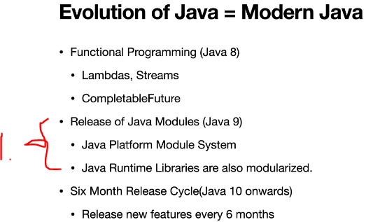
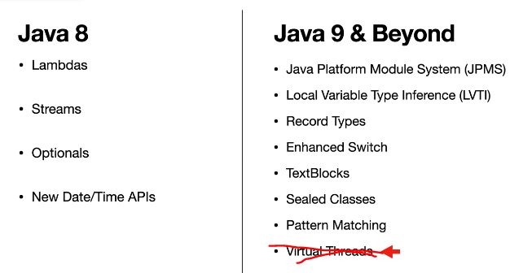
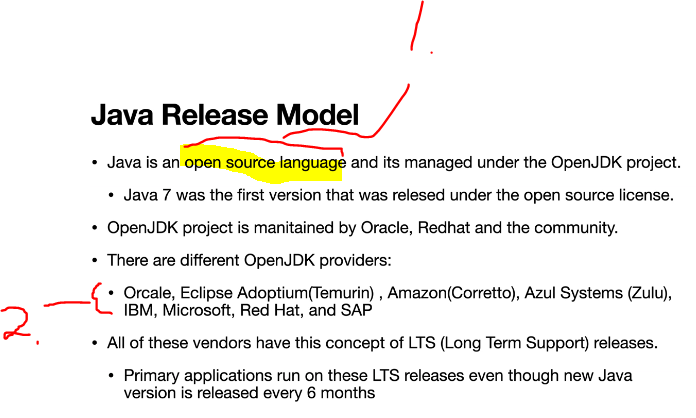

# Section 02: Getting Started Modern Java.

Getting Started Modern Java.

# What I Learned.

# Introduction to Modern Java : Big Picture.

1. The module functionality was introduced in **Java 9**. The **one** legacy package was changed to more granary packages.

1. Java the language is **open source**, but the trademark "Java" is owned by the **Oracle** company.
2. There are multiple **JDK** providers.