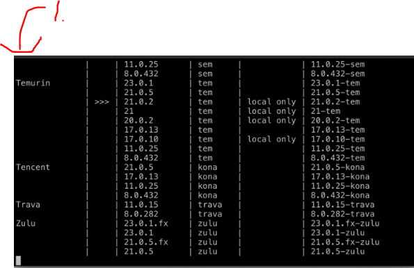
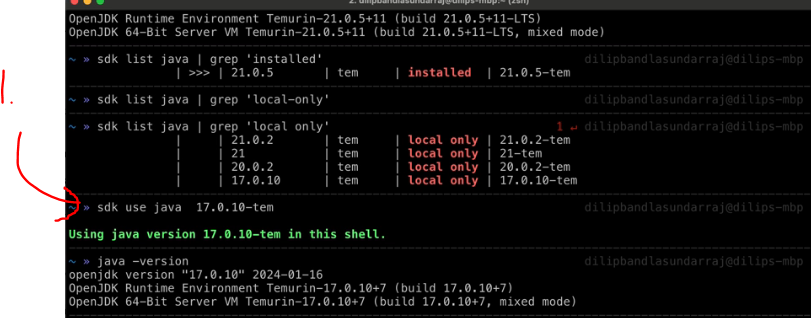

# Section 03: Local Set Up.

Local Set Up.

# What I Learned.

# Java Installation.

- We will install latest the **Java** in this episode.

- We are using the **SDK man**, below the example after running it:

- [Repo where is the SDK man](https://github.com/dilipsundarraj1/modern-java).
 
 

 1. You can see that what **SDK** versions and **providers** you could be installed using **SDK Man**.

 

 1. The **full potential** comes from this, we just need to issue one command to change the **SDK**.
    - Example to change to the **java 17.0.10-tem**, with the following `sdk use java 17.0.10-tem`.<>

