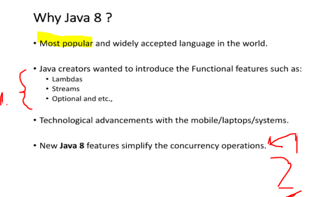
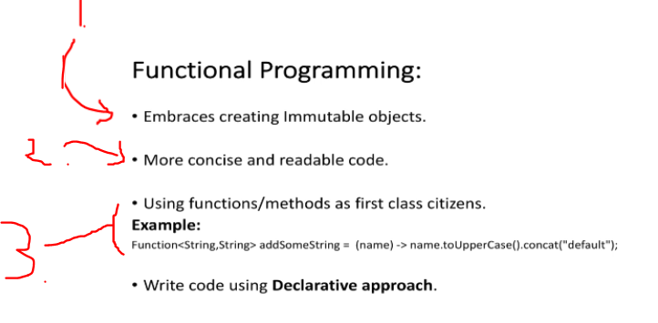

# Section 05: Why Java 8?

Why Java 8 ?

# What I Learned.

# Why Java 8 is important?  

    

1. The **Functional features** were wanted to be included also inside **Java**.
2. There was wanted improvement, in the realms of **threading** for the processors! Now it was introduced into the **Java 8** programming language. Also, introduced the **Functional programming** to the language.

    

1. We can use/manipulate **immutable object** thought functional programming, which are designed not to **change/mutate**.
2. We can write **more clear** and **cleaner code**, with the **Functional Programming**.
3. Furthermore, we can **assign** the **functions** to the **variable**.

> [!NOTE]
> **Imperative** vs **Declarative** programming style. Let's explore!

    

    

# Imperative vs Declarative Programming - Example 1.

- [Imperative vs Declarative Programming - Example 01](https://github.com/dilipsundarraj1/java-8/blob/master/java-8/src/com/learnJava/imperativevsdeclarative/ImperativeVsDeclarativeExample1.java)

- Todo these ones.

# Imperative vs Declarative Programming - Example 2. 

- [Imperative vs Declarative Programming - Example 02](https://github.com/dilipsundarraj1/java-8/blob/master/java-8/src/com/learnJava/imperativevsdeclarative/ImperativeVsDeclarativeExample2.java)

- Todo these ones.

 