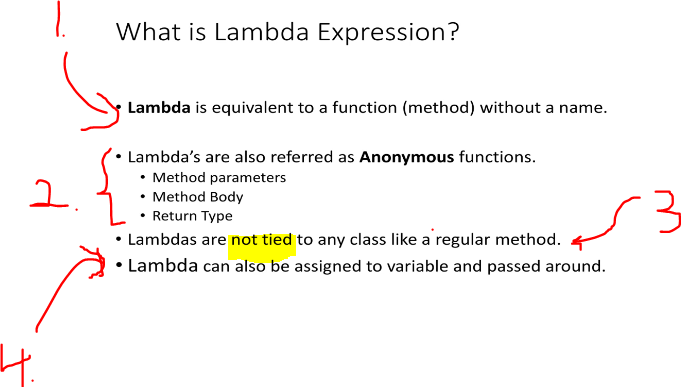

# Section 06: Introduction to Lambda.  

Introduction to Lambda.  

# What I Learned.

# What is Lambda ?

1. **Lambda** can be called, **function without a name**. 

2. **Lambda** has same characteristics as the **functions**.
    - Method parameters.
    - Method Body.
    - Return Type.
3. Lambdas are not **tied** to any **class**. Like example Class methods.
4. In fact in can be passed as a **variable**.

# Lab : Implement Runnable using Lambda.

# Lab : Implement Comparator using Lambda.