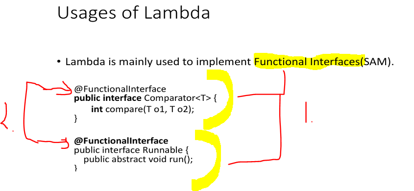
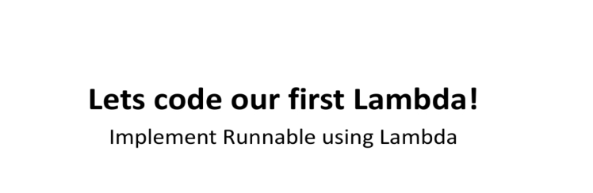
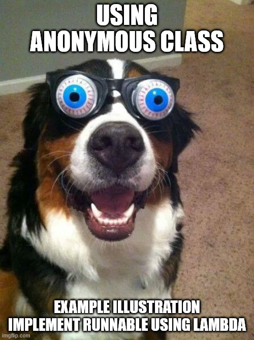
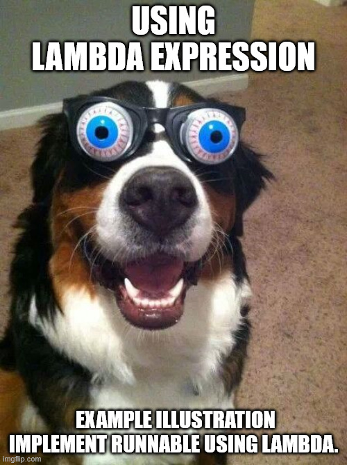
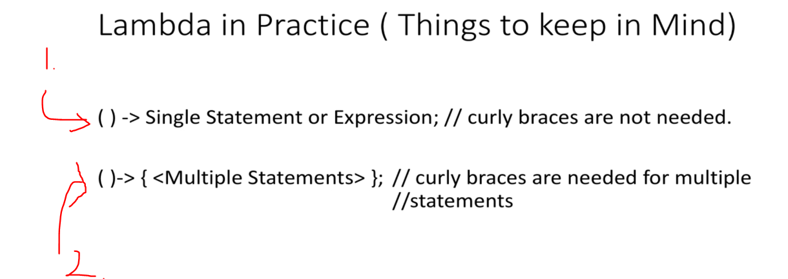
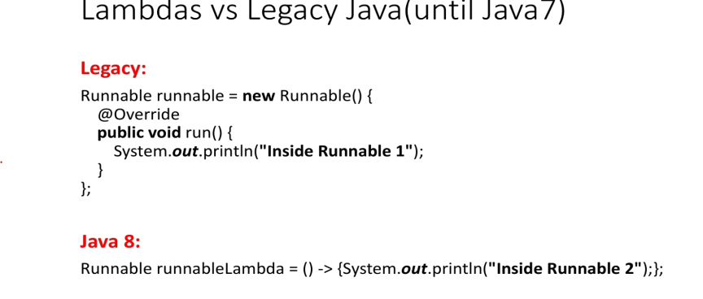
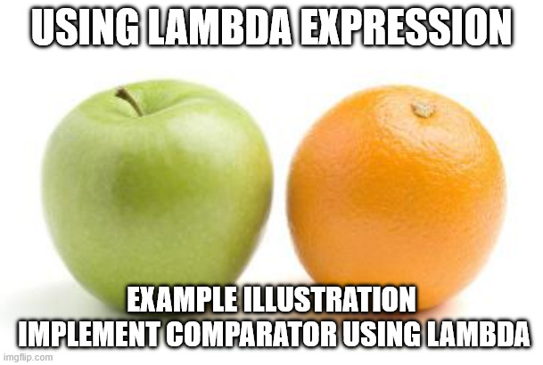
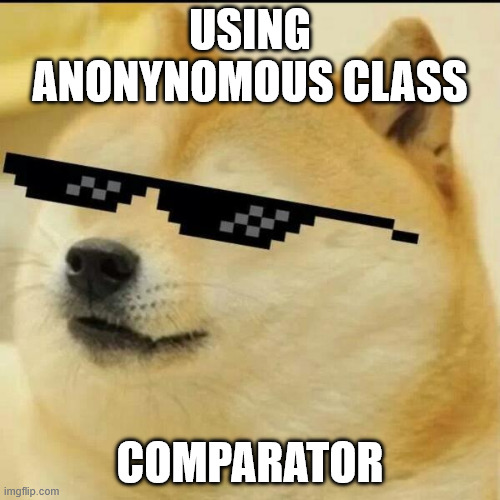
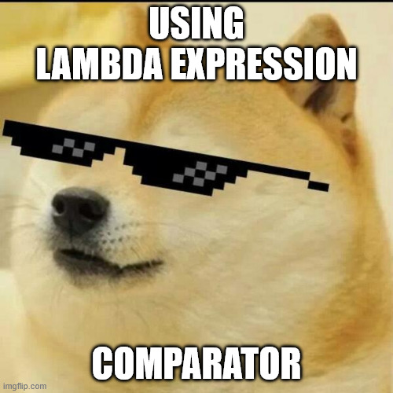

# Section 06: Introduction to Lambda.  

Introduction to Lambda.  

# What I Learned.

# What is Lambda?

<div align="center">
    
</div>


1. **Lambda** can be called, **function without a name**. 

2. **Lambda** has same characteristics as the **functions**.
    - Method parameters.
    - Method Body.
    - Return Type.
3. Lambdas are not **tied** to any **class**. Like example Class methods.
4. In fact in can be passed as a **variable**.

<div align="center">
    
</div>

- **Three** different parts in **Lambda Expression**

<div align="center">
    
</div>


1. Lambdas are used to implement **Functional Interfaces**.
    - Other names are called also, **SAM**. (**S**ingle **A**bstract **M**ethod).
2. **Functional Interfaces** are annotated with the `@FunctionalInterface`.

# Lab : Implement Runnable using Lambda.

- The first version of the **Lambda** will be using the old approach, **Anonymous Class**.

<div align="center">
    
</div>

- Link to the example, which we will be making. [Link](https://github.com/dilipsundarraj1/java-8/blob/master/java-8/src/com/learnJava/lambda/RunnableLambdaExample.javahttps://github.com/dilipsundarraj1/java-8/blob/master/java-8/src/com/learnJava/lambda/RunnableLambdaExample.java).

<div align="center">
    
</div>

- We are exploring the `interface Runnable`. The definition is below:
    - IntelliJ, has double `shift` to search for the type.

````
/*
 * Copyright (c) 1994, 2022, Oracle and/or its affiliates. All rights reserved.
 * DO NOT ALTER OR REMOVE COPYRIGHT NOTICES OR THIS FILE HEADER.
 *
 * This code is free software; you can redistribute it and/or modify it
 * under the terms of the GNU General Public License version 2 only, as
 * published by the Free Software Foundation.  Oracle designates this
 * particular file as subject to the "Classpath" exception as provided
 * by Oracle in the LICENSE file that accompanied this code.
 *
 * This code is distributed in the hope that it will be useful, but WITHOUT
 * ANY WARRANTY; without even the implied warranty of MERCHANTABILITY or
 * FITNESS FOR A PARTICULAR PURPOSE.  See the GNU General Public License
 * version 2 for more details (a copy is included in the LICENSE file that
 * accompanied this code).
 *
 * You should have received a copy of the GNU General Public License version
 * 2 along with this work; if not, write to the Free Software Foundation,
 * Inc., 51 Franklin St, Fifth Floor, Boston, MA 02110-1301 USA.
 *
 * Please contact Oracle, 500 Oracle Parkway, Redwood Shores, CA 94065 USA
 * or visit www.oracle.com if you need additional information or have any
 * questions.
 */

package java.lang;

/**
 * Represents an operation that does not return a result.
 *
 * <p> This is a {@linkplain java.util.function functional interface}
 * whose functional method is {@link #run()}.
 *
 * @author  Arthur van Hoff
 * @see     java.util.concurrent.Callable
 * @since   1.0
 */
@FunctionalInterface
public interface Runnable {
    /**
     * Runs this operation.
     */
    void run();
}
````

- The **recommendation** is to use the `@FunctionalInterface` in the interface that has **one** the method defined. 

- We can see that usage of the **Anonymous Class**.

````
 new Runnable() {
            @Override
            public void run() {
                System.out.println("Inside Runnable 1");
            }
````

- We are assigning it to the variable `Runnable runnable` as following:

````
/**
         * prior Java 8
         */

        Runnable runnable = new Runnable() {
            @Override
            public void run() {
                System.out.println("Inside Runnable 1");
            }
        };

````

- We will pass the **Runnable** to the **Thread**.
    - `new Thread(runnable).start();` and start this.

<div align="center">
    
</div>

-  We are assigning it to the variable using **Lambda expression**.

````
        Runnable runnableUsingLambda = () -> {
            System.out.println("Some Runnable using lambda expression!");
        };
````

- We are executing this with the **Lambda Expression**.
    - With the following `new Thread(runnableUsingLambda).start();`.

- You can see that there are **fewer lines** of code.

- We can also, give it straight to the **Thread** as with **Lambda expression**.
    - Example **not** using as variable `new Thread(()-> System.out.println("Inside Runnable 4")).start();`.

<div align="center">
    
</div>

1. If there is only **one** line.
2. If there are multiple lines inside **lambda expression**. You can use `{}`.

> [!CAUTION]
> Notice the difference between the styles, when assigning to the **functional interface**!

<div align="center">
    
</div>

# Lab : Implement Comparator using Lambda.

<div align="center">
    
</div>

- We are exploring the ` interface Comparator<T>`. The definition is below:
    - IntelliJ, has double `shift` to search for the type.

````
/*
 * Copyright (c) 1997, 2021, Oracle and/or its affiliates. All rights reserved.
 * DO NOT ALTER OR REMOVE COPYRIGHT NOTICES OR THIS FILE HEADER.
 *
 * This code is free software; you can redistribute it and/or modify it
 * under the terms of the GNU General Public License version 2 only, as
 * published by the Free Software Foundation.  Oracle designates this
 * particular file as subject to the "Classpath" exception as provided
 * by Oracle in the LICENSE file that accompanied this code.
 *
 * This code is distributed in the hope that it will be useful, but WITHOUT
 * ANY WARRANTY; without even the implied warranty of MERCHANTABILITY or
 * FITNESS FOR A PARTICULAR PURPOSE.  See the GNU General Public License
 * version 2 for more details (a copy is included in the LICENSE file that
 * accompanied this code).
 *
 * You should have received a copy of the GNU General Public License version
 * 2 along with this work; if not, write to the Free Software Foundation,
 * Inc., 51 Franklin St, Fifth Floor, Boston, MA 02110-1301 USA.
 *
 * Please contact Oracle, 500 Oracle Parkway, Redwood Shores, CA 94065 USA
 * or visit www.oracle.com if you need additional information or have any
 * questions.
 */

package java.util;

import java.io.Serializable;
import java.util.function.Function;
import java.util.function.ToIntFunction;
import java.util.function.ToLongFunction;
import java.util.function.ToDoubleFunction;
import java.util.Comparators;

/**
 * A comparison function, which imposes a <i>total ordering</i> on
 * some collection of objects.  Comparators can be passed to a sort
 * method (such as {@link Collections#sort(List,Comparator)
 * Collections.sort} or {@link Arrays#sort(Object[],Comparator)
 * Arrays.sort}) to allow precise control over the sort order.
 * Comparators can also be used to control the order of certain data
 * structures (such as {@linkplain SortedSet sorted sets} or
 * {@linkplain SortedMap sorted maps}), or to provide an ordering for
 * collections of objects that don't have a {@linkplain Comparable
 * natural ordering}.<p>
 *
 * The ordering imposed by a comparator {@code c} on a set of elements
 * {@code S} is said to be <i>consistent with equals</i> if and only if
 * {@code c.compare(e1, e2)==0} has the same boolean value as
 * {@code e1.equals(e2)} for every {@code e1} and {@code e2} in
 * {@code S}.<p>
 *
 * Caution should be exercised when using a comparator capable of imposing an
 * ordering inconsistent with equals to order a sorted set (or sorted map).
 * Suppose a sorted set (or sorted map) with an explicit comparator {@code c}
 * is used with elements (or keys) drawn from a set {@code S}.  If the
 * ordering imposed by {@code c} on {@code S} is inconsistent with equals,
 * the sorted set (or sorted map) will behave "strangely."  In particular the
 * sorted set (or sorted map) will violate the general contract for set (or
 * map), which is defined in terms of {@code equals}.<p>
 *
 * For example, suppose one adds two elements {@code a} and {@code b} such that
 * {@code (a.equals(b) && c.compare(a, b) != 0)}
 * to an empty {@code TreeSet} with comparator {@code c}.
 * The second {@code add} operation will return
 * true (and the size of the tree set will increase) because {@code a} and
 * {@code b} are not equivalent from the tree set's perspective, even though
 * this is contrary to the specification of the
 * {@link Set#add Set.add} method.<p>
 *
 * Note: It is generally a good idea for comparators to also implement
 * {@code java.io.Serializable}, as they may be used as ordering methods in
 * serializable data structures (like {@link TreeSet}, {@link TreeMap}).  In
 * order for the data structure to serialize successfully, the comparator (if
 * provided) must implement {@code Serializable}.<p>
 *
 * For the mathematically inclined, the <i>relation</i> that defines the
 * <i>imposed ordering</i> that a given comparator {@code c} imposes on a
 * given set of objects {@code S} is:<pre>
 *       {(x, y) such that c.compare(x, y) &lt;= 0}.
 * </pre> The <i>quotient</i> for this total order is:<pre>
 *       {(x, y) such that c.compare(x, y) == 0}.
 * </pre>
 *
 * It follows immediately from the contract for {@code compare} that the
 * quotient is an <i>equivalence relation</i> on {@code S}, and that the
 * imposed ordering is a <i>total order</i> on {@code S}.  When we say that
 * the ordering imposed by {@code c} on {@code S} is <i>consistent with
 * equals</i>, we mean that the quotient for the ordering is the equivalence
 * relation defined by the objects' {@link Object#equals(Object)
 * equals(Object)} method(s):<pre>
 *     {(x, y) such that x.equals(y)}. </pre>
 *
 * In other words, when the imposed ordering is consistent with
 * equals, the equivalence classes defined by the equivalence relation
 * of the {@code equals} method and the equivalence classes defined by
 * the quotient of the {@code compare} method are the same.

 * <p>Unlike {@code Comparable}, a comparator may optionally permit
 * comparison of null arguments, while maintaining the requirements for
 * an equivalence relation.
 *
 * <p>This interface is a member of the
 * <a href="{@docRoot}/java.base/java/util/package-summary.html#CollectionsFramework">
 * Java Collections Framework</a>.
 *
 * @param <T> the type of objects that may be compared by this comparator
 *
 * @author  Josh Bloch
 * @author  Neal Gafter
 * @see Comparable
 * @see java.io.Serializable
 * @since 1.2
 */
@FunctionalInterface
public interface Comparator<T> {
    /**
     * Compares its two arguments for order.  Returns a negative integer,
     * zero, or a positive integer as the first argument is less than, equal
     * to, or greater than the second.<p>
     *
     * The implementor must ensure that {@link Integer#signum
     * signum}{@code (compare(x, y)) == -signum(compare(y, x))} for
     * all {@code x} and {@code y}.  (This implies that {@code
     * compare(x, y)} must throw an exception if and only if {@code
     * compare(y, x)} throws an exception.)<p>
     *
     * The implementor must also ensure that the relation is transitive:
     * {@code ((compare(x, y)>0) && (compare(y, z)>0))} implies
     * {@code compare(x, z)>0}.<p>
     *
     * Finally, the implementor must ensure that {@code compare(x,
     * y)==0} implies that {@code signum(compare(x,
     * z))==signum(compare(y, z))} for all {@code z}.
     *
     * @apiNote
     * It is generally the case, but <i>not</i> strictly required that
     * {@code (compare(x, y)==0) == (x.equals(y))}.  Generally speaking,
     * any comparator that violates this condition should clearly indicate
     * this fact.  The recommended language is "Note: this comparator
     * imposes orderings that are inconsistent with equals."
     *
     * @param o1 the first object to be compared.
     * @param o2 the second object to be compared.
     * @return a negative integer, zero, or a positive integer as the
     *         first argument is less than, equal to, or greater than the
     *         second.
     * @throws NullPointerException if an argument is null and this
     *         comparator does not permit null arguments
     * @throws ClassCastException if the arguments' types prevent them from
     *         being compared by this comparator.
     */
    int compare(T o1, T o2);

    /**
     * Indicates whether some other object is &quot;equal to&quot;
     * this comparator.  This method must obey the general contract of
     * {@link Object#equals(Object)}.  Additionally, this method can
     * return {@code true} <i>only</i> if the specified object is also
     * a comparator and it imposes the same ordering as this
     * comparator.  Thus, {@code comp1.equals(comp2)} implies that
     * {@link Integer#signum signum}{@code (comp1.compare(o1,
     * o2))==signum(comp2.compare(o1, o2))} for every object reference
     * {@code o1} and {@code o2}.<p>
     *
     * Note that it is <i>always</i> safe <i>not</i> to override
     * {@code Object.equals(Object)}.  However, overriding this method may,
     * in some cases, improve performance by allowing programs to determine
     * that two distinct comparators impose the same order.
     *
     * @param   obj   the reference object with which to compare.
     * @return  {@code true} only if the specified object is also
     *          a comparator and it imposes the same ordering as this
     *          comparator.
     * @see Object#equals(Object)
     * @see Object#hashCode()
     */
    boolean equals(Object obj);

    /**
     * Returns a comparator that imposes the reverse ordering of this
     * comparator.
     *
     * @return a comparator that imposes the reverse ordering of this
     *         comparator.
     * @since 1.8
     */
    default Comparator<T> reversed() {
        return Collections.reverseOrder(this);
    }

    /**
     * Returns a lexicographic-order comparator with another comparator.
     * If this {@code Comparator} considers two elements equal, i.e.
     * {@code compare(a, b) == 0}, {@code other} is used to determine the order.
     *
     * <p>The returned comparator is serializable if the specified comparator
     * is also serializable.
     *
     * @apiNote
     * For example, to sort a collection of {@code String} based on the length
     * and then case-insensitive natural ordering, the comparator can be
     * composed using following code,
     *
     * <pre>{@code
     *     Comparator<String> cmp = Comparator.comparingInt(String::length)
     *             .thenComparing(String.CASE_INSENSITIVE_ORDER);
     * }</pre>
     *
     * @param  other the other comparator to be used when this comparator
     *         compares two objects that are equal.
     * @return a lexicographic-order comparator composed of this and then the
     *         other comparator
     * @throws NullPointerException if the argument is null.
     * @since 1.8
     */
    default Comparator<T> thenComparing(Comparator<? super T> other) {
        Objects.requireNonNull(other);
        return (Comparator<T> & Serializable) (c1, c2) -> {
            int res = compare(c1, c2);
            return (res != 0) ? res : other.compare(c1, c2);
        };
    }

    /**
     * Returns a lexicographic-order comparator with a function that
     * extracts a key to be compared with the given {@code Comparator}.
     *
     * @implSpec This default implementation behaves as if {@code
     *           thenComparing(comparing(keyExtractor, cmp))}.
     *
     * @param  <U>  the type of the sort key
     * @param  keyExtractor the function used to extract the sort key
     * @param  keyComparator the {@code Comparator} used to compare the sort key
     * @return a lexicographic-order comparator composed of this comparator
     *         and then comparing on the key extracted by the keyExtractor function
     * @throws NullPointerException if either argument is null.
     * @see #comparing(Function, Comparator)
     * @see #thenComparing(Comparator)
     * @since 1.8
     */
    default <U> Comparator<T> thenComparing(
            Function<? super T, ? extends U> keyExtractor,
            Comparator<? super U> keyComparator)
    {
        return thenComparing(comparing(keyExtractor, keyComparator));
    }

    /**
     * Returns a lexicographic-order comparator with a function that
     * extracts a {@code Comparable} sort key.
     *
     * @implSpec This default implementation behaves as if {@code
     *           thenComparing(comparing(keyExtractor))}.
     *
     * @param  <U>  the type of the {@link Comparable} sort key
     * @param  keyExtractor the function used to extract the {@link
     *         Comparable} sort key
     * @return a lexicographic-order comparator composed of this and then the
     *         {@link Comparable} sort key.
     * @throws NullPointerException if the argument is null.
     * @see #comparing(Function)
     * @see #thenComparing(Comparator)
     * @since 1.8
     */
    default <U extends Comparable<? super U>> Comparator<T> thenComparing(
            Function<? super T, ? extends U> keyExtractor)
    {
        return thenComparing(comparing(keyExtractor));
    }

    /**
     * Returns a lexicographic-order comparator with a function that
     * extracts an {@code int} sort key.
     *
     * @implSpec This default implementation behaves as if {@code
     *           thenComparing(comparingInt(keyExtractor))}.
     *
     * @param  keyExtractor the function used to extract the integer sort key
     * @return a lexicographic-order comparator composed of this and then the
     *         {@code int} sort key
     * @throws NullPointerException if the argument is null.
     * @see #comparingInt(ToIntFunction)
     * @see #thenComparing(Comparator)
     * @since 1.8
     */
    default Comparator<T> thenComparingInt(ToIntFunction<? super T> keyExtractor) {
        return thenComparing(comparingInt(keyExtractor));
    }

    /**
     * Returns a lexicographic-order comparator with a function that
     * extracts a {@code long} sort key.
     *
     * @implSpec This default implementation behaves as if {@code
     *           thenComparing(comparingLong(keyExtractor))}.
     *
     * @param  keyExtractor the function used to extract the long sort key
     * @return a lexicographic-order comparator composed of this and then the
     *         {@code long} sort key
     * @throws NullPointerException if the argument is null.
     * @see #comparingLong(ToLongFunction)
     * @see #thenComparing(Comparator)
     * @since 1.8
     */
    default Comparator<T> thenComparingLong(ToLongFunction<? super T> keyExtractor) {
        return thenComparing(comparingLong(keyExtractor));
    }

    /**
     * Returns a lexicographic-order comparator with a function that
     * extracts a {@code double} sort key.
     *
     * @implSpec This default implementation behaves as if {@code
     *           thenComparing(comparingDouble(keyExtractor))}.
     *
     * @param  keyExtractor the function used to extract the double sort key
     * @return a lexicographic-order comparator composed of this and then the
     *         {@code double} sort key
     * @throws NullPointerException if the argument is null.
     * @see #comparingDouble(ToDoubleFunction)
     * @see #thenComparing(Comparator)
     * @since 1.8
     */
    default Comparator<T> thenComparingDouble(ToDoubleFunction<? super T> keyExtractor) {
        return thenComparing(comparingDouble(keyExtractor));
    }

    /**
     * Returns a comparator that imposes the reverse of the <em>natural
     * ordering</em>.
     *
     * <p>The returned comparator is serializable and throws {@link
     * NullPointerException} when comparing {@code null}.
     *
     * @param  <T> the {@link Comparable} type of element to be compared
     * @return a comparator that imposes the reverse of the <i>natural
     *         ordering</i> on {@code Comparable} objects.
     * @see Comparable
     * @since 1.8
     */
    public static <T extends Comparable<? super T>> Comparator<T> reverseOrder() {
        return Collections.reverseOrder();
    }

    /**
     * Returns a comparator that compares {@link Comparable} objects in natural
     * order.
     *
     * <p>The returned comparator is serializable and throws {@link
     * NullPointerException} when comparing {@code null}.
     *
     * @param  <T> the {@link Comparable} type of element to be compared
     * @return a comparator that imposes the <i>natural ordering</i> on {@code
     *         Comparable} objects.
     * @see Comparable
     * @since 1.8
     */
    @SuppressWarnings("unchecked")
    public static <T extends Comparable<? super T>> Comparator<T> naturalOrder() {
        return (Comparator<T>) Comparators.NaturalOrderComparator.INSTANCE;
    }

    /**
     * Returns a null-friendly comparator that considers {@code null} to be
     * less than non-null. When both are {@code null}, they are considered
     * equal. If both are non-null, the specified {@code Comparator} is used
     * to determine the order. If the specified comparator is {@code null},
     * then the returned comparator considers all non-null values to be equal.
     *
     * <p>The returned comparator is serializable if the specified comparator
     * is serializable.
     *
     * @param  <T> the type of the elements to be compared
     * @param  comparator a {@code Comparator} for comparing non-null values
     * @return a comparator that considers {@code null} to be less than
     *         non-null, and compares non-null objects with the supplied
     *         {@code Comparator}.
     * @since 1.8
     */
    public static <T> Comparator<T> nullsFirst(Comparator<? super T> comparator) {
        return new Comparators.NullComparator<>(true, comparator);
    }

    /**
     * Returns a null-friendly comparator that considers {@code null} to be
     * greater than non-null. When both are {@code null}, they are considered
     * equal. If both are non-null, the specified {@code Comparator} is used
     * to determine the order. If the specified comparator is {@code null},
     * then the returned comparator considers all non-null values to be equal.
     *
     * <p>The returned comparator is serializable if the specified comparator
     * is serializable.
     *
     * @param  <T> the type of the elements to be compared
     * @param  comparator a {@code Comparator} for comparing non-null values
     * @return a comparator that considers {@code null} to be greater than
     *         non-null, and compares non-null objects with the supplied
     *         {@code Comparator}.
     * @since 1.8
     */
    public static <T> Comparator<T> nullsLast(Comparator<? super T> comparator) {
        return new Comparators.NullComparator<>(false, comparator);
    }

    /**
     * Accepts a function that extracts a sort key from a type {@code T}, and
     * returns a {@code Comparator<T>} that compares by that sort key using
     * the specified {@link Comparator}.
     *
     * <p>The returned comparator is serializable if the specified function
     * and comparator are both serializable.
     *
     * @apiNote
     * For example, to obtain a {@code Comparator} that compares {@code
     * Person} objects by their last name ignoring case differences,
     *
     * <pre>{@code
     *     Comparator<Person> cmp = Comparator.comparing(
     *             Person::getLastName,
     *             String.CASE_INSENSITIVE_ORDER);
     * }</pre>
     *
     * @param  <T> the type of element to be compared
     * @param  <U> the type of the sort key
     * @param  keyExtractor the function used to extract the sort key
     * @param  keyComparator the {@code Comparator} used to compare the sort key
     * @return a comparator that compares by an extracted key using the
     *         specified {@code Comparator}
     * @throws NullPointerException if either argument is null
     * @since 1.8
     */
    public static <T, U> Comparator<T> comparing(
            Function<? super T, ? extends U> keyExtractor,
            Comparator<? super U> keyComparator)
    {
        Objects.requireNonNull(keyExtractor);
        Objects.requireNonNull(keyComparator);
        return (Comparator<T> & Serializable)
            (c1, c2) -> keyComparator.compare(keyExtractor.apply(c1),
                                              keyExtractor.apply(c2));
    }

    /**
     * Accepts a function that extracts a {@link java.lang.Comparable
     * Comparable} sort key from a type {@code T}, and returns a {@code
     * Comparator<T>} that compares by that sort key.
     *
     * <p>The returned comparator is serializable if the specified function
     * is also serializable.
     *
     * @apiNote
     * For example, to obtain a {@code Comparator} that compares {@code
     * Person} objects by their last name,
     *
     * <pre>{@code
     *     Comparator<Person> byLastName = Comparator.comparing(Person::getLastName);
     * }</pre>
     *
     * @param  <T> the type of element to be compared
     * @param  <U> the type of the {@code Comparable} sort key
     * @param  keyExtractor the function used to extract the {@link
     *         Comparable} sort key
     * @return a comparator that compares by an extracted key
     * @throws NullPointerException if the argument is null
     * @since 1.8
     */
    public static <T, U extends Comparable<? super U>> Comparator<T> comparing(
            Function<? super T, ? extends U> keyExtractor)
    {
        Objects.requireNonNull(keyExtractor);
        return (Comparator<T> & Serializable)
            (c1, c2) -> keyExtractor.apply(c1).compareTo(keyExtractor.apply(c2));
    }

    /**
     * Accepts a function that extracts an {@code int} sort key from a type
     * {@code T}, and returns a {@code Comparator<T>} that compares by that
     * sort key.
     *
     * <p>The returned comparator is serializable if the specified function
     * is also serializable.
     *
     * @param  <T> the type of element to be compared
     * @param  keyExtractor the function used to extract the integer sort key
     * @return a comparator that compares by an extracted key
     * @see #comparing(Function)
     * @throws NullPointerException if the argument is null
     * @since 1.8
     */
    public static <T> Comparator<T> comparingInt(ToIntFunction<? super T> keyExtractor) {
        Objects.requireNonNull(keyExtractor);
        return (Comparator<T> & Serializable)
            (c1, c2) -> Integer.compare(keyExtractor.applyAsInt(c1), keyExtractor.applyAsInt(c2));
    }

    /**
     * Accepts a function that extracts a {@code long} sort key from a type
     * {@code T}, and returns a {@code Comparator<T>} that compares by that
     * sort key.
     *
     * <p>The returned comparator is serializable if the specified function is
     * also serializable.
     *
     * @param  <T> the type of element to be compared
     * @param  keyExtractor the function used to extract the long sort key
     * @return a comparator that compares by an extracted key
     * @see #comparing(Function)
     * @throws NullPointerException if the argument is null
     * @since 1.8
     */
    public static <T> Comparator<T> comparingLong(ToLongFunction<? super T> keyExtractor) {
        Objects.requireNonNull(keyExtractor);
        return (Comparator<T> & Serializable)
            (c1, c2) -> Long.compare(keyExtractor.applyAsLong(c1), keyExtractor.applyAsLong(c2));
    }

    /**
     * Accepts a function that extracts a {@code double} sort key from a type
     * {@code T}, and returns a {@code Comparator<T>} that compares by that
     * sort key.
     *
     * <p>The returned comparator is serializable if the specified function
     * is also serializable.
     *
     * @param  <T> the type of element to be compared
     * @param  keyExtractor the function used to extract the double sort key
     * @return a comparator that compares by an extracted key
     * @see #comparing(Function)
     * @throws NullPointerException if the argument is null
     * @since 1.8
     */
    public static<T> Comparator<T> comparingDouble(ToDoubleFunction<? super T> keyExtractor) {
        Objects.requireNonNull(keyExtractor);
        return (Comparator<T> & Serializable)
            (c1, c2) -> Double.compare(keyExtractor.applyAsDouble(c1), keyExtractor.applyAsDouble(c2));
    }
}
````

- Purpose of this is to compare **two** of something.
    - `int compare(T o1, T o2);`
    
<div align="center">
    
</div>

````
        Comparator<Integer> comparator  = new Comparator<Integer>() {
            @Override
            public int compare(Integer o1, Integer o2) {
                return o1.compareTo(o2); // 0 -> if both are equal
                                        // 1 -> if o1 > o2
                                        //-1 -> if o1<o2
            }
        };

        System.out.println(comparator.compare(1,2));
        // We are using following usually.
````

- We are not **instantiating the interface** directly—you are creating an anonymous class that **implements the interface**.
    - As in this example `new Comparator<Integer>()`.
        - This **compare** will be using following logic:
            - `0` → if **both** are `equal`.
            - `1` → if `o1 > o2`.
            - `-1` → if `o1 < o2`.


<div align="center">
    
</div>

- We are using **Lambda Expression** for the Comparator.

````
Comparator<Integer> comparatorLambda = (Integer  a,Integer b) -> a.compareTo(b);
System.out.println(comparatorLambda.compare(1,2));
````

- And the another example.
    - The `Comparator<Integer> comparatorLambda1 = (a,b) -> a.compareTo(b);` and the `System.out.println(comparatorLambda1.compare(1,2));`.