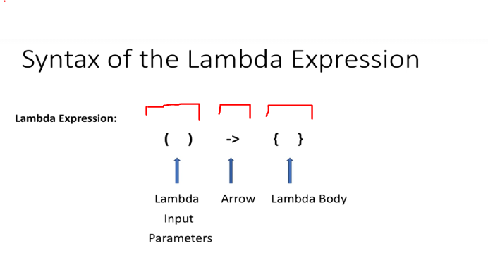

# Section 06: Introduction to Lambda.  

Introduction to Lambda.  

# What I Learned.

# What is Lambda?

<div align="center">
    
</div>


1. **Lambda** can be called, **function without a name**. 

2. **Lambda** has same characteristics as the **functions**.
    - Method parameters.
    - Method Body.
    - Return Type.
3. Lambdas are not **tied** to any **class**. Like example Class methods.
4. In fact in can be passed as a **variable**.

<div align="center">
    
</div>

- **Three** different parts in **Lambda Expression**

<div align="center">
    
</div>


1. Lambdas are used to implement **Functional Interfaces**.
    - Other names are called also, **SAM**. (**S**ingle **A**bstract **M**ethod).
2. **Functional Interfaces** are annotated with the `@FunctionalInterface`.

# Lab : Implement Runnable using Lambda.

- The first version of the **Lambda** will be using the old approach, **Anonymous Class**.

<div align="center">
    
</div>

- Link to the example, which we will be making. [Link](https://github.com/dilipsundarraj1/java-8/blob/master/java-8/src/com/learnJava/lambda/RunnableLambdaExample.javahttps://github.com/dilipsundarraj1/java-8/blob/master/java-8/src/com/learnJava/lambda/RunnableLambdaExample.java).

<div align="center">
    
</div>

- We are exploring the `interface Runnable`. The definition is below:
    - IntelliJ, has double `shift` to search for the type.

````
/*
 * Copyright (c) 1994, 2022, Oracle and/or its affiliates. All rights reserved.
 * DO NOT ALTER OR REMOVE COPYRIGHT NOTICES OR THIS FILE HEADER.
 *
 * This code is free software; you can redistribute it and/or modify it
 * under the terms of the GNU General Public License version 2 only, as
 * published by the Free Software Foundation.  Oracle designates this
 * particular file as subject to the "Classpath" exception as provided
 * by Oracle in the LICENSE file that accompanied this code.
 *
 * This code is distributed in the hope that it will be useful, but WITHOUT
 * ANY WARRANTY; without even the implied warranty of MERCHANTABILITY or
 * FITNESS FOR A PARTICULAR PURPOSE.  See the GNU General Public License
 * version 2 for more details (a copy is included in the LICENSE file that
 * accompanied this code).
 *
 * You should have received a copy of the GNU General Public License version
 * 2 along with this work; if not, write to the Free Software Foundation,
 * Inc., 51 Franklin St, Fifth Floor, Boston, MA 02110-1301 USA.
 *
 * Please contact Oracle, 500 Oracle Parkway, Redwood Shores, CA 94065 USA
 * or visit www.oracle.com if you need additional information or have any
 * questions.
 */

package java.lang;

/**
 * Represents an operation that does not return a result.
 *
 * <p> This is a {@linkplain java.util.function functional interface}
 * whose functional method is {@link #run()}.
 *
 * @author  Arthur van Hoff
 * @see     java.util.concurrent.Callable
 * @since   1.0
 */
@FunctionalInterface
public interface Runnable {
    /**
     * Runs this operation.
     */
    void run();
}
````

- The **recommendation** is to use the `@FunctionalInterface` in the interface that has **one** the method defined. 

- We can see that usage of the **Anonymous Class**.

````
 new Runnable() {
            @Override
            public void run() {
                System.out.println("Inside Runnable 1");
            }
````

- We are assigning it to the variable `Runnable runnable` as following:

````
/**
         * prior Java 8
         */

        Runnable runnable = new Runnable() {
            @Override
            public void run() {
                System.out.println("Inside Runnable 1");
            }
        };

````

- We will pass the **Runnable** to the **Thread**.
    - `new Thread(runnable).start();` and start this.

<div align="center">
    
</div>

-  We are assigning it to the variable using **Lambda expression**.

````
        Runnable runnableUsingLambda = () -> {
            System.out.println("Some Runnable using lambda expression!");
        };
````

- We are executing this with the **Lambda Expression**.
    - With the following `new Thread(runnableUsingLambda).start();`.

- You can see that there are **fewer lines** of code.

- We can also, give it straight to the **Thread** as with **Lambda expression**.
    - Example **not** using as variable `new Thread(()-> System.out.println("Inside Runnable 4")).start();`.

<div align="center">
    
</div>

1. If there is only **one** line.
2. If there are multiple lines inside **lambda expression**. You can use `{}`.

> [!CAUTION]
> Notice the difference between the styles, when assigning to the **functional interface**!

<div align="center">
    
</div>

# Lab : Implement Comparator using Lambda.


