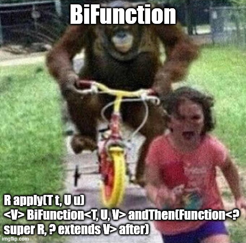

# Section 07: Lambdas and Functional Interfaces. 

Lambdas and Functional Interfaces.

# What I Learned.

# Introduction to Functional Interfaces.

<div align="center">
    
</div>

1. In the **past** these were introduced in **Java 1.0**, and it was called **Single Abstract Methods**!

2. These were introduced from the **Java 8** and its recommendation to use the annotation `@FunctinalInterface`.

<div align="center">
    
</div>

- These are **four** main **Functional Interfaces**.
    - **Consumer**.
    - **Predicate**.
    - **Function**.
    - **Supplier**.

<div align="center">
    
</div>

<div align="center">
    
</div>

1. **Consumer** has the interface **BiConsumer**.

2. **Predicate** has the **BiPredicate**.

3. **Function** has the **BiFunction**, **UnaryOperator** and **BinaryOperator**.

# Lab:Consumer Functional Interface - Part 1.

<div align="center">
    
</div>

- **Consumer** consumes something, but does **not** return **result**.
    - These are used to do some work or job.

- Example code is from. [Consumer Functional Interface](https://github.com/dilipsundarraj1/java-8/blob/master/java-8/src/com/learnJava/functionalInterfaces/ConsumerExample.java).

- The `Consumer` interface from **Java**.

````
/*
 * Copyright (c) 2010, 2013, Oracle and/or its affiliates. All rights reserved.
 * DO NOT ALTER OR REMOVE COPYRIGHT NOTICES OR THIS FILE HEADER.
 *
 * This code is free software; you can redistribute it and/or modify it
 * under the terms of the GNU General Public License version 2 only, as
 * published by the Free Software Foundation.  Oracle designates this
 * particular file as subject to the "Classpath" exception as provided
 * by Oracle in the LICENSE file that accompanied this code.
 *
 * This code is distributed in the hope that it will be useful, but WITHOUT
 * ANY WARRANTY; without even the implied warranty of MERCHANTABILITY or
 * FITNESS FOR A PARTICULAR PURPOSE.  See the GNU General Public License
 * version 2 for more details (a copy is included in the LICENSE file that
 * accompanied this code).
 *
 * You should have received a copy of the GNU General Public License version
 * 2 along with this work; if not, write to the Free Software Foundation,
 * Inc., 51 Franklin St, Fifth Floor, Boston, MA 02110-1301 USA.
 *
 * Please contact Oracle, 500 Oracle Parkway, Redwood Shores, CA 94065 USA
 * or visit www.oracle.com if you need additional information or have any
 * questions.
 */
package java.util.function;

import java.util.Objects;

/**
 * Represents an operation that accepts a single input argument and returns no
 * result. Unlike most other functional interfaces, {@code Consumer} is expected
 * to operate via side-effects.
 *
 * <p>This is a <a href="package-summary.html">functional interface</a>
 * whose functional method is {@link #accept(Object)}.
 *
 * @param <T> the type of the input to the operation
 *
 * @since 1.8
 */
@FunctionalInterface
public interface Consumer<T> {

    /**
     * Performs this operation on the given argument.
     *
     * @param t the input argument
     */
    void accept(T t);

    /**
     * Returns a composed {@code Consumer} that performs, in sequence, this
     * operation followed by the {@code after} operation. If performing either
     * operation throws an exception, it is relayed to the caller of the
     * composed operation.  If performing this operation throws an exception,
     * the {@code after} operation will not be performed.
     *
     * @param after the operation to perform after this operation
     * @return a composed {@code Consumer} that performs in sequence this
     * operation followed by the {@code after} operation
     * @throws NullPointerException if {@code after} is null
     */
    default Consumer<T> andThen(Consumer<? super T> after) {
        Objects.requireNonNull(after);
        return (T t) -> { accept(t); after.accept(t); };
    }
}
````

<div align="center">
    
</div>

1. All these are introduced in **Java 8**, as **Functional Interfaces**.

- To perform of **Consumer** is that it **accepts input** and **perform operation**.

- Example of using the **Consumer**.
    - Assigns **Lambda Expression**.
    - Execute it by `.accept("Some text")`.

````
package com.learnJava.functionalInterfaces;

import java.util.function.Consumer;

public class ConsumerExample {

    public static void main(String[] args) {

        Consumer<String> c1 = (string) -> System.out.println(string.toUpperCase());
        c1.accept("java8");

    }
}
````

# Lab:Consumer Functional Interface - Part 2.

- Example code is from. [Consumer Functional Interface](https://github.com/dilipsundarraj1/java-8/blob/master/java-8/src/com/learnJava/functionalInterfaces/ConsumerExample.java).

- We will have the following classes `student` and `studentDatabase`.

````
package com.learnJava.data;

import java.util.ArrayList;
import java.util.List;

public class Student {
    private String name;
    private int gradeLevel;
    private double gpa;
    private String gender;


    public Student(String name, int gradeLevel, double gpa, String gender, List<String> activities) {
        this.name = name;
        this.gradeLevel = gradeLevel;
        this.gpa = gpa;
        this.gender = gender;
        this.activities = activities;
    }

    public String getGender() {
        return gender;
    }

    public void setGender(String gender) {
        this.gender = gender;
    }

    public String getName() {
        return name;
    }

    public void setName(String name) {
        this.name = name;
    }

    public int getGradeLevel() {
        return gradeLevel;
    }

    public void setGradeLevel(int gradeLevel) {
        this.gradeLevel = gradeLevel;
    }

    public double getGpa() {
        return gpa;
    }

    public void setGpa(double gpa) {
        this.gpa = gpa;
    }

    List<String> activities = new ArrayList<>();

    public List<String> getActivities() {
        return activities;
    }

    public void setActivities(List<String> activities) {
        this.activities = activities;
    }

    @Override
    public String toString() {
        return "Student{" +
                "name='" + name + '\'' +
                ", gradeLevel=" + gradeLevel +
                ", gpa=" + gpa +
                ", gender='" + gender + '\'' +
                ", activities=" + activities +
                '}';
    }


}
````

- And the `studentDataase`.

````
package com.learnJava.data;

import java.util.Arrays;
import java.util.List;

public class StudentDataBase {

    /**
     * Total of 6 students in the database.
     * @return
     */
    public static List<Student> getAllStudents(){

        /**
         * 2nd grade students
         */
        Student student1 = new Student("Adam",2,3.6, "male",Arrays.asList("swimming", "basketball","volleyball"));
        Student student2 = new Student("Jenny",2,3.8,"female", Arrays.asList("swimming", "gymnastics","soccer"));
        /**
         * 3rd grade students
         */
        Student student3 = new Student("Emily",3,4.0,"female", Arrays.asList("swimming", "gymnastics","aerobics"));
        Student student4 = new Student("Dave",3,3.9,"male", Arrays.asList("swimming", "gymnastics","soccer"));
        /**
         * 4th grade students
         */
        Student student5 = new Student("Sophia",4,3.5,"female", Arrays.asList("swimming", "dancing","football"));
        Student student6 = new Student("James",4,3.9,"male", Arrays.asList("swimming", "basketball","baseball","football"));

        List<Student> students = Arrays.asList(student1,student2,student3,student4,student5,student6);
        return students;
    }
}
````

- We can see the `.forEach` method using he `Consumer` **Functional Interface**.

````
    default void forEach(Consumer<? super T> action) {
        Objects.requireNonNull(action);
        for (T t : this) {
            action.accept(t);
        }
    }
````

- The **default** gives the interface default behavior.

- We are illustrating the `.forEach()` action:

````
package com.learnJava.functionalInterfaces;

import com.learnJava.data.Student;
import com.learnJava.data.StudentDataBase;

import java.util.List;
import java.util.function.Consumer;

public class ConsumerExample {

    public static  void printName(){
        Consumer<Student> c2 = (string) -> System.out.println(string);

        List<Student> studentList = StudentDataBase.getAllStudents();
        studentList.forEach(c2);
    }

    public static void main(String[] args) {

        printName();

        //Consumer<String> c1 = (string) -> System.out.println(string.toUpperCase());
        //c1.accept("java8");
    }
}
````

- We can use two **Consumers** in a chain.

````
public static void printNamesActivities()
    {
        Consumer<Student> c3 = (student) -> System.out.println(student.getName());
        Consumer<Student> c4 = (student) -> System.out.println(student.getActivities());

        List<Student> studentList = StudentDataBase.getAllStudents();

        studentList.forEach(c3.andThen(c4)); // This is called consumer chaining.
    }
````

- This is called **consumer chaining** `studentList.forEach(c3.andThen(c4)); // This is called Consumer Chaining.`.

- We could do this as below, but this would need to loop **two** times.

````
    public static void printNamesActivities()
    {
        Consumer<Student> c3 = (student) -> System.out.println(student.getName());
        Consumer<Student> c4 = (student) -> System.out.println(student.getActivities());

        List<Student> studentList = StudentDataBase.getAllStudents();

        studentList.forEach(c3);
        studentList.forEach(c4);
    }
````

- We can achieve code re-usability with **Lambda Expression**, as following are defined:
    - `static Consumer<Student> c2 = (string) -> System.out.println(string);`
    - `static Consumer<Student> c3 = (student) -> System.out.println(student.getName());`
    - `static Consumer<Student> c4 = (student) -> System.out.println(student.getActivities());`


````
public static void printNamesActivitiesWithTheCondition()
    {

        System.out.println("printNamesActivitiesWithTheCondition:");
        List<Student> studentList = StudentDataBase.getAllStudents();

        studentList.forEach((student -> {
            if (student.getGradeLevel() >= 3){
                c3.andThen(c4).accept(student);
            }
        }));
    }
````

<div align="center">
    
</div>

- You can see, the following order `c3` and then `c4`. This **WONT** be **returned/executed** until the `1.` `.accept(student)` is executed for given **student**!


> [!TIP]
> We can chain **n** number of times the using the `.andThen()` as example: <br> `c3.andThen(c4).andThen(c1).accept(student);`.


# Lab:BiConsumer Functional Interface.

<div align="center">
    
</div>

- **BiConsumer** is the same as **Consumer**, but for **two** input and **no output**.
    - **BiConsumer** is extension to **Consumer**.
        - Like **Consumer**. These are used to do some work or job.


- Example code is from. [BiConsumer Functional Interface](https://github.com/dilipsundarraj1/java-8/blob/master/java-8/src/com/learnJava/functionalInterfaces/BiConsumerExample.java).

- We will be exploring the **BiConsumer** from the Java **SDK** as following:

````
/*
 * Copyright (c) 2012, 2013, Oracle and/or its affiliates. All rights reserved.
 * DO NOT ALTER OR REMOVE COPYRIGHT NOTICES OR THIS FILE HEADER.
 *
 * This code is free software; you can redistribute it and/or modify it
 * under the terms of the GNU General Public License version 2 only, as
 * published by the Free Software Foundation.  Oracle designates this
 * particular file as subject to the "Classpath" exception as provided
 * by Oracle in the LICENSE file that accompanied this code.
 *
 * This code is distributed in the hope that it will be useful, but WITHOUT
 * ANY WARRANTY; without even the implied warranty of MERCHANTABILITY or
 * FITNESS FOR A PARTICULAR PURPOSE.  See the GNU General Public License
 * version 2 for more details (a copy is included in the LICENSE file that
 * accompanied this code).
 *
 * You should have received a copy of the GNU General Public License version
 * 2 along with this work; if not, write to the Free Software Foundation,
 * Inc., 51 Franklin St, Fifth Floor, Boston, MA 02110-1301 USA.
 *
 * Please contact Oracle, 500 Oracle Parkway, Redwood Shores, CA 94065 USA
 * or visit www.oracle.com if you need additional information or have any
 * questions.
 */
package java.util.function;

import java.util.Objects;

/**
 * Represents an operation that accepts two input arguments and returns no
 * result.  This is the two-arity specialization of {@link Consumer}.
 * Unlike most other functional interfaces, {@code BiConsumer} is expected
 * to operate via side-effects.
 *
 * <p>This is a <a href="package-summary.html">functional interface</a>
 * whose functional method is {@link #accept(Object, Object)}.
 *
 * @param <T> the type of the first argument to the operation
 * @param <U> the type of the second argument to the operation
 *
 * @see Consumer
 * @since 1.8
 */
@FunctionalInterface
public interface BiConsumer<T, U> {

    /**
     * Performs this operation on the given arguments.
     *
     * @param t the first input argument
     * @param u the second input argument
     */
    void accept(T t, U u);

    /**
     * Returns a composed {@code BiConsumer} that performs, in sequence, this
     * operation followed by the {@code after} operation. If performing either
     * operation throws an exception, it is relayed to the caller of the
     * composed operation.  If performing this operation throws an exception,
     * the {@code after} operation will not be performed.
     *
     * @param after the operation to perform after this operation
     * @return a composed {@code BiConsumer} that performs in sequence this
     * operation followed by the {@code after} operation
     * @throws NullPointerException if {@code after} is null
     */
    default BiConsumer<T, U> andThen(BiConsumer<? super T, ? super U> after) {
        Objects.requireNonNull(after);

        return (l, r) -> {
            accept(l, r);
            after.accept(l, r);
        };
    }
}
````

- As you can see the **BI** accepts two `void accept(T t, U u);`.
    - Accepts **two** inputs.

- Example of the `biConsumer` simple case. 

````
        BiConsumer<String, String> biConsumer = (a,b) -> {
            System.out.println(" a : "  +  a + " b : " + b );
        };
        biConsumer.accept("java7" , "java8");
````

- Example using multiple `biConsumers` after each other.

````
        BiConsumer<Integer, Integer> multiply = (a,b) -> {
            System.out.println("Multiplication : " + (a * b));
        };


        BiConsumer<Integer, Integer> addition = (a,b) -> {
            System.out.println("Addition : " + (a + b));
        };

        BiConsumer<Integer, Integer> division = (a,b) -> {
            System.out.println("Division : "  + (a / b));
        };


        multiply.andThen(addition).andThen(division).accept(10,5);
````

- The **BiConsumer** usage with the `student` example. 

````
    public static void nameAndActivities(){

        BiConsumer<String, List<String>> studentBiConsumer = (name, activities) -> System.out.println(name + " : " + activities);

        Consumer<String> stringConsumer = (name) -> System.out.println("name is  :" + name);

        List<Student> students = StudentDataBase.getAllStudents();

        students.forEach((s) -> studentBiConsumer.accept(s.getName(),s.getActivities()));
    }
````

# Lab:Predicate - Functional Interface - Part 1.

<div align="center">
    
</div>

- **Predicate** are used to **test** something. These will return **boolean** as result. 

- We will be exploring the **Predicate** from the Java **SDK** as following:

````
/*
 * Copyright (c) 2010, 2013, Oracle and/or its affiliates. All rights reserved.
 * DO NOT ALTER OR REMOVE COPYRIGHT NOTICES OR THIS FILE HEADER.
 *
 * This code is free software; you can redistribute it and/or modify it
 * under the terms of the GNU General Public License version 2 only, as
 * published by the Free Software Foundation.  Oracle designates this
 * particular file as subject to the "Classpath" exception as provided
 * by Oracle in the LICENSE file that accompanied this code.
 *
 * This code is distributed in the hope that it will be useful, but WITHOUT
 * ANY WARRANTY; without even the implied warranty of MERCHANTABILITY or
 * FITNESS FOR A PARTICULAR PURPOSE.  See the GNU General Public License
 * version 2 for more details (a copy is included in the LICENSE file that
 * accompanied this code).
 *
 * You should have received a copy of the GNU General Public License version
 * 2 along with this work; if not, write to the Free Software Foundation,
 * Inc., 51 Franklin St, Fifth Floor, Boston, MA 02110-1301 USA.
 *
 * Please contact Oracle, 500 Oracle Parkway, Redwood Shores, CA 94065 USA
 * or visit www.oracle.com if you need additional information or have any
 * questions.
 */
package java.util.function;

import java.util.Objects;

/**
 * Represents a predicate (boolean-valued function) of one argument.
 *
 * <p>This is a <a href="package-summary.html">functional interface</a>
 * whose functional method is {@link #test(Object)}.
 *
 * @param <T> the type of the input to the predicate
 *
 * @since 1.8
 */
@FunctionalInterface
public interface Predicate<T> {

    /**
     * Evaluates this predicate on the given argument.
     *
     * @param t the input argument
     * @return {@code true} if the input argument matches the predicate,
     * otherwise {@code false}
     */
    boolean test(T t);

    /**
     * Returns a composed predicate that represents a short-circuiting logical
     * AND of this predicate and another.  When evaluating the composed
     * predicate, if this predicate is {@code false}, then the {@code other}
     * predicate is not evaluated.
     *
     * <p>Any exceptions thrown during evaluation of either predicate are relayed
     * to the caller; if evaluation of this predicate throws an exception, the
     * {@code other} predicate will not be evaluated.
     *
     * @param other a predicate that will be logically-ANDed with this
     *              predicate
     * @return a composed predicate that represents the short-circuiting logical
     * AND of this predicate and the {@code other} predicate
     * @throws NullPointerException if other is null
     */
    default Predicate<T> and(Predicate<? super T> other) {
        Objects.requireNonNull(other);
        return (t) -> test(t) && other.test(t);
    }

    /**
     * Returns a predicate that represents the logical negation of this
     * predicate.
     *
     * @return a predicate that represents the logical negation of this
     * predicate
     */
    default Predicate<T> negate() {
        return (t) -> !test(t);
    }

    /**
     * Returns a composed predicate that represents a short-circuiting logical
     * OR of this predicate and another.  When evaluating the composed
     * predicate, if this predicate is {@code true}, then the {@code other}
     * predicate is not evaluated.
     *
     * <p>Any exceptions thrown during evaluation of either predicate are relayed
     * to the caller; if evaluation of this predicate throws an exception, the
     * {@code other} predicate will not be evaluated.
     *
     * @param other a predicate that will be logically-ORed with this
     *              predicate
     * @return a composed predicate that represents the short-circuiting logical
     * OR of this predicate and the {@code other} predicate
     * @throws NullPointerException if other is null
     */
    default Predicate<T> or(Predicate<? super T> other) {
        Objects.requireNonNull(other);
        return (t) -> test(t) || other.test(t);
    }

    /**
     * Returns a predicate that tests if two arguments are equal according
     * to {@link Objects#equals(Object, Object)}.
     *
     * @param <T> the type of arguments to the predicate
     * @param targetRef the object reference with which to compare for equality,
     *               which may be {@code null}
     * @return a predicate that tests if two arguments are equal according
     * to {@link Objects#equals(Object, Object)}
     */
    static <T> Predicate<T> isEqual(Object targetRef) {
        return (null == targetRef)
                ? Objects::isNull
                : object -> targetRef.equals(object);
    }

    /**
     * Returns a predicate that is the negation of the supplied predicate.
     * This is accomplished by returning result of the calling
     * {@code target.negate()}.
     *
     * @param <T>     the type of arguments to the specified predicate
     * @param target  predicate to negate
     *
     * @return a predicate that negates the results of the supplied
     *         predicate
     *
     * @throws NullPointerException if target is null
     *
     * @since 11
     */
    @SuppressWarnings("unchecked")
    static <T> Predicate<T> not(Predicate<? super T> target) {
        Objects.requireNonNull(target);
        return (Predicate<T>)target.negate();
    }
}
````

- We can see different, **methods** from the **Predicate** class.
    - The main one is the `boolean test(T t);`, to test the given input.

``` 
    default Predicate<T> and(Predicate<? super T> other) {
        Objects.requireNonNull(other);
        return (t) -> test(t) && other.test(t);
    }

```

- We will use the `default Predicate<T> and(Predicate<? super T> other)` to chain the **Predicates**, example of this one:
    - We have the following **Predicates**.
        - `Predicate<Integer> isPositive = x -> x > 0;`.
        - `Predicate<Integer> isEven = x -> x % 2 == 0;`.
            - We will chain them.
                - `Predicate<Integer> positiveAndEven = isPositive.and(isEven);`.

```
    default Predicate<T> negate() {
        return (t) -> !test(t);
    }
```

- We will use the `default Predicate<T> negate()` to **negate** the flip the **result of a predicate**.

````
    default Predicate<T> or(Predicate<? super T> other) {
        Objects.requireNonNull(other);
        return (t) -> test(t) || other.test(t);
    }
````

- Todo this.

````

    static <T> Predicate<T> isEqual(Object targetRef) {
        return (null == targetRef)
                ? Objects::isNull
                : object -> targetRef.equals(object);
    }
````

- Todo this.

````
    static <T> Predicate<T> not(Predicate<? super T> target) {
        Objects.requireNonNull(target);
        return (Predicate<T>)target.negate();
    }
````

- We will be exploring these concepts using **examples**.

- The **Predicate** tests the **even number**.

````
static Predicate<Integer> p = (i) -> {return  i%2 ==0;};

System.out.println("Result is p : " + p.test(2));
````

- This will be returning **boolean**, in this case **true**. Also, we can use this, without the `{}` as following:

````
static Predicate<Integer> p1 = (i) -> i%2 ==0;

System.out.println("Result is p1 : " + p1.test(3));
````

- We will explore `.and` methods of the **Predicate**. This is called **predicate chaining**.

````
static Predicate<Integer> p1 = (i) -> i%2 ==0;
static Predicate<Integer> p2 = (i) -> i%5 ==0;

public static void predicateAnd(){
    System.out.println("Result in predicateAnd, this example we will use the 10: " + p1.and (p2).test(10));
    System.out.println("You can see that, the 10 is divisible by 2 and is divisible by 5.");
    System.out.println("Result in predicateAnd, this example we will use the 12: " + p1.and (p2).test(12));
    System.out.println("You can see that, the 12 is divisible by 2, but not the 5.");
}

````

- We will explore `.or` methods of the **Predicate**. This is called **predicate chaining**.
    - This **Predicate** chain return **true**, either if `p1` or `p2` return **true**.

````
    public static void predicateOr(){

        static Predicate<Integer> p1 = (i) -> i%2 ==0;
        static Predicate<Integer> p2 = (i) -> i%5 ==0;

        System.out.println("Predicate OR result is : " + p1.or(p2).test(10));
        System.out.println("Predicate OR result is : " + p1.or(p2).test(9));
    }
````

- We will explore `.negate` method of the **Predicate**. This is called **predicate chaining**.
    - This `.negate` will change the output of the result.

````
    public static void predicateNegate(){
        static Predicate<Integer> p1 = (i) -> i%2 ==0;
        static Predicate<Integer> p2 = (i) -> i%5 ==0;

        System.out.println("Result in predicateNegate : " + p1.and(p2).negate().test(10)); //equivalent to reversing the result
    }
````

# Lab:Predicate - Functional Interface - Part 2.

- Example code is from. [Predicate Functional Interface](https://github.com/dilipsundarraj1/java-8/blob/master/java-8/src/com/learnJava/functionalInterfaces/PredicateStudentExample.java).

- The **Predicate** usage with the `student` example. We will **filter** based one the criteria. 

````
package com.learnJava.functionalInterfaces;


import com.learnJava.data.Student;
import com.learnJava.data.StudentDataBase;

import java.util.List;
import java.util.function.Predicate;

public class PredicateStudentExample {
    // First criteria for the GradeLevel.
    static Predicate<Student> p1 = (s) -> s.getGradeLevel() >= 3;
    // Second criteria for the GBA.
    static Predicate<Student> p2 = (s) -> s.getGpa() >= 3.9;

    public static  void filterStudentByGradeLevel()
    {
        List<Student> studentList = StudentDataBase.getAllStudents();
        studentList.forEach(student -> {
            if (p1.test(student))
            {
                System.out.println("Student matches the Grade Level criteria:" + student);
            }
        });
    }
    public static  void filterStudentByGpa()
    {
        List<Student> studentList = StudentDataBase.getAllStudents();
        studentList.forEach(student -> {
            if (p2.test(student))
            {
                System.out.println("Student matches the GPA criteria:" + student);
            }
        });
    }

    public static void main(String[] args) {
        filterStudentByGradeLevel();

        filterStudentByGpa();
    }

}
````

<div align="center">
    
</div>

1. There is filter **Predicate** `p1` for filtering based one the **GPA**.
2. There is filter **Predicate** `p1` for filtering based one the **Grade Level**.

- We can now **easily** chain these conditions.
    - Example `p1.or(p2).negate().test(student)`, as following:

````
    public static void filterStudents()
    {
        System.out.println("filterStudents");
        List<Student> studentList = StudentDataBase.getAllStudents();
        studentList.forEach(student -> {

            // If its fits the p1 and the p2 Predicate.
            if (p1.or(p2).negate().test(student))
            {
                System.out.println(student);
            }
        });
    }
````

# Lab:Combining Predicate + Consumer.

<div align="center">
    
</div>

- We will just **combine** what we learned previously, in one example.

- Example code is from. [Predicate and Consumer combo](https://github.com/dilipsundarraj1/java-8/blob/master/java-8/src/com/learnJava/functionalInterfaces/PredicateAndConsumerExample.java).


````
package com.learnJava.functionalInterfaces;

import com.learnJava.data.Student;
import com.learnJava.data.StudentDataBase;

import java.util.List;
import java.util.function.BiConsumer;
import java.util.function.Consumer;
import java.util.function.Predicate;

public class PredicateAndConsumerExample {

    // Filtering criteria!
    Predicate<Student> p1 = (student) -> student.getGradeLevel() >= 3;
    Predicate<Student> p2 = (student) -> student.getGpa() >= 3.9;

    // Two inputs.
    BiConsumer<String, List<String>> studentBiConsumer = (name, activities)  -> System.out.println(name + " : " + activities );
    Consumer<Student> studentConsumer = ( student -> {

        // If the filtering is fine.
        if (p1.and(p2).test(student))
        {
            // Printing with two inputs.
             studentBiConsumer.accept(student.getName(), student.getActivities());
        }
    });

    public void printNameAndActivities(List<Student> studentList)
    {
        studentList.forEach(student -> studentConsumer.accept(student));
    }

    public static void main(String[] args) {
        List<Student> studentList = StudentDataBase.getAllStudents();
        new PredicateAndConsumerExample().printNameAndActivities(studentList);
    }
}
````

# Lab:BiPredicate.

<div align="center">
    
</div>

- Example code is from. [BiPredicate](https://github.com/dilipsundarraj1/java-8/blob/master/java-8/src/com/learnJava/functionalInterfaces/PredicateAndConsumerExample.java).

- **BiPredicate** are used to **test** something. These will return **boolean** as result. 
    - This time it's done with **two inputs** and **one output**!

- We will be exploring the **BiPredicate** from the Java **SDK** as following:

````
/*
 * Copyright (c) 2010, 2013, Oracle and/or its affiliates. All rights reserved.
 * DO NOT ALTER OR REMOVE COPYRIGHT NOTICES OR THIS FILE HEADER.
 *
 * This code is free software; you can redistribute it and/or modify it
 * under the terms of the GNU General Public License version 2 only, as
 * published by the Free Software Foundation.  Oracle designates this
 * particular file as subject to the "Classpath" exception as provided
 * by Oracle in the LICENSE file that accompanied this code.
 *
 * This code is distributed in the hope that it will be useful, but WITHOUT
 * ANY WARRANTY; without even the implied warranty of MERCHANTABILITY or
 * FITNESS FOR A PARTICULAR PURPOSE.  See the GNU General Public License
 * version 2 for more details (a copy is included in the LICENSE file that
 * accompanied this code).
 *
 * You should have received a copy of the GNU General Public License version
 * 2 along with this work; if not, write to the Free Software Foundation,
 * Inc., 51 Franklin St, Fifth Floor, Boston, MA 02110-1301 USA.
 *
 * Please contact Oracle, 500 Oracle Parkway, Redwood Shores, CA 94065 USA
 * or visit www.oracle.com if you need additional information or have any
 * questions.
 */
package java.util.function;

import java.util.Objects;

/**
 * Represents a predicate (boolean-valued function) of two arguments.  This is
 * the two-arity specialization of {@link Predicate}.
 *
 * <p>This is a <a href="package-summary.html">functional interface</a>
 * whose functional method is {@link #test(Object, Object)}.
 *
 * @param <T> the type of the first argument to the predicate
 * @param <U> the type of the second argument the predicate
 *
 * @see Predicate
 * @since 1.8
 */
@FunctionalInterface
public interface BiPredicate<T, U> {

    /**
     * Evaluates this predicate on the given arguments.
     *
     * @param t the first input argument
     * @param u the second input argument
     * @return {@code true} if the input arguments match the predicate,
     * otherwise {@code false}
     */
    boolean test(T t, U u);

    /**
     * Returns a composed predicate that represents a short-circuiting logical
     * AND of this predicate and another.  When evaluating the composed
     * predicate, if this predicate is {@code false}, then the {@code other}
     * predicate is not evaluated.
     *
     * <p>Any exceptions thrown during evaluation of either predicate are relayed
     * to the caller; if evaluation of this predicate throws an exception, the
     * {@code other} predicate will not be evaluated.
     *
     * @param other a predicate that will be logically-ANDed with this
     *              predicate
     * @return a composed predicate that represents the short-circuiting logical
     * AND of this predicate and the {@code other} predicate
     * @throws NullPointerException if other is null
     */
    default BiPredicate<T, U> and(BiPredicate<? super T, ? super U> other) {
        Objects.requireNonNull(other);
        return (T t, U u) -> test(t, u) && other.test(t, u);
    }

    /**
     * Returns a predicate that represents the logical negation of this
     * predicate.
     *
     * @return a predicate that represents the logical negation of this
     * predicate
     */
    default BiPredicate<T, U> negate() {
        return (T t, U u) -> !test(t, u);
    }

    /**
     * Returns a composed predicate that represents a short-circuiting logical
     * OR of this predicate and another.  When evaluating the composed
     * predicate, if this predicate is {@code true}, then the {@code other}
     * predicate is not evaluated.
     *
     * <p>Any exceptions thrown during evaluation of either predicate are relayed
     * to the caller; if evaluation of this predicate throws an exception, the
     * {@code other} predicate will not be evaluated.
     *
     * @param other a predicate that will be logically-ORed with this
     *              predicate
     * @return a composed predicate that represents the short-circuiting logical
     * OR of this predicate and the {@code other} predicate
     * @throws NullPointerException if other is null
     */
    default BiPredicate<T, U> or(BiPredicate<? super T, ? super U> other) {
        Objects.requireNonNull(other);
        return (T t, U u) -> test(t, u) || other.test(t, u);
    }
}
````

- Example of using **BiPredicate**.
    - Most **important** thing here is the 
    - Initialization: `BiPredicat<e<Integer,Double> studentBiPredicate = (gradeLevel, gpa) -> gradeLevel >= 3 && gpa>=3.9;`.
    - Usage: `if (studentBiPredicate.test(student.getGradeLevel(), student.getGpa()))`. 
    
````
package com.learnJava.functionalInterfaces;

import com.learnJava.data.Student;
import com.learnJava.data.StudentDataBase;

import java.util.List;
import java.util.function.BiConsumer;
import java.util.function.BiPredicate;
import java.util.function.Consumer;
import java.util.function.Predicate;

public class PredicateAndConsumerExample {

    // Filtering criteria!
    Predicate<Student> p1 = (student) -> student.getGradeLevel() >= 3;
    Predicate<Student> p2 = (student) -> student.getGpa() >= 3.9;

    // We will include two Predicates for one Bi Predicate for compact reasons!
    BiPredicate<Integer,Double> studentBiPredicate = (gradeLevel, gpa) -> gradeLevel >= 3 && gpa>=3.9;
    // Two inputs.
    BiConsumer<String, List<String>> studentBiConsumer = (name, activities)  -> System.out.println(name + " : " + activities );
    Consumer<Student> studentConsumer = ( student -> {

        // If the filtering is fine.
//        if (p1.and(p2).test(student))
// We can use combined predicate for the condition.
        if (studentBiPredicate.test(student.getGradeLevel(), student.getGpa()))
        {
            // Printing with two inputs.
             studentBiConsumer.accept(student.getName(), student.getActivities());
        }
    });

    public void printNameAndActivities(List<Student> studentList)
    {
        studentList.forEach(student -> studentConsumer.accept(student));
    }

    public static void main(String[] args) {
        List<Student> studentList = StudentDataBase.getAllStudents();
        new PredicateAndConsumerExample().printNameAndActivities(studentList);
    }
}
````

# Lab : Function - Function Interface - Part 1.

<div align="center">
    
</div>

- Example code is from. [Function Interface](https://github.com/dilipsundarraj1/java-8/blob/master/java-8/src/com/learnJava/functionalInterfaces/FunctionExample.java).

- **Function** represents function by **taking** one input `(T)` and **returning** one output `(R)`.
    - We can pass **method** as **argument**, and pass this where ever you would need it.

- We will be exploring the **Function** from the Java **SDK** as following:

 ````
 /*
 * Copyright (c) 2010, 2013, Oracle and/or its affiliates. All rights reserved.
 * DO NOT ALTER OR REMOVE COPYRIGHT NOTICES OR THIS FILE HEADER.
 *
 * This code is free software; you can redistribute it and/or modify it
 * under the terms of the GNU General Public License version 2 only, as
 * published by the Free Software Foundation.  Oracle designates this
 * particular file as subject to the "Classpath" exception as provided
 * by Oracle in the LICENSE file that accompanied this code.
 *
 * This code is distributed in the hope that it will be useful, but WITHOUT
 * ANY WARRANTY; without even the implied warranty of MERCHANTABILITY or
 * FITNESS FOR A PARTICULAR PURPOSE.  See the GNU General Public License
 * version 2 for more details (a copy is included in the LICENSE file that
 * accompanied this code).
 *
 * You should have received a copy of the GNU General Public License version
 * 2 along with this work; if not, write to the Free Software Foundation,
 * Inc., 51 Franklin St, Fifth Floor, Boston, MA 02110-1301 USA.
 *
 * Please contact Oracle, 500 Oracle Parkway, Redwood Shores, CA 94065 USA
 * or visit www.oracle.com if you need additional information or have any
 * questions.
 */
package java.util.function;

import java.util.Objects;

/**
 * Represents a function that accepts one argument and produces a result.
 *
 * <p>This is a <a href="package-summary.html">functional interface</a>
 * whose functional method is {@link #apply(Object)}.
 *
 * @param <T> the type of the input to the function
 * @param <R> the type of the result of the function
 *
 * @since 1.8
 */
@FunctionalInterface
public interface Function<T, R> {

    /**
     * Applies this function to the given argument.
     *
     * @param t the function argument
     * @return the function result
     */
    R apply(T t);

    /**
     * Returns a composed function that first applies the {@code before}
     * function to its input, and then applies this function to the result.
     * If evaluation of either function throws an exception, it is relayed to
     * the caller of the composed function.
     *
     * @param <V> the type of input to the {@code before} function, and to the
     *           composed function
     * @param before the function to apply before this function is applied
     * @return a composed function that first applies the {@code before}
     * function and then applies this function
     * @throws NullPointerException if before is null
     *
     * @see #andThen(Function)
     */
    default <V> Function<V, R> compose(Function<? super V, ? extends T> before) {
        Objects.requireNonNull(before);
        return (V v) -> apply(before.apply(v));
    }

    /**
     * Returns a composed function that first applies this function to
     * its input, and then applies the {@code after} function to the result.
     * If evaluation of either function throws an exception, it is relayed to
     * the caller of the composed function.
     *
     * @param <V> the type of output of the {@code after} function, and of the
     *           composed function
     * @param after the function to apply after this function is applied
     * @return a composed function that first applies this function and then
     * applies the {@code after} function
     * @throws NullPointerException if after is null
     *
     * @see #compose(Function)
     */
    default <V> Function<T, V> andThen(Function<? super R, ? extends V> after) {
        Objects.requireNonNull(after);
        return (T t) -> after.apply(apply(t));
    }

    /**
     * Returns a function that always returns its input argument.
     *
     * @param <T> the type of the input and output objects to the function
     * @return a function that always returns its input argument
     */
    static <T> Function<T, T> identity() {
        return t -> t;
    }
}
````

- Simple usage of the **Function**. This time with `.apply()`.

````
package com.learnJava.functionalInterfaces;

import java.util.function.Function;

public class FunctionExamples {

    static Function<String, String> function = (name) -> name.toUpperCase();

    public static void main(String[] args) {
        System.out.println("Result is : " + function.apply("java8"));
    }
}
````

- Next we will explore `.andhen()`.

````
package com.learnJava.functionalInterfaces;


import java.util.function.Function;

public class FunctionExamples {

    static Function<String, String> function = (name) -> name.toUpperCase();

    static Function<String, String> addSomeString = (name) -> name.toUpperCase().concat("default");


    public static void main(String[] args) {

        System.out.println("Result is : " + function.apply("java8"));

        System.out.println("Result is andThen : " + function.andThen(addSomeString).apply("java8"));
    }
}

````

<div align="center">
    
</div>

1. You can see the output of the `.andThen` function. Calling order will be:
    - **FIRST** `function`.
    - **SECOND** `.andThen(addSomeString)`.
        - **INPUT** The input for all of this `.apply("java8"));`.

- Next we will explore `.compose()`.
    - It will evaluate what is inside `.compose()` first, then proceed with the rest of the chain.

````
package com.learnJava.functionalInterfaces;


import java.util.function.Function;

public class FunctionExamples {

    static Function<String, String> function = (name) -> name.toUpperCase();

    static Function<String, String> addSomeString = (name) -> name.toUpperCase().concat("default");

    public static void main(String[] args) {

        System.out.println("Result is : " + function.apply("java8"));

        System.out.println("Result is andThen : " + function.andThen(addSomeString).apply("java8"));
        System.out.println("Result is andThen : " + function.compose(addSomeString).apply("java8"));
    }
}
````

- We can refer to **static** **Functions**, use these for re-usability.

````
package com.learnJava.functionalInterfaces;

public class FunctionExample1 {

    public static String appendDefault(String input)
    {
        return FunctionExamples.addSomeString.apply(input);
    }

    public static void main(String[] args) {
        String result = appendDefault("Hello");
        System.out.println(result);
    }
}
````

# Lab:Function - Function Interface - Part 2.

- The **Function** usage with the `student` example. 

````
package com.learnJava.functionalInterfaces;

import com.learnJava.data.Student;
import com.learnJava.data.StudentDataBase;

import java.util.HashMap;
import java.util.List;
import java.util.Map;
import java.util.function.Function;
import java.util.function.Predicate;

public class FunctionStudentExample {

    static Function<List<Student>, Map<String, Double>>  function = (students -> {

        Map<String,Double> studentGradeMap = new HashMap<>();

        students.forEach((student -> {

            if(PredicateStudentExample.p1.test(student)){
                studentGradeMap.put(student.getName(),student.getGpa());
            }
        }));

        return studentGradeMap;

    });

    public static void main(String[] args) {

        System.out.println(function.apply(StudentDataBase.getAllStudents()));

    }
}
````

# Lab:BiFunction Functional Interface.

<div align="center">
    
</div>

- **BiFunction** represents function by **taking two input** `(T, U)` and **returning** one output `(R)`.

- We will be exploring the **BiFunction** from the Java **SDK** as following:

````
/*
 * Copyright (c) 2010, 2013, Oracle and/or its affiliates. All rights reserved.
 * DO NOT ALTER OR REMOVE COPYRIGHT NOTICES OR THIS FILE HEADER.
 *
 * This code is free software; you can redistribute it and/or modify it
 * under the terms of the GNU General Public License version 2 only, as
 * published by the Free Software Foundation.  Oracle designates this
 * particular file as subject to the "Classpath" exception as provided
 * by Oracle in the LICENSE file that accompanied this code.
 *
 * This code is distributed in the hope that it will be useful, but WITHOUT
 * ANY WARRANTY; without even the implied warranty of MERCHANTABILITY or
 * FITNESS FOR A PARTICULAR PURPOSE.  See the GNU General Public License
 * version 2 for more details (a copy is included in the LICENSE file that
 * accompanied this code).
 *
 * You should have received a copy of the GNU General Public License version
 * 2 along with this work; if not, write to the Free Software Foundation,
 * Inc., 51 Franklin St, Fifth Floor, Boston, MA 02110-1301 USA.
 *
 * Please contact Oracle, 500 Oracle Parkway, Redwood Shores, CA 94065 USA
 * or visit www.oracle.com if you need additional information or have any
 * questions.
 */
package java.util.function;

import java.util.Objects;

/**
 * Represents a function that accepts two arguments and produces a result.
 * This is the two-arity specialization of {@link Function}.
 *
 * <p>This is a <a href="package-summary.html">functional interface</a>
 * whose functional method is {@link #apply(Object, Object)}.
 *
 * @param <T> the type of the first argument to the function
 * @param <U> the type of the second argument to the function
 * @param <R> the type of the result of the function
 *
 * @see Function
 * @since 1.8
 */
@FunctionalInterface
public interface BiFunction<T, U, R> {

    /**
     * Applies this function to the given arguments.
     *
     * @param t the first function argument
     * @param u the second function argument
     * @return the function result
     */
    R apply(T t, U u);

    /**
     * Returns a composed function that first applies this function to
     * its input, and then applies the {@code after} function to the result.
     * If evaluation of either function throws an exception, it is relayed to
     * the caller of the composed function.
     *
     * @param <V> the type of output of the {@code after} function, and of the
     *           composed function
     * @param after the function to apply after this function is applied
     * @return a composed function that first applies this function and then
     * applies the {@code after} function
     * @throws NullPointerException if after is null
     */
    default <V> BiFunction<T, U, V> andThen(Function<? super R, ? extends V> after) {
        Objects.requireNonNull(after);
        return (T t, U u) -> after.apply(apply(t, u));
    }
}
````

- In this example, we are using this for testing based on certain **predicate** for given **list**.

````
package com.learnJava.functionalInterfaces;

import com.learnJava.data.Student;
import com.learnJava.data.StudentDataBase;

import java.util.HashMap;
import java.util.List;
import java.util.Map;
import java.util.function.BiFunction;
import java.util.function.Predicate;

public class BiFunctionExample {

    private static Map<String, String> loginPageLocs = new HashMap<>();

    static BiFunction<List<Student>,Predicate<Student>,Map<String, Double>> biFunction = (students,studentPredicate)->{

        Map<String,Double> studentGradeMap = new HashMap<>();
        students.forEach((student -> {
            if(studentPredicate.test(student)){
                studentGradeMap.put(student.getName(),student.getGpa());
            }
        }));

        return studentGradeMap;
    };

    public static String getLoginLocs(String sLocator, String elementType) {
        return loginPageLocs.get(elementType);
    }

    static BiFunction<String,String,String> getLoginLocs = (sLocator,elementType) -> loginPageLocs.get(sLocator);

    public static void main(String[] args) {
        System.out.println(biFunction.apply(StudentDataBase.getAllStudents(),PredicateStudentExample.p2));
//        getLoginLocs.apply("locator","elementType");
    }
}
````


# Lab:UnaryOperator and BinaryOperator Functional Interface.

<div align="center">
    
</div>


<div align="center">
    
</div>

- Todo here.

# Lab:Supplier - Functional Interface.

<div align="center">
    
</div
