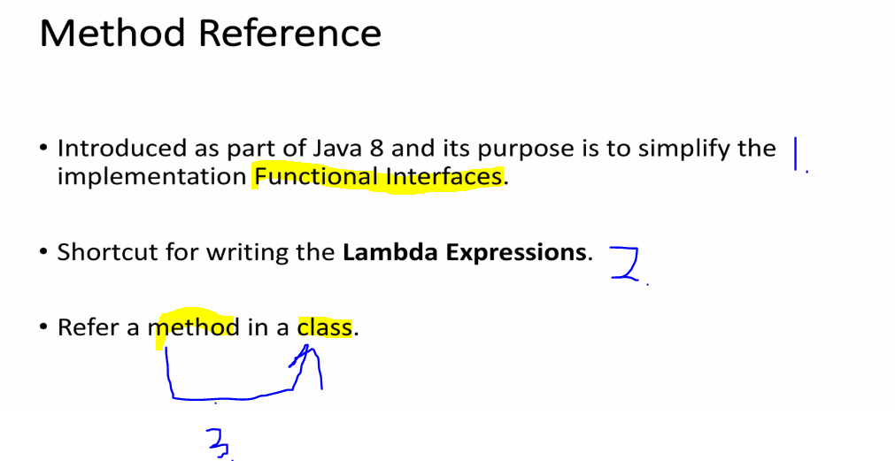
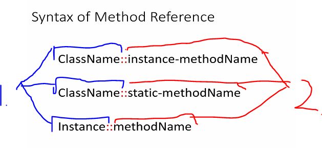
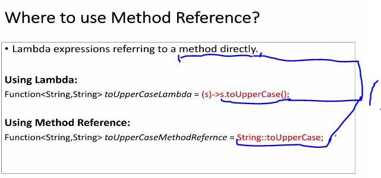
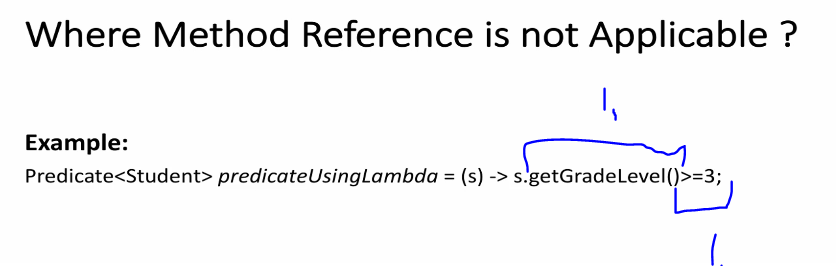
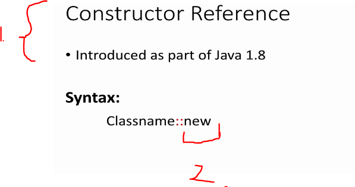

# Section 08: Constructor and Method References. 

Constructor and Method References.

# What I learned.

# Method Reference.

<div align="center">
    
</div>

1. **Method reference** got introduced in **Java 8** and this tries to **simplify** the implementations **Functional Interface**.
    - This tries to **simplify** the **Lambda expressions** itself.
2. **Method reference** is having shortcut called as **Lambda Expression**.
3. This will refer **method** in a **class**.

<div align="center">
    
</div>

1. The **Left** side refers to the **Class**.
2. The **Right** side refers to the **Method name**:s.

<div align="center">
    
</div>

1. This needs to be referred to the **method directly**.
    - Using **Lambda**: `(s) -> s.toUpperCase();`.
    - Using **Method Reference**: `String::toUpperCase;`.

> [!NOTE]
> **Methods Reference** is not applicable for every case.

<div align="center">
    
</div>

1. In example, there are **two** things which this function does. So **not** possible.
    - There is **work around**.

# Lab: Method Reference - Function.

- Example code is from. [Example Method Reference Function](https://github.com/dilipsundarraj1/java-8/blob/master/java-8/src/com/learnJava/methodreferences/FunctionMethodReferenceExample.java).

- We will be implementing the `Function` with the **Method reference** and with the **Lambda Expression** approach.

`````
package com.learnJava.methodreference;

import java.util.function.Function;

public class functionMethodReferenceExample {

    static Function<String, String> toUpperCaseLambda = (s) -> s.toUpperCase();
    static Function<String, String> toUpperCaseReference = String::toUpperCase;

    public static void main(String[] args) {

        System.out.println(toUpperCaseLambda.apply("java8"));
        System.out.println(toUpperCaseReference.apply("java8"));

    }
}
`````

# Lab: Method Reference - Consumer.

- Example code is from. [Example Method Reference Function](https://github.com/dilipsundarraj1/java-8/blob/master/java-8/src/com/learnJava/methodreference/ConsumerMethodReferenceExample.java).

- We will be implementing the `Consumer` with the **Method reference** and with the **Lambda Expression** approach.


`````
package com.learnJava.methodreference;

import com.learnJava.data.Student;
import com.learnJava.data.StudentDataBase;

import java.util.function.Consumer;

public class ConsumerMethodReferenceExample {

    static Consumer<Student> c1 = (string) -> System.out.println(string);

    // Method reference way.
    static Consumer<Student> c2 = System.out::println;

    static Consumer<Student> c3 = Student::pringListOfTheActivities;

    public static void main(String[] args) {

        // This is the old way.
        StudentDataBase.getAllStudents().forEach(c1);


        // Method reference way.
        StudentDataBase.getAllStudents().forEach(c2);

        // This is the new function.
        StudentDataBase.getAllStudents().forEach(c3);


    }
}
`````

- This is added to the `Student`.

````
    public void pringListOfTheActivities()
    {
        System.out.println(activities);
    }
````

# Lab: Refactor Lambda Expression to Method Reference.

- Example code is from. [Example Method Reference Function](https://github.com/dilipsundarraj1/java-8/blob/master/java-8/src/com/learnJava/methodreferences/RefactorMethodReferenceExample.java).

- We will be returning **Students** from **Student Database**.

````

package com.learnJava.data;

import java.util.Arrays;
import java.util.List;
import java.util.function.Supplier;

public class StudentDataBase {

    public  static Supplier<Student> studentSupplier = () -> {
        return new Student("Adam",2,3.6, "male",Arrays.asList("swimming", "basketball","volleyball"));
    };

    etc ...

}
````

- We can use the **Predicate** the in **predefined** method declaration, as following:
    - `greaterThan()` method being supplied to the `predicateUsingMetRef` **Predicate**.

````
package com.learnJava.methodreference;

public class RefactorMethodReferenceExample {

    static Predicate<Student> predicateUsingMetRef = RefactorMethodReferenceExample::greaterThan;

   static public  boolean greaterThan(Student student,Integer grade){

        return student.getGradeLevel() > grade;
    }

}
````

# Constructor Reference.

- Example code is from. [Example Construction Reference](
https://github.com/dilipsundarraj1/java-8/tree/master/java-8/src/com/learnJava/constructorreference).

<div align="center">
    
</div>

1. This was introduced in **Java 1.8**.

2. For **Constructor Reference** this accepts the `new` rather than the **method** name.

<div align="center">
    
</div>

1. We can use **Constructor Reference** in case of the **Function interface**.
    - This will **Create** new **Student** whenever, the `get` is called thought the **Supplier** interface.

2. This will not be working, for this case.

- This will be creating **new** every time when the `.get()` or the `.apply()` will be called:

````
package com.learnJava.constructorReference;

import com.learnJava.data.Student;

import java.util.function.Function;
import java.util.function.Supplier;

public class ConstructorReferenceExample {

    static Supplier<Student> studentSupplier = Student::new;

    static Function<String, Student> studentFunction = Student::new;

    public static void main(String[] args) {

        System.out.println(studentSupplier.get());
        System.out.println(studentFunction.apply("ABC"));
    }
}
````

- Remember **there** needs the different **Constructors** for the **Student** class. 
    - Example from the **Student** class for **Construction**.

````
    public Student() {

    }

    public Student(String name, int gradeLevel, double gpa, String gender, List<String> activities) {
        this.name = name;
        this.gradeLevel = gradeLevel;
        this.gpa = gpa;
        this.gender = gender;
        this.activities = activities;
    }

    // We will create the empty constructor for the Constructor Reference.
    public Student(String s) {
        this.name = s;
    }
````