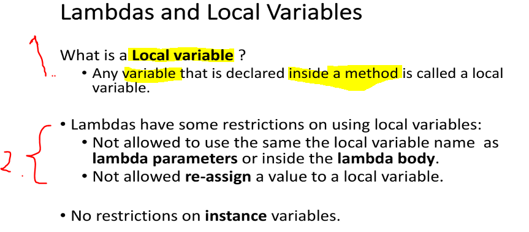
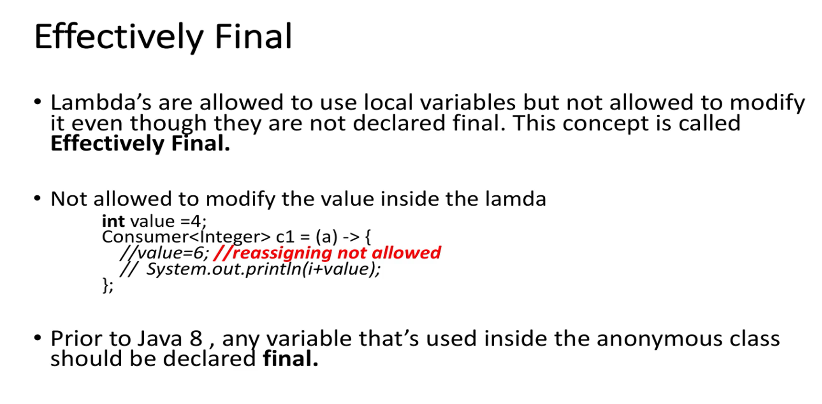
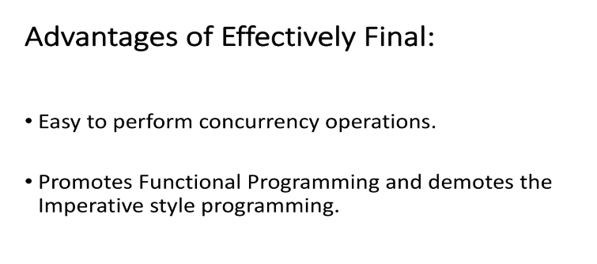

# Section 09: Lambdas and Local variables (Effectively Final). 

Lambdas and Local variables (Effectively Final).

# What I Learned.

# Lab : Local Variables in Lambda Expression.

- Example code is from. [Example Lambda Reference](
https://github.com/dilipsundarraj1/java-8/blob/master/java-8/src/com/learnJava/lambda/LambdaVariable1.java).

<div align="center">
    
</div>

1. **Local Variables**
    - **Variable** declared inside method.
2. As summary **Lambda Expression**, has **two** restrictions:
    - The **First** restriction is that you cannot use same local variable name `i`. Below the example:
    ````
        public static void main(String[] args) {

            int i=0; // Repeated variable name not allowed.
            Consumer<Integer> c1 = (i) -> {
    //        Consumer<Integer> c1 = (a) -> {
                //int i=0;
                System.out.println(i);
            };

        }
    ````    
    
    - The **Second** is that, you are not allowed to **re-assign** value to a local variable `value=6;`. Below the example:

    ````
    package com.learnJava.lambdas;

    import java.util.function.Consumer;

    public class LambdaVariable2 {

        static int value = 4;

        public static void main(String[] args) {

            int value =4; //effectively final
            Consumer<Integer> c1 = (a) -> {
                value=6;
                //  System.out.println(i+value);
            };
            //value =2;

            c1.accept(2);
        }
    }
    ````

# Effectively Final Variables in Lambda and its advantages.

- Example code is from. [Example Lambda Variable](
https://github.com/dilipsundarraj1/java-8/blob/master/java-8/src/com/learnJava/lambda/LambdaVariable2.java).

<div align="center">
    
</div>

- Not effectively final: 

````
public class Demo {
    public static void main(String[] args) {
        String name = "Alice";
        name = "Bob"; // reassigned -> not effectively final

        Runnable r = () -> System.out.println("Hello " + name); // ❌ compile error
        r.run();
    }
}
````

<div align="center">
    
</div>
