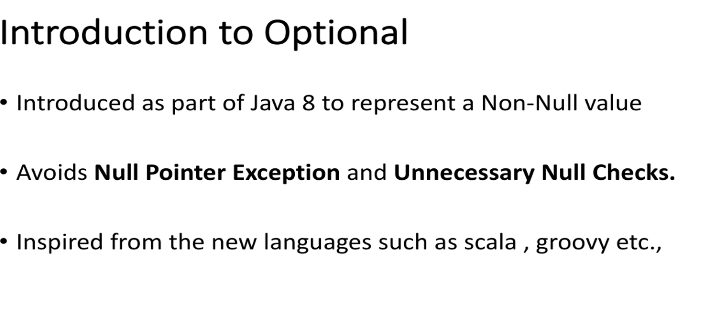
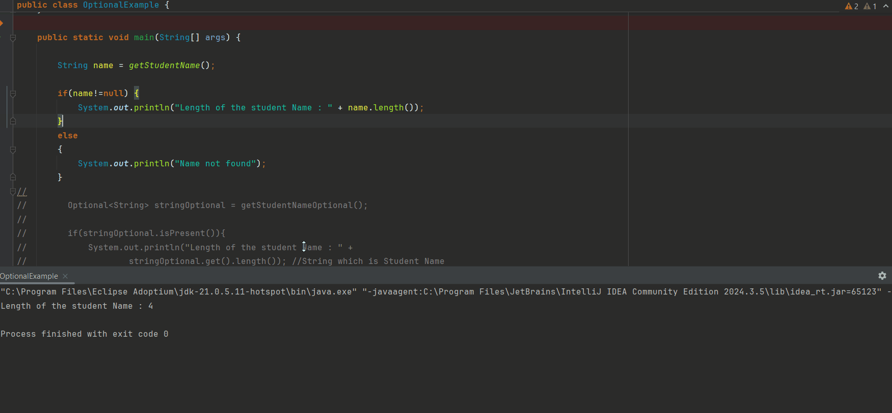
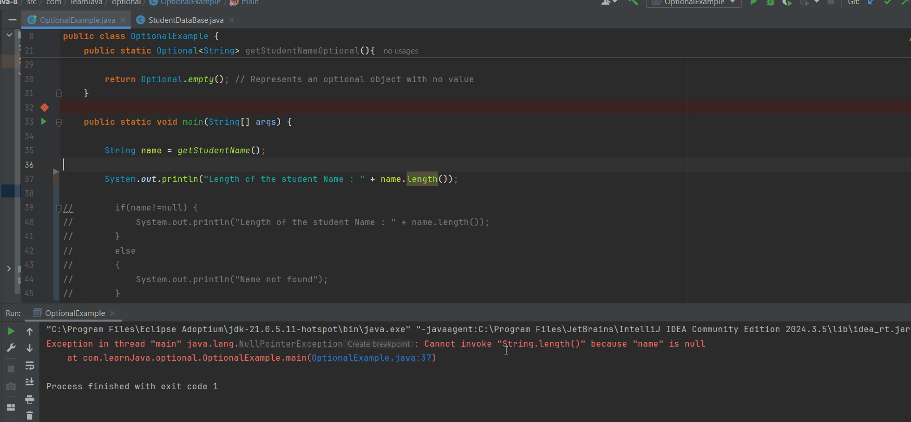

# Section 16: Optional.

Optional.

# What I Learned.

<details>
<summary id="IDE problem" open="false"> Some own examples of using <b>Optional</b>. </summary>

#### Old code:

````
if (obj == null) {
    return null;
}

Name name = obj.getName();
if (name == null) {
    return null;
}

String first = name.getFirst();
if (first == null) {
    return null;
}

return first;
````

#### Refactored code:

````
return Optional.ofNullable(obj)
               .map(MyObj::getName)
               .map(Name::getFirst)
               .orElse(null);
````

- Previous code will be having **short-circuiting**, if `null` is found. 
    - If **any** value is **missing**:
        - `obj` is `null`.
        - `obj.getName()` is `null`.
        - `name.getFirst()` is `null`.
    - The chain becomes `Optional.empty`,
        - and then `.orElse(null)` returns `null`.

#### Old code:

````
String city = null;
if (user != null && user.getAddress() != null) {
    city = user.getAddress().getCity();
}
````

#### Refactored code:

````
String city = Optional.ofNullable(user)
                      .map(User::getAddress)
                      .map(Address::getCity)
                      .orElse(null);
````

- ✅ Benefits ✅:
    - Removes boilerplate if checks.
    - Clear chain of transformations.
    - Avoids `NullPointerException`.

<hr>

#### Old code:

````
String firstName = null;
if (obj != null) {
    Name name = obj.getName();
    if (name != null) {
        firstName = name.getFirst();
    }
}
````

#### Refactored code:

````
String firstName = Optional.ofNullable(obj)
                           .map(MyObj::getName)
                           .map(Name::getFirst)
                           .orElse(null);
````

- ✅ Benefits ✅:
    - Handles multiple levels of `null` safely.
    - Easy to read and maintain.

</details>

# Introduction to Optional.

- [The source code for the chapter](https://github.com/dilipsundarraj1/java-8/blob/master/java-8/src/com/learnJava/optional/OptionalExample.java).

<div align="center">
    
</div>

1. `Optional` is to represent the `non-null` value.

2. This to avoids the `non null` exception and other point is to make clearer to make null checks.

- **Example** of use case, where we can have `null` value, but we have **some** value:

````
    public static String getStudentName(){

        Student student = StudentDataBase.studentSupplier.get();
//        Student student = null;
        if(student!=null){
            return student.getName();
        }

        return null;
    }
````

<details>
<summary id="Exmample of the Student database" open="false"> <b>StudentDataBase</b> behind the scenes:</summary>


````
package com.learnJava.data;

import java.util.Arrays;
import java.util.List;
import java.util.function.Supplier;

public class StudentDataBase {

    public static Supplier<Student> studentSupplier = () -> {
       return new Student("Adam",2,3.6, "male",Arrays.asList("swimming", "basketball","volleyball"));
    };

    /**
     * Total of 6 students in the database.
     * @return
     */
    public static List<Student> getAllStudents(){

        /**
         * 2nd grade students
         */
        Student student1 = new Student("Adam",2,3.6, "male",Arrays.asList("swimming", "basketball","volleyball"),11);
        Student student2 = new Student("Jenny",2,3.8,"female", Arrays.asList("swimming", "gymnastics","soccer"),12);
        /**
         * 3rd grade students
         */
        Student student3 = new Student("Emily",3,4.0,"female", Arrays.asList("swimming", "gymnastics","aerobics"),10);
        Student student4 = new Student("Dave",3,3.9,"male", Arrays.asList("swimming", "gymnastics","soccer"),9);
        /**
         * 4th grade students
         */
        Student student5 = new Student("Sophia",4,3.5,"female", Arrays.asList("swimming", "dancing","football"),15);
        Student student6 = new Student("James",4,3.9,"male", Arrays.asList("swimming", "basketball","baseball","football"),14);

        List<Student> students = Arrays.asList(student1,student2,student3,student4,student5,student6);
        return students;
    }

}
````
</details>

- `Student student = StudentDataBase.studentSupplier.get();`.
    - We are getting student length using following, when there is `Student` found.

<div align="center">
    
</div>

- **Example** of use case, where we will have `null` value:

````
    public static String getStudentName(){

//        Student student = StudentDataBase.studentSupplier.get();
        Student student = null;
        if(student!=null){
            return student.getName();
        }

        return null;
    }
````

- Illustration and code below where there is `null` value present.

````
    public static Optional<String> getStudentNameOptional(){

        Optional<Student> studentOptional = Optional.ofNullable(StudentDataBase.studentSupplier.get());
//        Optional<Student> studentOptional = Optional.ofNullable(null); // Optional.empty()
        if(studentOptional.isPresent()){
            studentOptional.get(); //Student
            return studentOptional.map(Student::getName); //Optional<String>
        }

        return Optional.empty(); // Represents an optional object with no value
    }
````

<div align="center">
    
</div>

- We will be getting `Student`, with the `Optional` code: 

````
 public static Optional<String> getStudentNameOptional(){

        Optional<Student> studentOptional = Optional.ofNullable(StudentDataBase.studentSupplier.get());
//        Optional<Student> studentOptional = Optional.ofNullable(null); // Optional.empty()
        if(studentOptional.isPresent()){
            studentOptional.get(); //Student
            return studentOptional.map(Student::getName); //Optional<String>
        }

        return Optional.empty(); // Represents an optional object with no value
    }
````

- We will be wrapping the **Object** inside:
    - `Optional<Student> studentOptional = Optional.ofNullable(StudentDataBase.studentSupplier.get());`.

````
        if(studentOptional.isPresent()){
//            return studentOptional.get(); //Student
            return studentOptional.map(Student::getName); //Optional<String>
        }
````

- We will be checking if the **Optional** is there `if(studentOptional.isPresent())`.

- Furthermore, we will be using `Map` to return the `Optional<String>`.
    - As following: `return studentOptional.map(Student::getName);`.
        
- Represents an optional object with **no value!** `return Optional.empty();`.


<details>
<summary id="Code example" open="false"> Realcase: <b>Optional</b> vs <b>real case</b> </summary>

## Real case:

- This returns the `null`, but anything can be `null`.

````
public static String getStudentName(){

//        Student student = StudentDataBase.studentSupplier.get();
        Student student = null;
        if(student!=null){
            return student.getName();
        }

        return null;
    }
````

## Optional case:

- This returns the <b>Optional</b> rather than the `null`.

````
    public static Optional<String> getStudentNameOptional(){
//        Optional<Student> studentOptional = Optional.ofNullable(StudentDataBase.studentSupplier.get());
        Optional<Student> studentOptional = Optional.ofNullable(null); // Optional.empty()
        if(studentOptional.isPresent()){
//            return studentOptional.get(); //Student
            return studentOptional.map(Student::getName); //Optional<String>
        }
        return Optional.empty(); // Represents an optional object with no value
    }
````
</details>


# Lab: Optional — `empty()`, `ofNullable()`, `of()`.

# Lab: `orElse()`, `orElseGet()`, `orElseThrow()`.

# Lab: `ifPresent()`, `isPresent()`.

# Lab: `map()`, `flatMap()`, `filter()` — Part 1.


<details>
<summary id="Code example" open="false"> Code afer this chapter:</summary>

````
package com.learnJava.optional;

import com.learnJava.data.Student;
import com.learnJava.data.StudentDataBase;

import java.util.Optional;

public class OptionalMapFlatMapExample {

    //filter
    public static void optionalFilter(){

        Optional<Student> studentOptional =
            Optional.ofNullable(StudentDataBase.studentSupplier.get()); //Optional<Student>

        studentOptional.
                filter(student -> student.getGpa()>=4.0)
                    .ifPresent(student -> System.out.println(student));
    }

    //map
    public static  void optionalMap(){
        Optional<Student> studentOptional =
                Optional.ofNullable(StudentDataBase.studentSupplier.get()); //Optional<Student>

        if(studentOptional.isPresent()){
            Optional<String> stringOptional = studentOptional
                    .filter(student -> student.getGpa()>=3.5)
                    .map(Student::getName);
            System.out.println(stringOptional.get());
        }

    }

    //flatmap

    public static void main(String[] args) {

        optionalFilter();
        optionalMap();
    }
}
````
</details>


# Lab: `map()`, `flatMap()`, `filter()` — Part 2.

