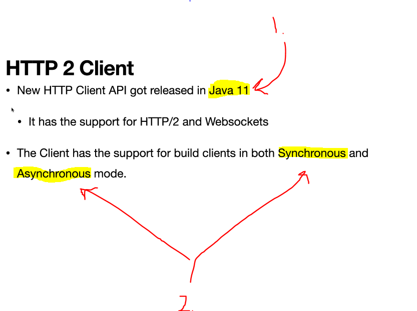

# Section 28: New Http Client.

New Http Client.

# What I Learned.

# New HttpClient - GET Request to retrieve movie by ID.

    

1. This was **released** in **Java 11**.
2. This supports **Synchronous** and **Asynchronous** mode. 

# JUnit test for the HTTP Client.

# Build HTTPClient in Asynchronous mode.

# Build HTTP Client - GET Request to Retrieve AllMovies.