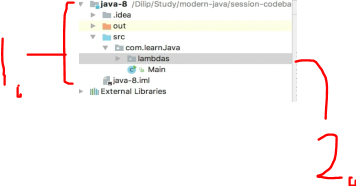
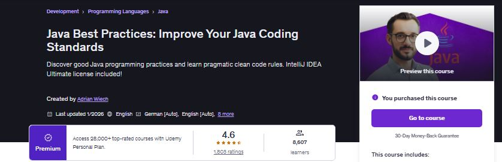

    

    
    Attempt to study <b>Java</b> itself! Some things which are related to advanced level!

- For these courses one should configure **GIT** for handle projects.
    - `git config --global http.postBuffer 524288000`.
    - `git config --global core.longpaths true`.

    

All course material from *Advanced Java Topics: Java Reflection - Master Class* by **Top Developer Academy LLC** and **Michael Pogrebinsky** ©. 

>. 🐟🐟🐟   
~ *DevelopersCradle*

Contains my own with my own visual notes ✍️ with some course material to enforce learning experience.

If the content sparked :fire: your interest, please consider buying the course and start learning :book:.

<!-- add this comment later 
This repository is made with , therefore it will include configuration files which are related to this IDE this approach will be favored for now. ⚙️ -->

[The course at Udemy](https://www.udemy.com/course/java-reflection-master-class/). 

[Content maker](https://topdeveloperacademy.com/).

<!-- 
Linkedin puts this shit front, when clicking from private mode x(. Need to put this to make jump working every case
?trk=public_profile_see-credential 
-->

    Insert certificate here when completed

**Note: The material provided in this repository is only for helping those who may get stuck at any point of time in the course. It is very advised that no one should just copy the solutions(violation of Honor Code) presented here.**

#### Progress/Curriculum.

- [x] [Section 01](https://github.com/developersCradle/java-advanced/tree/main/Advanced%20Java%20Topics%20Java%20Reflection%20Master%20Class/Section%2001#section-01-introduction-to-reflection) - Introduction to Reflection.
- [ ] [Section 02](https://github.com/developersCradle/java-advanced/tree/main/Advanced%20Java%20Topics%20Java%20Reflection%20Master%20Class/Section%2002#section-02-object-creation-and-constructors) - Object Creation and Constructors. 
- [ ] [Section 03](https://github.com/developersCradle/java-advanced/tree/main/Advanced%20Java%20Topics%20Java%20Reflection%20Master%20Class/Section%2003#section-03-inspection-of-fields--arrays) - Inspection of Fields & Arrays.
- [ ] [Section 04](https://github.com/developersCradle/java-advanced/tree/main/Advanced%20Java%20Topics%20Java%20Reflection%20Master%20Class/Section%2004#section-04-field-modification--arrays-creation) - Field Modification & Arrays Creation. 
- [ ] [Section 05](https://github.com/developersCradle/java-advanced/tree/main/Advanced%20Java%20Topics%20Java%20Reflection%20Master%20Class/Section%2005#section-05-methods-discovery--invocation) - Methods Discovery & Invocation. 
- [ ] [Section 06](#) - Java Modifiers Discovery and Analysis. 
- [ ] [Section 07](#) - Annotations with Java Reflection.
- [ ] [Section 08](#) - Dynamic Proxies.
- [ ] [Section 09](#) - Final Section: Performance, Safety and Best Practices.
- [ ] [Section 10](#) - Bonus Material.

#### Additional stuff.

- [ ] Chapters 1 and 7 for now. Related to interfaces!
- [ ] At end of this course ask yourself, "Did you develop the intuition when to use **Java reflection**"!

    

All course material from Modern Java Mastering Features from Java 8 to Java 21
by **Pragmatic Code School** ©. 

> During a live technical demonstration at **Evitec Solutions**, I was asked to solve a puzzle involving a Java problem that required clean data processing logic. Under normal circumstances, it was a problem perfectly suited for **Java Streams**, but the pressure of the live session caused me to overlook that approach.
>
>That moment became a turning point. It pushed me to deeply pursue a course on `Modern Java`, where I strengthened my understanding of streams, functional patterns, and expressive problem-solving techniques. The experience helped me regain confidence and sharpen my ability to apply the right abstractions even in high-pressure situations.  
~ *DevelopersCradle*

Contains my own with my own visual notes ✍️ with some course material to enforce learning experience.

<!-- add this comment later 
This repository is made with , therefore it will include configuration files which are related to this IDE this approach will be favored for now. ⚙️ -->

[The course at Udemy](https://www.udemy.com/course/modern-java-learn-java-8-features-by-coding-it/). 

If the content sparked :fire: your interest, please consider buying the course and start learning :book:.

<!-- 
Linkedin puts this shit front, when clicking from private mode x(. Need to put this to make jump working every case
?trk=public_profile_see-credential 
-->

    Insert certificate here when completed

**Note: The material provided in this repository is only for helping those who may get stuck at any point of time in the course. It is very advised that no one should just copy the solutions(violation of Honor Code) presented here.**

#### Progress/Curriculum.

- [x] [Section 01](https://github.com/developersCradle/java-advanced/tree/main/Modern%20Java%20Mastering%20Features%20from%20Java%208%20to%20Java%2021/Section%2001#section-01-getting-started) - Getting Started. ✅
- [x] [Section 02](https://github.com/developersCradle/java-advanced/blob/main/Modern%20Java%20Mastering%20Features%20from%20Java%208%20to%20Java%2021/Section%2002/README.md#section-02-getting-started-modern-java) - Getting Started Modern Java. ✅
- [x] [Section 03](https://github.com/developersCradle/java-advanced/tree/main/Modern%20Java%20Mastering%20Features%20from%20Java%208%20to%20Java%2021/Section%2003#section-03-local-set-up) - Local Set Up. ✅
- [x] [Section 04](https://github.com/developersCradle/java-advanced/tree/main/Modern%20Java%20Mastering%20Features%20from%20Java%208%20to%20Java%2021/Section%2004#section-04-source-code-and-slides-for-the-course) - Source Code and Slides for the course. ✅
- [x] [Section 05](https://github.com/developersCradle/java-advanced/tree/main/Modern%20Java%20Mastering%20Features%20from%20Java%208%20to%20Java%2021/Section%2005#section-05-why-java-8) - Why Java 8? ✅
- [x] [Section 06](https://github.com/developersCradle/java-advanced/tree/main/Modern%20Java%20Mastering%20Features%20from%20Java%208%20to%20Java%2021/Section%2006#section-06-introduction-to-lambda) - Introduction to Lambda. ✅
- [x] [Section 07](https://github.com/developersCradle/java-advanced/tree/main/Modern%20Java%20Mastering%20Features%20from%20Java%208%20to%20Java%2021/Section%2007#section-07-lambdas-and-functional-interfaces) - Lambdas and Functional Interfaces. ✅
- [x] [Section 08](https://github.com/developersCradle/java-advanced/blob/main/Modern%20Java%20Mastering%20Features%20from%20Java%208%20to%20Java%2021/Section%2008/README.md#section-08-constructor-and-method-references) - Constructor and Method References. ✅
- [x] [Section 09](https://github.com/developersCradle/java-advanced/blob/main/Modern%20Java%20Mastering%20Features%20from%20Java%208%20to%20Java%2021/Section%2009/README.md#section-09-lambdas-and-local-variables-effectively-final) - Lambdas and Local variables (Effectively Final). ✅
- [ ] [Section 10](https://github.com/developersCradle/java-advanced/blob/main/Modern%20Java%20Mastering%20Features%20from%20Java%208%20to%20Java%2021/Section%2010/README.md#section-10-streams-api) - Streams API.
- [ ] [Section 11](https://github.com/developersCradle/java-advanced/tree/main/Modern%20Java%20Mastering%20Features%20from%20Java%208%20to%20Java%2021/Section%2011#section-11-stream-api---operations) - Stream API - Operations.
- [ ] [Section 12](https://github.com/developersCradle/java-advanced/tree/main/Modern%20Java%20Mastering%20Features%20from%20Java%208%20to%20Java%2021/Section%2012#section-12-streams-api---factory-methods) - Streams API - Factory Methods.
- [ ] [Section 13](https://github.com/developersCradle/java-advanced/tree/main/Modern%20Java%20Mastering%20Features%20from%20Java%208%20to%20Java%2021/Section%2013#section-13-streams-api---numeric-streams) - Streams API - Numeric Streams.
- [ ] [Section 14](https://github.com/developersCradle/java-advanced/blob/main/Modern%20Java%20Mastering%20Features%20from%20Java%208%20to%20Java%2021/Section%2014/README.md#section-14-streams-api---terminal-operations) - Streams API - Terminal Operations.
- [ ] [Section 15](https://github.com/developersCradle/java-advanced/tree/main/Modern%20Java%20Mastering%20Features%20from%20Java%208%20to%20Java%2021/Section%2015#section-15-streams-api---parallel-processing) - Streams API - Parallel Processing.
- [ ] [Section 16](https://github.com/developersCradle/java-advanced/tree/main/Modern%20Java%20Mastering%20Features%20from%20Java%208%20to%20Java%2021/Section%2016#section-16-optional) - Optional.
- [ ] [Section 17](https://github.com/developersCradle/java-advanced/tree/main/Modern%20Java%20Mastering%20Features%20from%20Java%208%20to%20Java%2021/Section%2017#section-17-defaultstatic-methods-in-interfaces) - Default/Static Methods in Interfaces.
- [ ] [Section 18](https://github.com/developersCradle/java-advanced/tree/main/Modern%20Java%20Mastering%20Features%20from%20Java%208%20to%20Java%2021/Section%2018#section-18-new-datetime-apis) - New Date/Time APIs.
- [ ] [Section 19](https://github.com/developersCradle/java-advanced/tree/main/Modern%20Java%20Mastering%20Features%20from%20Java%208%20to%20Java%2021/Section%2019#section-19-base-project-setup-for-exploring-java-9-and-beyond-features) - Base Project Setup for Exploring Java 9 and Beyond Features.
- [ ] [Section 20](https://github.com/developersCradle/java-advanced/tree/main/Modern%20Java%20Mastering%20Features%20from%20Java%208%20to%20Java%2021/Section%2020#section-20-local-variable-type-inference-lvti-using-var) - Local Variable Type Inference (LVTI) using var.
- [ ] [Section 21](https://github.com/developersCradle/java-advanced/blob/main/Modern%20Java%20Mastering%20Features%20from%20Java%208%20to%20Java%2021/Section%2021/README.md#section-21-text-blocks) - Text Blocks.
- [ ] [Section 22](https://github.com/developersCradle/java-advanced/tree/main/Modern%20Java%20Mastering%20Features%20from%20Java%208%20to%20Java%2021/Section%2022#section-22-enhanced-switch) - Enhanced Switch.
- [ ] [Section 23](https://github.com/developersCradle/java-advanced/tree/main/Modern%20Java%20Mastering%20Features%20from%20Java%208%20to%20Java%2021/Section%2023#section-23-records) - Records.
- [ ] [Section 24](https://github.com/developersCradle/java-advanced/tree/main/Modern%20Java%20Mastering%20Features%20from%20Java%208%20to%20Java%2021/Section%2024#section-24-sealed-classesinterfaces) - Sealed Classes/Interfaces.
- [ ] [Section 25](#) - Pattern Matching.
- [ ] [Section 26](#) - Checkout/Service Application (Real Time Usecase).
- [ ] [Section 27](#) - Simple Web Server.
- [ ] [Section 28](#) - New Http Client.
- [ ] [Section 29](#) - Java Platform Module System (JPMS).
- [ ] [Section 30](#) - What's Next?

#### Additional stuff.

- This course uses the following repo. [Modern Java repo](https://github.com/dilipsundarraj1/modern-java).

- Use the `.gif` tool for making illustrations! Check the chapters and make GIFs out of it.
- Do again the `Optional` chapter, added it there.

- Reduce the examples in code into the dropdowns!

 <b>We will follow this project structure:</b> 

1. `java-8` is the **project** name.
2. The **individual** concept is inside **package**. Example `lambdas`.

- When the time comes, include the latest project code to projects as waterfall.

 <i>Course map for the </i><b>  Modern Java Courses!</b> 

 

    

1. You can take this course first: [Modern Java - Learn Java 8 features by coding it](https://www.udemy.com/course/modern-java-learn-java-8-features-by-coding-it/).
2. You can take this course second: [Multithreading, Parallel & Asynchronous Coding in Modern Java](https://www.udemy.com/course/parallel-and-asynchronous-programming-in-modern-java/).

    

All course material from *Refactoring into Chain of Responsibility from Legacy Code* by **Włodek Krakowski**

> Add story here   
~ *DevelopersCradle*

Contains my own with my own visual notes ✍️ with some course material to enforce learning experience.

<!-- add this comment later 
This repository is made with , therefore it will include configuration files which are related to this IDE this approach will be favored for now. ⚙️ -->

[The course at Udemy](https://www.udemy.com/course/pyramid-of-refactoring-java-chain-of-poker-hands/). 

[Content maker](https://refactoring.pl/en/recent-posts/).

If the content sparked :fire: your interest, please consider buying the course and start learning :book:.

<!-- 
Linkedin puts this shit front, when clicking from private mode x(. Need to put this to make jump working every case
?trk=public_profile_see-credential 
-->

    Insert certificate here when completed

**Note: The material provided in this repository is only for helping those who may get stuck at any point of time in the course. It is very advised that no one should just copy the solutions(violation of Honor Code) presented here.**

#### Progress/Curriculum.

- [ ] [Section 01](#) - Course Outline.
- [ ] [Section 02](#) - Introduction to the course.
- [ ] [Section 03](#) - First refactoring activities.
- [ ] [Section 04](#) - Finalize building blocks of the core logic.
- [ ] [Section 05](#) - Single Responsibility Principle - Classes.
- [ ] [Section 06](#) - Summary.

#### Additional stuff.

- [ ] todo.

# Java Best Practices: Improve Your Java Coding Standards.

    

All course material from *Java Best Practices: Improve Your Java Coding Standards* by **Adrian Wiech**!

> Add story here   
~ *DevelopersCradle*

Contains my own with my own visual notes ✍️ with some course material to enforce learning experience.

<!-- add this comment later 
This repository is made with , therefore it will include configuration files which are related to this IDE this approach will be favored for now. ⚙️ -->

[The course at Udemy](https://www.udemy.com/course/java-best-practices/). 

[Content maker other homepage](https://headeasylabs.com/).

If the content sparked :fire: your interest, please consider buying the course and start learning :book:.

<!-- 
Linkedin puts this shit front, when clicking from private mode x(. Need to put this to make jump working every case
?trk=public_profile_see-credential 
-->

    Insert certificate here when completed

**Note: The material provided in this repository is only for helping those who may get stuck at any point of time in the course. It is very advised that no one should just copy the solutions(violation of Honor Code) presented here.**

#### Progress/Curriculum.

- [ ] [Section 01](#) - Introduction.
- [ ] [Section 02](#) - Java Arrays in Depth.
- [ ] [Section 03](#) - Collections Overview.
- [ ] [Section 04](#) - Collection Framework.
- [ ] [Section 05](#) - Collection and Collections.
- [ ] [Section 06](#) - Generics Overview.
- [ ] [Section 07](#) - Lists ArrayList LinkedList Vector and Stack and Cursors.
- [ ] [Section 08](#) - Set Its implementation class and more.
- [ ] [Section 09](#) - Queues.
- [ ] [Section 10](#) - Maps & Trees in Depth - Working and its implementation classes.
- [ ] [Section 11](#) - Concurrent Collections in depth.
- [ ] [Section 12](#) - Lambda and Collections in depth.
- [ ] [Section 13](#) - Streams in Depth and collections.
- [ ] [Section 14](#) - Generics In Depth.
- [ ] [Section 15](#) - Thank you!.

#### Additional stuff.

- [ ] todo.

# Java Best Practices: Improve Your Java Coding Standards.

    

All course material from *Java Collections from basics to Advanced* by **Adrian Wiech**!

> Add story here   
~ *DevelopersCradle*

Contains my own with my own visual notes ✍️ with some course material to enforce learning experience.

<!-- add this comment later 
This repository is made with , therefore it will include configuration files which are related to this IDE this approach will be favored for now. ⚙️ -->

[The course at Udemy](https://www.udemy.com/course/java-best-practices/). 

If the content sparked :fire: your interest, please consider buying the course and start learning :book:.

<!-- 
Linkedin puts this shit front, when clicking from private mode x(. Need to put this to make jump working every case
?trk=public_profile_see-credential 
-->

    Insert certificate here when completed

**Note: The material provided in this repository is only for helping those who may get stuck at any point of time in the course. It is very advised that no one should just copy the solutions(violation of Honor Code) presented here.**

#### Progress/Curriculum.

- [ ] [Section 01](#) - Introduction.
- [ ] [Section 02](#) - Data Types.
- [ ] [Section 03](#) - Methods.
- [ ] [Section 04](#) - Classes and interfaces.
- [ ] [Section 05](#) - Exceptions.
- [ ] [Section 06](#) - Modern Java Elements.
- [ ] [Section 07](#) - Other.
- [ ] [Section 08](#) - Summary.

#### Additional stuff.

- [ ] todo.
