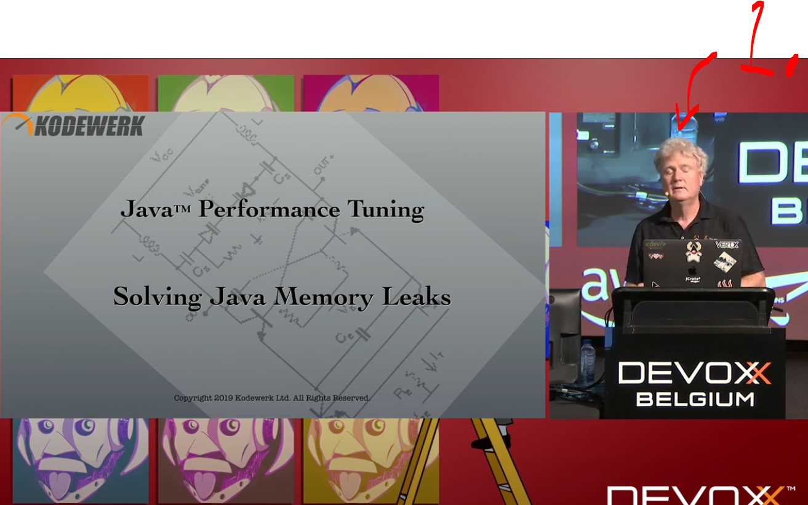
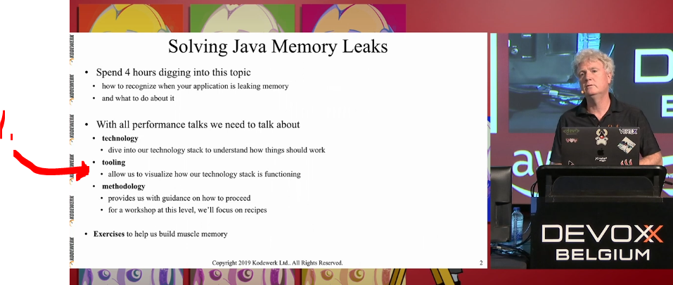
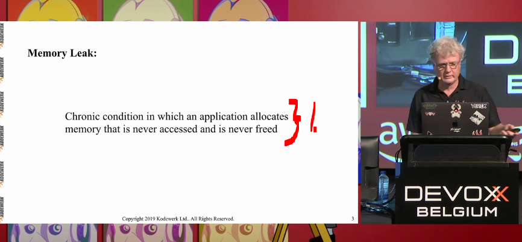
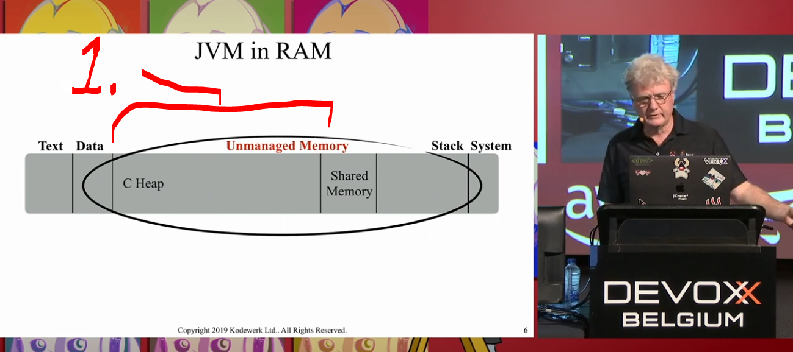
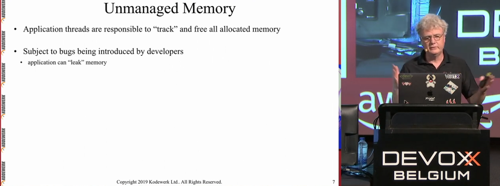

# Section 03: Collections Overview.

Collections Overview.

# What I Learned.

    

    

1. We are using **open source** tools!

    

1. What is **Memory Leak**:
    - Chronic condition in which an application **allocates memory** that is **never accessed** and is **never free**!

    

1. **C heap**, JVM will create **data structures*** to this area!

    

